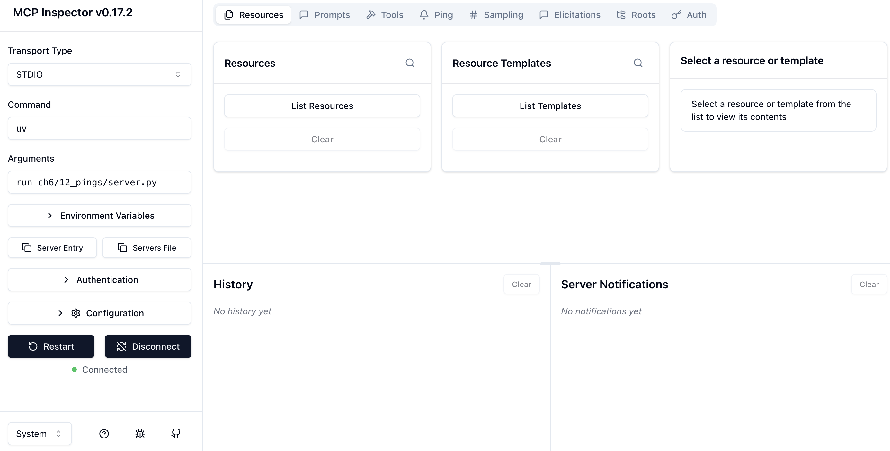
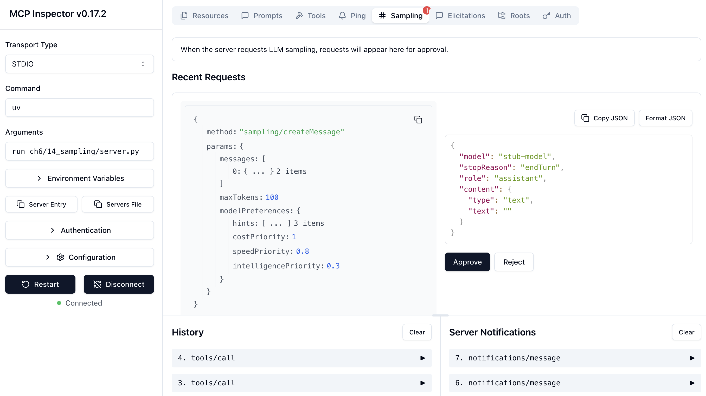
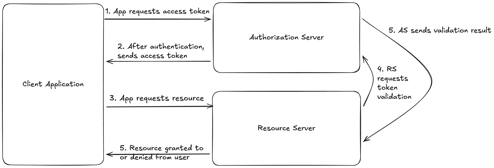

<section class="cover">
<div class="cover-kicker">에이전트 시스템 실전 가이드</div>

<div class="cover-mark" aria-hidden="true">
  <span class="node node-a"></span><span class="node node-b"></span>
  <span class="node node-c"></span><span class="node node-d"></span>
  <span class="link link-a"></span><span class="link link-b"></span>
  <span class="link link-c"></span>
</div>

<h1>AI 에이전트와<br>MCP</h1>

<p class="cover-subtitle">모델 컨텍스트 프로토콜로<br>지능형 애플리케이션 구축하기</p>

<div class="cover-rule"></div>

<p class="cover-author">KYLE STRATIS</p>
</section>


<div class="source-break"></div>

<section class="front-matter" data-source="brief_table_of_contents.md" markdown="1">

<a id="id22"></a>

# 간략 목차(*미확정*)

*서문* (미제공)

1장: 에이전트 AI와 MCP (제공)

2장: 모델 컨텍스트 프로토콜 소개 (제공)

3장: MCP 클라이언트로 지능형 애플리케이션을 에이전트화하기 (제공)

4장: MCP 클라이언트: 고급 활용과 모범 사례 (제공)

5장: MCP 서버 구축: 애플리케이션에 도구, 프롬프트, 리소스 제공하기 (제공)

6장: MCP 서버 구축: 유틸리티의 고급 활용과 클라이언트 기능 통합 (제공)

7장: MCP 서버 테스트, 보안 강화, 공유 (제공)

*8장: 클라이언트와 서버 연결: MCP 전송 계층* (미제공)

*9장: 마무리: 전체 예제와 다음 단계* (미제공)

</section>

<div class="source-break"></div>

<section class="book-section" data-source="chapter_1.md" markdown="1">

<a id="chapter_1_agentic_ai_and_mcp"></a>

# 1장. 에이전트 AI와 MCP

2024년 말, Anthropic은 큰 관심 속에 모델 컨텍스트 프로토콜(Model Context Protocol, MCP)을 공개했다. Anthropic은 단순히 대화만 하던 챗봇을 실제로 행동할 수 있는 에이전트로 전환하는 방식을 표준화했을 뿐 아니라, 널리 쓰이는 AI 기반 IDE 및 자사의 Claude Desktop이 MCP를 지원하도록 공개 시점을 맞춤으로써 빠른 도입을 이끌었다. MCP 아키텍처의 주요 구성 요소인 MCP 서버는 매우 간단하게 실행할 수 있으면서도, 고급 워크플로가 필요할 때에는 강력하고 복잡한 기능을 구현할 수 있도록 설계되었다. 그 결과 사용자가 만든 MCP 서버가 빠르게 쏟아져 나왔고, 생성형 AI 워크플로가 한층 확장되면서 MCP는 AI 에이전트 구축을 위한 사실상의 표준으로 자리 잡았다.

이 책은 기존 문서의 범위를 넘어 MCP를 깊이 있게 다룬다. MCP 아키텍처, 프로토콜과 SDK가 제공하는 기능을 충분히 이해하고, 무엇보다 그 이해를 바탕으로 자신만의 MCP 서버와 클라이언트를 구축하여 생성형 AI 워크플로를 확장하는 방법을 설명한다. 이를 통해 일반적인 생성형 AI 챗봇을 스스로 행동하고 계획하며 도구를 사용하고, 복잡한 과제를 수행하기 위해 서로 협업까지 할 수 있는 완전한 에이전트로 바꿀 수 있다. 이 장에서는 AI 에이전트가 무엇이며 어떻게 사용되는지, MCP가 에이전트 AI 생태계에서 어떤 위치를 차지하는지 살펴본다. 다음 장에서는 MCP의 역사, MCP가 해결하는 문제, 아키텍처, 실제 활용 사례를 다룬다. 이어지는 세 장에서는 MCP의 주요 구성 요소인 클라이언트와 호스트 애플리케이션, 서버, 전송 계층을 설명한다. 이러한 지식을 갖춘 뒤 마지막 세 장에서는 프로젝트를 통해 서버, 클라이언트, 전송 계층을 직접 구축하는 방법뿐 아니라, 실제 에이전트에서 이들을 활용하는 방법까지 실습한다.

<a id="id31"></a>

# 그래서 에이전트란 무엇인가?

그렇다면 *에이전트*란 정확히 무엇일까? 구글에서 검색해 보면 검색 결과 링크 수만큼이나 많은 정의를 만나게 된다. Claude나 ChatGPT에 연달아 몇 번 물어보면 답변이 매번 달라질 수도 있다. 무엇이 에이전트이고 무엇이 아닌지에 관해서는 저마다 의견이 있지만, 공통 정의를 정하지 않고서는 에이전트를 제대로 논하기 어렵다. 이 책에서는 Anthropic의 글 [효과적인 에이전트 구축하기(Building Effective Agents)](https://www.anthropic.com/engineering/building-effective-agents)에 나온 정의를 사용한다. *에이전트*란 “대규모 언어 모델(LLM)이 자신의 프로세스와 도구 사용을 동적으로 지휘하며, 과제를 수행하는 방식을 스스로 통제하는 시스템”이다. 일반적으로 에이전트는 과제를 전달받은 LLM이 도구를 사용해 행동을 실행하고, 피드백을 수집한 다음, 후속 작업을 진행하는 형태로 구현된다. 여기서 *도구(tool)*란 특정 과제를 수행하기 위해 에이전트가 호출하는, 에이전트 ‘외부’의 모든 코드를 뜻한다. 행동과 피드백 수집은 루프 안에서 이루어진다. LLM이 어떤 행동을 수행하면 피드백이 수집되어 다시 LLM에 전달되고, LLM은 그 결과를 사용자에게 최종 결과로 제시할지, 수집한 피드백을 바탕으로 또 다른 행동을 수행할지, 사용자에게서 추가 피드백을 받을지를 결정한다.

에이전트의 일반적인 활용 사례를 통해 각 결과에 따른 루프의 모습을 살펴보자. Cursor나 Windsurf 같은 AI 기반 코드 편집기에서 챗봇에게 코드의 단위 테스트를 작성해 달라고 요청하는 상황을 가정한다. 이때 행동-피드백 루프는 [그림 1-1](#action-feedback-loop)과 같은 모습일 수 있다.

<a id="action-feedback-loop"></a>


*그림 1-1. 코딩 에이전트가 수행하는 가상의 행동-피드백 루프.*

그림 1-1은 코딩 에이전트의 행동-피드백 루프(action-feedback loop, *AF 루프*) 예를 보여 준다. 사용자는 `feature.py`에 들어 있는 코드의 단위 테스트를 작성해 달라고 에이전트에게 정중히 요청함으로써 작업을 시작한다. 첫 번째 AF 루프가 시작되면 LLM은 `feature.py`를 읽는다. 피드백을 가져오는 환경은 `feature.py`이며, 여기서 피드백은 코드 자체일 수도, 코드의 구조만일 수도, 파일을 다른 방식으로 표현한 것일 수도 있다. 이 정보를 얻은 에이전트가 다음 AF 루프에서 수행할 작업은 `feature.py`의 내용이 암시하는 모든 테스트를 작성하는 것이 될 수 있다. 이 경우 테스트 작성이 행동이고, 작성된 테스트 파일이 피드백 환경이며, 작성한 코드나 그 코드의 다른 표현이 피드백이다. 이어 세 번째 AF 루프에서는 테스트 실행을 행동으로 수행할 수 있다. 이 루프의 환경은 테스트 환경과 결과이며, LLM에 전달되는 피드백은 테스트 결과, 테스트 커버리지, 또는 모델이 다음 단계를 판단하는 데 유용한 다른 정보일 수 있다. 결과가 만족스럽다면 여기서 루프를 끝낸다. 그렇지 않다면 에이전트는 AF 루프 2를 다시 실행하거나 실패한 테스트를 수정하는 것처럼 더 정확한 다른 행동을 선택한 뒤 AF 루프 3을 다시 실행하며, 만족스러운 결과를 얻을 때까지 이 과정을 이어 갈 가능성이 크다.

이는 *에이전트 워크플로(agentic workflow)*와 구별된다. 에이전트 워크플로는 LLM이 아니라 코드가 로직의 진행 경로를 결정하되, 작업의 일부를 수행하기 위해 여전히 LLM을 호출하는 시스템이다. 에이전트 시스템에서 흔히 사용하는 패턴이며, 코드가 강제하는 일정 수준의 결정론적 로직이 필요한 복잡한 작업에 특히 유용하다. 예를 들어 입력 코드를 받아 다른 언어의 동등한 코드로 변환하는 애플리케이션을 생각해 보자. 워크플로 방식에서는 입력 코드를 받아 LLM을 호출해 코드의 언어를 감지하고, 언어를 감지하지 못하면 사용자에게 실패 메시지를 반환할 수 있다. 언어를 감지했고 그 언어에 사용할 결정론적 파서가 있다면 코드에 해당 파서를 적용한 다음 변환 결과를 사용자에게 반환한다. 감지한 언어에 사용할 파서가 없다면 LLM을 다시 호출하고 번역을 수행하도록 프롬프트를 전달한 뒤 결과를 사용자에게 반환한다. 이것이 *프롬프트 체이닝(prompt chaining)*이다. 하나 이상의 LLM 호출이 필요하고 과제를 완수하기 위한 다음 단계를 코드 경로로 결정해야 할 때 널리 쓰이는 에이전트 워크플로 패턴이다. 그 밖의 일반적인 워크플로 패턴에는 여러 LLM을 동시에 호출한 뒤 결과를 결합하는 *병렬화(parallelization)*, LLM이 입력을 분류한 다음 분류 결과에 따라 여러 LLM 호출 가운데 하나를 선택하는 *라우팅(routing)*, 한 LLM이 과제를 세분화하고 작업자 LLM들을 호출해 작은 과제를 처리한 뒤 마지막 LLM이 결과를 취합하는 *오케스트레이터-작업자(orchestrator-worker)*, 한 LLM이 사용자 프롬프트에 대한 응답을 생성하면 두 번째 LLM 호출이 이를 평가하여 적절할 경우 사용자에게 제시하고, 그렇지 않으면 피드백과 함께 첫 번째 LLM 대화로 돌려보내 개선하는 *평가자-최적화자(evaluator-optimizer)*가 있다.

[그림 1-2](#prompt-chaining-example)는 이 프롬프트 체이닝 워크플로를 자세히 보여 준다. 입력을 LLM으로 보내 입력 언어를 감지한다. 추정한 언어가 출력되면 코드에서 언어 감지 여부를 확인한다. 언어를 감지하지 못했으면 ‘실패’ 상태로, 감지했으면 ‘성공’ 상태로 분기한다. 다음 상태 역시 결정론적이며, 감지한 언어에 사용할 결정론적 파서가 있는지 확인한다. 파서가 있다면 다음 상태에서는 파서를 호출하고 그 결과를 사용자에게 보고하기만 하면 된다. 파서가 없다면 LLM을 다시 호출하여 번역하도록 프롬프트를 전달하고 결과를 사용자에게 반환한다.

<a id="prompt-chaining-example"></a>


*그림 1-2. 언어 감지 및 번역 에이전트를 위한 가상의 프롬프트 체이닝 워크플로.*

첫 번째 LLM 호출이 워크플로를 시작해야 한다고 판단하면서 워크플로가 시작된다. 이 워크플로에서는 이전 호출 결과를 바탕으로 구성한 프롬프트를 사용해 LLM을 연속해서 호출하며, 워크플로의 진행 방향은 LLM이 아니라 주로 코드가 결정한다.

반면 에이전트 방식에서는 언어 감지 및 번역 도구를 LLM에 제공하고, 입력 언어를 감지한 다음 올바른 번역 도구를 선택해 번역하라고 요청하기만 하면 된다. [그림 1-3](#Agentic-workflow-example)은 이 과정을 보여 준다. 사용자가 코드를 입력하면 LLM이 호출된다. LLM은 행동-피드백 루프를 반복하면서 입력 언어를 감지한 뒤, 환경에 번역을 수행할 도구가 있는지 확인한다. 에이전트가 사용할 적절한 도구가 있다면 호출하고, 없다면 자율적으로 번역을 시도한다. 어떤 결과를 받든 사용자에게 반환한다.

<a id="Agentic-workflow-example"></a>


*그림 1-3. 언어 감지 및 번역 에이전트.*

[그림 1-3](#Agentic-workflow-example)은 [그림 1-2](#prompt-chaining-example)의 프롬프트 체이닝 워크플로와 같은 과정을 자율 에이전트로 구현한 것이다. 에이전트에는 언어 감지 도구와 번역 도구가 제공되며, 에이전트는 사용자의 프롬프트에 따라 자신의 판단으로 이를 사용할 수 있다. 코드가 워크플로의 진행을 결정하는 프롬프트 체이닝 워크플로와 대비되는 방식이다.

기억해야 할 가장 중요한 차이는 에이전트가 하나 이상의 행동-피드백 루프에 걸쳐 사용할 도구와 수행할 행동을 스스로 결정하는 반면, 워크플로에서는 코드 경로가 사용할 도구와 수행할 행동, 그리고 그 행동의 수행 방식을 결정한다는 점이다.

<a id="id32"></a>

# 생성형 AI에서 에이전트는 어떻게 사용되는가?

앞에서 살펴본 것처럼 에이전트는 주어진 과제를 완수하는 데 계획, 의사 결정, 도구 사용이 필요한 복잡한 작업에 활용된다. 일반적으로 사용자가 에이전트와 상호 작용하는 방식은 비에이전트형 LLM과 상호 작용하는 방식과 겉으로 뚜렷하게 다르지 않다. 반대편에 챗봇이 있는 채팅 상자가 있고, 사용자가 질문하면 챗봇이 답한다. 하지만 에이전트에는 중요한 차이가 하나 있다. 사용자는 에이전트에게 무언가를 *수행*하라고 요청할 수 있고, 에이전트는 주어진 도구를 이용해 행동하며 환경과 상호 작용할 수 있다. 사용자는 단지 더 강력한 챗봇이라고 느낄 수도 있지만, 에이전트는 도구, 특화 프롬프트, 데이터 리소스, 메모리를 활용하고 다른 에이전트와 조정·협업함으로써 맞춤형 경험을 제공할 수 있다.

에이전트는 기존 LLM을 자율적으로 동작하도록 확장한 것이므로, 에이전트를 사용하는 모습은 LLM을 사용하는 것과 같다. 텍스트, 즉 프롬프트를 입력하고 응답을 받는다. 그러나 에이전트에서는 LLM이 실행할 작은 코드 조각을 직접 선택하거나 작성할 수도 있고, 여러 사용자와 상호 작용한 내용을 메모리에 보존할 수도 있으며, 웹을 자율적으로 조사하면서 비에이전트 시스템이나 사람이 대부분 순차적으로 수행할 조사 작업을 병렬화할 수도 있다.

<a id="id33"></a>

# 에이전트가 생성형 AI에 가져오는 변화

에이전트와 이를 위해 새로 고안되고 탐구되는 설계 패턴은 생성형 AI에서 가장 흥미로운 발전을 이끌고 있다. 단일 에이전트만으로도 학습 데이터라는 정적인 정보원에 의존하던 LLM을 새로운 정보에 접근하고, 도구를 통해 환경에 행동을 가하며, 반자율적으로 동작하고, 다른 에이전트와 통신할 수 있는 시스템으로 바꿀 수 있다. 이러한 모든 동작은 에이전트의 아키텍처, 특히 이 장 앞부분에서 설명한 행동-피드백 루프와, 에이전트 시스템이 LLM에 추가하는 데이터 검색·도구·메모리 기능에서 비롯된다.

에이전트가 널리 보급되기 전에는 채팅 인터페이스를 통해 LLM과 직접 상호 작용하는 방식이 가장 일반적이었다. LLM이 사용할 수 있는 정보는 학습 데이터뿐이었으므로 모델은 특정 시점에 고정되어 있었고, 사용자의 대화 기록을 기억하거나 도구를 사용할 수 없었다. *검색 증강 생성(retrieval-augmented generation, RAG)*은 LLM에 더 많은 정보를 제공한 초기 방법으로, 조직의 지식 베이스, 지원 문서, 기타 데이터 소스의 정보를 바탕으로 질문에 답하는 챗봇을 탄생시켰다. 미세 조정(fine-tuning) 같은 기법도 기반 모델의 *지식*을 확장하거나 챗봇에 다른 *성격*을 부여하는 등의 용도로 사용되었다.

그러나 에이전트는 한층 더 강력한 가능성을 열었다. 자율적으로 행동하고, 자신의 *판단*과 환경 피드백에 따라 결정론적 코드를 호출하고, 다른 에이전트와 조정하며, 사용자의 대화 기록과 기타 정보를 단기 *메모리*에 저장할 수 있게 된 것이다. 이러한 요소 대부분은 그 자체로 시스템을 에이전트라 부르기 위한 필수 조건은 아니지만, LLM의 능력에 자율 에이전트 루프와 이러한 모델 확장 기능이 결합하면서 생성형 AI에서 지금까지 가장 흥미로운 발전들이 이루어졌다.

<a id="id34"></a>

# 에이전트의 예와 활용 사례

에이전트가 어떻게 사용되고 무엇을 가능하게 하며 어떤 작업에 뛰어난지 제대로 살펴보려면, 에이전트의 활용 사례와 실제 사례, 가능하다면 그 아키텍처까지 살펴보는 것이 도움이 된다. 에이전트 시스템은 거의 모든 곳에 도입되고 있지만, 최근 특히 두드러진 활용 사례는 다음과 같다.

- 코딩 에이전트
- 리서치 에이전트
- 고객 서비스 에이전트
- 비즈니스 특화 코파일럿/어시스턴트

  - **코딩 에이전트**: 가장 흔하고 인기 있는 에이전트일 가능성이 크며, 독자 역시 하나 이상 사용해 보았을 것이다. Anthropic의 [Claude Code](https://www.anthropic.com/claude-code)와 OpenAI의 [Codex](https://openai.com/codex/) 같은 비감독형 애플리케이션은 에이전트에 지시할 수 있는 명령줄 인터페이스를 제공한다. 코드 변경은 백그라운드에서 이루어지므로 에이전트가 작업하는 동안 사용자는 다른 일을 할 수 있다. 감독형 애플리케이션으로는 [Cursor](https://www.cursor.com/), [Windsurf](https://windsurf.dev/), VS Code용 [GitHub Copilot](https://github.com/features/copilot) 확장이 있다. 익숙한 코드 편집기 안에 사용자 인터페이스를 제공하여 에이전트가 수행한 변경을 확인하고 승인할 수 있게 한다.
  - **리서치 에이전트**: 특정 주제를 심층 조사하는 에이전트다. 메모리와 웹 검색 같은 도구를 활용하며, 경우에 따라 추가 자율 에이전트를 동원해 여러 조사 방향을 탐색한다. Anthropic의 [리서치 에이전트](https://www.anthropic.com/news/research)가 좋은 예다. 내장 도구와 사용자 제공 도구를 함께 사용해 조사하고, 메모리 저장소를 통해 컨텍스트와 현재 조사 방향을 기록하는 작업 공간을 제공하며, 주 에이전트가 하위 에이전트를 오케스트레이션하여 각각의 조사 방향을 탐색하게 한다. Claude Research의 아키텍처와 동작 방식은 [여기](https://www.anthropic.com/engineering/built-multi-agent-research-system)에서 자세히 알아볼 수 있다.
  - **고객 서비스 에이전트**: 고객 서비스 에이전트는 빠르게 보편화되고 있다. 실제 운영 중인 시스템 대부분은 아직 단순한 의사 결정 트리나 RAG를 사용하는 LLM 기반 챗봇이지만, 도구 사용과 메모리를 추가한 진정한 에이전트가 점점 늘고 있다. 이러한 에이전트는 고객 질문에 더 정확히 대응하고, 문제 해결 과정을 안내하거나 직접 해결을 시도하며, 필요할 때 문제를 더 정확히 상위 단계로 이관한다.
  - **소프트웨어 특화 코파일럿/어시스턴트**: 많은 소프트웨어 애플리케이션과 플랫폼, 특히 기업 고객을 대상으로 하는 제품이 고객의 소프트웨어 사용과 관리를 돕는 코파일럿을 추가하고 있다. 이러한 에이전트에는 해당 소프트웨어에 특화된 도구가 제공되는 경우가 많다. 어떤 에이전트는 사용자 데이터로 차트를 만들고, 다른 에이전트는 브랜드 양식에 맞춘 보고서를 생성하며, 또 다른 에이전트는 자연어로 소프트웨어의 데이터를 조회하도록 도울 수 있다.

이는 가장 널리 알려진 에이전트 활용 사례 중 일부일 뿐이다. 에이전트가 본질적으로 지닌 유연성과 자율성 덕분에 활용 가능성은 거의 무한하다. 인터랙티브 [예술 프로젝트](https://www.youtube.com/watch?v=7fNYj0EXxMs), 사람 및 다른 에이전트와 수많은 상호 작용을 거쳐 형성된 AI ‘인격’(Bluesky의 [Void](https://cameron.pfiffer.org/blog/void/) 등), 3D 모델링 에이전트, 물리적 사물에 ‘체화된’ 에이전트, 올인원 개인 비서 역할을 하는 에이전트는 비교적 드물지만 어쩌면 더 흥미로운 활용 사례다.

<a id="id35"></a>

# 에이전트 AI에서 모델 컨텍스트 프로토콜의 역할

MCP 이전에는 에이전트 AI가 아직 비교적 새로운 분야였음에도, 내부 생성형 AI 플랫폼을 구축하는 조직과 LangChain 같은 공개 프레임워크가 사용자의 도구 구현 방식을 각자 마련한 다음 그 도구를 LLM에 전달해야 했다. 또한 LLM마다 별도의 커넥터가 필요했다. 이로 인해 이른바 ‘M×N 문제’가 발생했다. 지원해야 할 M개의 LLM 각각에 대해 연결하려는 도구, 데이터 소스 등 N개마다 커넥터가 필요하다. 모델 3개와 도구 4개를 지원한다면 대부분 내용이 중복되는 커넥터 12개를 작성해야 하며, 진단하기 어려운 버그가 생길 가능성도 커진다([그림 1-4](#mxn-problem)).

<a id="mxn-problem"></a>


*그림 1-4. 모델 3개가 서로 다른 도구 4개에 모두 접근해야 할 때 발생하는 M×N 문제. 총 12개(4×3)의 커넥터가 필요하다.*

언어 서버 프로토콜(Language Server Protocol, LSP)에서 영감을 받은 모델 컨텍스트 프로토콜은 도구, 프롬프트, 데이터 리소스를 구축하고 이를 LLM에 연결하는 공통 인터페이스를 제공한다. 따라서 M개의 LLM이 있더라도 N개의 커넥터만 작성하면 되며, M×N 문제를 M+N 문제로 바꿀 수 있다. 앞서 든 모델 3개와 도구 4개의 예에서는 12개가 아니라 7개의 커넥터만 있으면 된다([그림 1-5](#mandn_solution)).

<a id="mandn_solution"></a>


*그림 1-5. MCP가 도구와 모델 사이에 공통 인터페이스를 제공하므로, 모델 3개가 도구 4개에 접근할 수 있게 하는 데 12개가 아니라 7개의 커넥터만 필요하다. 각 모델 또는 AI 애플리케이션에는 MCP 서버로 연결되는 자체 커넥터 하나만 있으면 되며, MCP는 모든 모델과 애플리케이션이 사용 가능한 도구를 활용할 수 있는 공통 인터페이스를 제공한다.*

MCP 서버는 모델이 도구를 사용하는 간단한 표준 인터페이스를 제공함으로써 M×N 문제를 M+N 문제로 줄인다. 도구 사용을 지원하는 모든 모델은 MCP 클라이언트를 통해 MCP 서버에 연결할 수 있으므로, 하나의 MCP 서버가 제공하는 모든 도구에 커넥터 하나만 있으면 된다. MCP에서는 이 커넥터가 클라이언트다. 도구를 지원하는 모든 서버는 `ListTools`와 `CallTool` 엔드포인트를 노출한다. 호스트 애플리케이션은 클라이언트를 통해 각 엔드포인트를 호출하여 서버에서 사용 가능한 도구를 가져오고 해당 도구를 실행한다.

# MCP 구성 요소

MCP의 주요 구성 요소는 MCP 서버, MCP 클라이언트, MCP 전송 계층이다. 서버는 공통 인터페이스를 통해 도구, 프롬프트, 데이터 리소스 등을 제공한다. 클라이언트는 호스트 애플리케이션과 MCP 서버 사이를 연결하는 *커넥터*다. 전송 계층은 클라이언트와 서버의 통신을 가능하게 하는 기반 통신 프로토콜이다. MCP 아키텍처 전체는 다음 장에서 더 자세히 다룬다.

<a id="id36"></a>

# 에이전트 AI의 다른 프로토콜

MCP가 성공을 거두자 다른 여러 단체도 자체 에이전트 프로토콜을 발표했다. MCP가 LLM이 도구, 프롬프트, 데이터 리소스에 접근하고 이를 사용하는 방식을 표준화하는 데 집중한다면, 다른 프로토콜은 에이전트 간 통신 방식에 초점을 맞춘다. 가장 대표적인 예가 Google의 [Agent2Agent 프로토콜](https://developers.googleblog.com/en/a2a-a-new-era-of-agent-interoperability/)(A2A)이다. A2A를 공개할 당시 개발자들은 A2A가 MCP와 경쟁하는 프로토콜이 아니라 상호 보완하는 프로토콜임을 분명히 밝혔다. MCP를 통해 도구와 데이터에 접근하는 에이전트도 A2A를 사용하여 다른 에이전트와 통신할 수 있다.

[Agent Communication Protocol](https://agentcommunicationprotocol.dev/) 역시 A2A와 마찬가지로 에이전트 간 통신 방식에 초점을 맞춘다. 에이전트가 서로 통신할 수 있는 RESTful API를 제공하여 서로 다른 기술 스택과 모델로 구축한 에이전트가 협업할 수 있게 한다. [Agent Network Protocol](https://agent-network-protocol.com/)은 중국에서 개발된 프로토콜로, 역시 에이전트 간 통신을 더 쉽게 만들고 취약성을 줄이는 데 초점을 둔다. 이 프로토콜은 ID와 인증 기능을 내장하고 에이전트 간 암호화 통신을 지원한다.

이러한 프로토콜은 흥미롭고, MCP를 포함하는 전체 에이전트 프로토콜 기술 스택의 일부가 될 가능성이 크다. 인터넷 프로토콜 기술 스택과 마찬가지로, 인터넷의 발전 경로를 따른다면 여러 목적별 프로토콜도 함께 등장할 것이다. 그러나 이 책의 초점은 다른 프로토콜이 아니다. 그렇더라도 직접 살펴보고 MCP와 통합할 방법을 찾아보기를 권한다.

<a id="id37"></a>

# 이 책에서 배울 내용

이 책의 목적은 두 가지다. 첫째이자 주된 목적은 모델 컨텍스트 프로토콜의 모든 기능과 구성 요소에 익숙해져 호스트 애플리케이션(이 장 첫머리의 정의에 따르면 에이전트), 클라이언트, 서버를 구축하고 프로토콜 및 여러 SDK의 개발에도 기여할 수 있게 하는 것이다. 이 책의 1부인 2~5장에서는 설명과 예제를 통해 이를 달성한다. MCP와 공식 Python SDK의 모든 구성 요소를 살펴보고, 각각의 용도와 기능, 구현이 프로토콜과 어떤 관계가 있는지 설명한다. 각 구성 요소를 학습하면서 불필요한 부수 요소를 최소화하고 실용적인 구현을 보여 주도록 설계한 코드 예제를 만나게 될 것이다. 덕분에 현재 주제에 집중할 수 있다. 2부인 6~9장에서는 MCP 아키텍처의 모든 부분을 사용하는 프로젝트 구축 과정을 안내한다. 이를 통해 MCP 클라이언트로 MCP 서버와 연동하는 애플리케이션, MCP 서버, 전송 계층까지 구축하는 실질적인 실습 경험을 얻을 수 있다.

둘째 목적은 이 책을 참고 안내서로 활용할 수 있게 하는 것이다. 이어지는 각 장에서 모델 컨텍스트 프로토콜의 아키텍처와 Python 구현을 다루는 절에는 코드, 프로토콜 명세, 프로토콜을 설명하거나 사용하는 글과 프로젝트의 링크가 포함되어 있다. 책에서 다룬 개념을 더 자세히 알아보거나, 빠르게 변화하는 프로토콜의 현재 상태에서 해당 개념이 어디에 해당하는지 확인할 때 출발점으로 활용할 수 있다. 또한 코드 예제와 프로젝트가 독자 자신의 프로젝트를 빠르게 시작하는 데 도움이 되는 참고 자료가 되기를 바란다.

</section>

<div class="source-break"></div>

<section class="book-section" data-source="chapter_2.md" markdown="1">

<a id="chapter_2_intro_to_mcp"></a>

# 2장. 모델 컨텍스트 프로토콜 소개


MCP를 제대로 이해하려면 그 역사와 탄생 배경, 개발자를 위해 해결하는 문제, 설계 방식을 이해해야 한다. MCP 사용량은 폭발적으로 증가했으며, 프로토콜 자체와 공식·비공식 소프트웨어 개발 키트, 더 넓은 생태계가 빠르게 발전하는 가운데 MCP가 애초에 왜 만들어졌고 어떤 문제를 해결하도록 설계되었는지 놓치기 쉽다. 이러한 내용을 깊이 이해하면 프로토콜의 설계 결정을 더 잘 파악하고 MCP가 제공하는 구성 요소를 효과적으로 활용할 수 있다.

먼저 타임머신을 타고 2024년으로 돌아간다. 당시 한 Anthropic 엔지니어는 Claude Desktop과 코드 편집기 사이를 계속 오가야 하는 상황에 불편을 느끼고 있었다. MCP가 탄생한 뜻밖의 사연과, MCP의 탄생에 영감을 준 여러 도구 및 불편을 알아본다. 이어 탄생 배경을 통해 MCP가 해결하려 했던 문제들을 살펴본다. 그런 다음 로컬 및 원격 MCP 서버, MCP 서버 사용을 가능하게 하는 MCP 클라이언트 호스트 애플리케이션 등 실제 MCP 활용 사례를 알아본다. 이들이 각각의 구체적인 문제뿐 아니라 프로토콜이 해결하도록 설계된 더 광범위한 문제까지 어떻게 해결하는지 확인할 수 있다. 마지막으로 이 모든 맥락을 바탕으로 MCP 아키텍처 자체를 자세히 살펴본다. 구성 요소와 협력 방식, 이를 사용자 정의하고 활용해 개발하는 방법을 알아본다.

<a id="id38"></a>

# MCP의 탄생

MCP는 Anthropic의 내부 프로젝트에서 탄생했다. Anthropic의 소프트웨어 엔지니어 David Soria Parra는 개발자 도구를 작성하는 일상 업무에 Claude Desktop을 활용하고 있었다. 그러나 Claude Desktop과 코드 편집기 사이에서 코드를 계속 복사해 붙여 넣어야 하는 점이 불편했다. 오늘날 LLM 기반 코딩 도구가 유행하기 전에 AI 보조 코딩을 해 보았다면 비슷한 불편을 겪었을 것이다. 그는 언어 서버 프로토콜(Language Server Protocol, LSP) 프로젝트도 진행 중이었고, 여기서 영감을 얻어 이 문제에 비슷한 접근법을 적용했다.

LSP는 JSON-RPC를 사용해 클라이언트와 서버가 통신하도록 함으로써 IDE에 고급 언어 정보를 제공하는 개방형 프로토콜이다. LLM이 아닌 자동 완성 기능을 사용하거나, 변수 또는 함수 호출 위에 커서를 올려 정의를 확인하거나, IDE에서 변수의 모든 사용처를 한꺼번에 이름 변경해 보았다면 LSP와 하나 이상의 언어 서버를 사용했을 가능성이 크다. Microsoft가 VS Code를 위해 개발하고 2016년에 표준화한 이 프로토콜은 IDE에 고급 언어별 기능을 제공하는 사실상의 표준으로 빠르게 자리 잡았다.

# 언어 서버 프로토콜(LSP)

프로그래밍 언어 서버와 SDK 목록을 포함한 LSP 프로토콜 명세 홈페이지는 [microsoft.github.io/language-server-protocol](https://microsoft.github.io/language-server-protocol/)에서 볼 수 있다.

자신이 겪은 문제를 고민하던 David는 개발자가 Claude Desktop, 더 일반적으로는 LLM과의 통합 기능을 더 쉽게 만들 수 있는 방법을 폭넓게 생각했다. 그는 LLM, 특히 둘 이상의 LLM을 위한 통합 기능을 작성하면 앞 장에서 배운 M×N 문제가 발생한다는 사실을 깨달았다. M개의 LLM에 N개의 통합 기능을 연결하려면 M×N개의 커넥터를 작성해야 한다. 그림 1-4가 이를 보여 준다. LSP 프로젝트를 염두에 두고 있던 David는 LSP와 유사한 프로토콜이 M×N 문제의 완벽한 해법이 될 수 있음을 떠올렸다. 통합 기능마다 각 LLM 전용 커넥터를 둘 필요 없이, 통합 기능과 LLM이 공유 프로토콜로 통신하고 공통 인터페이스를 통해 각자의 커넥터를 구현하게 하면 M×N 문제를 M+N 문제로 줄일 수 있다(그림 1-5 참조). 이 커넥터는 LLM과 통합 기능의 모든 조합이 아니라 MCP 서버와만 연동하면 된다.

David는 Justin Spahr-Summers에게 아이디어를 제안했고, 두 사람은 MCP의 기반을 놓기 시작했다. 그해 말 MCP가 처음 공개되기 전 Anthropic에서 내부 해커톤이 열렸다. 여러 팀이 즉시 MCP를 도입해 온갖 도구와 Claude Desktop 통합 기능을 만들기 시작했다. 돌이켜 보면 MCP가 이렇게 빠르고 자연스럽게 도입된 것은 불과 한 달 뒤 MCP가 대중에 처음 공개되었을 때 벌어질 일을 예고하는 신호였다.

# MCP의 시작

이 이야기의 상당 부분은 The Latent Space Podcast가 David와 Justin을 인터뷰한 내용에서 가져왔다. 인터뷰는 [The Latent Space](https://www.latent.space/p/mcp)에서 들을 수 있다.

MCP 공개 전 일부 공급업체는 사전 접근 권한을 받아 Anthropic의 도움으로 자사 애플리케이션용 클라이언트와 서버를 구축했다. 개발자가 매일 사용하는 여러 주요 IDE와 도구에 MCP가 즉시 통합된 것은 MCP가 폭발적으로 성공하는 데 크게 기여했다. 그보다 더 큰 요인이라 할 만한 것은 MCP 서버 형태로 새 도구를 구축하고 배포하기가 매우 쉬웠다는 점이다. 제작이 쉬워지자 MCP 서버와 서버 구축 튜토리얼이 거의 즉시 급증했고, 생태계가 탄생했다. 하지만 이러한 편의성은 몇 가지 문제도 일으켰다. 인증이나 권한 부여가 거의 또는 전혀 없는 서버가 만들어졌고, 민감한 정보를 유출하는 서버도 있었으며, 기대대로 동작하지 않는 서버도 있었다. 그렇다고 커뮤니티의 성장이 멈추지는 않았다. 경험을 쌓은 개발자들은 Reddit의 [r/mcp](https://www.reddit.com/r/mcp/)와 [r/modelcontextprotocol](https://www.reddit.com/r/modelcontextprotocol/), [커뮤니티 운영 MCP Discord 서버](https://discord.gg/v5FsE4Baqq) 같은 공동체를 만들어 경험을 공유하고 서로 도왔다. 개발 모범 사례와 표준을 마련하고, MCP 문서·프로토콜 명세·SDK는 물론 이 책과 같은 자료에도 기여했다.

# 왜 이 책인가?

이처럼 많은 자료가 있는데 이 책은 왜 필요할까? 필자가 MCP로 개발을 시작했을 때 MCP 서버 구축을 설명하는 튜토리얼은 품질이 제각각이었지만 이미 많았다. 대부분은 Cursor나 Claude Desktop처럼 클라이언트가 내장된 애플리케이션에 서버를 통합하고 있었다. 반면 필자는 개발 중인 에이전트 플랫폼과 프레임워크에 MCP 클라이언트 지원을 구현하려 했다. 놀랍게도 클라이언트 구축 자료는 거의, 어쩌면 전혀 없었다. 이 경험을 계기로 다른 사람도 모델 컨텍스트 프로토콜 자체와 각 구성 요소를 깊이 이해하고, Python SDK를 통해 프로토콜을 자유롭게 활용하여 더 큰 MCP 생태계와 커뮤니티에 온전히 참여하고 개선할 수 있도록 이 책을 쓰게 되었다.

MCP 탄생 이야기는 흥미롭기도 하지만, 더 큰 생성형 AI 도구 생태계에서 MCP의 위치를 제대로 이해하는 데 중요한 배경이기도 하다. MCP는 [REST API가 아니며](https://leehanchung.github.io/blogs/2025/05/17/mcp-is-not-rest-api/), 원격 서버도 허용하는 LSP에 더 가깝다. 특정 SDK나 구현에 종속되지 않은 프로토콜이다. 개방성을 지향하며, 에이전트가 도구·프롬프트·데이터를 발견하고 언제 어떻게 사용할지 결정할 수 있게 한다. 구체적으로 MCP는 LLM 통합 기능을 더 쉽게 작성하고, 에이전트와 서버의 양방향 통신을 지원하며, 팀이 도구·프롬프트·데이터 소스를 다른 팀과 대중에게 쉽게 배포할 수 있도록 설계되었다.


<a id="id39"></a>

# MCP가 해결하는 문제

MCP는 단지 사용자가 Claude Desktop과 즐겨 쓰는 코드 편집기 사이에서 코드를 복사해 붙여 넣는 일을 없애려고 만든 것이 아니다. 물론 그것이 MCP 탄생으로 직접 이어진 문제였지만, MCP는 더 일반적인 문제들을 해결하기 위해 구축되었다. David가 겪은 복사·붙여넣기 문제는 Claude Desktop, 더 일반적으로는 LLM과 IDE 같은 다른 애플리케이션 사이에 통합 기능이 필요하다는 더 큰 문제의 일부였다. MCP는 통합 기능을 발견하고 사용하는 공통 인터페이스를 제공할 뿐 아니라, 통합 기능을 애플리케이션 코드와 분리할 수 있게 하여 새로운 통합 기능을 매우 쉽게 구축하고 배포하도록 함으로써 이 문제를 해결한다. MCP 서버는 통합 기능을 LLM에 보내기만 하는 것이 아니다. LLM이 선택한 도구를 실행하거나 호스트 애플리케이션과 LLM에 통합 기능 목록을 제공하려면 LLM으로부터 정보도 받을 수 있어야 한다.

<a id="id40"></a>

## 통합 기능

에이전트와 생성형 AI가 이룬 가장 흥미로운 발전 중 하나는 다른 애플리케이션에 초능력과도 같은 기능을 부여했다는 점이다. 메모에 질문하고, IDE에 함수 작성을 요청하고, 에이전트로 캘린더를 정리하거나 파일을 정리할 수 있다. 그러나 이 모든 활용에는 애플리케이션과 에이전트를 구동하는 LLM 사이의 통합이 필요하다. 전통적으로 이러한 통합 기능은 애플리케이션 개발자가 구축했고 애플리케이션 코드베이스와 강하게 결합되어 있었다. 이로 인해 뒤따르는 여러 문제를 이 절에서 자세히 살펴본다. 가장 중요한 문제 중 하나는 애플리케이션이 여러 모델을 지원하려면 개발자가 각 모델의 각 통합 기능마다 커넥터를 작성해야 한다는 것이다.

이것이 앞 장에서 설명한 M×N 문제이며, 어느 시점을 넘으면 통합 기능 구축을 감당할 수 없게 된다. MCP는 MCP 서버로 이 문제를 해결한다. 서버는 도구, 프롬프트, 데이터 소스 같은 통합 기능을 발견하고 사용하는 공통 인터페이스를 제공한다. 따라서 MCP를 사용하는 애플리케이션 개발자는 지원하려는 모델과 통합 기능의 모든 조합에 사용자 정의 커넥터를 작성할 필요가 없다. 서버에 연결해 서버가 제공하는 통합 기능 목록을 가져오고, 동일한 함수를 호출해 통합 기능을 사용하면 된다. 예를 들어 Python 도구라면 도구 이름과 인수를 함수 매개변수로 전달해 \`use_tool()\`을 호출한다. 이 ‘범용 커넥터’ 아키텍처는 모든 통합 기능에 같은 커넥터를 사용한다는 점에서 흔히 통합을 위한 ‘USB-C’ 아키텍처라고 표현된다.

# 통합 기능인가, 도구인가?

이 장에서는 통합 기능과 도구를 어느 정도 혼용했다. *도구*는 LLM 통합 기능의 한 종류로, LLM이 호출하고 실행하는 결정론적 코드 단위이며 보통 함수다. *통합 기능*은 도구뿐 아니라 프롬프트 컨텍스트로 사용하는 데이터 소스처럼 LLM 요청에 통합할 수 있는 모든 것을 아우르는 더 일반적인 용어다.

<a id="id41"></a>

## 배포

과거 에이전트 개발 팀은 도구와 커넥터를 직접 만들어야 했다. 이들은 대개 특정 용도와 환경에 맞춰져 재사용하기 어려웠으므로 팀 간 배포는 물론 대중에게 배포하기도 힘들었다. MCP에서는 도구, 프롬프트, 데이터 리소스 등을 GitHub 같은 코드 공유 플랫폼을 통해 간접적으로 공유하거나, 모델이 직접 연결할 수 있는 실행 중인 서버 형태로 공유할 수 있다. MCP가 통합 기능 발견 및 사용 인터페이스를 통일하므로 통합 기능 자체를 애플리케이션 코드에서 분리할 수 있다. 통합 기능을 사용하는 에이전트는 무엇이 제공되는지 발견한 다음 적절한 기능을 사용하기만 하면 된다.

이는 팀과 개인에게 승수 효과를 제공한다. 누구나 MCP 서버를 작성해 공개함으로써 자신의 데이터셋이나 도구를 AI가 바로 사용할 수 있는 형태로 만들 수 있다. 대규모 조직에서는 전담 팀이 MCP 서버를 작성해 다른 내부 팀에 배포할 수도 있고, 여러 팀이 MCP 서버를 공동 개발해 조직 전체에 공유함으로써 기업 전체의 도구, 프롬프트, 데이터를 표준화할 수도 있다.

<a id="id42"></a>

## 양방향 통신

많은 통신 프로토콜과 마찬가지로 MCP는 양방향 통신을 위해 설계되었다. MCP 서버는 호스트 애플리케이션과 LLM에 정보를 보낼 뿐 아니라 이들로부터 정보를 받을 수도 있다. 자율 통신 프로토콜에서는 양측이 연결 설정이나 연결된 MCP 서버에 사용 가능한 도구 목록 요청 같은 기본 작업을 수행하기 위해 서로 데이터를 보내야 하는 경우가 많으므로 양방향 통신이 필수다. MCP는 클라이언트에서 서버로 보내는 초기화 요청과 그에 대한 서버의 적절한 응답을 포함해 전체 연결 수명 주기를 정의함으로써 프로토콜 명세 자체에서 양방향 통신을 요구한다. [그림 2-1](#The-MCP-Connection-Lifecycle)은 초기화, 운영, 종료 단계에 걸친 MCP 클라이언트와 서버의 전체 연결 수명 주기를 보여 준다.

<a id="The-MCP-Connection-Lifecycle"></a>


*그림 2-1. MCP 연결 수명 주기는 초기화, 운영, 연결 해제의 세 단계로 구성된다. 각 단계에서 클라이언트와 서버는 일련의 요청과 응답으로 메시지를 주고받으며, 이는 MCP 클라이언트-서버 통신의 양방향성을 보여 준다.*

MCP는 프로토콜이므로 MCP 자체는 클라이언트와 서버 간 통신이 양방향이어야 한다고만 요구한다. 실제 구현은 연결 유지, 확립된 통신 채널을 통한 메시지 전달 등 클라이언트-서버 통신의 기반 세부 사항을 담당하는 전송 계층이 처리한다. MCP에는 두 가지 기본 전송 계층이 있다. Streamable HTTP는 원격 MCP 서버 연결에, stdio는 로컬 MCP 서버에 사용한다. 사용자가 직접 전송 계층을 구현하여 기존 MCP SDK에 바로 연결할 수도 있다. 전송 계층과 구축 방법은 5장에서 자세히 알아본다.

<a id="id43"></a>

# MCP의 실제 사례

다른 개방형 기술과 마찬가지로 MCP 사용 여부를 결정할 때는 기술을 둘러싼 커뮤니티와 생태계를 평가해야 한다. 오픈 소스 기술의 경우 학습과 사용에 시간과 노력을 들일 가치가 있는지, 버그에 빠르게 대응하고 새 기능을 구축할 강력한 커뮤니티가 있는지, 프로덕션 애플리케이션에 포함할 만큼 안정적인지 판단하는 데 도움이 된다. 보통 사용자 수, 사용자 집단, 개발 기여자 수, 실제 활용 방식을 살펴보면 감을 잡을 수 있다.

MCP는 매우 새로운 프로토콜이지만 이미 강력한 커뮤니티와 생태계를 갖추었다. 이 글을 쓰는 시점에 앞서 언급한 커뮤니티 운영 Discord 서버에는 약 1,000명의 회원이 있고, 두 subreddit의 구독자는 합쳐 7만 명이 넘으며, 공식 [MCP 명세 GitHub 저장소](https://github.com/modelcontextprotocol/modelcontextprotocol)는 4,800개 이상의 스타를 받았다. 프로토콜 변경 제안을 논의하는 활성 이슈도 150개가 넘는다. 더 중요한 것은 [공식 MCP 서버 저장소](https://github.com/modelcontextprotocol/servers)에 350개가 넘는 공식 MCP 서버와 약 650개의 커뮤니티 제작 서버가 등록되어 있다는 점이다. 예제 클라이언트 [공식 목록](https://modelcontextprotocol.io/clients)에는 76개가 있으며 그중 다수는 MCP 공식 출시 때부터 제공되었다. 무엇이 이처럼 빠른 도입을 이끌었을까?

생성형 AI 분야가 어느 때보다 뜨겁지만 활기찬 MCP 생태계가 단지 유행의 산물인 것은 아니다. 출시 당시 Claude Desktop, Cursor, Zed 등 Anthropic과 다른 공급업체의 여러 주요 애플리케이션이 MCP를 지원했다. 코딩 능력 때문에 이미 Anthropic의 Claude 모델군을 널리 사용하던 개발자들이 선호하는 애플리케이션에 실제 동작하는 MCP 구현이 들어간 것은 프로토콜의 초기 도입을 빠르게 확산시키는 데 결정적이었다. 또한 프로토콜은 서버를 통해 도구, 프롬프트, 데이터 리소스를 매우 쉽게 구축하고 공유할 수 있게 했으며, 여러 SDK로 서버를 만들고 통합하는 충분한 문서도 함께 제공했다. 뒤이어 MCP 서버 구축 입문 자료가 풍부하게 등장했고, [FastMCP](https://github.com/jlowin/fastmcp) 같은 프레임워크가 나와 MCP 서버 개발을 더욱 단순화했다. FastMCP v1은 공식 Python SDK에 통합되었다.

Anthropic이 심고 커뮤니티가 가꾼 이 씨앗은 잡초처럼 빠르게 자라 오늘날의 활기차고 번성하는 생태계가 되었다. AWS 개발자를 지원하는 수많은 [AWS MCP 서버](https://github.com/awslabs/mcp/tree/main), GitHub 저장소를 지능적으로 관리하는 [공식 GitHub MCP 서버](https://github.com/github/github-mcp-server), Linear 프로젝트와 티켓을 다루는 [Linear 공식 MCP 서버](https://linear.app/docs/mcp)처럼 많은 서버 및 클라이언트 통합 기능이 개발자에 초점을 맞춘다. 하지만 혜택을 받는 대상이 개발자뿐인 것은 아니다. Canva는 에이전트 소프트웨어가 디자이너의 작업 과정을 돕도록 [MCP 서버](https://www.canva.dev/docs/apps/mcp-server/)를 공개했다. [Uberall MCP 서버](https://github.com/uberall/uberall-mcp-server)는 영업 담당자와 함께 일하는 에이전트를 강화하고, [FetchSERP MCP 서버](https://github.com/fetchSERP/fetchserp-mcp-server-node)는 성장 마케터에게 유용한 SEO 분석, 웹 스크래핑 등의 도구를 에이전트에 제공한다.

MCP의 실제 활용을 보여 주는 것은 서버만이 아니다. 클라이언트 통합 기능은 이미 에이전트 워크플로를 구현한 특정 호스트 애플리케이션에 MCP 도구를 제공한다. 도구 사용 능력을 얻은 에이전트는 훨씬 강력해진다. Cline, Cursor, GitHub Copilot, Windsurf 등 다수는 애플리케이션의 코드 어시스턴트 워크플로를 강화하는 IDE 또는 IDE 플러그인이다. 편집기 밖에서도 Slack과 BoltAI 같은 채팅 애플리케이션, 널리 쓰이는 API 테스트 클라이언트 Postman, Witsy와 5ire 같은 데스크톱 어시스턴트가 MCP 클라이언트를 갖추고 있다. 사용자는 MCP 서버가 제공하는 기능을 추가하여 이들 애플리케이션의 사용 경험을 향상할 수 있다.


<a id="id44"></a>

## 개발자의 MCP 활용 사례

MCP는 이를 활용해 개발하는 사람을 중심으로 만들어졌으므로 가장 잘 정립된 도구와 활용 사례가 개발자를 대상으로 하는 것은 자연스럽다. MCP가 공개되자 인기 AI 기반 IDE는 모두 각자의 에이전트에 MCP 서버를 추가하는 기능을 지원했다. 선택한 모델이 도구 호출 같은 기능을 지원하기만 하면 코드 어시스턴트에 더 많은 지식과 능력을 추가할 수 있게 되어 개발자에게 큰 도움이 되었다. AWS, 특히 AWS CLI와 CDK 코드형 인프라(infrastructure-as-code, IaC) 라이브러리를 많이 사용하며 Cursor IDE로 개발하는 Python 개발자를 생각해 보자. Cursor는 MCP가 2024년 11월 처음 공개된 무렵부터 MCP 서버 지원을 내장했으므로 원하는 서버를 IDE에 추가할 수 있다. AWS를 사용하므로 문서, [CDK Nag](https://github.com/cdklabs/cdk-nag) 같은 도구 등을 제공하는 공식 AWS MCP 서버 십여 개 중에서 고를 수 있다. 예를 들어 방대한 CDK 문서의 인터페이스를 제공하고, 기존 코드를 바탕으로 CDK 모범 사례를 조언하며, CDK 애플리케이션에서 Lambda Powertools를 사용하도록 돕는 [CDK MCP 서버](https://awslabs.github.io/mcp/servers/cdk-mcp-server/)를 선택할 수 있다. AWS 관련 질문에 더 정확한 답을 얻으려고 [AWS 문서 MCP 서버](https://awslabs.github.io/mcp/servers/aws-documentation-mcp-server/)를, 자연어 프롬프트로 에이전트가 AWS 명령을 실행하게 하려고 [AWS API MCP 서버](https://awslabs.github.io/mcp/servers/aws-api-mcp-server/)를 추가할 수도 있다. 이어 여러 LSP MCP 서버 중 하나를 추가하여 코드 자동 완성처럼 IDE가 접근하는 모든 LSP 기능을 에이전트에도 제공하고, 메모리 MCP 서버를 추가해 에이전트에 성격을 부여할 수도 있다.

# 너무 많은 도구

도구 이름 충돌, 겹치는 정의와 활용 사례 등의 요인 때문에 도구가 지나치게 많으면 도구 선택 정확도, 즉 프롬프트에 대해 에이전트가 올바른 도구를 선택하는 비율이 낮아질 수 있다. 에이전트에 서버를 십여 개 추가하기 전에 [Promptfoo](https://www.promptfoo.dev/) 같은 도구로 서버 추가 전후의 도구 선택 정확도를 기록하거나 평가해야 한다.

가능성은 사실상 무한하다. 사용 가능한 수백 개의 MCP 서버 중 구체적인 요구에 맞는 서버가 없다면, 이 책에서 배운 도구로 직접 만들어 세상과 공유할 수 있다. 그러한 도구 중 하나가 MCP 아키텍처에 대한 이해다. 최상위 수준에서 MCP는 클라이언트, 서버, 전송 계층이라는 세 가지 주요 구성 요소로 이루어진다. 다음 절에서 이 세 가지를 모두 소개한다.

<a id="id45"></a>

# MCP 아키텍처

모델 컨텍스트 프로토콜은 IDE나 채팅 에이전트 같은 클라이언트 애플리케이션이 로컬 또는 원격 서버에 연결해 메시지를 교환하는 클라이언트-서버 아키텍처를 따른다. 브라우저와 웹사이트의 단순화된 상호 작용 형태로 이 아키텍처에 익숙한 사람이 많겠지만, 언어 서버 프로토콜의 설계를 살펴보면 MCP 아키텍처를 이해하는 데 도움이 된다. 먼저 LSP와 MCP의 전체 아키텍처를 간략히 논하고 두 가지를 비교한 다음, 프로토콜의 주요 구성 요소와 각각의 역할 및 협력 방식을 살펴본다. 구성 요소는 호스트 애플리케이션, MCP 클라이언트, MCP 서버, MCP 전송 계층이며, MCP 개발을 돕기 위해 등장한 몇 가지 개발 도구도 알아본다.

<a id="id46"></a>

## LSP에서 MCP로

이 장 도입부에서 MCP의 기원을 설명하며 MCP가 오늘날 현대적인 IDE와 코드 편집기에서 널리 쓰이는 언어 서버 프로토콜에서 영감을 받았다는 사실을 배웠다. LSP 이전에 언어별 IDE가 흔했던 이유 중 하나는 IDE가 지원할 언어마다 언어 지원을 별도로 구축해야 했기 때문이다. 전형적인 M×N 문제의 또 다른 예다(그림 1-4 참조). LSP는 호스트 애플리케이션이 표준 JSON-RPC 통신 인터페이스를 통해 별도 프로세스로 실행되는 언어 서버와 통신하는 프로토콜을 정립하여 이 문제를 해결했다. 호스트 애플리케이션에 포함된 클라이언트 코드가 언어 서버 연결을 관리하고, 서버는 별도 프로세스로 시작되어 실행된다. 언어 서버는 범용 메시징 언어와 형식을 사용하여 지원 언어에 관한 여러 부가 기능을 호스트 애플리케이션에 제공한다. [그림 2-2](#The-LSP-architecture)는 LSP를 사용하는 호스트 애플리케이션과 여러 언어 서버의 상호 작용을 보여 준다.

<a id="The-LSP-architecture"></a>


*그림 2-2. LSP 아키텍처는 클라이언트를 포함한 호스트 애플리케이션(IDE)과 하나 이상의 언어 서버로 구성된다. 호스트 애플리케이션이 클라이언트에 이벤트를 내보내면 클라이언트는 이를 언어 서버로 보내는 요청이나 알림으로 바꿀 수 있다. 언어 서버는 요청에 응답하고, 클라이언트는 그 응답을 호스트 애플리케이션에 전달한다.*

MCP에 관한 사전 지식이 있다면 이 아키텍처가 매우 익숙할 것이다. LSP와 마찬가지로 MCP에도 호스트 애플리케이션, 서버 연결을 관리하는 클라이언트 소프트웨어, 호스트 애플리케이션에 부가 기능을 제공하는 서버, JSON-RPC 통신 계층이 있다. LSP의 아키텍처가 끼친 영향은 분명하지만 중요한 차이도 있다. LSP가 IDE 기능 확장에 집중하는 반면 MCP는 이를 사용하는 호스트 애플리케이션의 종류에 비교적 구애받지 않는다. MCP 사용에 관한 유일한 요구 사항도 강제 사항은 아니다. 호스트 애플리케이션이 어떤 형태로든 에이전트형인 것이 *바람직하지만*, 비에이전트 호스트 시스템에서 사용해도 이를 막는 것은 없다. LSP 서버는 보통 호스트 애플리케이션과 같은 로컬 환경에서 프로세스로 실행된다. IDE를 시작하면 컴퓨터의 언어 서버도 함께 시작된다. 반면 MCP는 로컬 서버와 원격 서버를 모두 지원한다. 사용자가 Claude Desktop 같은 호스트 애플리케이션에 로컬 서버를 추가할 때는 서버 시작 명령과 필요한 시작 매개변수를 포함한 서버 정의를 추가하고, 일반적으로 stdio인 로컬 전송 계층으로 메시지를 보낸다. 원격 서버는 URL로 정의하며 API 키나 OAuth 토큰 같은 인증 방식을 지원하는 경우가 많고, Streamable HTTP 같은 원격 전송 계층을 사용해 JSON-RPC 메시지를 전달한다.

# Streamable HTTP

Streamable HTTP 전송 계층은 원격 MCP 서버의 기본 전송 계층이며 공식 MCP 소프트웨어 개발 키트에서 기본 지원한다. MCP 서버는 독립 프로세스로 실행되면서 여러 외부 연결을 받아들일 수 있다. 익숙한 HTTP 메서드, 구체적으로 GET과 PUT으로 통신하며, 선택적 플래그를 사용하면 클라이언트와 원격 서버 사이에 *서버 전송 이벤트(server-sent events, SSE)* 방식의 스트리밍 통신을 활성화할 수 있다. 자세한 내용은 [공식 문서](https://modelcontextprotocol.io/specification/2025-03-26/basic/transports#streamable-http)와 5장을 참조한다.

원격 MCP 서버는 제3자가 자체 웹 서버에 호스팅하거나 조직이 사설 네트워크 안에 호스팅할 수 있다. 전통적인 웹 애플리케이션에 REST API를 배포하는 것처럼 쉽게 도구를 배포할 수 있게 되어 에이전트 AI의 진정한 힘이 발휘된다. [그림 2-3](#The-MCP-architecture)은 MCP에서 호스트 애플리케이션, 클라이언트, 서버가 상호 작용하는 방식을 보여 준다. [그림 2-1](#The-MCP-Connection-Lifecycle)과 거의 같아 보이는 이유는 본질적으로 같은 구조이기 때문이며, 이는 MCP 설계가 LSP에서 깊은 영감을 받았음을 강조한다. 그림에서 MCP 클라이언트는 호스트 애플리케이션에 결합되어 호스트 애플리케이션 및 그 LLM과 MCP 서버를 잇는 중심점 역할을 한다. 호스트 애플리케이션이 클라이언트를 호출하면 클라이언트는 서버에 요청을 보내고 응답을 받을 수 있다. 단, 정보 요청(elicitation)과 샘플링은 이 순서를 반대로 한다. 자세한 내용은 [3장](chapter_3.md#ch03)에서 배운다. 클라이언트와 서버는 상대방의 응답이 필요 없는 알림도 서로 보낼 수 있다.

<a id="The-MCP-architecture"></a>


*그림 2-3. MCP 아키텍처는 클라이언트를 포함한 호스트 애플리케이션과 하나 이상의 MCP 서버로 구성된다. 단일 서버에는 클라이언트 인스턴스 하나만 연결할 수 있다. 호스트 애플리케이션이 클라이언트를 호출하면 클라이언트는 이를 MCP 서버로 보내는 요청이나 알림으로 바꿀 수 있다. MCP 서버는 요청에 응답하고, 클라이언트는 그 응답을 호스트 애플리케이션에 전달한다. 정보 요청과 샘플링에서는 MCP 서버도 클라이언트에 요청을 보낼 수 있다. 클라이언트는 애플리케이션 또는 LLM과 함께 요청을 처리하고 서버에 응답을 돌려보낸다.*

이 책의 1부에서는 MCP 자체의 구조와 동작 방식, 공식 Python SDK를 통한 MCP 기능 사용법에 집중한다. 이를 위해 MCP 아키텍처를 호스트 애플리케이션과 MCP 클라이언트, MCP 서버, MCP 전송 계층이라는 주요 구성 요소로 나눈다. 2부에서는 이러한 모든 구성 요소를 아우르는 프로젝트를 함께 구축하여 프로토콜의 모든 측면을 직접 경험한다. 이어지는 절에서 각 주요 구성 요소의 용도와 전체 프로토콜에서 차지하는 위치를 소개한다.

<a id="id47"></a>

## 호스트 애플리케이션과 MCP 클라이언트

호스트 애플리케이션과 MCP 클라이언트부터 살펴보자. 엄밀히 말해 호스트 애플리케이션은 MCP 아키텍처의 일부가 아니지만, MCP를 실제로 사용하는 데 반드시 필요하다. 호스트 애플리케이션은 MCP 클라이언트를 호스팅하고, 이를 통해 MCP 서버와 상호 작용하여 기능을 확장하는 모든 애플리케이션을 뜻한다. 호스트 애플리케이션의 종류에는 제한이 없다. IDE, Claude Desktop 같은 챗봇 애플리케이션, 에이전트 구축 프레임워크, Warp 같은 AI 기반 터미널이 일반적인 예다.

클라이언트는 호스트 애플리케이션의 일부이며, MCP 서버 연결을 관리하고 LLM의 요청을 적절한 서버로 보낸 뒤 응답을 다시 LLM에 전달한다. 클라이언트 인스턴스는 단일 서버와 1:1 연결을 유지하며 호스트 애플리케이션과 서버 사이에서 메시지를 중계한다. 클라이언트는 서버의 어떤 기능을 호스트 애플리케이션과 LLM에 전달할지 결정할 수 있다. 도구·리소스·프롬프트라는 MCP 구성 요소 중 무엇을 서버가 제공하든 도구만 사용하도록 허용하는 클라이언트도 있고, 모든 구성 요소를 사용하도록 허용하는 클라이언트도 있다.

# 클라이언트인가, 클라이언트인가?

일부 자료에서는 MCP 클라이언트가 제공하는 컨텍스트를 사용하는 모든 애플리케이션을 클라이언트라고 부르며, 특정 맥락에서는 올바른 용법이다. 그러나 이 책은 코드를 중점적으로 다루므로 ‘클라이언트’를 **호스트 애플리케이션**과 MCP **클라이언트**라는 별개의 두 개념으로 나눈다. 호스트 애플리케이션은 MCP 클라이언트 코드를 호스팅하고 LLM과 상호 작용하여 사용자에게 기능을 제공하는 애플리케이션이다. LLM 상호 작용 지점을 제외한 나머지 애플리케이션 코드는 MCP 클라이언트의 존재를 전혀 알지 못할 수도 있다. MCP 클라이언트는 호스트 애플리케이션 내부에서 MCP 서버에 연결하고 통신하는 구체적인 코드다.

클라이언트는 서버 기능을 확장하는 몇 가지 기능도 제공한다. 샘플링, 루트, 정보 요청이다. **샘플링(sampling)**을 사용하면 서버가 호스트 애플리케이션의 언어 모델을 호출할 수 있다. 서버는 도구 안에서 복잡한 AI 기반 워크플로를 제공할 수 있다. 보고서 생성을 예로 들어 보자. 조직의 판매 데이터베이스에 접근할 수 있는 MCP 서버가 있다고 가정한다. 애플리케이션에 최근 6개월 판매 보고서를 만들라고 요청하면 애플리케이션은 판매 보고 도구를 호출한다. 도구는 데이터베이스에서 원시 데이터를 가져온 다음, 서버에 저장된 템플릿 및 프롬프트와 함께 데이터를 클라이언트로 보낸다. 호스트 LLM은 프롬프트, 원시 데이터, 보고서 템플릿으로 보고서를 생성한다. 서버의 주요 기능을 구성하는 프롬프트와 보고서 템플릿 같은 자산은 서버가 제어하면서도 서버가 별도 언어 모델에 의존하지 않게 해 주는 방식이다. 이 워크플로는 [그림 2-4](#sampling_sequence_diagram)를 참조한다.

<a id="sampling_sequence_diagram"></a>


*그림 2-4. 샘플링 워크플로의 예를 보여 주는 시퀀스 다이어그램. 사용자가 호스트 애플리케이션에 판매 보고서를 요청한다. 호스트의 LLM이 판매 보고 도구 호출을 선택하면 클라이언트는 도구 이름과 매개변수를 담은 도구 실행 요청을 서버에 보낸다. 서버는 코드를 실행한 뒤 응답으로 데이터, 보고서 템플릿, 프롬프트를 반환한다. 클라이언트는 모든 내용을 호스트 LLM에 전달해 보고서를 생성하고 결과를 사용자에게 반환할 수 있다.*

**루트(roots)**를 사용하면 클라이언트가 연결된 서버의 접근을 허용할 파일 시스템 영역을 지정할 수 있다. 서버의 접근 범위를 특정 프로젝트 디렉터리로 자동 제한하거나, 사용자가 애플리케이션과 연결된 서버에 제공할 특정 파일 및 디렉터리를 선택하게 하는 등 여러 워크플로에 유용하다. 파일 시스템 컨텍스트가 필요한 서버에 이를 제공하는 강력한 방법이지만, 악성 서버의 피해 범위를 제한하는 안전한 방법은 *아니다*. MCP 명세는 서버가 클라이언트가 제공한 루트를 존중해야 한다고 권고할 뿐 강제하지 않기 때문이다. 파일 시스템에 접근하지 않는 서버와의 호환성을 위한 조항일 수 있지만, 루트를 무시할 수 있으므로 올바른 접근 제어 시스템의 대안으로 삼기에는 부족하다.

**정보 요청(elicitations)**은 MCP 클라이언트 기능에 비교적 최근 추가되었다. 목적은 샘플링과 비슷하다. 샘플링이 서버에서 호스트 애플리케이션의 언어 모델을 호출하게 한다면, 정보 요청은 서버가 클라이언트를 통해 호스트 애플리케이션에 역으로 접근하여 사용자의 입력을 요청하게 한다. 해당 기능을 지원하는 클라이언트에 연결된 서버는 복잡한 LLM 기반 워크플로뿐 아니라 사람의 피드백이 포함된 워크플로도 구성할 수 있다. 애플리케이션의 클라이언트가 이를 지원하기만 하면 호스트 애플리케이션에 더 큰 유연성과 즉시 사용 가능한 기능을 제공한다.

클라이언트는 호스트 애플리케이션과 MCP 서버를 연결한다. 연결 자체를 관리하고, 호스트 언어 모델과 서버 사이에서 메시지를 중계하며, 서버 자체에서 더 복잡한 워크플로를 실행할 수 있게 하는 기능을 제공한다. MCP 개발자가 접하게 될 또 하나의 주요 구성 요소는 서버다. 개인 용도로 설치하거나, 자체 에이전트 애플리케이션에 연결하거나, 다른 사람이 사용하도록 구축하는 등 일반적으로 서버를 다루는 데 가장 많은 시간을 쓰게 된다.


<a id="id48"></a>

## MCP 서버

서버는 MCP 아키텍처에서 가장 눈에 잘 띄는 부분이다. LSP의 선행 사례처럼 MCP 서버는 연결된 호스트 애플리케이션에 폭넓은 기능을 제공한다. LSP의 기능은 보통 언어별로 특화되어 코드 자동 완성, 문서 도구 설명 등이 포함된다. 반면 MCP 서버는 호스트 애플리케이션과 같은 로컬 환경에서 실행될 필요가 없고, 훨씬 다양한 기능으로 호스트 애플리케이션을 확장할 수 있다. 이러한 기능은 일반적으로 행동, 데이터, 언어 모델 프롬프트라는 세 범주로 나뉜다. 각각 호스트 애플리케이션이 할 수 있는 일, 그 일을 수행할 대상, 언어 모델과 상호 작용하는 방식을 나타내며 MCP 서버의 세 가지 주요 구성 요소인 도구, 리소스, 프롬프트에 대응한다.

**도구(tools)**는 행동을 나타낸다. 일반적으로 호스트 애플리케이션의 언어 모델이 호출할 수 있는 독립적인 함수다. 도구의 이름과 설명이 클라이언트를 통해 LLM에 제공되면 LLM은 사용자 프롬프트를 바탕으로 도구 호출 여부를 선택한다. 호출된 도구는 MCP 서버가 실행되는 곳에서 실행되고 결과는 클라이언트와 애플리케이션으로 돌아간다. 도구는 MCP 서버에서 가장 흔하고 범용적인 구성 요소로, 애플리케이션이 수행할 수 있는 행동을 확장한다.

**리소스(resources)**는 데이터를 나타낸다. 텍스트 파일, PDF 같은 바이너리 대형 객체(blob) 파일, 데이터베이스 스키마, 코드 문서 등 다양한 형태일 수 있다. 도구가 MCP 서버 문법의 동사라면 리소스는 명사다. 리소스를 직접 사용해 LLM에 더 많은 컨텍스트를 제공할 수도 있고, 도구가 리소스의 데이터를 처리할 수도 있으며, [LLM 호출의 크기와 비용을 줄이는 캐시](https://timkellogg.me/blog/2025/06/05/mcp-resources)로 사용할 수도 있다.

마지막으로 **프롬프트(prompts)**는 호스트 애플리케이션이 자체 LLM과 상호 작용하는 데 사용할 수 있는 언어 모델 프롬프트다. 클라이언트 측 샘플링과 매우 비슷해 보이지만 용도는 크게 다르다. 샘플링은 서버가 호스트 애플리케이션의 LLM을 직접 호출하게 하지만, 서버 제공 프롬프트는 애플리케이션이 제어한다. 애플리케이션이 서버가 제공한 프롬프트를 언제 어떻게 사용할지 결정할 수 있다. 특정 서비스나 애플리케이션용 서버를 구축한 개발자가 그 서비스를 잘 이해하고, 서비스와 상호 작용하도록 최적화된 프롬프트를 테스트하고 작성했을 때 유용하다.

###### 경고

패키지와 전통적인 API 같은 다른 외부 도구와 마찬가지로 MCP 서버는 공격자가 데이터와 시스템에 접근할 추가 공격 경로가 될 수 있다. 처음에는 안전했던 서버의 소유자가 나중에 악성 서버로 바꾸는 러그 풀(rug pull)이 한 예다. 로컬 실행 서버에서는 위험이 비교적 작지만, 로컬과 원격 MCP 서버를 사용할 때 모두 고려하고 완화해야 한다. 4장에서 서버 보안을 더 자세히 다룬다.

도구, 리소스, 프롬프트와 같은 의미의 구성 요소는 아니지만 MCP 서버는 서버 개발과 디버깅을 돕는 유틸리티도 제공한다. LSP에서 영감을 받은 흔적이 뚜렷한 기능으로, MCP 서버는 사용자에게 프롬프트와 리소스의 자동 완성 제안을 제공하는 완성(completion) 기능을 지원할 수 있다. 연결된 서버의 구조화된 로그를 클라이언트가 수신하고 필터링하게 하는 로깅 기능도 구현할 수 있다. 마지막 서버 유틸리티는 페이지네이션이다. 웹 API, 특히 REST를 다루거나 데이터베이스를 직접 사용해 보았다면 이미 접했을 가능성이 크다. 페이지네이션을 사용하면 서버는 전체 응답 데이터에서 현재 위치를 나타내는 토큰과 함께 응답 일부를 요청 클라이언트에 반환할 수 있다. 로컬과 원격에서 대규모 데이터셋을 다룰 때 성능 개선에 도움이 된다.

서버는 [5장](chapter_5.md#ch05)부터 더 자세히 다룬다. 주요 구성 요소와 유틸리티, 이를 지원하도록 구축하는 방법을 살펴볼 것이다. 모델 컨텍스트 프로토콜의 다음 주요 구성 요소는 전송 계층이다.

<a id="id49"></a>

## MCP 전송 계층

MCP 전송 계층은 프로토콜의 통신 계층을 구현한다. 가장 기본적인 수준에서 클라이언트와 서버 사이의 메시지 송수신을 담당한다. MCP SDK에는 로컬 연결용 stdio와 원격 연결용 Streamable HTTP라는 두 가지 기본 전송 계층이 포함된다. 이 둘이 가장 널리 쓰이지만, 기반 통신 채널이 양방향 메시지 전달을 지원하기만 하면 기본 전송 계층이 잘 맞지 않는 활용 사례를 위한 사용자 정의 전송 계층도 구현할 수 있다. 전송 계층은 stdio처럼 상태 비저장일 수도 있고, Streamable HTTP처럼 선택적으로 상태를 유지할 수도 있다. 상태 유지 전송 계층은 클라이언트와 서버 사이의 세션 유지도 담당하며, 네트워크 중단 후 연결 재개나 여러 클라이언트의 동일 서버 연결 같은 기능을 지원할 수 있다. 모든 전송 계층은 [5장](chapter_5.md#ch05)에서 설명하는 전체 연결 수명 주기를 관리해야 한다.

# 여러 전송 계층 지원하기

클라이언트나 서버를 구축할 때 단일 전송 계층만 사용해야 하는 것은 아니다. 여러 전송 계층을 지원하면 사용자가 활용 사례에 가장 적합한 방식을 선택할 수 있다. Anthropic은 stdio 전송 계층을 항상 지원할 것을 강력히 권장한다. 원격 서버를 배포하거나 애플리케이션에서 원격 서버 추가를 지원할 계획이라면 Streamable HTTP 전송 계층 지원도 추가할 수 있다.

전송 계층의 주된 기능은 연결을 관리하고 메시지를 처리하는 것이다. 어떤 전송 계층을 사용하든 클라이언트와 서버가 주고받는 메시지는 항상 JSON-RPC 메시지다. 따라서 전송 계층은 클라이언트와 서버가 이해할 수 있는 올바른 형식으로 메시지를 적재해야 하며, 기본 제공 전송 계층은 이를 자체 처리한다. MCP의 주요 메시지 유형은 요청, 응답, 알림 세 가지다. 요청은 클라이언트와 서버 모두 보낼 수 있으며 연결된 상대에게 어떤 행동을 시작하도록 요구한다. 응답은 요청에 대한 회신으로, 작업 결과나 작업 실패 시 오류 정보를 담는다. 알림은 단방향 메시지로 클라이언트와 서버 모두 보낼 수 있고, 일반적으로 수신자에게 상태 변경을 알린다.

프로토콜의 다른 부분과 마찬가지로 자체 전송 계층을 구축하여 기본 제공 전송 계층과 같은 방식으로 사용할 수 있다. 흔한 경우는 아니지만, 특히 성능과 보안에 고유한 요구가 있을 때 가치가 있다. 전송 계층은 보안 경계로 보아야 하며, 기본 제공 전송 계층이 제공하는 수준 이상의 보안이 필요하다면 직접 구축하는 것이 좋은 선택이다. 이미 통신 프로토콜이나 메시징 시스템을 사용하는 기존 시스템에 MCP를 통합할 때도 자체 전송 계층을 구축할 수 있다. 전송 계층과 메시지 구조는 [5장](chapter_5.md#ch05)에서 더 자세히 배운다.

<a id="id50"></a>

## MCP 연결 수명 주기

다음 장으로 넘어가기 전에 MCP 연결 수명 주기를 간략히 살펴보자. 이 수명 주기는 각 MCP 구성 요소가 연결을 생성하고 사용하고 닫는 방식을 규정하며, 다음과 같은 주요 단계 이름에 그 역할이 드러난다.

- **초기화(Initialization)**: 클라이언트와 서버가 메시지를 교환하여 서로 호환되는 프로토콜 버전을 확인하고, 지원 기능을 공유·협상하며, 연결과 관련된 구현 세부 정보를 공유한다.
- **운영(Operation)**: 모든 일이 일어나는 주 ‘루프’다. 초기화 단계에서 협상한 기능을 바탕으로 클라이언트가 서버에 요청을 보내면 서버가 응답한다. 응답에는 요청한 작업의 결과 또는 실패 시 오류가 포함될 수 있다.
- **종료(Shutdown)**: 클라이언트가 프로토콜 연결을 종료하고, 전송 계층이 이 종료 사실을 서버에 전달한다.

클라이언트나 서버에서 기본 제공 전송 계층을 사용하면 연결 수명 주기는 거의 모두 자동으로 관리되므로 중요성이 줄어든다. 선택한 언어의 SDK가 제공하는 적절한 기본 세션 관리자에 연결하고 연결을 해제하는 데 집중하면 된다. 프로토콜은 전송 계층의 권한 부여도 지원하며, 권한 부여를 포함하려는 전송 계층 개발자는 [OAuth 2.1](https://oauth.net/2.1/) 권한 부여 지원을 구현해야 한다. 이 주제들은 모두 [5장](chapter_5.md#ch05)에서 자세히 다룬다.

<a id="id51"></a>

## 프로토콜 유틸리티와 기타 개발자 도구

MCP가 빠르게 성장한 데에는 Anthropic과 MCP 생태계의 외부 개발자가 만든 주변 도구도 기여했다. 프로토콜 내부에는 클라이언트와 서버가 모두 사용할 수 있는 특수 유틸리티 메시지 지원이 있고, 외부에는 SDK, 테스트 및 디버깅 도구, 프레임워크 등이 있다. 특히 초기 프레임워크는 프로토콜과의 상호 작용을 일찍부터 매우 단순하게 만들어 빠른 도입에 기여했다. 최근 도구는 개발자 경험 개선에 초점을 맞추어 공식 SDK의 대대적인 개편, MCP 서버 직접 테스트, 로그 시각화 등 개발자 중심 작업을 지원한다. 개발자가 프로토콜 자체나 그 주변에서 작업하게 되므로, 이미 놀라울 정도로 인기가 폭증한 MCP가 계속 도입되는 데 이러한 도구는 결정적인 역할을 할 것이다.

> 개발자, 개발자, 개발자, 개발자!
>
> Steve Ballmer

서버에는 자체 전문 유틸리티가 있지만 기본 프로토콜도 클라이언트와 서버 모두가 사용할 수 있는 공통 유틸리티를 지원한다. 일반적으로 연결 상태에 관한 피드백을 얻거나 상태를 변경하는 데 사용한다. 첫 번째 유틸리티는 취소다. 클라이언트나 서버가 요청 ID와 취소 사유를 담은 알림 메시지를 보내 아직 처리 중인 요청을 취소한다. 핑은 매개변수 없는 JSON-RPC 메시지로, 클라이언트나 서버가 연결이 여전히 살아 있는지 확인하기 위해 보낸다. 마지막으로 프로토콜 수준의 진행률 보고를 사용하면 클라이언트 또는 서버가 작업 진행 상황을 전달하는 정확한 진행률 표시줄을 사용자에게 보여 줄 수 있다. 이 모든 내용은 3장과 4장에서 자세히 배운다.

###### 참고

이러한 도구를 사용하려면 클라이언트와 서버가 모두 지원하는지 확인해야 한다.

MCP로 개발하는 독자라면, 바라건대 이 책을 읽는 모두라면, 이미 작업을 수월하게 해 줄 여러 개발자 도구를 활용할 수 있다. 개발자는 주로 공식 소프트웨어 개발 키트를 통해 MCP와 상호 작용한다. Python, TypeScript, Go, Rust, C# 등 여러 언어로 제공되는 이 SDK들은 해당 언어로 MCP의 핵심인 메시지를 관리·처리·라우팅하여 ‘프로토콜을 구현’한다. 모두 클라이언트, 서버, 전송 계층의 핵심 기능을 처리한다. 또 하나의 인기 도구는 [MCP Inspector](https://github.com/modelcontextprotocol/inspector)다. 기본 제공 전송 계층을 통해 서버에 연결하고 시각적으로 테스트할 수 있는 웹 UI 클라이언트와 프록시를 제공하며, [그림 2-5](#mcp_inspector)에서 그 모습을 볼 수 있다.

<a id="mcp_inspector"></a>


*그림 2-5. 왼쪽 메뉴 모음에는 연결 설정, 위쪽 메뉴에는 서버 기능 선택기, 가운데에는 도구 검사 UI가 표시된 MCP Inspector UI.*

MCP Inspector UI를 사용하면 개별 MCP 서버의 동작을 깊이 들여다볼 수 있다. 리소스, 프롬프트, 도구, 루트를 검사하고, 도구를 실행하고, 핑 메시지를 보내며, 샘플링과 정보 요청 워크플로까지 실행할 수 있어 MCP 서버의 모든 측면을 수동 테스트할 수 있다. MCP Inspector는 [7장](chapter_7.md#ch07)에서 자세히 배운다.

다음 장들에서는 MCP의 주요 구성 요소가 내부에서 어떻게 동작하는지, Python SDK를 사용한 코드는 어떤 모습인지, 자체 클라이언트와 서버를 어떻게 구현하는지 살펴본다. MCP에 영감을 준 것, MCP가 해결하는 문제, 오늘날의 사용 방식, 설계 방식이라는 배경은 앞으로 배울 구성 요소를 더 넓은 맥락에서 깊이 이해하는 데 도움이 될 것이다.

</section>


<div class="source-break"></div>

<section class="book-section" data-source="chapter_3.md" markdown="1">

<a id="ch03"></a>

# 3장. MCP 클라이언트로 지능형 애플리케이션을 에이전트화하기

모델 컨텍스트 프로토콜을 사용할 때는 일반적으로 클라이언트나 서버를 다루거나 직접 구축하게 된다. 프로젝트에 따라 둘 다 구축할 수도 있다. 프로토콜을 제대로 이해하고 프로젝트에서 잠재력을 온전히 활용하려면 MCP 아키텍처의 모든 구성 요소를 익숙하게 다룰 수 있어야 한다. 이 장에서는 이 아키텍처의 소비자 측인 호스트 애플리케이션과 클라이언트를 배운다.

먼저 호스트 애플리케이션을 자세히 살펴본다. 호스트 애플리케이션이 무엇이고 어떤 일을 하며, 어떤 애플리케이션이 MCP 통합의 이점을 얻을 수 있는지 알아본다. 그런 다음 클라이언트 자체를 살펴본다. 호스트 애플리케이션은 클라이언트를 호스팅하고, 클라이언트는 호스트 애플리케이션과 MCP 서버의 통신을 가능하게 한다. 바로 이것이 호스트 애플리케이션을 ‘호스트’로 만드는 요소다.

단, 한 가지 제약이 있다. 단일 클라이언트는 단일 서버와만 통신할 수 있다. 여러 서버에 접근하려면 여러 클라이언트 인스턴스를 실행하거나, 여러 서버에 짧은 임시 연결만 만드는 단일 클라이언트를 사용해야 한다. 각 접근 방식의 장단점과 어떤 활용 사례에 가장 적합한지 살펴본다.

이어서 매우 단순한 호스트 애플리케이션과 그 안에서 호스팅되는 클라이언트를 살펴본다. 코드를 한 줄씩 분석하여 클라이언트 구조와 호스트 애플리케이션에 기능을 제공하는 방식을 이해한다. 마지막으로 호스트 애플리케이션에 클라이언트를 구축할 때의 모범 사례를 배워 애플리케이션의 보안성, 신뢰성, 응답성을 유지한다.

<a id="id52"></a>

# 호스트 애플리케이션

호스트 애플리케이션은 MCP 서버 연결을 관리하는 클라이언트를 호스팅하는 모든 애플리케이션이 될 수 있다. 사용자 입력을 받아 LLM에 보내고 응답을 받는 간단한 챗봇 스크립트부터 [Cursor](https://www.cursor.com/)나 [Windsurf](https://windsurf.com) 같은 완전한 기능을 갖춘 IDE까지 모두 해당한다.

MCP는 모듈식이므로 MCP를 지원하기 위해 호스트 애플리케이션이 수행해야 할 작업에는 제약이 거의 없다. LLM과 통신하고 하나 이상의 MCP 클라이언트를 호스팅하기만 하면 된다. 도구를 사용할 계획이라면 호스트 애플리케이션이 사용하는 LLM도 도구 호출을 지원해야 한다.

아래 예제는 최소한의 호스트 애플리케이션을 보여 준다. 현재는 무한 루프에서 사용자 입력을 받아 LLM에 전달하는 기능만 수행한다. 이 스크립트와 이 장의 다른 모든 코드는 [책의 GitHub 저장소](https://github.com/kylestratis/ai_agents_mcp_examples)의 `ch3`에서 찾을 수 있다.

<a id="id53"></a>

## 예제: 간단한 호스트 애플리케이션

<a id="host_no_client"></a>

```python
import os

from anthropic import Anthropic
from dotenv import load_dotenv

load_dotenv()

LLM_API_KEY = os.environ["LLM_API_KEY"]
anthropic_client = Anthropic(api_key=LLM_API_KEY)

print("Welcome to your AI Assistant. Type 'goodbye' to quit.")

def main():
    while True:
        prompt = input("You: ")
        if prompt.lower() == "goodbye":
            print("AI Assistant: Goodbye!")
            break
        message = anthropic_client.messages.create(
            max_tokens=4096,
            messages=[
                {
                    "role": "user",
                    "content": prompt,
                }
            ],
            model="claude-sonnet-4-0",
        )
        for response in message.content:
            print(f"Assistant: {response.text}")

if __name__ == "__main__":
    main()
```

여기에는 MCP 호스트의 출발점이 있다. 사용자 입력을 받아 LLM(이 예제에서는 Anthropic Claude 3.5)에 보내고 응답을 출력하는 매우 간단한 스크립트다. 코드를 한 줄씩 살펴보자.

1~4행에서는 몇 가지 패키지를 가져온다. `os`는 환경 변수를 불러오고, `anthropic`은 `Anthropic` 클라이언트 클래스를 제공하며, `dotenv`는 파일의 키-값 쌍을 환경 변수로 임시로 불러온다. 이를 사용하면 API 키 같은 민감한 정보를 코드 외부의 파일에 `KEY=VALUE` 형식으로 저장할 수 있다. 관례적으로 이 파일을 `.env`라고 부른다.

###### 경고

`.env` 파일을 버전 관리 시스템에 커밋하지 말아야 한다. API 키가 공개되어 무단 사용이나 사용량 기반 API의 막대한 비용 같은 문제가 발생할 수 있다. 실수로 커밋했다면 즉시 키 공급자에 로그인하여 노출된 키를 비활성화해야 한다.

6~9행에서 애플리케이션은 `load_dotenv()`를 호출해 키를 환경 변수에 불러온 다음 `os.environ` 딕셔너리에서 불러온 키를 가져온다. 이어 이 키로 Anthropic 클라이언트를 인스턴스화한다.

11행에서 사용자에게 환영 메시지를 표시한 뒤 코드는 무한 루프에 들어간다. 14행은 사용자에게 프롬프트를 요청하고, 15~17행은 프롬프트에 종료 문구가 있는지 확인한다. 발견하면 애플리케이션은 작별 메시지를 출력하고 종료한다.

18~28행은 모델과의 통신을 처리한다. 코드에서 LLM을 호출할 때 반복해서 접하게 될 패턴이다. Anthropic 클라이언트에서 `.messages.create()` 함수에 접근하고 여러 매개변수를 제공한다. `max_tokens`는 사용자 질의에 대한 응답으로 생성할 토큰의 상한을 제어한다. `system`은 시스템 프롬프트를 설정해 모델이 사용자에게 응답하는 방식을 형성한다. `messages`는 역할이 지정된 프롬프트 딕셔너리의 목록이다. 여기서는 `role`을 `"user"`로, `content`를 사용자의 프롬프트로 설정했다. 마지막으로 `model`은 사용할 모델을 지정한다.

더 큰 Anthropic API 안의 `messages` 인터페이스는 매우 강력하며, `create()` 함수에는 모델 응답의 특성을 조정하며 실험할 수 있는 매개변수가 여럿 있다. 자세한 내용은 [Anthropic 공식 문서](https://docs.anthropic.com/en/api/messages)를 참조한다.

마지막 29~30행에서는 모델이 생성한 응답을 순회하며 Anthropic 클라이언트가 받은 메시지 중 텍스트 콘텐츠를 출력한다.

이제 Anthropic 모델 클라이언트에서 애플리케이션이 호스팅할 MCP 클라이언트로 초점을 옮겨 보자.

<a id="id54"></a>

# 클라이언트

애플리케이션에 MCP 지원을 구축할 때 클라이언트는 직접 구축하고 다루게 될 가장 중요한 구성 요소 중 하나다. 클라이언트는 MCP 서버와 애플리케이션 사이의 통신을 지원하며, 서버·애플리케이션·사용 중인 대규모 언어 모델 사이의 인터페이스를 제공한다.

클라이언트는 애플리케이션과 MCP 서버 사이의 인터페이스 역할을 하므로 어떤 서버 기능을 지원할지는 클라이언트가 결정한다. 이 글을 쓰는 시점에 MCP 서버는 호스트 애플리케이션에 다음을 제공할 수 있다.

- 텍스트 파일, 로그 파일 등의 데이터를 나타내는 리소스
- 프롬프트
- 에이전트나 모델이 실행할 수 있는 코드인 도구
- 서버가 호스트 애플리케이션의 모델에 채팅 완성을 요청하는 샘플링
- 이미지
- 도구에 MCP 기본 기능을 제공하는 컨텍스트

각 항목은 4장 ‘서버’에서 자세히 알아본다.

클라이언트는 연결된 서버가 동작해야 할 경계, 예를 들어 특정 파일 시스템 위치를 정의하는 **루트(roots)**도 지원할 수 있다. 루트는 엄격하게 강제되지 않으므로 서버가 이를 준수해야 하며, 클라이언트 사용자는 서버를 사용하기 전에 잠재적 위험을 검토해야 한다.

이 글을 쓰는 시점에 MCP가 지원하는 주요 전송 메커니즘은 표준 입력/출력(stdio)과 Streamable HTTP 두 가지다. 이 장에서는 각 공식 메커니즘을 지원하는 방법을 다룬다. 5장에서는 전송 계층 자체, 공식 전송 구현의 동작 방식, 자체 전송 계층 구현 방법을 자세히 배운다.

###### 참고

Anthropic은 최근 원격 MCP 서버에 Anthropic SDK의 Messages API를 통해 직접 접근하게 해 주는 [MCP 커넥터](https://docs.anthropic.com/en/docs/agents-and-tools/mcp-connector) 베타 버전을 공개했다. 사용자 정의 클라이언트의 필요성을 줄일 수 있어 보이지만, 이 글을 쓰는 시점에는 도구와 원격 MCP 서버만 지원한다. MCP 서버를 다루는 장에서 보겠지만 이는 보안 위험이 될 수 있다. 또한 사용자를 Claude 같은 Anthropic 모델에 묶어 두므로 특정 활용 사례에는 맞지 않을 수 있다.

<a id="id55"></a>

## 기본 클라이언트 설계

MCP에서 클라이언트는 서버와의 모든 통신과 연결을 처리한다. 클라이언트-서버 연결은 일대일이므로 일반적으로 클라이언트 클래스를 만드는 것이 가장 좋다. 클라이언트는 최소한 다음 작업을 수행해야 한다.

- 서버에 연결한다.
- 서버의 리소스를 발견한다.
- 해당 리소스를 LLM이 사용할 수 있게 한다.

이러한 기본 작업 외에도 다음 기능을 구현하면 유용한 경우가 많다.

- 인증
- 리소스 필터링
- 모델 독립성

이 장의 나머지 부분에서는 각 기능을 구축하는 방법과 애플리케이션에 제공하는 이점을 배운다. 먼저 클라이언트 클래스의 인터페이스를 대략 설계해 보자. [GitHub 저장소](https://github.com/kylestratis/ai_agents_mcp_examples)를 따라 실습한다면 이 절의 코드는 `client.py`에, 호스트 애플리케이션 코드는 모두 `agent.py`에 있다. 장의 나머지 부분에서도 이 구조를 유지한다.

<a id="host_w_client_interface"></a>

```python
...
class MCPClient:
    def __init__(self) -> None:
        pass

    async def connect(self) -> None:
        """
        Connect to the server set in the constructor.
        """
        pass

    async def get_available_tools(self) -> list[Any]:
        """
        Retrieve tools that the server has made available.
        """
        pass

    async def use_tool(self, tool_name: str, tool_args: list | None = None):
        """
        Given a tool name and optionally a list of argumnents, execute the
        tool
        """
        pass

    async def disconnect(self) -> None:
        """
        Clean up any resources
        """
        pass
```

이 클래스에서는 생성자를 제외한 세 메서드의 시그니처를 만들었다.

- `connect()`: 서버 연결을 초기화한다. 구현 형태는 선택한 전송 계층에 따라 달라진다.
- `get_available_tools()`: 클라이언트의 서버 연결을 사용하여 서버가 제공하는 도구를 가져온다.
- `use_tool()`: 도구 이름과 호출자가 제공한 인수를 받아 도구를 호출한다.

호스트 애플리케이션 관점에서 인스턴스화된 객체가 MCP 서버를 나타내므로 [공식 Python 예제](https://github.com/modelcontextprotocol/python-sdk/tree/05b7156ea8a34d8476a7cfbef5f754e22ab6c697/examples/clients/simple-chatbot)처럼 클라이언트 이름을 `MCPServer`로 지정하는 것도 좋다. 다만 혼동을 일으킬 수 있어 이 예제에서는 `MCPClient`라고 했다. 자신의 프로젝트에서는 개발자와 사용자에게 가장 이해하기 쉬운 이름을 선택하자.

이 골격은 도구 지원부터 시작한다. 도구는 MCP의 주요 프리미티브 중 하나이자 가장 인기 있는 MCP 활용 사례라 할 수 있다. 도구는 에이전트에 행동 능력을 부여하고 LLM의 지식을 확장하는 등 많은 일을 할 수 있다. 따라서 먼저 도구 지원을 구현한 뒤 MCP 서버가 제공할 수 있는 여러 리소스를 모두 지원하는 방법으로 넘어간다.

###### 참고

MCP의 세 가지 프리미티브는 **도구**, **프롬프트**, **리소스**다.

<a id="id56"></a>

## 클라이언트 초기화 및 서버 연결

코드를 작성하기 전에 서버에 *어떻게* 연결할지 생각해 보자. 어떤 전송 계층을 사용할지 결정해야 한다. MCP에서 **전송(transport)**은 프로토콜의 전송 계층을 구현하며 클라이언트와 서버 사이에서 메시지를 보내는 방식을 관리한다.

이 글을 쓰는 시점에 MCP에는 stdio와 Streamable HTTP라는 두 가지 주요 기본 전송 구현이 있다. stdio 전송은 표준 입력과 출력 스트림으로 클라이언트와 서버 사이의 통신을 전달하므로, 서버를 호스트 애플리케이션과 함께 실행할 것으로 예상하는 활용 사례에 적합하다. 구현이 간단하고, MCP 클라이언트를 호스팅하는 시판 애플리케이션 대부분이 사용자가 서버를 직접 설치하고 실행한다고 가정하므로 가장 일반적인 전송 방식이다.

###### 참고

Python MCP SDK에는 WebSocket 전송과 HTTP 서버 전송 이벤트(SSE) 전송도 포함되지만, SSE는 Streamable HTTP로 대체되고 있다. 따라서 여기서는 Streamable HTTP 연결만 다룬다. 이 절에서 정립하는 패턴과 [Anthropic의 하위 호환성 가이드](https://modelcontextprotocol.io/specification/2025-03-26/basic/transports#backwards-compatibility)를 참고하면 클라이언트 개발자가 두 원격 전송을 모두 지원하는 데 충분할 것이다. 모든 전송 방식은 5장에서 더 자세히 살펴본다.

반면 기본 제공 Streamable HTTP 전송은 사용하는 MCP 서버를 호스트 애플리케이션과 함께 실행한다고 가정할 수 없는 애플리케이션에 가장 적합하다. 플랫폼 개발과 호스팅 도구에서 특히 분명하게 드러난다.

하위 제품을 구축하고 배포하는 플랫폼이나 프레임워크를 개발할 때는 MCP 서버가 애플리케이션과 같은 컴퓨터에 배포된다고 보장할 수 없다. 그렇지 않다면 stdio 클라이언트는 서버와 통신할 수 없다. 일부 조직은 자체 네트워크에서 MCP 서버를 호스팅하고 공개하는 방식을 실험 중이다. 이를 사용하려면 클라이언트에 Streamable HTTP 지원을 구축해야 한다.

###### 경고

Streamable HTTP를 포함한 모든 원격 전송은 보안 문제를 막기 위해 올바르게 보호해야 한다. 연결 인증과 Origin 헤더 검증이 포함된다.

먼저 가장 간단한 사례인 stdio 연결을 살펴보자. 이 절에서는 `MCPClient` 클래스의 생성자와 `connect()` 메서드를 구현한다. 그런 다음 같은 방식으로 원격 MCP 서버 연결을 지원하는 Streamable HTTP 클라이언트를 구축한다.

그 후 세 가지 메서드를 모두 지원하는 클라이언트 예제와 적절한 메서드를 선택하는 방법을 살펴본다.

<a id="id57"></a>

### stdio로 연결하기

stdio로 MCP 서버에 연결하면 클라이언트가 서버를 하위 프로세스로 실행한 뒤 서버의 표준 입력에서 메시지를 읽고 표준 출력으로 메시지를 보낸다. 다행히 MCP [Python SDK](https://github.com/modelcontextprotocol/python-sdk/tree/main)에는 클라이언트를 구성하고 stdio로 연결하는 데 필요한 구조가 모두 포함되어 있다.

먼저 클라이언트 생성자를 설정하자.

<a id="stdio_client_constructor"></a>

```python
# client.py
from contextlib import AsyncExitStack
from typing import Any

from mcp import ClientSession

class MCPClient:
    def __init__(self, name: str, command: str, server_args: list[str], env_vars: dict[str, str]=None) -> None:
        self.name = name
        self.command = command
        self.server_args = server_args
        self.env_vars = env_vars
        self._session: ClientSession = None
        self._exit_stack: AsyncExitStack = AsyncExitStack()
        self._connected: bool = False
    ...
```

이 생성자에서는 MCP 서버에 연결하고 상호 작용할 수 있게 하는 몇 가지 중요한 속성을 설정한다. 첫 번째 `name`은 인스턴스화한 클라이언트에 사람이 읽을 수 있는 이름을 부여한다. 특히 여러 서버 연결을 유지할 때 로그가 나온 구체적인 출처를 쉽게 식별할 수 있어 로깅에 유용하다. 다만 MCP 클라이언트의 필수 요소는 아니다.

다음 세 매개변수는 서버 설정에 사용한다. `command`는 서버를 시작하기 위해 실행할 프로그램을 지정한다. 서버는 보통 `python`, `node`, 또는 로컬 설치 방식에 따라 `npx`로 실행한다. 매우 일반적인 값이므로 대부분의 활용 사례에서 클라이언트가 열거형을 정의하여 지원되는 명령만 사용하도록 할 수 있다. `server_args`는 `command` 실행 파일에 전달할 모든 명령줄 인수의 목록이며, 최소한 서버 파일 경로를 포함한다. 파일이 `--port 8000 --verbose` 같은 명령줄 인수를 받는다면 `server_args` 목록은 `["server.py", "--port", "8080"]`처럼 구성한다. 다음 `env_vars`는 환경 변수 딕셔너리다. 일반적인 환경 변수처럼 동작하며 `{**os.env}`로 시스템 환경 변수를 이 딕셔너리에 펼칠 수도 있다. 그러나 민감한 정보가 서버에 노출될 수 있으므로 권장하지 않는다.

클라이언트 세션을 저장할 `_session`, 비동기 연결 컨텍스트를 관리할 `_exit_stack`(뒤에서 자세히 설명한다), 이미 연결된 상태에서 서버에 다시 연결하는 것을 막을 `_connected` 같은 ‘비공개’ 연결 관리 속성도 포함한다.

다음 단계는 `connect()`와 `disconnect()` 메서드를 구현하는 것이다. Python MCP SDK의 기본 연결 관리 객체를 사용해 서버 연결을 만들고 유지한다.

<a id="connect_disconnect_stdio"></a>

```python
# client.py
from contextlib import AsyncExitStack
from typing import Any

from mcp import ClientSession
from mcp.client.stdio import StdioServerParameters, stdio_client

class MCPClient:
    ...
    async def connect(self) -> None:
        """
        Connect to the server set in the constructor.
        """
        if self._connected:
            raise RuntimeError("Client is already connected")

        server_parameters = StdioServerParameters(
            command=self.command,
            args=self.server_args,
            env=self.env_vars if self.env_vars else None
        )

        # Connect to stdio server, starting subprocess
        stdio_connection = await self._exit_stack.enter_async_context(stdio_client(server_parameters))
        self.read, self.write = stdio_connection

        # Start MCP client session
        self._session = await self._exit_stack.enter_async_context(ClientSession(read_stream=self.read, write_stream=self.write))

        # Initialize session
        await self._session.initialize()
        self._connected = True

    async def disconnect(self) -> None:
        """
        Clean up any resources
        """
        if self._exit_stack:
            await self._exit_stack.aclose()
            self._connected = False
            self._session = None
```

특히 비동기 Python을 작성한 경험이 없다면 복잡해 보일 수 있다. `connect()` 메서드부터 작업을 나누어 이해해 보자. 메서드가 가장 먼저 하는 일은 `_connected` 속성을 확인하는 것이다. 사용자가 이미 열린 연결을 다시 열지 못하게 한다. 그런 다음 생성자에서 설정한 속성을 전달하여 `StdioServerParameters` 객체를 인스턴스화한다. 나머지 코드는 MCP 서버를 실행하고 사용하는 데 필요한 프로세스와 연결을 생성한다. `AsyncExitStack` 인스턴스를 담고 있는 `_exit_stack`을 통해 이 작업을 수행한다.

###### 참고

`AsyncExitStack`을 사용하면 더 일반적인 `async with` 컨텍스트 관리자 구문을 쓰지 않고도 비동기 컨텍스트 관리자를 수동으로 중첩할 수 있다. 스택에 비동기 컨텍스트 관리자를 동적으로 추가할 수 있고 호출 한 번으로 스택의 모든 리소스를 순서대로 안전하게 해제할 수 있어 이 상황에 이상적이다. 특히 각 컨텍스트 관리자의 범위를 코드가 벗어날 때까지 기다리지 않고 스택을 해제할 시점을 직접 결정할 수 있다는 점이 매우 유용하다. `enter_async_context()` 함수를 호출해 이를 수행한다.

먼저 MCP 세션이 실행될 하위 프로세스를 시작하는 stdio 서버 연결을 연다. 바로 앞에서 만든 `server_params`로 인스턴스화한 `stdio_client`를 전달한다. 호출 결과를 각각 세션의 읽기 및 쓰기 스트림을 나타내는 `self.read`와 `self.write`로 풀어낸다. 다음에는 `enter_async_context()`를 다시 호출하되, 이번에는 읽기 및 쓰기 스트림을 `self.read`와 `self.write`로 설정한 `ClientSession` 인스턴스를 전달해 MCP 클라이언트 세션을 시작한다. 이를 `self._session`에 저장한 다음 `initialize()`로 초기화한다. 이 메서드는 서버 연결 시작, 서버에 클라이언트 기능 알림, 서버 지원 프로토콜 버전 확인, 클라이언트가 성공적으로 초기화되었음을 서버에 알리는 작업을 처리한다. 마지막으로 `self._connected`를 `True`로 설정한다.

요약하면 stdio 서버 연결 코드를 작성할 때는 다음 순서를 따른다.

1. `StdioServerParams` 인스턴스를 만든다.
2. 비동기 컨텍스트에서 stdio 서버 하위 프로세스를 시작한다.
3. 중첩된 다른 비동기 컨텍스트에서 MCP 클라이언트 세션을 시작하고 `self._session`에 저장한다.
4. 세션 자체를 초기화한다.

이 예제에서는 `disconnect()` 메서드도 만들었다. `self._exit_stack.aclose()`를 호출해 모든 서버 연결을 순서대로 닫고, `self._connected`를 `False`로, `self._session`을 `None`으로 설정한다. 이제 stdio 전송을 사용하여 필요할 때 MCP 서버에 깔끔하게 연결하고 연결을 해제할 수 있다. 아직 서버로 어떤 작업도 할 수는 없지만 가장 복잡한 부분을 끝냈다. 스스로를 격려해도 좋다. 이제 Streamable HTTP 전송을 지원하도록 같은 작업을 수행해 보자.

<a id="id58"></a>

### Streamable HTTP로 연결하기

[서드파티 예제](https://github.com/S1LV3RJ1NX/mcp-server-client-demo/blob/main/client/universal_client.py) Streamable HTTP는 원격 MCP 서버에 사용하도록 설계된 주요 전송 방식이다. 원래는 HTTP 서버 전송 이벤트(SSE)가 원격 서버 연결 표준이었지만, 여러 프로덕션 문제 때문에 계속 지원하기 어려워졌다. 이러한 문제와 두 전송 방식의 아키텍처는 5장에서 다룬다.

Streamable HTTP로 원격 서버에 연결하면 서버가 정의한 단일 엔드포인트를 사용한다. 응답은 서버에 POST를 보내 발생하며 상시 연결이 필요 없는 즉각적인 표준 HTTP 응답일 수도 있고, 서버에 빈 GET을 보내 발생하는 스트리밍 SSE 응답일 수도 있다. 후자는 선택 사항이며 서버 구현에 따라 달라진다.

###### 참고

“잠깐, Streamable HTTP가 HTTP+SSE를 대체한다고 하지 않았나? 무엇이 다른가?”라는 의문이 들 수 있다. 개선 사항은 5장에서 자세히 설명하지만 가장 큰 차이는 SSE 응답이 선택 사항이라는 점이다. 클라이언트는 스트리밍 응답을 요청해야 하고, 서버도 지원 여부를 선택할 수 있다.

Streamable HTTP를 지원하기 위해 다시 `MCPClient`의 생성자, `connect()`, `disconnect()` 메서드를 구축한다. 생성자부터 시작하자.

<a id="streamable_http_client_constructor"></a>

```python
# client.py
from contextlib import AsyncExitStack
from typing import Callable

from mcp import ClientSession

class MCPClient:
    def __init__(self, name: str, server_url: str) -> None:
        self.name = name
        self.server_url = server_url
        self._session: ClientSession = None
        self.exit_stack = AsyncExitStack()
        self._connected: bool = False
        self._get_session_id: Callable[[], str] = None
```

stdio 클라이언트 생성자와 놀랄 만큼 비슷하다. 로컬에서 프로세스를 시작하지 않으므로 `command`나 `server_args`는 필요 없지만, `server_url`이 제공하는 서버 위치는 필요하다. 나머지 속성은 stdio 클라이언트와 같다.

서버 연결 및 연결 해제 방식도 stdio 클라이언트와 매우 비슷하다.

<a id="streamable_http_connect_disconnect"></a>

```python
# client.py
from mcp import ClientSession
from mcp.client.streamable_http import streamablehttp_client

class MCPClient:
    ...
    async def connect(self, headers: dict | None = None) -> None:
        if self._connected:
            raise RuntimeError("Client is already connected")

        # Connect to Streamable HTTP server
        streamable_connection = await self._exit_stack.enter_async_context(streamablehttp_client(url=self.server_url, headers=headers))
        self.read, self.write, self._get_session_id = streamable_connection

        # Start MCP client session
        self._session = await self._exit_stack.enter_async_context(ClientSession(read_stream=self.read, write_stream=self.write))

        # Initialize session
        await self._session.initialize()
        self._connected = True

    async def disconnect(self) -> None:
        """
        Clean up any resources
        """
        if self._exit_stack:
            await self._exit_stack.aclose()
            self._connected = False
            self._session = None
```

이 코드는 stdio 클라이언트의 `connect()` 및 `disconnect()` 코드와 거의 같으므로 익숙해 보일 것이다. 다른 점은 선택적 `headers` 매개변수를 받아 `server_url` 속성과 함께 `streamablehttp_client()`에 전달한다는 것이다. 이 함수는 `read_stream`과 `write_stream` 외에도 서버가 세션 ID를 제공할 경우 이를 가져오는 콜백을 반환한다. 서버가 지원하면 끊어진 세션을 재개하는 데 사용할 수 있다. 또한 `streamablehttp_client` 함수는 별도의 매개변수 객체 대신 URL과 헤더를 직접 매개변수로 받으므로 `StdioServerParams` 객체를 인스턴스화하지 않는다. 클라이언트 개발자가 관심을 둘 만한 다른 매개변수는 다음과 같다.

- `timeout`: HTTP 작업이 시간 초과될 때까지의 초 단위 시간으로, 형식은 `datetime.timedelta`다. 기본값은 30초다.
- `sse_read_timeout`: 추가 이벤트를 기다리다가 시간 초과될 때까지의 초 단위 시간으로, 형식은 `datetime.timedelta`다. 기본값은 5분이다.
- `auth`: 인증을 처리하며 형식은 `httpx.auth`다. 인증을 지원하는 서버와 세션을 인증하는 방법은 뒤 절에서 배운다.

클라이언트 클래스를 구축하는 동안 이를 호스트 챗봇 애플리케이션에 통합하는 한 가지 전략을 살펴보자. 이 장 도입부의 간소화된 챗봇을 사용하여 MCP 클라이언트가 더 큰 LLM 기반 애플리케이션에 어떻게 들어맞는지 보여 준다. 여기서는 stdio MCP 클라이언트를 인스턴스화하고 `add_two_numbers`, `subtract_two_numbers`, `multiply_two_numbers`, `divide_two_numbers` 같은 계산기 도구를 제공한다고 가정한 MCP 서버에 연결하는 기능만 추가한다.

<a id="instantiate_stdio_client"></a>

```python
import asyncio
from pathlib import Path
...
mcp_client = MCPClient(
    name="calculator_server_connection",
    command="uv",
    server_args=[
        "--directory",
        str(Path(__file__).parent.resolve()),
        "run",
        "calculator_server.py",
    ],
)

print("Welcome to your AI Assistant. Type 'goodbye' to quit.")

def main():
    await mcp_client.connect()
    while True:
        prompt = input("You: ")
        if prompt.lower() == "goodbye":
            print("AI Assistant: Goodbye!")
            break
        message = anthropic_client.messages.create(
            max_tokens=4096,
            messages=[
                {
                    "role": "user",
                    "content": prompt,
                }
            ],
            model="claude-sonnet-4-0",
        )
        for response in message.content:
            print(f"Assistant: {response.text}")
    await mcp_client.disconnect()

if __name__ == "__main__":
    asyncio.run(main())
```

여기서는 클라이언트를 인스턴스화한 다음 `connect()`를 호출해 서버 연결을 열었을 뿐이다. 채팅 루프가 끝나면 `disconnect()`를 호출해 연결을 닫는다. Streamable HTTP 서버용으로 바꾸려면 어떻게 해야 할까?

###### 참고

클라이언트를 인스턴스화할 때 명령으로 `python` 대신 `uv`를 사용한다. `uv`는 어느 위치에서나 실행할 수 있고 가상 환경과 의존성을 간단히 관리하므로 여기서 유용하다. 명령을 `python`이나 `python3`로 바꿀 수도 있지만, [uv도 살펴보기](https://github.com/astral-sh/uv) 바란다.

이제 MCP 서버가 클라이언트에 제공할 수 있는 모든 것을 사용하는 방법을 살펴보자.

<a id="id59"></a>

## MCP 서버 기능과 상호 작용하기

MCP 서버는 MCP 프리미티브인 *도구*, *리소스*, *프롬프트*를 비롯해 매우 다양한 기능을 제공할 수 있다. 클라이언트 개발자는 인스턴스화한 `ClientSession` 객체를 통해 이들과 상호 작용하며, 일반적으로 각 기능에 대해 발견과 사용이라는 같은 2단계 워크플로를 적용한다. 각 기능은 `<primitive>/list` 요청으로 발견하며, Python SDK에서는 `list_<primitive>s()` 메서드가 이 요청을 감싼다. 서버가 해당 기능을 제공하면 호출 결과로 사용 가능한 도구, 리소스, 프롬프트 목록이 반환된다. 결과 기능을 사용하려면 `<primitive>/<verb>` 호출이 필요하며 동사는 호출하는 프리미티브에 따라 달라진다. Python SDK에서는 `tool/call`을 위한 `call_tool()`처럼 `<verb>_<primitive>()` 형식의 메서드가 이러한 호출을 감싼다.

###### 참고

프로토콜은 서버와 클라이언트가 알림 메시지를 보낼 수 있게 하며, 수신 측은 원하는 방식으로 알림을 처리한다. Streamable HTTP 연결에서 알림은 전송 계층 정의에 따라 다른 메시지와 같은 방식으로 보내지만, `JSONRPCMessage` 클래스의 구현인 `JSONRPCNotification` 형태로 전송한다.

MCP SDK는 여러 요청 호출을 클라이언트가 직접 호출할 수 있는 메서드로 감싸지만, 자체 객체 메서드로 한 번 더 감싸는 것이 유용한 경우가 많다. 그러면 로깅, 재시도, 메서드 매개변수 등 서버 호출을 사용자 정의할 수 있다. 페이지네이션을 위해 `list_<primitive>()` 메서드에 선택적 `cursor` 매개변수를 전달하는 것도 한 예다.

<a id="id60"></a>

### 도구

도구는 MCP 서버가 제공하는 가장 일반적인 리소스이며 그럴 만한 이유가 있다. 에이전트 워크플로는 기반 LLM의 능력을 확장하기 위해 도구가 필요한 경우가 많다. 도구는 필요할 때 LLM이 호출하기로 결정할 수 있는 결정론적 함수다. 숫자 계산부터 특정 위치의 날씨 조회까지 코드로 할 수 있는 모든 일을 수행할 수 있다. MCP 서버는 클라이언트가 이러한 도구를 발견하고 사용하게 한다.

Python SDK로 도구를 발견하려면 클라이언트 안에서 `self.session.list_tools()`를 호출하면 된다. 이 함수는 `tools` 속성이 있는 `response` 객체를 반환한다. `tools`에는 클라이언트에 연결된 서버가 제공한 모든 도구의 목록이 들어 있으며, 각 도구에는 `name`, `description`, `inputSchema`, `annotations`, `model_config` 속성이 있다. 현재 Tool 클래스 구조는 [MCP Python SDK의 types 모듈](https://github.com/modelcontextprotocol/python-sdk/blob/2cbc435c6cabf75b3b6a6095faad5498e8a133f3/src/mcp/types.py#L781)에서 확인할 수 있다.

기본 활용 사례에서는 `list_tools()`를 직접 호출해도 괜찮다. 그러나 기능이 서로 다른 여러 서버 및 애플리케이션에서 사용할 클라이언트를 구축한다면 보호 장치, 로깅, 사용자에게 감추고 싶은 기능을 포함한 자체 함수를 작성하는 편이 유리하다. 예를 들어 다음 함수를 구현할 수 있다.

<a id="wrap_list_tools"></a>

```python
# client.py
import logging
...
logger = logging.getLogger(__name__)

class MCPClient:
    ...
    async def get_available_tools(self) -> list[dict[str, Any]]:
        if not self._connected:
            raise RuntimeError("Client not connected to a server")

        tools_result = await self._session.list_tools()
        if not tools_result.tools:
            logger.warning("No tools found on server")
        available_tools = [
            {
                "name": tool.name,
                "description": tool.description,
                "input_schema": tool.inputSchema,
            }
            for tool in tools_result.tools
        ]
        return available_tools
...
# agent.py
async def main():
    await mcp_client.connect()
    available_tools = await mcp_client.get_available_tools()
    print(f"Available tools: {", ".join([tool['name'] for tool in available_tools])}")
    while True:
        ...
```

이 메서드는 `tools/list` 요청을 감싸는 `Session` 객체의 `list_tools()` 메서드를 다시 감싼 매우 간단한 래퍼다. 단순하지만 서버 연결 상태 확인 같은 기본 보호 장치와 빈 도구 결과 확인 같은 상세 로깅을 구현하는 방법을 보여 준다. 또한 MCP 고유 도구 객체 목록을 `"name"`, `"description"`, `"input_schema"` 키가 있는 딕셔너리 목록으로 변환하여 Anthropic Messages API와 호환되게 한다. 이 패턴을 확장해 재시도를 추가하거나 MCP 도구 형식을 다른 LLM과 호환되는 형식으로 변환할 수 있다. 이 장 뒤에서 볼 또 다른 유용한 패턴은 MCP `Tool` 객체를 자체 객체로 변환하여 구조를 사용자 정의하고 다른 LLM을 지원하는 변환 함수를 구현하는 것이다. `main()` 함수에는 사용 가능한 도구 이름 목록을 만드는 리스트 컴프리헨션을 추가하고 코드가 동작하는지 확인하기 위해 출력했다.

클라이언트가 도구를 갖추었으니 무엇을 해야 할까? 당연히 사용해야 한다. `get_available_tools()` 예제처럼 `Session` 객체의 `call_tool()` 함수를 감싸고 약간의 로깅을 추가한 뒤 여러 응답 형식을 처리한다. `call_tool()`은 SDK의 콘텐츠 형식으로 이루어진 목록인 `CallToolResult`를 반환한다.

- `TextContent`: 도구 결과가 사용자에게 반환할 텍스트라면 `text` 속성에 저장된다.
- `ImageContent`: 도구 결과가 이미지라면 `ImageContent` 객체로 반환되며 이미지 데이터 자체는 `data` 속성에 Base64 인코딩 문자열로 저장된다.
- `AudioContent`: 일부 도구는 오디오 콘텐츠를 반환한다. `ImageContent`처럼 데이터는 Base64로 인코딩되어 `data` 속성에 들어 있다.
- `EmbeddedResource`: 도구는 일반적으로 추가 컨텍스트나 데이터 캐싱을 위해 응답 일부로 임베디드 리소스를 반환할 수 있다. 리소스 데이터는 `resource` 속성에 있으며, 구성 파일 리소스 등의 텍스트 콘텐츠를 나타내는 `TextResourceContents` 또는 Base64 인코딩 문자열로 된 바이너리 데이터를 나타내는 `BlobResourceContents`일 수 있다.

도구 사용 요청은 콘텐츠 목록을 반환한다는 점을 기억해야 한다. 추가 컨텍스트로 사용하는 `EmbeddedResource` 응답 같은 경우에는 이를 예상하고 알맞게 처리해야 한다. 아래 예제에서는 `call_tool()`을 감싸고 유효한 각 도구 콘텐츠 응답 형식의 문자열 표현을 반환한다.

###### 경고

활용 사례에 따라 응답 형식을 클라이언트 자체에서 처리하는 것이 바람직하지 않을 수 있다. 클라이언트를 구축할 때 사용자가 여러 콘텐츠 형식의 처리 방식을 직접 제어하기를 원하거나 그럴 필요가 있는지 고려해야 한다.

<a id="implement_use_tool"></a>

```python
# client.py
from typing import Any
from mcp.types import TextResourceContents

class MCPClient:
    ...
    async def use_tool(self, tool_name: str, arguments: dict[str, Any] | None=None) -> list[str]:
        if not self._connected:
            raise RuntimeError("Client not connected to a server")

        tool_call_result = await self._session.call_tool(name=tool_name, arguments=arguments)
        logger.debug(f"Calling tool {tool_name} with arguments {arguments}")

        results = []
        if tool_call_result.content:
            for content in tool_call_result.content:
                match content.type:
                    case "text":
                        results.append(content.text)
                    case "image" | "audio":
                        results.append(content.data)
                    case "resource":
                        if isinstance(content.resource, TextResourceContents):
                            results.append(content.resource.text)
                        else:
                            results.append(content.resource.blob)
        else:
            logger.warning(f"No content in tool call result for tool {tool_name}")
        return results
```

여기서는 `list_tools()` 메서드와 마찬가지로 먼저 클라이언트가 서버 세션에 연결되어 있는지 확인하고, 연결되지 않았으면 예외를 발생시키는 `use_tool()` 메서드를 만들었다. 이어 도구 이름과 인수를 전달해 `call_tool()`을 호출한다. 다음 행에는 어떤 도구를 호출하는지 알 수 있도록 디버그 문을 추가했다. 사용자가 여러 콘텐츠 형식의 처리 방법을 결정하게 하려면 여기서 즉시 결과를 반환할 수 있다. 이 예제에서는 `content` 목록이 비어 있지 않은지 확인한 다음 각 항목을 순회한다. 항목의 형식을 확인하여 알맞은 문자열 표현을 결과 목록에 추가한다. `content`가 비어 있으면 사용자에게 경고를 표시하고 마지막에 결과 목록을 반환한다. `list_tools()`와 마찬가지로 `call_tool()`을 감싸면 도구 호출 중 일어나는 일을 훨씬 세밀하게 제어할 수 있다.

###### 경고

MCP를 지원하는 에이전트를 구축할 때 도구를 추가하면서 도구 호출과 전체 성능을 면밀히 관찰해야 한다. 도구가 늘수록 프롬프트에 맞는 올바른 도구를 선택하기 어려워져 성능이 크게 떨어지는 경향이 있다. 도구 설명이 모호하거나 서로 겹치거나, 설명과 인터페이스를 합친 정보량이 LLM이 정확히 처리하기에 지나치게 많을 때 이런 문제가 생길 수 있다.

이 장 도입부의 간소화된 채팅 애플리케이션처럼 특정 애플리케이션용 클라이언트를 구축한다면 이러한 호출도 사용해야 한다. 도구 호출을 지원하는 여러 LLM API에는 선택적 `tools` 매개변수가 있어 사용 가능한 도구를 모델에 간단히 보낼 수 있다. 다른 모델에서는 도구 이름, 설명, 스키마 목록을 시스템 프롬프트에 포함해야 한다. 이 예제에서는 `tools` 매개변수를 받는 Anthropic Claude API에 집중한다. 이 목록은 모델로 보내는 모든 사용자 메시지에 추가되고, 호스트 애플리케이션은 결과 응답에 도구 사용이 있는지 분석한다. 도구 사용을 발견하면 애플리케이션이 `tool_result` 메시지를 구성하여 메시지 목록에 추가하고, 이 목록을 모델에 다시 보내 사용자를 위한 최종 결과를 생성한다.

<a id="make_tool_calls"></a>

```python
# agent.py
...
mcp_client = MCPClient(
    name="calculator_server_connection",
    command="uv",
    server_args=[
        "--directory",
        str(Path(__file__).parent.resolve()),
        "run",
        "calculator_server.py",
    ],
)

print("Welcome to your AI Assistant. Type 'goodbye' to quit.")

async def main():
    """Main async function to run the assistant."""
    try:
        await mcp_client.connect()
        available_tools = await mcp_client.get_available_tools()
        print(
            f"Available tools: {", ".join([tool['name'] for tool in available_tools])}"
        )

        while True:
            prompt = input("You: ")
            if prompt.lower() == "goodbye":
                print("AI Assistant: Goodbye!")
                break

            # Build conversation starting with user message
            conversation_messages = [{"role": "user", "content": prompt}]

            # Tool use loop - continue until we get a final text response
            while True:
                # Get LLM response
                current_response = anthropic_client.messages.create(
                    max_tokens=4096,
                    messages=conversation_messages,
                    model="claude-sonnet-4-0",
                    tools=available_tools,
                    tool_choice={"type": "auto"},
                )

                # Add assistant message to conversation
                conversation_messages.append(
                    {"role": "assistant", "content": current_response.content}
                )

                # Check if we need to use tools
                if current_response.stop_reason == "tool_use":
                    # Extract tool use blocks
                    tool_use_blocks = [
                        block
                        for block in current_response.content
                        if block.type == "tool_use"
                    ]

                    # Execute all tools and collect results
                    tool_results = []
                    for tool_use in tool_use_blocks:
                        print(f"Using tool: {tool_use.name}")
                        tool_result = await mcp_client.use_tool(
                            tool_name=tool_use.name, arguments=tool_use.input
                        )
                        tool_results.append(
                            {
                                "type": "tool_result",
                                "tool_use_id": tool_use.id,
                                "content": "\n".join(tool_result),
                            }
                        )

                    # Add tool results to conversation
                    conversation_messages.append(
                        {"role": "user", "content": tool_results}
                    )

                    continue

                else:
                    # No tools needed, extract final text response
                    text_blocks = [
                        content.text
                        for content in current_response.content
                        if hasattr(content, "text") and content.text.strip()
                    ]

                    if text_blocks:
                        print(f"Assistant: {text_blocks[0]}")
                    else:
                        print("Assistant: [No text response available]")

                    break
    finally:
        await mcp_client.disconnect()


if __name__ == "__main__":
    asyncio.run(main())
```

이 코드에는 필요한 도구를 가져와 사용하는 여러 변경 사항이 있다. 먼저 초기화 단계에서 `get_available_tools()`를 사용해 연결된 서버의 모든 도구를 가져온다. 그런 다음 `Tool` 객체 목록을 일반 딕셔너리 목록으로 변환하여 모델에 올바르게 전달한다. 도구 목록을 한 번만 가져오도록 모듈 최상단에서 처리한다. 연결 중인 서버가 제공 도구를 변경할 수 있다고 예상한다면 모델에 사용자 입력을 보낼 때마다 새 도구 목록을 가져오거나, 클라이언트가 서버의 `list_changed` 알림을 수신해 처리하도록 해야 한다.

다음으로 모델용 사용자 메시지를 만드는 코드를 수정하여 도구 목록을 `tools` 매개변수에 전달하고, `tool_choice`를 `"type"` 키가 `"auto"`로 설정된 딕셔너리로 지정했다. `auto`는 기본 설정이며 사용자의 질의에 답할 도구를 모델이 직접 결정하게 하므로 명시하지 않아도 된다. `"any"`로 설정하면 사용 가능한 도구 중 하나 이상을 사용한다. 도구 이름과 `"tool"` 형식을 지정하면 특정 도구 사용을 강제하고, `"none"`으로 설정하면 사용 가능한 도구를 사용하지 못하게 할 수 있다.

그런 다음 결과를 검사하고 모델에 돌려보낼 수 있는 도구 사용 메시지를 초기화한다. 메시지 응답의 `stop_reason`이 `tool_use`라면 모델이 요청한 도구의 결과가 담긴 응답을 기다리고 있다는 뜻이다. 응답 콘텐츠에서 도구 사용 메시지 블록을 만들고 루프에서 각 도구를 실행한다. 결과로 `type` 키는 `"tool_use"`, `tool_use_id`는 모델의 도구 사용 메시지 응답 ID, `content`는 도구 호출 결과로 설정한 딕셔너리를 만든다. 이들을 모두 `conversation_messages` 목록에 추가한다. 모든 도구를 호출한 뒤 결과와 원래 사용자 질문을 LLM에 보내 평가한다. 사용자에게 응답하기 전에 여러 도구를 호출할 수도 있으므로, 예를 들어 모델에 5 × 3 + 7을 묻는 경우처럼, 이 전체 과정을 while 루프로 감싼다.

도구 사용 메시지에 도구 호출 응답이 없다면 도구가 필요하지 않았거나 도구 사용 단계가 끝난 것이다. 어느 경우든 최신 응답에서 텍스트 블록을 추출해 사용할 수 있으면 출력한다. 마지막으로 사용자가 애플리케이션을 종료할 때 올바른 범위에서 연결이 해제되도록 전체를 try/finally 블록으로 감싼다.

이 절에서는 MCP 서버 제공 도구, 서버에서 도구를 발견하고 사용하는 방법, 채팅 애플리케이션 맥락에서 도구를 사용하는 방법을 배웠다. 다음 절에서는 리소스와 방금 도구에 적용한 방식으로 리소스를 애플리케이션에서 사용하는 방법을 배운다.

<a id="id61"></a>

### 리소스

2장에서 배웠듯 MCP 리소스는 프롬프트 크기를 최적화하는 캐시처럼 커뮤니티도 아직 충분히 탐구하지 않은 역할을 포함해 다양한 역할을 할 수 있다. 기본적으로 리소스는 호스트 애플리케이션과 그 애플리케이션이 상호 작용하는 LLM에 MCP 서버가 제공하는 데이터 접근 권한을 준다. 데이터베이스 레코드, 이미지, 텍스트 파일 등이 될 수 있다. 리소스에는 다음과 같은 작업을 수행할 수 있다.

- **`resources/list` 또는 `list_resources()`**: 서버에 사용 가능한 리소스 목록을 요청한다.
- **`resources/templates/list` 또는 `list_resource_templates()`**: 서버에 리소스 URI 템플릿 목록을 요청한다. 보유한 다른 정보를 바탕으로 리소스 URI를 동적으로 구성할 수 있다. Python SDK에서 이 문자열은 f-string처럼 보이며 변수 부분이 중괄호로 둘러싸여 있다.
- **`resources/read` 또는 `read_resource()`**: 서버가 제공하는 파일에 접근하여 텍스트 또는 blob 형식의 데이터를 LLM에 보낸다.
- **`resources/subscribe` 또는 `subscribe_resource()`**: 호출에서 지정한 리소스 URI의 업데이트를 클라이언트가 구독한다.
- **`resources/unsubscribe` 또는 `unsubscribe_resource()`**: 매개변수의 리소스 URI로 지정한 리소스 업데이트 구독을 해제한다.

###### 참고

MCP 리소스를 효율적인 프롬프팅용 캐시로 사용하는 최소 클라이언트 구현은 Tim Kellogg의 [tupac](https://github.com/tkellogg/tupac/) 프로젝트를 참조한다.

먼저 두 목록 메서드의 래퍼를 구현한다. 앞 절에서 `get_available_tools()`에 정립한 패턴을 이어 간다. 몇 가지 기본 보호 장치와 로깅을 갖춘 가벼운 래퍼로, 더 복잡한 워크플로의 기반으로 사용할 수 있다.

<a id="wrap_list_resources"></a>

```py
# client.py
from mcp.types import Resource, ResourceTemplate

class MCPClient:
    ...
    async def get_available_resources(self) -> list[Resource]:
        if not self._connected:
            raise RuntimeError("Client not connected to a server")

        resources_result = await self._session.list_resources()
        if not resources_result.resources:
            logger.warning("No resources found on server")
        return resources_result.resources

    async def get_available_resource_templates(self) -> list[ResourceTemplate]:
        if not self._connected:
            raise RuntimeError("Client not connected to a server")

        resource_templates_result = await self._session.list_resource_templates()
        if not resource_templates_result.resources:
            logger.warning("No resource templates found on server")
        return resource_templates_result.resources
```

두 메서드는 서로 거의 같고 `get_available_tools()` 메서드와도 거의 같다. 각 함수는 서버에 요청하기 전에 연결을 확인하고, 알맞은 목록 메서드를 호출한 다음 결과를 확인해 반환하며, 결과가 비어 있으면 경고한다. `list_tools()` 메서드와 마찬가지로 두 목록 메서드 모두 페이지네이션을 위한 선택적 커서 매개변수를 받는다. 다음 프롬프트 절에서도 이 패턴을 다시 보게 된다. 목록 메서드 래퍼의 기능을 확장하면서 코드를 더 간결하게 만드는 방법을 생각해 보자.

###### 참고

리소스와 리소스 템플릿은 `uri`, `name`, `description`, `mimeType`, `size`, `annotations`, `model_config`라는 거의 동일한 속성 집합을 갖는다. 리소스 템플릿에는 `uri` 대신 `uriTemplate` 속성이 있다.

다음에는 `read_resource()` 세션 메서드의 래퍼를 구현하고 이전 예제의 패턴에 따라 `use_resource()`라고 부른다. 이 코드는 리소스 URI 또는 리소스 템플릿에서 값을 채운 URI를 받아 리소스를 읽은 뒤 텍스트 문자열이나 Base64 인코딩 데이터 문자열로 호출자에게 반환한다.

<a id="get_resource"></a>

```py
# client.py
from mcp.types import BlobResourceContents, TextResourceContents

class MCPClient:
    ...
    async def get_resource(self, uri: str) -> list[BlobResourceContents | TextResourceContents]:
        if not self._connected:
            raise RuntimeError("Client not connected to a server")
        resource_read_result = await self._session.read_resource(uri=uri)

        if not resource_read_result.contents:
            logger.warning(f"No content read for resource URI {uri}")
        return resource_read_result.contents
```

이 메서드에는 이제 표준이 된 연결 보호 장치와 빈 결과 경고만 추가하면 된다. `get_available_tools()`와 비슷하게 MCP의 `BlobResourceContents`와 `TextResourceContents` 클래스를 변환하지 않고 그대로 사용자에게 반환한다. 반환되는 문자열 형식에 관한 유용한 정보를 제공하며, 예제 모음의 최소 처리 원칙에도 부합하기 때문이다.

MCP 프로토콜은 클라이언트가 리소스 변경 알림을 구독하는 것도 허용한다. 그러나 이 글을 쓰는 시점에는 Python SDK에 알림 처리가 일부만 구현되어 있으며 알림을 처리 함수로 라우팅하거나 핸들러를 등록하는 방법이 제공되지 않는다. TypeScript SDK에서는 가능한 것으로 보인다. ClientSession 클래스에 메시지 핸들러 콜백이 있지만 요청, 응답, 알림을 포함한 모든 수신 메시지를 처리한다.

지금까지 사용 가능한 리소스 및 리소스 템플릿 목록을 가져오고, 리소스 URI가 있을 때 해당 리소스를 읽는 방법을 배웠다. 그렇다면 호스트 애플리케이션에서는 어떻게 사용할까? 리소스는 주로 사용자 질의에 추가 컨텍스트를 제공하기 위해 존재한다. 예를 들어 사용자의 스크립트 관련 질의에 Bash 스크립트를 추가할 수 있다. 이를 직접 확인하기 위해 장 도입부의 최소 호스트 챗봇 애플리케이션을 다시 사용한다. 이번에는 사용자 프롬프트에서 `context:` 키를 찾아 모델 요청의 컨텍스트로 사용한다. 애플리케이션이 시작될 때와 사용자가 `refresh` 명령을 입력할 때마다 서버의 현재 리소스 목록을 가져와 표시한다. 사용자 프롬프트에서 `context:`를 발견하면 그 뒤의 내용을 사용해 특정 리소스를 선택하고 원래 사용자 질문의 컨텍스트로 추가한다.

[GitHub 저장소](https://github.com/kylestratis/ai_agents_mcp_examples)의 코드를 따라 실습한다면 다음 예제 코드가 `client.py`와 `agent.py` 두 파일로 나뉜 것을 볼 수 있다. 코드 복잡도를 낮추고 가독성을 높이기 위해서다. 다음 코드 예제는 이제 `Agent` 클래스를 포함하는 `agent.py`로 시작한다. 이 클래스는 이전 `main()` 함수를 `run()`으로 포함하고 리소스 처리용 유틸리티 함수도 몇 개 포함한다. `extract_resource_name()`은 사용자 프롬프트에서 리소스 이름을 추출하고, `display_resources()`는 사용 가능한 리소스 이름과 설명을 사용자에게 출력하며, `refresh_resources()`는 사용 가능한 리소스를 새로 고쳐 딕셔너리로 반환한다.

<a id="use_resource"></a>

```python
# agent.py
...
class Agent:
    def __init__(self, mcp_client: MCPClient, anthropic_client: Anthropic):
        self.mcp_client = mcp_client
        self.anthropic_client = anthropic_client
        self.available_resources = {}

    async def _select_resources(self, prompt: str) -> list[str]:
        """Use LLM to intelligently select relevant resources."""
        if not self.available_resources:
            return []

        resource_descriptions = {
            name: resource.description or f"Resource: {name}"
            for name, resource in self.available_resources.items()
        }

        selection_prompt = f"""
Given this user question: "{prompt}"

And these available resources:
{json.dumps(resource_descriptions, indent=2)}

Which resources (if any) would be helpful to answer the user's question?
Return a JSON array of resource names, or an empty array if no resources are needed.
Only include resources that are directly relevant.

Example: ["math-constants"] or []
"""

        try:
            response = self.anthropic_client.messages.create(
                max_tokens=200,
                messages=[{"role": "user", "content": selection_prompt}],
                model="claude-sonnet-4-0",
            )

            response_text = response.content[0].text.strip()
            # Extract JSON from response (handle case where LLM adds explanation)
            if "[" in response_text and "]" in response_text:
                start = response_text.find("[")
                end = response_text.rfind("]") + 1
                json_part = response_text[start:end]
                selected_resources = json.loads(json_part)
                return [r for r in selected_resources if r in self.available_resources]

        except Exception as e:
            logger.warning(f"Failed to select resources with LLM: {e}")

        return []

    async def _load_selected_resources(
        self, resource_names: list[str]
    ) -> list[dict[str, Any]]:
        """Load the specified resources."""
        context_messages = []

        for resource_name in resource_names:
            if resource_name in self.available_resources:
                print(f"LLM selected resource: {resource_name}")
                try:
                    resource = self.available_resources[resource_name]
                    resource_contents = await self.mcp_client.get_resource(
                        uri=resource.uri
                    )
                    for content in resource_contents:
                        if isinstance(content, TextResourceContents):
                            context_messages.append(
                                {
                                    "type": "text",
                                    "text": f"[Resource: {resource_name}]\n{content.text}",
                                }
                            )
                        elif content.mimeType in [
                            "image/jpeg",
                            "image/png",
                            "image/gif",
                            "image/webp",
                        ]:  # b64-encoded image
                            context_messages.append(
                                {
                                    "type": "image",
                                    "source": {
                                        "type": "base64",
                                        "media_type": content.mimeType,
                                        "data": content.blob,
                                    },
                                }
                            )
                        else:
                            print(
                                f"WARNING: Unable to process mimeType {resource_contents.mimeType} for resource {resource_name}"
                            )
                except Exception as e:
                    print(f"Error loading resource {resource_name}: {e}")

        return context_messages

    async def _refresh_resources(self) -> None:
        available_resources = await self.mcp_client.get_available_resources()
        self.available_resources = {
            resource.name: resource for resource in available_resources
        }

    async def run(self):
        try:
            print(
                "Welcome to your AI Assistant. Type 'goodbye' to quit or 'refresh' to reload and redisplay available resources."
            )
            await self.mcp_client.connect()
            available_tools = await self.mcp_client.get_available_tools()
            await self._refresh_resources()

            while True:
                prompt = input("You: ")

                if prompt.lower() == "goodbye":
                    print("AI Assistant: Goodbye!")
                    break

                if prompt.lower() == "refresh":
                    await self._refresh_resources()
                    continue

                selected_resource_names = await self._select_resources(prompt)
                context_messages = await self._load_selected_resources(
                    selected_resource_names
                )

                # Build conversation with initial user message and any context
                user_content = [{"type": "text", "text": prompt}]
                if context_messages:
                    user_content.extend(context_messages)

                conversation_messages = [{"role": "user", "content": user_content}]

                # Tool use loop - continue until we get a final text response
                while True:
                    # Get LLM response
                    current_response = anthropic_client.messages.create(
                        max_tokens=4096,
                        messages=conversation_messages,
                        model="claude-sonnet-4-0",
                        tools=available_tools,
                        tool_choice={"type": "auto"},
                    )

                    # Add assistant message to conversation
                    conversation_messages.append(
                        {"role": "assistant", "content": current_response.content}
                    )

                    # Check if we need to use tools
                    if current_response.stop_reason == "tool_use":
                        # Extract tool use blocks
                        tool_use_blocks = [
                            block
                            for block in current_response.content
                            if block.type == "tool_use"
                        ]

                        print(f"Executing {len(tool_use_blocks)} tool(s)...")

                        # Execute all tools and collect results
                        tool_results = []
                        for tool_use in tool_use_blocks:
                            print(f"Using tool: {tool_use.name}")
                            tool_result = await self.mcp_client.use_tool(
                                tool_name=tool_use.name, arguments=tool_use.input
                            )
                            tool_results.append(
                                {
                                    "type": "tool_result",
                                    "tool_use_id": tool_use.id,
                                    "content": "\n".join(tool_result),
                                }
                            )

                        # Add tool results to conversation
                        conversation_messages.append(
                            {"role": "user", "content": tool_results}
                        )

                        # Continue loop to get next LLM response
                        continue

                    else:
                        # No tools needed, extract final text response
                        text_blocks = [
                            content.text
                            for content in current_response.content
                            if hasattr(content, "text") and content.text.strip()
                        ]

                        if text_blocks:
                            print(f"Assistant: {text_blocks[0]}")
                        else:
                            print("Assistant: [No text response available]")

                        # Exit the tool use loop
                        break
        finally:
            await self.mcp_client.disconnect()


if __name__ == "__main__":
    mcp_client = MCPClient(
        name="calculator_server_connection",
        command="uv",
        server_args=[
            "--directory",
            str(Path(__file__).parent.parent.resolve()),
            "run",
            "calculator_server.py",
        ],
    )
    agent = Agent(mcp_client, anthropic_client)
    asyncio.run(agent.run())
```

이 통합은 도구 절에서 수행한 통합과 같은 방식으로 시작한다. 클라이언트를 통해 MCP 서버에 연결하고, 이 경우 리소스인 사용 가능한 프리미티브를 발견한 다음, 해당 프리미티브를 메모리에 불러온다. 에이전트에 다음 세 유틸리티 함수를 추가했다.

- `_select_resources()`: 사용 가능한 리소스의 이름-설명 딕셔너리를 만든 다음, 사용자 프롬프트를 바탕으로 관련 리소스를 LLM이 선택하게 한다.
- `_load_selected_resources()`: `_select_resources()`가 반환한 리소스 이름 목록을 받아 유효한 이름에 대해 클라이언트로 리소스 콘텐츠를 가져온다. 콘텐츠가 텍스트면 텍스트 콘텐츠 블록을 만든다. blob이면 `mimeType`이 Anthropic 모델 API가 지원하는 이미지 형식과 일치하는지 확인하고, 일치하면 해당 데이터로 콘텐츠 블록을 구성하여 호출자에게 돌려보낼 최종 메시지 목록에 추가한다.
- `_refresh_resources()`: 사용 가능한 리소스를 새로 고치고 Agent 객체의 `available_resources` 딕셔너리에 저장한다.

`run()` 함수에서는 `refresh`라는 단어만 담은 메시지를 입력하면 리소스 목록을 새로 고친다는 내용을 환영 메시지에 추가했다. 이어 `refresh()` 메서드 결과로 리소스 목록을 채운다. 사용자가 프롬프트를 입력하면 `_select_resources()`를 사용해 LLM이 사용자 프롬프트와 관련된 리소스를 선택하게 한다. 그런 다음 `_load_selected_resources()`를 호출해 이름이 지정된 리소스를 `context_messages` 목록에 추가한다. 컨텍스트 메시지는 LLM에 추가 컨텍스트를 제공하며 사용자 프롬프트와 한 목록으로 묶는다. 이 사용자 프롬프트와 선택한 리소스 목록을 LLM에 보내면 모델은 필요할 때 리소스 콘텐츠를 사용해 사용자의 프롬프트에 답할 수 있다.

###### 참고

사용자 프롬프트에 컨텍스트를 추가할 때는 사용자 프롬프트처럼 별도의 사용자 메시지를 만들면 안 된다. 대신 사용자 메시지를 `type` 키와 `content` 키를 가진 중첩 딕셔너리인 완전한 형식으로 변환해야 한다. `content` 키에는 딕셔너리 목록이 들어 있으며 이 목록에 컨텍스트 메시지를 추가한다.

이 예제에는 여러 개선점을 적용할 수 있다. 지식을 확장하는 연습으로 일반 리소스와 함께 리소스 템플릿을 나열하고 사용하는 기능을 구현해 보자. 그런 다음 일반 텍스트 파싱이나 추가 LLM 호출을 사용해 하나가 아닌 여러 컨텍스트 파일을 지원해 보자. 정리할 부분도 있다. 현재 애플리케이션은 사용자 질의에 가장 적합한 리소스를 선택하기 위해 각 사용자 입력마다 비용이 많이 들 수 있는 LLM 호출을 한 번 더 수행한다. 어떻게 하면 더 효율적으로 만들 수 있을까?

###### 참고

눈치챘겠지만 이러한 개선점 중 다수는 생성형 AI에만 국한되지 않은 일반적인 소프트웨어 공학 모범 사례다. AI 공학이 독자적인 분야로 발전하고 있지만 핵심은 여전히 소프트웨어 공학이다. 따라서 소프트웨어 엔지니어로서 보유한 실무 방식과 도구는 AI를 위한 개발에도 큰 도움이 된다.

<a id="id62"></a>

### 프롬프트

프롬프트는 MCP 서버가 제공하는 세 가지 주요 프리미티브 중 마지막이다. 프롬프트는 애플리케이션 사용자가 제어하도록 설계되며, 앞 절의 호스트 애플리케이션 예제와 비슷하게 사용자가 원하는 프롬프트를 선택할 수 있어야 한다. 각 프롬프트 정의에는 고유 식별자인 `name`, 선택적이며 사람이 읽을 수 있는 `description`, 선택적 `arguments`가 있다. `arguments`는 `name`, 선택적이며 사람이 읽을 수 있는 `description`, 인수가 필수인지 나타내는 선택적 불리언 `required`를 포함한 딕셔너리 목록이다. 각 인수에 값을 주입하는 일은 프롬프트를 사용하는 클라이언트 구현이나 호스트 애플리케이션이 담당한다. 이를 **동적 프롬프트(dynamic prompts)**라고 한다.

Python SDK는 프롬프트 처리를 단순화한다. `Session` 클래스의 `list_prompts()` 메서드는 앞 단락에 나열한 프롬프트 정의 속성을 가진 `Prompt` 객체 목록을 반환한다. `get_prompt()`로 특정 프롬프트를 가져올 때 이름과 인수를 제공하면 일반 딕셔너리로 변환해 LLM에 직접 보낼 수 있는 즉시 사용 가능한 `PromptMessage` 객체 목록을 받는다. 앞 절의 호스트 통합 예제에서 LLM으로 보내는 메시지 구조를 자세히 살펴보자. 메시지는 `role`과 `content` 키가 있는 딕셔너리이며, 이 두 가지가 `PromptMessage` 객체의 필수 속성이다. 콘텐츠 자체는 `TextContent`, `ImageContent`, `AudioContent`, `EmbeddedResource`가 될 수 있다. 임베디드 리소스는 이름 그대로 메시지 콘텐츠 블록에 삽입된 리소스이며, 앞 절에서 구축한 호스트 애플리케이션 예제와 같다.

앞 두 절의 패턴을 이어 두 메서드를 자체 클라이언트로 감싸 보자.

<a id="get_available_prompts"></a>

```py
# client.py
from mcp.types import Prompt

class MCPClient:
    ...
    async def get_available_prompts(self) -> list[Prompt]:
        if not self._connected:
            raise RuntimeError("Client not connected to a server")

        prompt_result = await self._session.list_prompts()
        if not prompt_result.prompts:
            logger.warning("No prompts found on server")
        return prompt_result.prompts
```

이 패턴은 앞에서 이미 본 내용이므로 설명할 것이 많지 않다. 연결 확인을 설정하고 프롬프트 목록을 가져온 뒤 결과 목록이 비어 있지 않은지 확인하고 사용자에게 반환한다. `get_prompt()` 래퍼도 매우 익숙할 것이다. 사용자에게서 프롬프트 이름과 인수를 받고, 제공된 인수로 서버에서 프롬프트를 불러온 다음 MCP `PromptMessage` 객체를 애플리케이션에 반환한다.

<a id="load_prompt"></a>

```py
# client.py
from mcp.types import PromptMessage

class MCPClient:
    ...
    async def load_prompt(self, name: str, arguments: dict[str, str]) -> list[PromptMessage]:
        if not self._connected:
            raise RuntimeError("Client not connected to a server")
        prompt_load_result = await self._session.get_prompt(name=name, arguments=arguments)

        if not prompt_load_result.messages:
            logger.warning(f"No prompt found for prompt {name}")
        else:
            logger.warning(f"Loaded prompt {name} with description {prompt_load_result.description}")
        return prompt_load_result.messages
```

앞 절에서 리소스를 가져온 방식과 다시 한번 비슷하다. 표준 보호 장치를 두고 `name`과 `arguments`를 변경하지 않은 채 세션의 `get_prompt()` 메서드에 전달하며 로깅을 추가한다.

###### 참고

리소스와 도구처럼 사용 가능한 프롬프트 목록이 변경되었을 때 알림을 보내는 기능도 프로토콜이 지원한다. 안타깝게도 클라이언트가 구독할 수는 있어도 서버의 알림을 처리하고 수신 대기하는 사용자용 API는 없다. 사용하려면 콜백 라우팅을 직접 처리해야 한다. SDK 소스 코드에는 `Session._received_request()`에서 샘플링 콜백을 라우팅하는 방식 등 참고할 예제가 있다([소스 코드](https://github.com/modelcontextprotocol/python-sdk/blob/29c69e6a47d0104d0afcea6ac35e7ab02fde809a/src/mcp/client/session.py#L373)). 모든 메시지를 처리하는 새 함수를 만들어 클라이언트 생성자의 `message_handler` 매개변수에 전달할 수도 있다. 모든 메시지를 처리해야 하지만 알림 처리 로직도 구축할 수 있다.

다른 프리미티브와 마찬가지로 프롬프트를 애플리케이션에 통합하는 방법은 상상하는 것 이상으로 다양하다. 애플리케이션에서 사용 가능한 프롬프트 기능을 활용하는 방법을 보여 주기 위해 앞의 두 예제와 같은 기반 애플리케이션을 사용한다. 서버 및 프롬프트 프리미티브의 사용법이 과도한 애플리케이션 로직에 가려지지 않고 명확하게 드러난다. 리소스 절과 비슷한 사용자 상호 작용 패턴도 사용한다. 애플리케이션이 사용 가능한 프리미티브, 여기서는 프롬프트 목록을 가져와 사용자에게 표시하고, 사용자가 입력에서 사용할 프롬프트를 선택하게 한다. 선택한 프롬프트만 그대로 LLM에 보내고 애플리케이션이 응답을 처리해 표시한다.

<a id="use_prompt"></a>

```py
# agent.py
class Agent:
    def __init__(self, mcp_client: MCPClient, anthropic_client: Anthropic):
        self.mcp_client = mcp_client
        self.anthropic_client = anthropic_client
        self.available_resources = {}
        self.available_prompts = {}

    async def _select_resources(self, user_query: str) -> list[str]:
        """Use LLM to intelligently select relevant resources."""
        ...

    async def _select_prompts(self, user_query: str) -> list[dict[str, Any]]:
        """Use LLM to intelligently select relevant prompts."""
        if not self.available_prompts:
            return []

        prompts = [
            prompt.model_dump_json() for prompt in self.available_prompts.values()
        ]

        selection_prompt = f"""
Given this user question: "{user_query}"

And these available prompt templates:
{json.dumps(prompts, indent=2)}

Which prompts (if any) would provide helpful instructions or guidance for answering this question?
Return a JSON array of prompt objects which have a name (string) and arguments (objects where the
keys are the named parameter name and value is the argument value), or an empty array if no prompts
are needed. Only include prompts that are directly relevant.

Example: [{{"name": "calculation-helper", "arguments": {{"operation": "addition"}}]}},
 {{"name": "step-by-step-math", "arguments": {{}}}}] or []
"""

        try:
            response = self.anthropic_client.messages.create(
                max_tokens=200,
                messages=[{"role": "user", "content": selection_prompt}],
                model="claude-sonnet-4-0",
            )

            response_text = response.content[0].text.strip()
            if "[" in response_text and "]" in response_text:
                start = response_text.find("[")
                end = response_text.rfind("]") + 1
                json_part = response_text[start:end]
                selected_prompts = json.loads(json_part)
                return [
                    p for p in selected_prompts if p["name"] in self.available_prompts
                ]

        except Exception as e:
            logger.warning(f"Failed to select prompts with LLM: {e}")

        return []

    async def _load_selected_resources(
        self, resource_names: list[str]
    ) -> list[dict[str, Any]]:
        ...

    async def _load_selected_prompts(self, prompts: list[dict[str, Any]]) -> str:
        """Load the specified prompts as system instructions."""
        system_instructions = []

        for prompt in prompts:
            if prompt["name"] in self.available_prompts:
                print(f"Using prompt: {prompt['name']}")
                try:
                    prompt_content = await self.mcp_client.load_prompt(
                        name=prompt["name"], arguments=prompt["arguments"]
                    )

                    # Extract the prompt text
                    prompt_text = ""
                    for message in prompt_content:
                        if hasattr(message.content, "text"):
                            prompt_text += message.content.text + "\n"
                        elif isinstance(message.content, str):
                            prompt_text += message.content + "\n"

                    if prompt_text.strip():
                        system_instructions.append(
                            f"[Prompt: {prompt['name']}]\n{prompt_text.strip()}"
                        )

                except Exception as e:
                    print(f"Error loading prompt {prompt['name']}: {e}")

        return "\n\n".join(system_instructions)

    async def _refresh(self) -> None:
        available_resources = await self.mcp_client.get_available_resources()
        self.available_resources = {
            resource.name: resource for resource in available_resources
        }
        available_prompts = await self.mcp_client.get_available_prompts()
        self.available_prompts = {prompt.name: prompt for prompt in available_prompts}

    async def run(self):
        try:
            print(
                "Welcome to your AI Assistant. Type 'goodbye' to quit or 'refresh' to reload and redisplay available resources."
            )
            await self.mcp_client.connect()
            available_tools = await self.mcp_client.get_available_tools()
            await self._refresh()

            print(
                f"Loaded {len(self.available_resources)} resources and {len(self.available_prompts)} prompts"
            )

            while True:
                prompt = input("You: ")

                if prompt.lower() == "goodbye":
                    print("AI Assistant: Goodbye!")
                    break

                if prompt.lower() == "refresh":
                    await self._refresh()
                    continue

                # Select relevant resources and prompts
                selected_resource_names = await self._select_resources(prompt)
                selected_prompt_names = await self._select_prompts(prompt)

                # Load relevant resources and prompts
                context_messages = await self._load_selected_resources(
                    selected_resource_names
                )
                system_instructions = await self._load_selected_prompts(
                    selected_prompt_names
                )

                # Build conversation with initial user message and any context
                user_content = [{"type": "text", "text": prompt}]
                if context_messages:
                    user_content.extend(context_messages)

                conversation_messages = [{"role": "user", "content": user_content}]

                # Tool use loop - continue until we get a final text response
                while True:
                    create_message_args = {
                        "max_tokens": 4096,
                        "messages": conversation_messages,
                        "model": "claude-sonnet-4-0",
                        "tools": available_tools,
                        "tool_choice": {"type": "auto"},
                    }

                    if system_instructions:
                        create_message_args["system"] = system_instructions

                    current_response = self.anthropic_client.messages.create(
                        **create_message_args
                    )

                    # Add assistant message to conversation
                    conversation_messages.append(
                        {"role": "assistant", "content": current_response.content}
                    )

                    # Check if we need to use tools
                    if current_response.stop_reason == "tool_use":
                        # Extract tool use blocks
                        tool_use_blocks = [
                            block
                            for block in current_response.content
                            if block.type == "tool_use"
                        ]

                        # Execute all tools and collect results
                        tool_results = []
                        for tool_use in tool_use_blocks:
                            print(f"Using tool: {tool_use.name}")
                            tool_result = await self.mcp_client.use_tool(
                                tool_name=tool_use.name, arguments=tool_use.input
                            )
                            tool_results.append(
                                {
                                    "type": "tool_result",
                                    "tool_use_id": tool_use.id,
                                    "content": "\n".join(tool_result),
                                }
                            )

                        # Add tool results to conversation
                        conversation_messages.append(
                            {"role": "user", "content": tool_results}
                        )

                        # Continue loop to get next LLM response
                        continue

                    else:
                        # No tools needed, extract final text response
                        text_blocks = [
                            content.text
                            for content in current_response.content
                            if hasattr(content, "text") and content.text.strip()
                        ]

                        if text_blocks:
                            print(f"Assistant: {text_blocks[0]}")
                        else:
                            print("Assistant: [No text response available]")

                        # Exit the tool use loop
                        break
        finally:
            await self.mcp_client.disconnect()
...
```

이 코드 버전은 예제 도입부에서 설정한 모든 작업을 수행한다. 주 루프부터 보면 먼저 클라이언트에 구축한 `get_available_prompts()` 메서드를 호출하는 `_refresh_()` 함수를 호출한다. 리소스 예제와 비슷한 딕셔너리로 `available_prompts` 속성을 채우며, 키는 프롬프트 이름이고 값은 프롬프트 객체다. 에이전트 루프에서는 리소스 절과 마찬가지로 `_select_prompts()`를 호출해 LLM이 사용자 질의에 가장 관련 있는 프롬프트를 선택하게 하되 몇 가지 차이가 있다. 먼저 `model_dump_json()`으로 `Prompt` 객체를 JSON 문자열로 덤프한다. 선택 프롬프트가 설명과 인수를 포함한 전체 프롬프트 객체를 이용해 가장 적합한 프롬프트를 판단할 수 있다. 이어 `_load_selected_prompts()`를 호출해 환각으로 만들어 낸 프롬프트를 걸러내고, 남은 프롬프트를 클라이언트를 통해 가져와 시스템 프롬프트 형식으로 변환한다.

이 예제에서는 LLM을 호출하기 전에 메시지 인수 딕셔너리를 만든 다음, 불러온 프롬프트가 있으면 `system` 인수 키로 인수에 추가한다. 이어 Anthropic의 `create()` 호출에서 이 인수들을 펼쳐 전달한다. 에이전트의 나머지 부분은 동일하다.

</section>


<div class="source-break"></div>

<section class="book-section" data-source="chapter_4.md" markdown="1">

<a id="ch04"></a>

# 4장. MCP 클라이언트: 고급 활용과 모범 사례

MCP와 여러 프로토콜 SDK 구현의 기반에는 클라이언트와 서버 사이에서 메시지를 주고받는 시스템이 있다. Python SDK에서 앞서 감싼 모든 세션 메서드는 다시 `send_request()` 메서드를 감싼다. 이 메서드는 클라이언트 및 서버 전용 `Session` 클래스가 모두 상속하는 `mcp.shared.session.BaseSession`에 있다. 따라서 이론상 사용자 정의 요청을 지원하는 서버에 직접 요청을 보낼 수도 있지만, 이를 위해 자체 Request, RequestParams, Result 클래스를 만들어야 한다.

클라이언트 세션 객체에는 활용할 수 있는 다른 메서드도 몇 가지 있다. `send_ping()`은 연결된 서버에 핑 요청을 보낸다. 서버는 데이터는 없지만 정상적인 서버 연결이 존재함을 나타내는 `ServerResult` 안의 `EmptyResult`를 반환한다. MCP `types` 라이브러리의 `LoggingLevel` 객체를 받는 `set_logging_level()`은 서버가 허용할 경우 해당 연결의 서버 로깅 수준을 바꿀 수 있다. 서버가 시작한 로그는 알림을 통해 클라이언트에 전송된다. 구독 알림과 달리 로깅 알림에는 `ClientSession` 생성자에 `logging_callback`이라는 전용 매개변수가 있다. `LoggingFnT` 프로토콜([소스 코드](https://github.com/modelcontextprotocol/python-sdk/blob/f3cd20c9200de001fb58f83a130ab83c6a6ed5fd/src/mcp/client/session.py#L31))을 따르는 자체 로깅 콜백 함수를 구현해 생성자의 `logging_callback` 매개변수로 전달한다.

<a id="handle_logging"></a>

```py
from mcp.types import LoggingMessageNotificationParams

class MCPClient:
    ...
    async def _handle_logs(self, params: LoggingMessageNotificationParams) -> None:
        if params.level in ("debug", "error", "critical", "alert", "emergency"):
            print(f"[{params.level}] - {params.data}")

    async def connect(self) -> None:
        """
        Connect to the server set in the constructor.
        """
        ...  # Removing setup code for brevity
        # Start MCP client session
        self._session = await self._exit_stack.enter_async_context(
            ClientSession(
                read_stream=self.read,
                write_stream=self.write,
                logging_callback=self._handle_logs,
            ),
        )

        # Initialize session
        await self._session.initialize()
        self._connected = True
```

여기서 `handle_logs()`는 서버가 제공한 매개변수의 보고된 로그 수준을 확인하고, 지정한 집합에 포함되면 수준과 데이터를 출력하는 매우 간단한 함수다. 이 수준 목록이 전부는 아니며, MCP는 [RFC 5424](https://datatracker.ietf.org/doc/html/rfc5424#section-6.2.1)에 정의된 syslog 심각도 수준을 따른다. `LoggingMessageNotificationsParams`는 `level`과 `data` 외에 선택적 `logger` 이름과 `model_config` 딕셔너리도 제공한다.

`send_progress_notification()`은 `progress_token`과 부동소수점 값 `progress`를 담은 알림을 서버에 보낸다. 선택적으로 부동소수점 `total`과 문자열 `message`도 보낼 수 있다. 이 값이 어떻게 표시될지는 연결된 서버와 서버가 진행률 업데이트에 요구하는 내용에 따라 달라진다.

<a id="id63"></a>

# MCP 클라이언트 기능 제공하기

앞 절에서는 연결된 MCP 서버의 로그 메시지를 처리하는 콜백 구현 예를 보았다. 이 절에서는 같은 패턴을 반복하되 연결된 MCP 서버에 클라이언트 기능을 제공하는 데 사용한다. 클라이언트가 서버에 제공할 수 있는 주요 기능은 세 가지다. **샘플링**은 서버가 클라이언트를 통해 클라이언트에 연결된 LLM에 채팅 완성을 요청하게 한다. **루트**는 호스트 애플리케이션 파일 시스템에서 서버가 접근할 수 있는 영역을 알려 준다. **정보 요청**은 연결된 서버가 사용자에게 정보를 요청할 수 있게 한다.

서버가 이러한 기능을 사용하거나 준수할 의무는 없다. 하지만 클라이언트가 기능을 제공한다면 클라이언트-서버 연결 초기화 단계에서 해당 사실을 알려야 한다. Python SDK를 사용하면 지원할 기능의 콜백 함수를 구현하고 적절한 매개변수로 `ClientSession` 생성자에 전달할 때 자동으로 처리된다. 클라이언트 기능 제공의 일반적인 워크플로는 다음과 같다.

1. 클라이언트 클래스에 서버 요청 시 호출할 콜백 함수를 구현한다.
2. 콜백이 `SamplingFnT` 같은 해당 기능의 정해진 프로토콜을 따르는지 확인한다.
3. 샘플링의 `sampling_callback`처럼 적절한 매개변수로 콜백 함수를 `ClientSession` 생성자에 전달한다.

이것이 전부다. 물론 작업 대부분은 1단계에 있으며 활용 사례와 상호 작용 흐름에 따라 달라진다.

<a id="id64"></a>

## 샘플링 지원하기

샘플링은 MCP 서버가 클라이언트와 호스트 애플리케이션에 연결된 LLM을 사용할 수 있게 하는 클라이언트 기능이다. 서버 안에서 중첩된 도구 선택과 사용을 지원하거나, 서버가 LLM에 질문한 결과로 자신이 제공하는 프롬프트를 선택하거나 정보를 채우는 등 상상할 수 있는 여러 에이전트 워크플로를 가능하게 한다.

프로토콜 수준에서는 서버가 클라이언트에 `sampling/createMessage` 요청을 보내 샘플링을 시작한다. 클라이언트가 요청을 받으면 사용자 승인을 얻는 휴먼 인 더 루프(human-in-the-loop, HITL) 워크플로를 시작해야 한다. 사용자가 승인하면 클라이언트가 메시지를 LLM에 전달해 응답을 받는다. 응답은 클라이언트로 돌아오며 서버에 반환하기 전에 사용자가 다시 승인할 기회를 제공한다. 승인된 응답을 클라이언트가 서버에 반환한다.

클라이언트 제공 기능이므로 서버 제공 기능을 사용할 때보다 작업이 조금 적다. 로깅에서 본 것처럼 `ClientSession` 클래스는 구현할 샘플링 콜백 함수의 시그니처를 정의하는 `SamplingFnT` 프로토콜을 제공한다. 생성자의 `sampling_callback` 매개변수는 연결된 서버가 샘플링 요청을 보낼 때 사용할 콜백을 받는다. 클라이언트가 샘플링 요청을 받으면 `RequestContext` 형식의 `context`와 `CreateMessageRequestParams` 형식의 `params`로 콜백 함수를 호출하고, `CreateMessageResult` 또는 `ErrorData` 객체가 반환되기를 기대한다. `CreateMessageRequestParams` 객체에는 다음 샘플링 요청 매개변수가 들어 있다.

- `messages`: `role`과 `content` 속성이 있는 `SamplingMessage` 객체 목록으로, LLM에 보낼 메시지를 구성하는 데 사용한다.
- `modelPreferences`: 샘플링 요청에 선호하는 모델과 비용·속도·지능 우선순위 힌트를 클라이언트에 제공하는 선택적 매개변수다. 이 선호를 따를지는 클라이언트가 결정한다.
- `systemPrompt`: 서버 제공 시스템 프롬프트를 담는 선택적 매개변수다. 기존 시스템 프롬프트와 함께 사용하거나, 기존 프롬프트를 대체해 단독으로 사용하거나, 사용하지 않을 수 있다.
- `includeContext`: 연결된 서버 또는 모든 서버에서 요청 컨텍스트를 응답에 포함할지 정하는 선택적 문자열 리터럴이다.
- `temperature`: LLM 생성의 temperature를 제어하는 선택적 부동소수점 값이다.
- `maxTokens`: 생성에 사용할 최대 토큰 수를 제어하는 선택적 정수다.
- `stopSequences`: 생성 종료를 나타내는 선택적 문자열 목록이다.

콜백이 반환하는 `CreateMessageResult` 객체는 더 단순하다. 메시지의 `role`, `TextContent`·`ImageContent`·`AudioContent` 중 하나인 `content`, 응답 생성에 사용한 모델을 나타내는 문자열 `model`, 생성 중지 이유를 나타내는 `stopReason`이 들어 있다.

###### 경고

외부 서버에 애플리케이션이 사용하고 비용을 지불하는 LLM 접근 권한을 부여하는 데에는 위험이 따른다. 필자와 Anthropic 모두 서버가 클라이언트와 애플리케이션을 통해 LLM에 요청을 보내기 전에 어떤 형태로든 HITL 승인 절차를 구현할 것을 강력히 권장한다.

이 예제에서는 `SamplingFnT` 인터페이스를 구현하는 간단한 샘플링 콜백을 만들고 `ClientSession` 생성자에 전달하여 위의 일반 워크플로를 따른다. 기본 구현을 보여 주는 것이 목적이고 HITL 워크플로는 호스트 애플리케이션과 사용자 인터페이스에 크게 좌우되므로 구현하지 않는다. 실제로 프로토콜은 샘플링 콜백 개발 시 고려할 몇 가지 권고 사항을 정의한다.

- LLM에 메시지를 보내기 전과 서버에 응답을 반환하기 전에 사용자의 승인을 얻는 HITL 워크플로를 구현하는 것이 *바람직하다*.
- 서버가 제공한 모든 모델 선호 힌트를 따르는 것이 *바람직하다*.
- 속도 제한을 구현하는 것이 *바람직하다*.

프로토콜의 필수 요구 사항은 아니지만 실제 구현에서 이 지침을 따르면 사용자와 LLM을 악용으로부터 보호하는 데 도움이 된다. 따라서 뒤의 프로젝트 기반 장에서는 더 복잡한 샘플링 콜백 구현을 보게 된다.

<a id="sampling_callback"></a>

```py
# client.py
from anthropic import Anthropic
from mcp.shared.context import RequestContext
from mcp.types import (
    CreateMessageRequestParams,
    CreateMessageResult,
    ErrorData,
    SamplingMessage
    TextContent
)

class MCPClient:
    def __init__(self, name: str, server_url: str, llm_client: Anthropic) -> None:
        self.name = name
        self.server_url = server_url
        self._session: ClientSession = None
        self.exit_stack = AsyncExitStack()
        self._connected: bool = False
        self._llm_client = llm_client

    async def _handle_sampling(
        self,
        context: RequestContext[ClientSession, None],
        params: CreateMessageRequestParams
    ) -> CreateMessageResult | ErrorData:
        messages = []
        for message in params.messages:
            if isinstance(message.content, TextContent):
                messages.append(
                    {"role": message.role, "content": message.content.text}
                )
            else:
                # Handle other content types if needed
                messages.append(
                    {"role": message.role, "content": str(message.content)}
                )

        response = self._llm_client.messages.create(
            max_tokens=params.maxTokens,
            messages=messages,
            model="claude-sonnet-4-0",
        )

        # Extract content from the response - content is a list of content blocks
        if response.content and len(response.content) > 0:
            content = response.content[0]
            if hasattr(content, "text"):
                content_data = TextContent(type="text", text=content.text)
            elif hasattr(content, "data"):
                content_data = BlobResourceContents(
                    type="blob",
                    data=content.data,
                    mimeType=content.mimeType,
                )
            else:
                # Fallback to string representation
                content_data = TextContent(type="text", text=str(content))
        else:
            # No content in response
            content_data = ""

        return CreateMessageResult(
            role=response.role, content=content_data, model="claude-sonnet-4-0"
        )

    async def connect(self) -> None:
        """
        Connect to the server set in the constructor.
        """
        ...  # Removing setup code for brevity
        # Start MCP client session
        self._session = await self._exit_stack.enter_async_context(
            ClientSession(
                read_stream=self.read,
                write_stream=self.write,
                logging_callback=self._handle_logs,
                sampling_callback=self._handle_sampling,
            ),
        )

        # Initialize session
        await self._session.initialize()
        self._connected = True
    ...
# agent.py
...
if __name__ == "__main__":
    mcp_client = MCPClient(
        name="calculator_server_connection",
        command="uv",
        server_args=[
            "--directory",
            str(Path(__file__).parent.parent.resolve()),
            "run",
            "calculator_server.py",
        ],
        llm_client=anthropic_client,
    )
    agent = Agent(mcp_client, anthropic_client)
    asyncio.run(agent.run())
...
```

`agent.py`에서는 클라이언트가 LLM과 서버 사이에서 메시지를 라우팅하려면 LLM 클라이언트에 접근해야 하므로 `MCPClient` 생성자에 `llm_client` 매개변수를 추가했다. 핸들러 `_handle_sampling()`은 MCP 서버가 클라이언트로 보낸 각 SamplingMessage의 `content`를 추출해 `messages` 목록에 추가하여 메시지를 구성한다. 이어 `_llm_client`를 통해 `messages` 목록을 LLM에 보내 응답을 받는다. 응답을 추출하여 `TextContent` 또는 `BlobResourceContents`로 변환하고 `CreateMessageResult` 객체에 담아 서버로 돌려보낸다.

###### 경고

이 구현은 단순화된 예제이며 실제 환경에 배포하기에는 안전하지 않다. 핸들러는 서버의 프롬프트를 애플리케이션 모델에 보내기 전에 사용자에게 허가를 요청해야 한다.

`client.py`의 `connect()` 메서드에서는 샘플링 핸들러 메서드를 `sampling_callback`으로 `ClientSession` 생성자에 전달한다. MCP 서버는 `CreateMessageRequestParams` 객체를 통해 여러 매개변수를 클라이언트로 보낼 수 있다. 이 객체에는 생성에 사용할 토큰 상한을 정하는 `maxTokens`, LLM 호출용 시스템 프롬프트를 정의하는 `system_prompt`, 서버 사용에 가장 적합한 모델을 클라이언트에 알려 주는 `model_preferences` 등 샘플링 메시지 생성에 사용할 매개변수가 모두 들어 있다. 클라이언트가 이 선호를 따를 의무는 없다. 서버가 보낼 수 있는 모든 매개변수는 GitHub의 [CreateMessageParams 클래스 정의](https://github.com/modelcontextprotocol/python-sdk/blob/f3cd20c9200de001fb58f83a130ab83c6a6ed5fd/src/mcp/types.py#L919)를 참조한다.

<a id="id65"></a>

## 루트 지원하기

루트는 MCP에 비교적 최근 추가된 기능으로, 연결된 MCP 서버가 접근할 수 있는 파일과 디렉터리를 클라이언트가 지정하는 데 사용한다. 코드 어시스턴트에 작업할 프로젝트 디렉터리를 제공하는 경우처럼 일반적으로 호스트 애플리케이션 사용자가 구성한다. 사용자가 언제든 목록을 바꿀 수 있으므로 클라이언트는 루트 목록이 변경되었음을 알리는 `ListChanged` 알림을 서버에 보낼 수 있어야 한다. Python SDK로 루트를 지원하면 이 작업은 자동으로 처리된다.

###### 경고

루트는 강력한 보안 수단이 아니며 그렇게 사용해서는 안 된다. 서버가 루트로 설정한 경계를 무시할 수 있기 때문이다. 서버나 LLM이 실제로 접근할 수 있는 파일은 호스트 애플리케이션이 최종적으로 결정해야 한다.

루트를 지원하려면 `ListChanged` 알림뿐 아니라 실제 루트 목록도 서버에 보낼 수 있어야 한다. 그래야 서버가 파일 시스템 작업에 필요한 정보를 얻는다. 프로토콜 명세에 따르면 목록은 `uri`와 `name` 속성이 있는 JSON 객체의 목록이다. 이 글을 쓰는 시점에 `uri` 속성은 `file://` 스킴을 사용해야 하고, `name` 속성은 사람이 읽을 수 있는 루트 이름을 제공하는 문자열이면 된다. Python SDK에서는 `uri`와 `name` 외에 `_meta` 속성도 가진 `Root` 클래스로 루트를 표현한다. `_meta`는 루트의 추가 메타데이터를 저장하는 딕셔너리다. 키에는 마침표로 구분되고 `/`로 끝나는 선택적 접두사와 필수 이름이 있으며, 값은 무엇이든 사용할 수 있다.

Python SDK를 사용하여 클라이언트에서 루트를 지원하려면 로깅과 샘플링 때처럼 콜백 함수를 구현하고 `list_roots_callback` 매개변수로 세션 생성자에 전달한다. 콜백 함수는 `RequestContext` 형식, 구체적으로 `ClientSession` 컨텍스트인 `context` 매개변수를 받고 `ListRootsResult` 또는 `ErrorData` 객체를 반환하는 `ListRootsFnT` 프로토콜을 따라야 한다. `ListRootsResult`는 `Result` 클래스의 하위 클래스이며 `Root` 객체 목록인 `roots` 속성을 갖는다. 호스트 애플리케이션이 사용자에게서 루트 목록을 수집해 클라이언트에 전달하는 방법은 직접 결정해야 한다. `ErrorData` 클래스는 JSON-RPC 오류 데이터를 처리하며 JSON-RPC 오류 코드 `code`, 오류 메시지 `message`, 오류 데이터 `data` 속성을 갖는다.

호스트 컴퓨터의 파일 시스템에 명시적인 접근 권한을 제공하면 보안에 영향을 주므로, 프로토콜은 클라이언트에 루트 지원을 구현할 때 반드시 또는 가급적 따라야 할 요구 사항과 권고 사항을 다음과 같이 제시한다.

- 의도한 용도에 적합한 권한을 가진 루트만 노출해야 *한다*.
- [경로 순회 공격](https://owasp.org/www-community/attacks/Path_Traversal)을 방지하도록 루트 URI를 검증해야 *한다*.
- 파일과 디렉터리의 무단 접근을 추가로 방지하는 접근 제어를 구현해야 *한다*.
- 방화벽이나 다른 네트워크 제한 때문에 차단되지 않는지 루트 접근 가능성을 모니터링해야 *한다*.
- 루트를 서버에 제공하기 전에 사용자 동의를 얻는 것이 *바람직하다*.
- 루트를 추가·제거·검사하고 사용 가능 여부를 확인할 수 있는 이해하기 쉬운 사용자 인터페이스를 제공하는 것이 *바람직하다*.

전체 최신 보안 및 구현 지침은 [MCP 명세](https://modelcontextprotocol.io/specification/2025-06-18/client/roots#security-considerations)에서 확인할 수 있다.

아래 예제는 서버가 사용할 `Root` 객체 목록을 반환하는 간단한 `_handle_roots()` 콜백 함수를 보여 준다. 이 방식은 호스트 애플리케이션이 제공한 루트를 저장할 인스턴스 변수를 `MCPClient` 클래스에 두어 콜백에서 접근한다. 호스트 애플리케이션이 언제든 루트 목록을 업데이트할 수도 있다.

<a id="providing_roots"></a>

```py
# client.py
from mcp.types import ListRoolsResult, Root

class MCPClient:
    def __init__(
        self,
        name: str,
        command: str,
        server_args: list[str],
        llm_client: Anthropic,
        env_vars: dict[str, str] = None,
        file_roots: list[str] = None,
    ) -> None:
        self.name = name
        self.command = command
        self.server_args = server_args
        self.env_vars = env_vars
        self.file_roots = file_roots
        self._session: ClientSession = None
        self._exit_stack: AsyncExitStack = AsyncExitStack()
        self._connected: bool = False
        self._llm_client = llm_client
    ...
    async def _handle_roots(
        self,
        context: RequestContext[ClientSession, Any],
    ) -> ListRootsResult | ErrorData:
        """
        Roots handler that returns the file roots, implementing the RootsFnT protocol.
        """
        roots_result = []
        for root in self.file_roots:
            if not root.startswith("file:///"):
                logger.warning(f"Root {root} does not start with file:///, ignoring")
            else:
                roots_result.append(Root(uri=root))
        if roots_result is None:
            return ErrorData(code=-32602, message="No valid file roots provided")
        return ListRootsResult(roots=roots_result)

    async def connect(self) -> None:
        ...
                # Start MCP client session
        self._session = await self._exit_stack.enter_async_context(
            ClientSession(
                read_stream=self.read,
                write_stream=self.write,
                logging_callback=self._handle_logs,
                sampling_callback=self._handle_sampling,
                list_roots_callback=self._handle_roots,
            ),
        )
        ...
# agent.py
...
if __name__ == "__main__":
    mcp_client = MCPClient(
        name="calculator_server_connection",
        command="uv",
        server_args=[
            "--directory",
            str(Path(__file__).parent.parent.resolve()),
            "run",
            "calculator_server.py",
        ],
        llm_client=anthropic_client,
        file_roots=[
            f"file:///{str(Path(__file__).parent.resolve())}",
        ],
    )
    agent = Agent(mcp_client, anthropic_client)
    asyncio.run(agent.run())
```

이 예제에서는 클라이언트에 크고 작은 변경을 적용했다. 주요 변경은 `_handle_roots()` 콜백 함수를 클라이언트 클래스에 추가한 것이다. 서버가 `ListRoots` 요청을 보내면 함수가 호출되어 서버가 사용할 `Root` 객체 목록을 반환한다. 호스트 애플리케이션이나 사용자에게서 루트 목록을 수집하고 처리하는 방법은 전적으로 개발자가 결정한다. 이 코드는 새 인스턴스 변수 `file_roots`를 확인하여 클라이언트 생성자에 전달된 루트가 있는지 살핀다. 호스트 애플리케이션이 언제든 루트 목록을 업데이트할 수 있어 매우 유연하다.

`_handle_roots()` 함수는 각 루트가 `file://` 스킴으로 시작하고 컴퓨터의 정규화된 전체 호스트 이름을 생략했는지 확인하는 등의 간단한 검사를 수행한 뒤 루트 URI 문자열로 `Root` 객체를 만든다. 루트가 없으면 JSON-RPC 오류 코드 `-32602`와 유효한 파일 루트가 제공되지 않았다는 메시지를 담은 `ErrorData` 객체를 반환한다. 루트가 있으면 `ListRootsResult` 객체로 반환한다. `ClientSession` 생성자도 `_handle_roots()` 콜백 함수를 `list_roots_callback` 매개변수에 전달하도록 수정했다.

`agent.py`의 변경은 최소한이다. `file_roots` 목록을 `MCPClient` 생성자에 전달하기만 하면 클라이언트가 `_handle_roots()` 함수에서 사용한다. [GitHub 저장소](https://github.com/kylestratis/ai_agents_mcp_examples)를 따라 실습한다면 디렉터리에 파일이 몇 개 있는지 물어 MCP 기반 에이전트의 이 버전을 시험해 보자. 지정한 루트 경계 안의 디렉터리와 경계 밖의 디렉터리에 대해 “`/full/path/to/directory`에 파일이 몇 개 있나요?”와 같은 질문을 해 보자. 아래에는 클라이언트 제공 루트로 서버가 제한된 상태에서 예제 코드와 로깅 문을 사용한 실제 대화를 보여 준다.

<a id="source"></a>

```
You: How many files are in /full/path/to/ai_agents_mcp_examples/ch3?

Using tool: count_files
Processing request of type CallToolRequest
[error] - Access denied: /full/path/to//ai_agents_mcp_examples/ch3 is not within allowed roots [FileUrl('file:///full/path/to/ai_agents_mcp_examples/ch3/16_using_roots')]

Assistant: It looks like I don't have access to that specific directory path. The system is restricting access to only a subdirectory: `/full/path/to/ai_agents_mcp_examples/ch3/16_using_roots`.

I can only count files within the allowed directory. Would you like me to count the files in `/full/path/to/ai_agents_mcp_examples/ch3/16_using_roots` instead, or do you need to adjust the file permissions to allow access to the broader ch3 directory?
```

다음이자 마지막 클라이언트 제공 기능은 **정보 요청(elicitation)**, 즉 사람의 피드백을 지원하는 기능이다.

<a id="id66"></a>

## 정보 요청 지원하기

정보 요청은 MCP 서버가 클라이언트를 통해 사용자에게 추가 정보를 요청할 수 있게 하는 모델 컨텍스트 프로토콜의 새로운 기능이다. 에이전트 루프에 사람을 포함해 과제 설명을 명확히 하거나 결정에 대한 사용자 승인을 받는 등 사용자 입력이 필요한 과제를 완수하도록 돕는 데 흔히 사용한다. 사용자가 초기 프롬프트에 모든 정보를 미리 제공하도록 강요하지 않고, 필요할 때 정보를 받을 수도 있다.

정보 요청은 서버가 시작하며, 클라이언트는 이를 받으면 수락·거절·취소 세 가지 응답 중 하나를 보낼 수 있다. 애플리케이션 사용자는 요청받은 정보를 서버에 제공할지, 제공하지 않을 경우 대화를 어떻게 진행할지 제어할 수 있다. 수락 응답은 사용자가 정보 요청에 대한 응답을 승인했고 응답에 요청 정보가 들어 있다는 뜻이다. 거절 응답은 사용자가 정보 요청을 거부했음을 뜻하며, `content` 필드가 없거나 빈 응답이 반환된다. 취소 응답은 거절과 비슷하지만 사용자가 요청을 명시적으로 거부하지 않았음을 나타낸다. 요청을 거절하지 않은 채 채팅 대화 상자나 모달을 닫는 등 대화를 취소하는 행동을 했을 때 사용한다.

서버는 JSON의 하위 집합을 사용해 응답 스키마를 클라이언트에 제공할 수도 있다. 문자열, 숫자, 불리언, 열거형이라는 일부 속성 형식만 허용하는 평면 객체를 지원한다. 서버는 애플리케이션 사용자에게 구조화된 피드백을 요청해 자체 목적에 사용할 수 있다. 다행히 Python SDK는 모든 응답 형식과 스키마용 Pydantic 모델을 제공하므로 클라이언트에서 익숙한 API로 사용할 수 있다.

정보 요청은 악성 서버가 사용자의 개인 정보를 수집하는 공격 경로가 될 수 있으므로, 프로토콜은 클라이언트에서 정보 요청 지원을 구현할 때 다음 권고 사항을 제시한다. - 사용자가 정보 요청을 수락·거절·취소할 수 있는 제어 기능을 구현하는 것이 *바람직하다*. - 정보 요청 콘텐츠를 제공된 스키마에 맞게 검증하는 것이 *바람직하다*. - 어떤 서버가 정보를 요청하는지 사용자에게 매우 명확히 알리는 것이 *바람직하다*. - 속도 제한을 구현하는 것이 *바람직하다*. - 어떤 정보를 왜 요청하는지 명확한 형태로 정보 요청을 사용자에게 제시하는 것이 *바람직하다*.

클라이언트에서 정보 요청을 지원할 때도 로깅, 샘플링, 루트와 비슷한 패턴을 따른다. `ClientSession` 요청 컨텍스트를 받는 `context` 매개변수와 `ElicitRequestParams` 객체를 받는 `params` 매개변수를 정의하는 `ElicitationFnT` 프로토콜을 준수하는 콜백 함수를 구현해야 한다. 콜백은 `ElicitResult` 또는 `ErrorData` 객체를 반환해야 한다. 서버에서 오는 `ElicitRequestParams` 객체는 문자열 `message`와 Python 딕셔너리의 형식 별칭인 `ElicitRequestedSchema` 형식의 `requestedSchema` 속성으로 구성된다. 반환 형식 `ElicitResult`는 요청에 대한 사용자의 응답(`"accept"`, `"decline"`, `"cancel"`)을 반영하는 문자열 리터럴 `action`과 서버가 요청한 구조화된 정보를 담는 `content` 딕셔너리로 구성된다. `content`는 `action`이 `"accept"`일 때만 존재한다.

아래 예제에서는 `_handle_elicitations()` 콜백 구현을 볼 수 있다. 사용자가 서버 시작 요청에 응답하고 있으며 클라이언트가 사용자 응답을 서버에 반환한다는 점을 매우 명확히 표시하는 방식에 주목하자. 예제에 나오지 않는 `_collect_form_data()` 도우미 함수는 정보 요청 스키마를 파싱하고 사용자에게 표시해 구조화된 정보를 받는다. 전체 코드는 [이 책의 GitHub 저장소](https://github.com/kylestratis/ai_agents_mcp_examples/tree/fef43e0112a22979fac13bb18ace23061bc61450/ch3/17_returning_elicitations)에서 볼 수 있다.

<a id="returning_elicitations"></a>

```py
# source.py
from mcp.types import ElicitResult, ElicitRequestParams, ElicitRequestedSchema
...
class MCPClient:
    ...
        async def _handle_elicitation(
        self,
        context: RequestContext[ClientSession, Any],
        params: ElicitRequestParams,
    ) -> ElicitResult | ErrorData:
        """
        Elicitation handler that displays the server request to the user, handles
        their accept/decline response, and collects form data when accepted,
        implementing the ElicitFnT protocol.
        """
        # Get the server name from the client instance
        requesting_server = self.name

        # Display the elicitation request to the user
        print(f"\n{'='*60}")
        print(f"ELICITATION REQUEST FROM SERVER: {requesting_server}")
        print(f"{'='*60}")
        print(f"Message: {params.message}")
        print(f"{'='*60}")

        # Get user input for accept/decline
        while True:
            user_response = (
                input("\nDo you want to accept this request? (y/n/c for cancel): ")
                .lower()
                .strip()
            )

            if user_response in ["y", "yes", "accept"]:
                print("Request accepted")
                # Collect form data based on the schema
                form_data = self._collect_form_data(params.requestedSchema)
                if form_data is not None:
                    print("Form data collected successfully")
                    return ElicitResult(action="accept", content=form_data)
                else:
                    print("Form data collection cancelled")
                    return ElicitResult(action="cancel")
            elif user_response in ["n", "no", "decline"]:
                print("Request declined")
                return ElicitResult(action="decline")
            elif user_response in ["c", "cancel"]:
                print("Request cancelled")
                return ElicitResult(action="cancel")
            else:
                print(
                    "Invalid response. Please enter 'y' (accept), 'n' (decline), or 'c' (cancel)."
                )
    ...
    async def connect(self) -> None:
        ...
        self._session = await self._exit_stack.enter_async_context(
            ClientSession(
                read_stream=self.read,
                write_stream=self.write,
                logging_callback=self._handle_logs,
                sampling_callback=self._handle_sampling,
                list_roots_callback=self._handle_roots,
                elicitation_callback=self._handle_elicitation,
            ),
        )
        ...
```

다른 클라이언트 제공 기능과 마찬가지로 `_handle*()` 콜백 함수를 구현하고 `elicitation_callback` 매개변수로 `ClientSession` 생성자에 전달한다. 클라이언트가 연결된 서버에 자신의 기능을 알리는 방식이다. 콜백에서는 별표와 모두 대문자인 텍스트를 사용해 서버가 사용자에게 정보를 요청한다는 사실과 요청한 서버 이름을 매우 명확하게 표시한다. 그런 다음 무한 루프를 시작해 사용자에게 요청을 수락·거절·취소할지 묻는다. 사용자가 수락하면 `params.requestedSchema`의 정보 요청 스키마를 도우미 함수 `_collect_form_data()`에 전달한다. 이 함수는 스키마를 사용자에게 표시하고 각 속성의 입력을 받는다. 결과를 `ElicitResult` 객체로 서버에 돌려보내면 서버가 사용자 정보를 활용한다. 이 코드는 최대한 범용적으로 작성했다. MCP의 주요 특징은 에이전트 애플리케이션을 사용하는 도구 및 리소스와 분리하는 것이므로, 클라이언트가 서버가 요청하는 정보 요청이나 스키마를 미리 알 필요가 없어야 한다.

<a id="id67"></a>

# 여러 모델 지원하기

MCP 사용의 주요 이점 중 하나는 애플리케이션 개발자가 사용자에게 여러 모델 또는 자신이 선택한 모델을 사용할 자유를 제공할 수 있다는 점이다. 이 장의 예제는 Anthropic 모델을 사용하지만 MCP는 특정 모델에 종속되지 않는다. 가장 간단한 지원 방법은 각 프리미티브-모델 계열 조합마다 MCP 객체를 해당 모델 계열이 기대하는 형식으로 바꾸는 변환 함수를 클라이언트에 작성하는 것이다. 각 프리미티브에 대해 MCP 객체로 생성할 수 있고 변환 메서드를 멤버로 갖는 클래스를 만들면 기본 설계를 개선할 수 있다. 이를 클라이언트에 통합하려면 `get_available_tools()`가 호스트 애플리케이션에 `InternalTool` 객체 목록을 반환하도록 수정하고, 호스트 애플리케이션이 각 도구에서 적절한 변환 메서드를 호출한 다음 결과를 해당 LLM으로 보내게 할 수 있다.

다음 예제는 이 워크플로를 보여 준다. `InternalTool` 클래스를 구현하고 멤버로 `translate_to_openai()` 메서드를 추가한 새 파일 `internal_tool.py`에서 시작한다. 이 메서드는 `type`, `name`, `description`, `parameters` 키가 있는 딕셔너리를 반환한다. 클라이언트의 `get_available_tools()` 메서드는 Anthropic API 형식의 딕셔너리 대신 `InternalTool` 객체 목록을 반환하도록 수정한다. 이제 호스트 애플리케이션은 클라이언트 자체를 변경하지 않고 호출할 모델을 바꿀 수 있어 클라이언트와 호스트 애플리케이션이 한층 더 분리된다.

<a id="multiple_models"></a>

```py
#internal_tool.py
from typing import Any

class InternalTool:
    def __init__(
        self, name: str, input_schema: dict[str, Any], description: str | None = None
    ) -> None:
        self.name = name
        self.input_schema = input_schema
        self.description = description

    def translate_to_openai(self) -> dict[str, Any]:
        return {
            "type": "function",
            "name": self.name,
            "description": self.description,
            "parameters": self.input_schema,
        }

    def translate_to_anthropic(self) -> dict[str, Any]:
        return {
            "name": self.name,
            "description": self.description,
            "input_schema": self.input_schema,
        }


example_tool = InternalTool(name=mcp_tool.name, input_schema=mcp_tool.inputSchema, description=mcp_tool.description)
openai_tool = example_tool.translate_to_openai()

# client.py
from internal_tool import InternalTool
...
class MCPClient:
    ...
    async def get_available_tools(self) -> list[dict[str, Any]]:
        if not self._connected:
            raise RuntimeError("Client not connected to a server")

        tools_result = await self._session.list_tools()
        if not tools_result.tools:
            logger.warning("No tools found on server")
        available_tools = [
            InternalTool(
                name=tool.name,
                description=tool.description,
                input_schema=tool.inputSchema,
            )
            for tool in tools_result.tools
        ]
        return available_tools
    ...
# agent.py
from internal_tool import InternalTool
...
    async def run(self):
        try:
            print(
                "Welcome to your AI Assistant. Type 'goodbye' to quit or 'refresh' to reload and redisplay available resources."
            )
            await self.mcp_client.connect()
            available_tools: list[
                InternalTool
            ] = await self.mcp_client.get_available_tools()
            available_tools: list[dict[str, str]] = [
                tool.translate_to_anthropic() for tool in available_tools
            ]
            await self._refresh()
...
```

이 예제에서는 세 파일을 모두 다룬다. 먼저 `internal_tool.py`가 애플리케이션의 내부 도구 표현을 정의하며, 지원하려는 각 모델 계열의 변환 메서드를 담는다. 이어 클라이언트의 `get_available_tools()` 메서드가 `InternalTool` 객체 목록을 반환하도록 수정하여 어떤 모델을 사용할지 결정하는 책임을 원래 있어야 할 호스트 애플리케이션으로 돌려보낸다.

###### 참고

앞 예제에서는 내부 표현의 Tool 객체를 OpenAI 함수 호출 형식으로 변환하는 함수를 작성했다. OpenAI API는 [원격 MCP 서버 직접 호출](https://platform.openai.com/docs/guides/tools-remote-mcp)도 지원한다.

<a id="id68"></a>

# 여러 서버 사용하기

지금까지의 모든 예제에서는 클라이언트가 단일 서버에 연결했다. [단일 클라이언트는 단일 서버에만 연결할 수 있지만](https://modelcontextprotocol.io/specification/2025-03-26/architecture), Python SDK는 한 클라이언트 안에서 여러 세션을 동시에 관리하는 `ClientSessionGroup` 클래스를 제공한다. `connect_with_session()`으로 기존 `ClientSession`에 연결하거나, `connect_to_server()`로 새 `ClientSession`을 만들어 새 서버에 연결한 다음 연결된 서버가 제공하는 모든 프리미티브/구성 요소(도구, 리소스, 프롬프트)를 객체 속성에 불러온다. 세션과 각 도구를 알맞은 세션에 연결하는 매핑도 `ClientSessionGroup` 객체에 저장된다. 세션은 `sessions` 속성으로, MCP 프리미티브는 `prompts`, `resources`, `tools` 속성으로 접근한다. SessionGroup의 도구도 단일 `ClientSession`처럼 `call_tool()`로 호출할 수 있다. `disconnect_from_server()`로 개별 서버 연결을 해제하면 불러온 서버 구성 요소도 제거된다. 아래 예제에서는 `ClientSessionGroup`을 통해 서버에 연결하는 간단한 클라이언트를 만든다.

<a id="multiple_servers"></a>

```py
# client.py
from mcp.client.session_group import ClientSessionGroup, ServerParameters

class MCPClient:
    def __init__(
        self,
        name: str,
        llm_client: Anthropic,
    ) -> None:
        self.name = name
        self._llm_client = llm_client
        self._session_group = ClientSessionGroup()
    ...
    async def connect(self, server_parameters: ServerParameters) -> None:
        """
        Connect to the server set in the constructor.
        """
        connected_server = await self._session_group.connect_to_server(
            server_params=server_parameters,
        )
        connected_server._logging_callback = self._handle_logs
        connected_server._sampling_callback = self._handle_sampling
        connected_server._list_roots_callback = self._handle_roots
        connected_server._elicitation_callback = self._handle_elicitation

    async def get_available_resources(self) -> list[Resource]:
        if not self._session_group.sessions:
            raise RuntimeError("Client not connected to a server")

        resources_result = list(self._session_group.resources.values())
        if not resources_result:
            logger.warning("No resources found on server")
        return resources_result

    async def get_resource(
        self, uri: str
    ) -> list[BlobResourceContents | TextResourceContents]:
        if not self._connected:
            raise RuntimeError("Client not connected to a server")
        # Read resource from session group
        resource_read_result = await self._session_group.read_resource(uri=uri)

        if not resource_read_result.contents:
            logger.warning(f"No content read for resource URI {uri}")
        return resource_read_result.contents
    ...
    async def disconnect(self) -> None:
        """
        Clean up any resources
        """
        for session in self._session_group.sessions:
            await self._session_group.disconnect_from_server(session)

...
# agent.py
async def main():
    """Main async function to run the agent with proper connection management."""
    calculator_server_parameters = StdioServerParameters(
        command="uv",
        args=[
            "--directory",
            str(Path(__file__).parent.parent.resolve()),
            "run",
            "calculator_server.py",
        ],
    )
    mcp_client = MCPClient(
        name="calculator_multi_client",
        llm_client=anthropic_client,
    )
    await mcp_client.connect(calculator_server_parameters)
    agent = Agent(mcp_client, anthropic_client)
    await agent.run()

if __name__ == "__main__":
    asyncio.run(main())
```

클라이언트 관점에서는 `ClientSessionGroup`이 이전 예제의 단일 서버 클라이언트가 하던 모든 연결 관리를 처리하므로 더 단순하다. 생성자가 더 이상 단일 서버 매개변수로 정의되지 않아 매개변수 수가 줄었다. 전체 속성도 더 적다. 연결 전까지 `None`인 `_session` 속성 대신 `ClientSessionGroup` 객체를 인스턴스화해 `_session_group`에 저장한다. `call_tool()`처럼 기반 세션 메서드를 호출하는 모든 메서드는 `_session` 대신 `_session_group`을 사용하도록 수정해야 한다. 클라이언트에는 `_connected` 속성도 더 이상 필요하지 않다. 내부에서 `ClientSessionGroup`은 모든 프리미티브가 단일 서버에서 온 것처럼 취급하므로 같은 서버에 여러 번 연결하면 예외가 발생한다. 전체 코드에서는 서버 연결을 확인하던 `_connected` 속성 검사를 제거하고, 연결된 서버가 하나 이상인지 `_session_group.sessions` 목록을 확인하는 검사로 대체했다.

사용 가능한 도구, 리소스, 프롬프트를 가져오려면 `get_available_*()` 메서드를 조금 바꿔야 한다. `get_available_resources()`에서 보인 패턴에 따라 `ClientSessionGroup`의 `resources` 딕셔너리를 순회하고 값을 목록으로 반환해야 한다.

###### 경고

프리미티브는 단일 서버에서 온 것처럼 취급되므로 `ClientSessionGroup` 안에 이름이 같은 프리미티브를 둘 수 없다. 프리미티브 이름은 딕셔너리에 저장되므로 기존 도구와 이름이 같은 도구 같은 프리미티브를 추가하면 예외가 발생한다.

이어 `ServerParameters` 객체 하나만 받는 `connect()` 메서드가 있다. 이는 실제로 `StdioServerParameters`, `SseServerParameters`, `StreamableHttpParameters`의 Python 형식 별칭이다. 이를 사용해 단일 서버에 연결하며 모든 연결 관리는 세션 그룹이 처리한다. 반면 개별 `ClientSession` 객체를 설정할 때 콜백을 포함하는 기능은 아직 지원하지 않는다. 예제에 우회 방법이 나온다. `ClientSessionGroup`의 `connect_to_server()` 함수가 연결된 세션을 반환하므로 세션의 `_logging_callback`과 `_sampling_callback` 속성을 직접 설정할 수 있다. 엄밀히 말해 비공개 속성이므로 가장 깔끔한 방법은 아니지만, `ClientSessionGroup` 클래스가 콜백을 기본 지원하기 전까지 이 제약을 해결하는 가장 간단한 방법이다. `disconnect()` 메서드도 `ClientSessionGroup`의 `sessions` 목록을 순회하며 각 세션에 `disconnect_from_server()`를 호출하도록 수정했다.

호스트 애플리케이션도 수정해야 한다. 위 예제에서는 `if __name__ == "__main__"` 블록의 코드를 대부분 `main()`으로 옮긴다. 계산기 서버 매개변수는 `StdioServerParameters` 객체에 저장하고, `mcp_client`는 이 매개변수 없이 인스턴스화한다. 그 뒤 직접 `connect()`를 호출하면서 만든 서버 매개변수 객체를 전달한다. 이 메서드는 클라이언트와 서버 사이에 세션을 만들고 내부 활성 세션 목록에 추가한다.

`ClientSessionGroup` 생성자는 이름 충돌 방지를 위해 구성 요소 이름을 바꾸는 선택적 훅 `component_name_hook`도 받는다. 문자열인 구성 요소 이름과 [Implementation 객체](https://github.com/modelcontextprotocol/python-sdk/blob/f3cd20c9200de001fb58f83a130ab83c6a6ed5fd/src/mcp/types.py#L200)를 받아 바뀐 구성 요소 이름 문자열을 반환하는 함수면 된다.

<a id="id69"></a>

# 모범 사례

일부 모범 사례는 아직 완전히 확립되지 않았고, 일부는 커뮤니티가 확립했으며, 일부는 일반적인 공학 모범 사례다. 클라이언트에 적용되는 이들을 모두 개괄하면 자체 애플리케이션을 위한 복원력 있고 프로덕션에 바로 사용할 수 있는 MCP 클라이언트를 빠르게 구축하는 데 도움이 된다. 보안, 연결 관리, 사용자 경험을 중심으로 살펴본다.

<a id="id70"></a>

## 보안

LLM은 강력한 도구지만 범용성이 넓은 만큼 공격 표면도 넓다. 서드파티 서버와 상호 작용하면 공격 표면이 더 커진다. 모델 컨텍스트 프로토콜 사용에 따른 보안 위험을 완화하는 방법이 몇 가지 있다. 예를 들어 많은 서버가 인증을 요구한다. stdio 연결에서는 환경에서 자격 증명을 가져오는 방식이 가장 좋다. 스트리밍 HTTP 연결에서는 Python OAuth 2.1 클라이언트 라이브러리로 인증 절차를 처리해야 한다. 클라이언트는 서버에 접근한 뒤 인증 절차를 시작하고 서버에서 액세스 토큰을 받아 보호된 도구와 리소스에 접근해야 한다.

<a id="id71"></a>

## 연결 재개하기

클라이언트와 서버의 연결은 항상 안정적이지 않다. 실패 형태가 많고 보통 구체적인 활용 사례에 따라 달라진다. 다행히 Streamable HTTP 연결은 재개할 수 있어 끊어진 연결을 중단된 지점부터 다시 설정할 수 있다. MCP 서버는 내보내는 각 SSE 이벤트에 선택적으로 `id`를 붙일 수 있다. 클라이언트는 이 `id`를 사용해 마지막으로 받은 이벤트부터 연결을 재개한다. 프로토콜 수준에서는 클라이언트가 연결했던 서버로 보내는 GET 요청에 `Last-Event-ID` 헤더를 포함해 수행한다. Python에서도 비슷하게 처리한다.

클라이언트는 세션 ID와 가장 최근 이벤트 ID를 속성에 보존해야 한다. 다시 연결하기 전에 세션 및 이벤트 ID를 가져와 연결 함수에 전달할 헤더 딕셔너리에 추가한다.

Streamable HTTP 연결 절을 기억한다면 서버 연결이 stdio 서버보다 간단했다는 점도 기억할 것이다. 연결 재개도 마찬가지다. 재개하기 전에 세션 및 이벤트 ID를 헤더 딕셔너리에 추가해 연결 함수의 `headers` 매개변수로 전달한다. 아래 예제에서는 이미 저장된 세션 ID와 이벤트 ID를 가져와 헤더 딕셔너리에 추가한 뒤 Streamable HTTP 연결 생성자에 전달한다.

<a id="resuming_connections"></a>

```py
from mcp.client.streamable_http import streamablehttp_client


class MCPClient:
    """MCP Client class for connecting to and interacting with MCP servers."""

    def __init__(self, name: str, server_url: str) -> None:
        """Initialize the MCPClient with server connection parameters."""
        self.name = name
        self.server_url = server_url
        self._session: ClientSession = None
        self.exit_stack = AsyncExitStack()
        self._connected: bool = False
        self._get_session_id: Callable[[], str] = None
        self._last_event_id: str = None

    async def connect(self, headers: dict | None = None) -> None:
        """Connect to the server set in the constructor."""
        headers["Last-Event-ID"] = self._last_event_id

        # Connect to Streamable HTTP server
        streamable_connection = await self._exit_stack.enter_async_context(
            streamablehttp_client(url=self.server_url, headers=headers)
        )
        ...
```

매우 단순화된 구현이다. `Last-Event-ID` 키로 `_last_event_id`를 `headers` 딕셔너리에 추가한 다음, 전체 딕셔너리를 `headers` 매개변수로 `streamablehttp_client`에 전달한다.

<a id="id72"></a>

## 결과 페이지네이션

서버에서 가져오는 결과가 매우 길면 페이지로 나누는 것이 좋다. 사용자가 어떤 종류의 에이전트를 사용할지 알 수 없으며 한 번에 너무 많은 결과로 에이전트에 부담을 주고 싶지 않으므로 따를 가치가 있다. 일반적으로 서버가 `nextCursor` 속성이 있는 결과를 반환하면서 시작된다.

다음 결과 페이지를 가져오려면 결과를 가져올 때 사용한 같은 메서드를 호출하되 `nextCursor` 속성을 `cursor` 매개변수로 전달한다. 그러면 서버에서 다음 결과 페이지를 받아야 한다. 현재는 목록 함수만 페이지네이션을 지원하며, Python SDK에서는 `list_resources()`, `list_resource_templates()`, `list_prompts()`, `list_tools()` 메서드가 해당한다.

</section>


<div class="source-break"></div>

<section class="book-section" data-source="chapter_5.md" markdown="1">

<a id="ch05"></a>

# 5장. MCP 서버 구축: 애플리케이션에 도구, 프롬프트, 리소스 제공하기

MCP에서 클라이언트 반대편에는 서버가 있다. 3장의 모든 클라이언트 예제는 호스트 애플리케이션에 계산 기능을 제공하는 미리 구축된 로컬 서버를 사용했다. 이 장에서는 같은 서버를 처음부터 구축하면서 서버가 클라이언트와 호스트 애플리케이션에 제공할 수 있는 모든 프리미티브와 기능을 살펴본다.

###### 참고

클라이언트 장에서는 클라이언트 관점에서 *호스트 애플리케이션*을 이야기했다. 이제 서버를 구축하므로 클라이언트와 호스트 애플리케이션을 구분할 수 없는 서버의 관점을 취한다. 이 장들에서는 둘을 묶어 *클라이언트 애플리케이션* 또는 간단히 *클라이언트*라고 부른다.

먼저 서버의 역할과 유용성, 클라이언트 연결 방식, Python SDK로 구축하는 두 가지 주요 경로를 높은 수준에서 살펴본다. 이어 다음 세부 사항을 다룬다.

- 서버 프리미티브(도구, 프롬프트, 리소스)와 제공 방법
- 서버 유틸리티(완성, 로깅, 알림, 페이지네이션)와 사용 방법
- 서버 보안
- 샘플링과 정보 요청 같은 클라이언트 제공 리소스 사용

서버 개발자는 서버 테스트에도 익숙해져야 한다. 서버와 도구를 시각화하고 상호 작용하는 MCP Inspector와, 전통적인 AI 시스템용 테스트를 용도에 맞게 활용한 평가를 배운다.

<a id="id73"></a>

# 서버는 어디에 유용한가?

서버는 MCP를 처음 접하는 개발자에게 가장 인기 있는 진입점이다. Claude Desktop, Claude Code, Cursor 같은 인기 도구는 애플리케이션에 서버를 추가하는 기능을 내장하며, MCP SDK 관리자는 서버 개발을 최대한 쉽게 만드는 데 집중해 왔다. 그 결과 보안과 성능이 취약한 서버가 즉시 공개되거나 MCP 서버의 더 깊은 이점이 가려지는 부작용도 생겼다.

서버의 가장 분명한 역할은 애플리케이션에 MCP 프리미티브 접근 권한을 제공하여 이전에 없던 능력을 부여하는 것이다. MCP의 구성 요소인 프리미티브에는 도구, 프롬프트, 리소스가 있다. [3장](chapter_3.md#ch03)에서 클라이언트가 이들을 간단한 채팅 애플리케이션과 통합했다. 도구는 프로그래밍된 행동, 리소스는 언어 모델의 컨텍스트로 사용할 구조화된 데이터, 프롬프트는 클라이언트 애플리케이션 언어 모델을 위한 대화형 지침을 제공한다. [MCP 명세](https://modelcontextprotocol.io/specification/2025-06-18/server)에서는 각 프리미티브를 서로 다른 주체가 제어하도록 설계한다. 도구는 호출하는 모델, 리소스는 사용 방식을 결정하는 애플리케이션, 프롬프트는 사용을 시작하고 입력을 제공하는 애플리케이션 사용자가 제어한다.

이러한 용도와 제어 주체를 MCP 명세에서 일부 수정해 가져온 다음 표에 요약했다.

<a id="server_primitive_table"></a>

*표 5-1. [MCP 서버 명세](https://modelcontextprotocol.io/specification/2025-06-18/server)의 MCP 서버 프리미티브, 제어 주체, 설명*

| 프리미티브 | 제어 주체 | 설명 |
| --- | --- | --- |
| 도구 | 모델 | 어떤 행동을 수행하도록 LLM에 노출한 함수 |
| 리소스 | 애플리케이션 | 서버를 사용하는 애플리케이션이 관리하는 컨텍스트 데이터 |
| 프롬프트 | 애플리케이션 사용자 | 사용자의 선택으로 호출하는 대화형 템플릿 |

서버의 진정한 힘은 애플리케이션 확장과 관련된 또 다른 곳, 즉 배포 문제 해결에 있다. MCP 이전에는 도구, 데이터 소스, 프롬프트가 사용하는 지능형 애플리케이션과 강하게 결합되어 공유하고 재사용하기 어려웠다. 애플리케이션의 LLM이 AWS 문서에 접근하게 하려면 직접 연결하고 검색 코드를 작성해 LLM이 사용할 수 있게 해야 했다. MCP를 사용하면 도구를 더 잘 아는 AWS 담당자가 MCP 서버를 작성하여 연결할 수 있는 누구에게나 이 기능을 제공할 수 있다. 애플리케이션 개발자는 애플리케이션 로직에 집중하고 나머지는 MCP 서버에 맡긴다. 서버 작성자는 GitHub 같은 코드 공유 플랫폼이나 MCP 클라이언트가 원격으로 연결할 수 있는 실행 중인 서버로 배포한다. MCP 서버를 단일 파일로 작성할 수 있어 공유와 재사용이 훨씬 쉬우며 원격 웹 서버에 배포하면 더욱 그렇다.

<a id="id74"></a>

# 전송 계층으로 서버와 애플리케이션 연결하기

서버가 MCP 클라이언트를 통해 애플리케이션과 통신하는 핵심은 *전송 계층*이다. [3장](chapter_3.md#ch03)의 클라이언트 예제에서 접했으며 8장에서 세부 사항을 깊이 다룬다. 서버 개발에서는 클라이언트 애플리케이션에 서버를 배포할 수 있는 선택지를 이해해야 한다. 프로토콜은 기반 통신 프로토콜로 [JSON-RPC](https://www.jsonrpc.org/)를 사용하며, 전송 계층은 이 프로토콜로 인코딩한 메시지를 클라이언트와 서버 사이에 전달한다. MCP와 SDK는 로컬 연결용 stdio와 원격 연결용 Streamable HTTP라는 두 가지 주요 전송을 지원한다. 프로토콜은 가능한 한 stdio를 지원하도록 권장한다. 사용자는 서버 스크립트를 애플리케이션에 로컬로 불러오고, 보통 서버 `README`에 안내된 명령으로 MCP 클라이언트가 실행하게 하여 쉽게 연결할 수 있다. MCP 클라이언트는 서버 스크립트를 장기 실행 하위 프로세스로 실행하며 서버는 표준 입력으로 메시지를 읽고 표준 출력으로 쓴다. 그림 5-1은 stdio 연결의 기본 흐름을 보여 준다.

반면 Streamable HTTP는 서버와 클라이언트가 같은 시스템에서 실행될 필요 없는 원격 연결을 지원하도록 설계되었다. 서버는 GET과 POST 요청을 지원하는 단일 HTTP 엔드포인트, MCP 명세에서 말하는 *MCP 엔드포인트*를 제공해야 한다. GET은 클라이언트가 서버 연결을 시작할 때, POST는 요청·알림·이벤트를 서버에 보낼 때 사용한다. 선택적 SSE 스트리밍도 허용하며, 이를 통해 단일 MCP 클라이언트 인스턴스가 서로 다른 스트림으로 여러 서버에 동시에 연결할 수 있다.

###### 참고

Streamable HTTP는 주로 원격 서버용이지만 로컬에서도 사용할 수 있어 디버깅과 테스트에 도움이 된다. 로컬에서는 `0.0.0.0`보다 `localhost`(`127.0.0.1`)를 사용하도록 명세가 권장한다.

그림 5-2는 Streamable HTTP 연결의 기본 흐름을 보여 준다.

공개 인터넷에서 원격 서버를 운영하는 데 따르는 고유한 문제 때문에 MCP 명세는 스트리밍 세션 재개와 OAuth 권한 부여를 지원한다. 세션 재개를 지원하려면 서버가 각 SSE 이벤트에 전역적으로 고유한 이벤트 ID인 `id` 필드를 포함한다. 스트리밍 연결이 끊기면 클라이언트는 마지막으로 받은 이벤트 ID를 `_Last-Event-ID_` 헤더에 넣어 GET 요청을 보낸다. 서버는 같은 스트림에서 해당 ID 뒤에 전송했어야 할 메시지를 다시 보낸다. 서버가 여러 스트림을 동시에 열 수 있으므로 다른 스트림용 메시지를 보내면 안 된다.

> 스트림을 교차하지 마라.
>
> Dr. Egon Spengler, *Ghostbusters (1984)*

스트리밍 세션 재개 구현은 선택 사항이지만 원격 서버의 권한 부여는 필수다. MCP 명세는 OAuth 권한 부여를 규정하며 일반적으로 서버 개발자가 언어 기본 OAuth 라이브러리로 흐름을 처리하도록 요구한다. MCP와 생성형 AI의 고유한 특성은 중간자 공격, 세션 하이재킹, 토큰 패스스루 공격, 도구 오염 등 신구 위협에 서버를 노출한다. 서버 개발자는 자신과 사용자 데이터를 보호하기 위해 방어를 최우선으로 고려해야 한다. 이 장 뒤의 서버 보안 절에서 자세히 다룬다.

보안과 권한 부여를 제외한 연결 관리 세부 사항 대부분은 [3장](chapter_3.md#ch03)의 클라이언트 예제처럼 MCP SDK가 추상화한다. 다음 절에서는 Python SDK로 MCP 서버를 구축하는 두 방법을 소개하고, 그중 한 방법을 프로젝트에서 사용하는 세부 사항을 알아본다.

<a id="id75"></a>

# Python SDK로 서버 구축하기

MCP와 여러 SDK가 처음 공개되었을 때 MCP 서버 구축 방법은 하나뿐이었다. SDK가 구축 방식에 관해 의견을 갖는 것은 일반적이므로 놀라운 일은 아니다. 그러나 얼마 지나지 않아 Python MCP 서버 구축을 크게 단순화한 FastMCP가 공개되어 큰 인기를 얻었고 공식 MCP Python SDK에 통합되었다. 그 결과 거의 모든 활용 사례를 위한 FastMCP와 더 세밀한 제어가 필요한 경우를 위한 기존 ‘저수준’ API라는 2계층 구조가 생겼다.

###### 경고

FastMCP 1.0을 FastMCP 2.0 또는 FastAPI와 혼동하지 말자. FastMCP 1.0은 MCP 서버 개발 경험 재설계에 집중하고, FastMCP 2.0은 자체 설계로 Python에서 MCP를 구현하며 전체 Python SDK로 범위를 넓힌다.

> <a id="antipattern_rest_apis"></a>
>
> # 안티패턴 경고: REST API로 MCP 서버 만들기
>
> MCP 커뮤니티와 공개 서버에서 기존 REST API로 MCP 서버를 자동 생성하는 사례를 자주 본다. 조직의 API를 에이전트에 노출하려는 제품과 도구가 이를 부추기지만 일반적인 안티패턴이다. REST API는 보통 세분화되고 상태 비저장이며 다형적인 반면, 에이전트는 입력과 출력 형식이 명확하고 하나의 잘 정의된 행동을 수행하는 도구를 가장 잘 사용한다. 단일 활동에 REST API 엔드포인트 여러 개를 호출해야 하면 도구 선택 오류 가능성과 사용자 에이전트 행동 비용이 모두 증가한다. 에이전트에 도구가 너무 많으면 선택 오류율이 높아지고, 한 행동에 여러 도구를 선택하고 호출하면 오류율이 누적된다. 행동별 올바른 도구 선택 성공률이 95%인 에이전트가 도구 5개를 선택해야 하면 성공률은 약 77%로 떨어진다.
>
> 비용도 폭증한다. 단일 행동에 도구 5개를 호출하면 각 턴의 입력 토큰 수에 이전 턴의 입출력 토큰이 포함되어 빠르게 누적된다. 3장의 간단한 예제 서버를 바탕으로 대략 계산하면 전체 토큰 사용량은 약 8배, 비용은 거의 7배 늘 수 있다. 자동 생성 MCP 서버를 그대로 배포하지 말고 [Prefect CEO Jeremiah Lowin의 조언](https://www.jlowin.dev/blog/stop-converting-rest-apis-to-mcp)에 따라 최종 서버의 출발점으로 사용한 뒤, 에이전트에 필요 없는 요소와 불분명한 변수 등을 제거하도록 생성된 도구를 ‘적극적으로 선별’해야 한다. 더 좋은 방법은 전통적인 제품 중심 소프트웨어 개발의 사용자 스토리와 유사한 ‘에이전트 스토리’를 사용해 처음부터 에이전트가 가장 잘 사용할 서버를 만드는 것이다.

<a id="id76"></a>

## FastMCP

FastMCP는 이제 Python SDK로 MCP 서버를 구축하는 기본 방법이며, 원래 SDK 설계의 강력함 대부분을 훨씬 간단한 인터페이스로 제공한다. FastAPI처럼 주로 데코레이터를 통해 서버 코드와 상호 작용하며 서버 인증 같은 기능을 기본 지원한다. 가장 중요한 점은 모든 MCP 프리미티브와 정보 요청·샘플링 같은 클라이언트 측 기능을 지원한다는 것이다. 서버 수명 주기도 관리할 수 있어 FastMCP 서버 인스턴스화 시 데이터베이스에 연결하고 종료 시 닫을 수 있다. 기본적으로 FastMCP 객체를 인스턴스화하고 서버 이름을 전달하기만 하면 된다.

<a id="instantiate_fastmcp"></a>

```python
from mcp.server.fastmcp import Context, FastMCP

mcp = FastMCP(name="server_name")
```

이는 MCP 프리미티브를 서버에 추가하는 데 사용할 FastMCP 객체를 인스턴스화할 뿐이다. 클라이언트에 표시할 지침, 디버그 모드 플래그, 기본 로그 수준, JSON 응답 플래그 등 더 많은 옵션을 `FastMCP` 생성자에 추가할 수 있다. 이들은 서버에서 `Context` 객체로 노출되며 서버 함수의 매개변수로 전달하여 함수 안에서 사용할 수 있다.

그런 다음 `mcp.run()`으로 서버를 시작하면 서버가 중지될 때까지 블로킹한다. `run()` 메서드에 전송 방식을 전달할 수도 있으며, 이 경우 서버를 시작하고 await할 수 있는 코루틴을 반환한다.

<a id="run_fastmcp"></a>

```python
if __name__ == "__main__":
    mcp.run()
```

직접 실행하는 것 외에도 `uv run mcp dev server.py`로 개발 모드에서 [그림 2-5](chapter_2.md#mcp_inspector)를 사용해 서버를 실행하거나, `uv run mcp install server.py`로 Claude Desktop에서 실행되도록 설치할 수 있다. 이 방법은 저수준 API 서버가 아닌 FastMCP 서버에서만 동작하며 프로젝트에 MCP 개발 도구가 설치되어 있어야 한다. 프로젝트에서 `uv add "mcp[cli]"`를 실행해 설치할 수 있다.

<a id="id77"></a>

## 저수준 서버 API

저수준 API는 FastMCP API의 모든 기능을 포함한 전체 MCP 프로토콜을 제공하면서 클라이언트 요청, 서버 수명, 도구 호출 처리 방식을 완전히 제어하게 한다. FastMCP에서는 Python 함수에 `@mcp.tool()` 같은 데코레이터를 붙이면 클라이언트가 서버에 도구 목록을 요청할 때 FastMCP가 목록을 구축해 반환한다. 정확한 방법은 [‘서버 프리미티브: 도구, 프롬프트, 리소스’](#server_primitives)에서 본다. 저수준 API에서는 `tool/list` 요청의 응답을 직접 구현해 서버 반환 내용을 더 세밀하게 제어할 수 있다. `mcp.server.lowlevel`에서 `Server`를 가져오고 `async` 함수를 만들며 서버 이름·버전·기능 같은 초기화 옵션을 설정한 뒤 비동기 `stdio_server()` 컨텍스트 관리자 안에서 서버를 인스턴스화한다. 컨텍스트 관리자에서 얻은 읽기 및 쓰기 스트림과 초기화 옵션도 전달한다. 마지막으로 `asyncio.run()`으로 함수를 호출해 서버를 비동기로 시작한다.

<a id="start_low_level_server"></a>

```python
import asyncio

import mcp.server.stdio
from mcp.server.lowlevel import NotificationOptions, Server
from mcp.server.models import InitializationOptions

# Create a server instance
server = Server("low-level-server")

async def run():
    print("Running low-level server")
    initialization_options = InitializationOptions(
        server_name="low-level-server",
        server_version="0.1.0",
        capabilities=server.get_capabilities(
            notification_options=NotificationOptions(),
            experimental_capabilities={},
        ),
    )

    async with mcp.server.stdio.stdio_server() as (read_stream, write_stream):
        await server.run(
            read_stream=read_stream,
            write_stream=write_stream,
            initialization_options=initialization_options,
        )


if __name__ == "__main__":
    asyncio.run(run())
```

저수준 API의 서버 인스턴스화는 FastMCP보다 장황하지만 드물게 필요한 추가 기능과 유연성을 제공한다. 예제 도입에서 설명하지 않은 `get_capabilities()` 메서드는 서버에 프롬프트·리소스·도구 같은 기능의 핸들러가 등록되었는지 확인한다. 핸들러를 찾으면 해당 기능을 나타내는 클래스 인스턴스(예: `PromptsCapability`)를 만들어 `InitializationOptions` 객체에 포함되는 `ServerCapabilities` 객체로 전달한다. MCP 명세가 요구하는 기능 선언을 저수준 API에서 처리하는 방식이다. `get_capabilities()`에 전달하는 `NotificationOptions` 객체는 어떤 기능이 알림을 지원하는지 결정한다.

도구 사용을 지원하려면 `tools/list`와 `tool/call` 요청 핸들러를 구현해야 하며 프롬프트와 리소스도 마찬가지다. [‘서버 프리미티브: 도구, 프롬프트, 리소스’](#server_primitives)에서 보듯 선언한 도구 함수로 목록을 추론하는 FastMCP보다 복잡하다. 도구 목록 요청을 처리하려면 `Tool` 객체 목록을 반환하는 함수를 작성한다. 각 `Tool`은 `name`, `description`, `inputSchema`와 선택적 `outputSchema`를 갖는다. `inputSchema`는 `type`, `properties`, `required` 키가 있는 JSON 객체여야 한다. `properties`는 도구 함수 인수를 키로, 인수 형식과 설명 딕셔너리를 값으로 갖고, `required`는 필수 인수 목록이다. 다음 예제에서는 `list_tools()`로 구현한다. 도구는 `add()`에 구현하고 `@server.call_tool()` 데코레이터로 선언한다. 저수준 API의 모든 도구 함수는 도구 이름 `name`과 도구 인수 및 값의 딕셔너리 `args`를 받는다.

올바른 도구 호출을 보장하려면 `name` 내용이 예상값인지 확인한다. `inputSchema`에 정의한 인수는 `args`의 키로 접근한다. 결과는 `TextContent` 같은 `Content` 객체나 결과 형식과 결과 자체를 선언한 딕셔너리로 반환할 수 있다. 아래 예제는 후자를 사용해 `text` 형식과 계산식 및 결과를 보여 주는 f-string을 반환한다.

<a id="low_level_list_call_tools"></a>

```python
from typing import Any

import mcp.server.stdio
...
from mcp.types import Tool
...
@server.list_tools()
async def list_tools() -> list[Tool]:
    """List all tools available on the server."""
    return [
        Tool(
            name="add",
            description="Add two numbers together.",
            inputSchema={
                "type": "object",
                "properties": {
                    "a": {
                        "type": "number",
                        "description": "The first number to add"
                    },
                    "b": {
                        "type": "number",
                        "description": "The second number to add"
                    },
                },
                "required": ["a", "b"],
            },
        )
    ]


@server.call_tool()
async def add(name: str, args: dict[str, Any]) -> dict[str, Any]:
    """Add two numbers together.

    Args:
        a: First number
        b: Second number
    """
    if name != "add":
        raise ValueError(f"Unknown tool: {name}")
    result = args["a"] + args["b"]
    return {"type": "text", "text": f"{args['a']} + {args['b']} = {result}"}
```

간단한 예제지만 특정 프리미티브(도구 등)를 나열하는 함수와 도구 로직을 구현하는 기본 과정을 보여 준다. 도구에 구조화된 출력 스키마를 제공하면 출력이 일정한 구조로 MCP 클라이언트와 호스트 애플리케이션에 전달된다. 전송 전 출력을 검증하고, 콘텐츠 블록만 보내는 대신 구조화 데이터만 또는 구조화 데이터와 사람이 읽을 수 있는 콘텐츠 블록의 튜플을 반환할 수 있다. FastMCP 구현에서는 이 작업이 자동으로 수행된다.

<a id="low_level_strucutred_output"></a>

```python
@server.list_tools()
async def list_tools() -> list[Tool]:
    """List all tools available on the server."""
    return [
        Tool(
            name="add",
            description="Add two numbers together.",
            inputSchema={
                "type": "object",
                "properties": {
                    "a": {"type": "number", "description": "The first number to add"},
                    "b": {"type": "number", "description": "The second number to add"},
                },
                "required": ["a", "b"],
            },
            outputSchema={
                "type": "object",
                "properties": {
                    "augend": {
                        "type": "number",
                        "description": "The first number to add",
                    },
                    "addend": {
                        "type": "number",
                        "description": "The second number to add",
                    },
                    "sum": {
                        "type": "number",
                        "description": "The result of the addition",
                    },
                },
                "required": ["augend", "addend", "sum"],
            },
        )
    ]

@server.call_tool()
async def add(name: str, args: dict[str, Any]) -> dict[str, Any]:
    """Add two numbers together.

    Args:
        a: First number
        b: Second number
    """
    if name != "add":
        raise ValueError(f"Unknown tool: {name}")
    result = {"augend": args["a"], "addend": args["b"], "sum": args["a"] + args["b"]}
    return result
```

저수준 API에서 출력 스키마를 사용하는 과정은 두 단계다. 먼저 `list_tools()` 핸들러의 올바른 도구 정의에 스키마를 선언하고, 도구 자체에서 구조화 데이터를 반환한다. 출력 스키마는 입력 스키마와 같은 구조다. 값이 `"object"`인 `type` 키와 도구 출력에서 예상하는 구성 요소를 담는 `properties` 객체가 있는 JSON 객체 형태의 Python 딕셔너리다. 필수 속성 목록을 담는 선택적 `required` 필드도 있다. 필수 속성을 지정하지 않으면 어떤 출력도 유효하다. 도구에서는 출력 스키마의 `properties`와 같은 키를 가진 딕셔너리를 반환해야 한다. MCP는 출력을 스키마에 맞게 자동 검증하고 필수 필드가 없거나, 이름이 틀리거나, 형식이 잘못된 경우 오류를 발생시킨다.

`add()` 결과의 필드 이름 하나를 바꾼 뒤 MCP Inspector에서 서버와 도구를 실행해 보자. 어떤 일이 일어나는가?

저수준 서버는 이처럼 간단한 예제를 지원하는 데도 작업이 훨씬 많지만 서버 수명 주기 API를 사용할 수 있다는 이점이 있다. 수명 주기 API는 여러 작업을 지원하며, 주로 서버 시작과 종료 시 데이터베이스 연결 같은 필요한 리소스를 설정하고 해제하게 한다. 생성 비용이 크거나 연결에 시간이 걸리거나 서버 중지 시 명시적으로 닫아야 하는 리소스에 유용하다. Python 표준 라이브러리 `contextlib`의 `@asynccontextmanager` 데코레이터를 붙인 `async` 함수를 만든다. 함수는 `Server` 형식의 인수를 받고 `AsyncIterator` 객체를 yield해야 한다. 본문에서 설정을 수행하고, `try` 블록에서 컨텍스트 객체로 제공할 객체를 딕셔너리로 yield하며, `finally` 블록에서 필요한 해제 작업을 수행한다. 이 함수를 `lifespan` 인수로 `Server` 생성자에 전달한다.

서버에서 요청할 수 있는 수명 주기 컨텍스트 객체를 통해 이러한 리소스를 도구, 프롬프트, 리소스에도 제공할 수 있다. 에이전트용 함수에서 컨텍스트 객체에 접근하려면 서버 객체의 `request_context` 속성을 사용한다. 그러면 수명 주기 함수가 yield한 딕셔너리를 받는다. 다음 예제는 앞 예제를 확장해 이를 보여 준다.

<a id="lifespan_management"></a>

```python
import asyncio
import sys
from collections.abc import AsyncGenerator
from contextlib import asynccontextmanager
from datetime import datetime

...

@asynccontextmanager
async def lifespan(server: Server) -> AsyncGenerator[dict[str, list[str]]]:
    logs = []
    logs.append(f"{datetime.now()}: Server started")
    print(logs[-1], file=sys.stderr)
    try:
        logs.append(f"{datetime.now()}: logs yielded")
        yield {"logs": logs}
    finally:
        logs.append(f"{datetime.now()}: Server stopped, printing all logs")
        print(logs, file=sys.stderr)

# Create a server instance
server = Server("low-level-server", lifespan=lifespan)

@server.list_tools()
async def list_tools() -> list[Tool]:
    """List all tools available on the server."""
    ctx = server.request_context
    logs = ctx.lifespan_context["logs"]
    print(logs[-1], file=sys.stderr)
    logs.append(f"{datetime.now()}: list_tools called")
    print(logs[-1], file=sys.stderr)

    return [
        Tool(
            name="add",
            description="Add two numbers together.",
            inputSchema={
                "type": "object",
                "properties": {
                    "a": {
                        "type": "number",
                        "description": "The first number to add",
                    },
                    "b": {
                        "type": "number",
                        "description": "The second number to add",
                    },
                },
                "required": ["a", "b"],
            },
            outputSchema={
                "type": "object",
                "properties": {
                    "augend": {
                        "type": "number",
                        "description": "The first number to add",
                    },
                    "addend": {
                        "type": "number",
                        "description": "The second number to add",
                    },
                    "sum": {
                        "type": "number",
                        "description": "The result of the addition",
                    },
                },
                "required": ["augend", "addend", "sum"],
            },
        )
    ]

@server.call_tool()
async def add(name: str, args: dict[str, Any]) -> dict[str, Any]:
    """Add two numbers together.

    Args:
        a: First number
        b: Second number
    """
    if name != "add":
        raise ValueError(f"Unknown tool: {name}")
    result = {"augend": args["a"], "addend": args["b"], "sum": args["a"] + args["b"]}
    ctx = server.request_context
    logs = ctx.lifespan_context["logs"]
    logs.append(f"{datetime.now()}: add called")
    print(logs[-1], file=sys.stderr)
    return result

async def run():
    print("Running low-level server", file=sys.stderr)
    ...
```

이 예제에서는 서버에 기초적인 로깅 기능을 추가했다. `lifespan()` 함수를 정의하고 `@asynccontextmanager`로 장식하여 컨텍스트 관리자로 사용할 수 있게 한 뒤 함수 안에 로그를 담을 목록을 만든다. 함수 본문은 서버 시작 시 호출되므로 서버 시작을 알리는 로그 메시지를 추가한다. 이어 `try` 블록에서 로그를 yield한다는 메시지를 추가하고 딕셔너리 안의 로그를 yield한다. `lifespan()`은 서버 시작 시 한 번만 호출되고 `logs` 목록도 한 번만 yield한다. 이후에는 yield된 딕셔너리를 가져오므로 목록 업데이트는 직접 수행해야 한다.

`finally` 블록은 서버 종료 시 사용한다. 서버 초기화 함수에는 정의한 `lifespan()` 함수를 받는 `lifespan` 매개변수를 추가한다. 코드 어디서든, 예제에서는 `list_tools()`와 `add()`에서 `server.request_context`를 호출하면 컨텍스트 객체의 로그 목록에 접근해 직접 업데이트하고 가장 최근 항목을 `stderr`에 출력할 수 있다. MCP Inspector로 서버를 디버깅할 때 알림 창에서 출력 메시지를 볼 수 있도록 `stderr`를 사용한다.

<a id="id78"></a>

## FastMCP를 사용하는 이유

수명 주기 API는 분명 멋지지만 적용 범위가 제한적이어서 FastMCP의 단순성을 포기할 이유가 되기 어렵다. 따라서 이 책에서는 저수준 API보다 FastMCP 서버 구축에 집중한다. 강력함과 단순함을 결합한 FastMCP는 빠르게 Python SDK의 기본 서버 구축 방식이 되었다. 널리 쓰이므로 이 장의 나머지 설명과 예제는 FastMCP API에 집중한다.

<a id="server_primitives"></a>

# 서버 프리미티브: 도구, 프롬프트, 리소스

MCP 서버 개발에서는 지원할 프리미티브 구현에 대부분의 노력을 쓰게 된다. MCP 프리미티브는 서버가 연결된 클라이언트 애플리케이션에 제공하는 주요 구성 요소다. 애플리케이션이 호출할 수 있는 함수인 *도구*, 서버 제공 기능과 애플리케이션의 상호 작용을 더 잘 안내하는 *프롬프트*, 서버가 애플리케이션에 제공하는 데이터인 *리소스*가 있다. 이 절에서는 예제 MCP 서버로 각 프리미티브를 제공하는 방법을 배운다. [3장](chapter_3.md#ch03)에서는 클라이언트 예제와 함께 서버를 사용했고, 이제 서버 구성 방식을 살펴본다.

먼저 MCP 서버를 실제로 만들고 시작하는 방법부터 알아보자. 다음 예제는 아무 기능도 없지만 실행되고 연결을 받아들이는 서버다.

<a id="minimal_stdio_server"></a>

```python
from mcp.server.fastmcp import FastMCP

# Initialize FastMCP server
mcp = FastMCP("minimal-stdio-server")

if __name__ == "__main__":
    # Initialize and run the server
    mcp.run()
```

FastMCP 절에서 본 것과 같은 예제다. 이름이 `minimal-stdio-server`인 FastMCP 서버 인스턴스를 만들고 스크립트를 직접 실행할 때 `mcp.run()`으로 실행한다. `uv run server.py` 또는 [그림 2-5](chapter_2.md#mcp_inspector)를 실행하는 `uv run mcp dev server.py`로 실행할 수 있으며, 서버는 시작한 뒤 아무 일도 하지 않는다. 이후 모든 예제를 이 방식으로 실행할 수 있다. 예제 서버와 쉽게 상호 작용하도록 MCP Inspector 사용을 강력히 권장한다.

###### 팁

MCP Inspector에서는 명령줄 플래그로 추가 의존성을 설치하거나 로컬 코드를 마운트하여 Inspector UI에서 변경 사항을 실시간으로 볼 수 있다. 로컬 개발 환경에 설치하지 않고 서버가 Pydantic 라이브러리에 접근하게 하려면 다음 명령을 실행한다.

```bash
uv run mcp dev server.py --with pydantic
```

서버를 재시작하지 않고 코드를 수정하려면 서버 디렉터리에서 다음 명령으로 로컬 코드를 마운트한다.

```bash
uv run mcp dev server.py --with-editable .
```

서버가 Streamable HTTP를 지원하게 하려면 적절한 전송 문자열(`'streamable-http'`)을 `run()` 메서드에 전달한다. 필요하면 여러 방식으로 구성 가능하게 만들 수 있다.

```python
if __name__ == "__main__":
    # Initialize and run the server
    mcp.run("streamable-http")
```

실행되는 MCP 서버를 구축하는 데 필요한 것은 이것이 전부다. 물론 이 예제는 실행만 할 뿐 아무 일도 하지 않는다. 다음 절에서는 MCP 클라이언트가 호출할 수 있는 도구를 구현한다.

<a id="serving_tools"></a>

## 도구 제공하기

도구는 MCP 생태계의 중추다. 코딩할 수 있는 거의 모든 것에 LLM이 접근하게 하여 상상하는 모든 일을 즉시 수행할 능력을 부여하므로 LLM의 행동과 능력을 진정으로 확장한다. Python SDK에서 도구는 `@mcp.tool()` 데코레이터를 붙인 Python 함수다. 클라이언트가 서버에 도구 목록을 요청하면 FastMCP가 도구 이름과 설명을 자동으로 보내며, 클라이언트는 보통 호스트 애플리케이션의 언어 모델에 전달한다. FastMCP는 함수 시그니처와 형식 어노테이션에서 입력 및 출력 스키마를, 함수 독스트링에서 도구 설명을 자동 추론한다.

> MCP는 영화 《매트릭스》와 같다. 서버에 접속하기만 하면 갑자기 쿵후를 알게 된다!
>
> Christopher Bailey, *Real Python Podcast 진행자*

<a id="id81"></a>

### 도구 설계하기

예제로 들어가기 전에 LLM이 효과적으로 사용할 도구의 설계 방식을 이해해야 한다. FastMCP가 도구 이름, 매개변수, 설명을 감지해 데이터 모델의 적절한 위치에 넣게 하는 것이 중요하지만 LLM도 이를 이해해야 한다. 도구에는 수행 행동과 관련된 고유한 이름, 설명력이 있지만 지나치게 장황하지 않은 설명, 잘 정의된 입출력이 필요하다. 도구를 [적절한 네임스페이스](https://www.anthropic.com/engineering/writing-tools-for-agents) 안에 두는 것도 적극 고려해야 한다. MCP 네임스페이스는 보통 도구 이름 앞에 밑줄로 구분한 접두사로 표시한다. 서드파티 API 공급자처럼 핵심 차이 하나만 있는 비슷한 도구 여러 개를 개발할 때 특히 유용하다. 목적별 에이전트는 비슷한 도구를 여러 개 사용할 가능성이 있으므로 네임스페이스가 모델에 추가 구분자를 제공해 도구 선택 정확도를 높인다. Anthropic은 매우 상세한 도구 설명도 권장하며, 신입 직원에게 코드 동작을 설명하는 일에 비유한다. 코드에 관해 암묵적으로 알고 있는 맥락을 깊이 생각해 명시해야 한다. LLM도 마찬가지이므로 토큰 효율성과 최적의 도구 선택을 위한 명확성·맥락 사이에 균형을 맞춰야 한다.

도구 코드를 잘 문서화했다면 도구가 수행하는 일로 초점을 옮긴다. LLM은 REST API에서 흔한 세분화되고 조합 가능한 개별 행동보다 종단 간 행동을 수행하는 도구를 더 잘 사용한다. [‘안티패턴 경고: REST API로 MCP 서버 만들기’](#antipattern_rest_apis)에서 설명했듯 한 행동에 여러 도구를 호출하면 오류율과 토큰 비용이 누적되고 컨텍스트 창이 급격히 커진다. 테스트성과 재사용성을 위해 도구 코드를 비공개 함수로 나눠 서버 코드 안에서 조합할 수 있지만, 그 구성 요소 자체를 도구로 노출하지 않도록 주의한다.

전통적인 소프트웨어 개발의 제품 관리 전략에는 사용자가 원하는 기능이나 행동을 사용자 관점에서 짧게 설명한 ‘사용자 스토리’가 많다. 흔한 형식은 “나는 [사용자 유형]으로서 [목표]를 이루기 위해 [행동]을 하고 싶다”이다. 개발자와 제품 관리자가 사용자 관점에서 실제 요구를 해결하는 기능을 설계하게 한다. MCP 서버는 에이전트가 사용할 도구를 구축하므로 에이전트 관점에서 원하는 행동을 설명하는 ‘에이전트 스토리’를 작성하는 것이 유용하다.

LLM은 선택할 도구가 일정 수를 넘으면 도구 선택 정확도가 낮아지는 느슨한 한계가 있다는 점도 기억해야 한다. MCP 클라이언트 개발자는 도구 과부하를 처리할 선택지가 있지만, 서버 개발자는 노출하는 도구 수를 합리적인 수준으로 유지해야 한다. 사용자는 다른 서버도 사용할 가능성이 높으며 애플리케이션에서 안정적으로 호출할 수 있는 잘 정의된 소수의 도구를 선호한다.

###### 참고

알려진 서버 집합을 사용하는 애플리케이션 및 클라이언트 개발자, 애플리케이션에 범용 MCP 서버 지원을 구축하는 클라이언트 개발자, IDE나 Claude Desktop 같은 애플리케이션에 서버를 직접 추가하지만 수정할 수 없는 최종 사용자 등 모든 잠재 사용자를 고려해야 한다. 클라이언트 개발자는 받은 도구 목록 필터링(유연성 감소 비용이 따른다)이나 전문 하위 에이전트가 있는 [다중 에이전트 시스템](https://www.anthropic.com/engineering/multi-agent-research-system) 개발 등 최종 사용자보다 도구 과다 문제를 다룰 선택지가 많다.

- 알려진 서버 집합을 사용하는 애플리케이션 및 클라이언트 개발자
- 애플리케이션에 범용 MCP 서버 지원을 구축하는 클라이언트 개발자
- 사용하는 애플리케이션에 서버를 추가하지만 애플리케이션은 수정할 수 없는 최종 사용자

앞서 설명했듯 FastMCP API는 도구 함수 시그니처에서 입출력 스키마를 자동 추론한다. 따라서 여러 출력 형식에서 MCP 도구는 기본적으로 검증된 구조화 출력을 반환하여 일관된 형태와 높은 사용 편의성을 보장한다. 해당 출력 형식은 다음과 같다.

- Pydantic 모델
- Python TypedDict
- 데이터 클래스
- 형식 힌트가 있는 클래스
- 문자열 키와 JSON 직렬화 가능 값을 가진 딕셔너리
- `result` 키가 있는 딕셔너리로 감싼 Python 프리미티브 형식
- `result` 키가 있는 딕셔너리로 감싼 Python 제네릭 형식

Python에서 실제로 반환할 수 있는 출력 거의 전부를 포함하며 최신 목록은 [Python SDK README](https://github.com/modelcontextprotocol/python-sdk/tree/main?tab=readme-ov-file#structured-output)에서 볼 수 있다. FastMCP 패키지는 구조화 출력 외에 도구 출력으로 사용할 `Image`와 `Audio` 형식도 제공한다. 개발자나 클라이언트 개발자의 추가 작업 없이 네이티브 `ImageContent`와 `AudioContent` 응답 블록을 자동 구성해 반환한다. 다음 예제는 Pydantic 모델과 이미지를 반환하는 도구를 보여 준다.

<a id="structured_output"></a>

```python
from mcp.server.fastmcp import FastMCP, Image
from PIL import Image as PILImage
from PIL import ImageDraw
from pydantic import BaseModel

# Initialize FastMCP server
mcp = FastMCP("structured-output-server")


class ReportCard(BaseModel):
    name: str
    grades: list[tuple[str, int]]  # class name and grade


@mcp.tool()
async def generate_report_card(name: str, grades: list[tuple[str, int]]) -> ReportCard:
    """
    Generate a report card for a student.

    Args:
        name: The name of the student
        grades: A list of tuples containing the class name and grade
    """
    return ReportCard(name=name, grades=grades)


@mcp.tool()
async def generate_report_card_image(report_card: ReportCard) -> Image:
    """
    Generate a report card image for a student.

    Args:
        report_card: The report card to generate an image for
    """
    image = PILImage.new("RGB", (400, 200), color=(255, 255, 255))
    draw = ImageDraw.Draw(image)
    draw.text((100, 100), report_card.name, fill=(0, 0, 0))
    return Image(data=image.tobytes())


if __name__ == "__main__":
    # Initialize and run the server
    mcp.run()
```

이 예제의 `ReportCard` Pydantic 모델은 학생 이름과 과목-성적 튜플 목록을 포함한 성적표를 나타내며 `generate_report_card()` 도구 및 함수의 구조화 출력 형식을 정의한다. `generate_report_card()`는 입력 데이터를 받아 구조화된 ReportCard 모델 형식으로 반환한다. `generate_report_card_image()`는 FastMCP `Image` 클래스 사용법을 보여 준다. FastMCP에서 `Image` 클래스를 가져와 해당 클래스로 만든 이미지 객체를 반환한다. 예제에서는 Pillow로 이미지를 열고 그림을 그린 뒤 학생 이름을 추가했다. `fastMCP.Image` 객체를 반환해야 하므로 `tobytes()`로 이미지를 바이트 객체로 바꿔 `Image` 생성자에 전달한다. 이미지 조작에 Pillow를 써야 하는 것은 아니지만 바이트 객체로 변환할 수 있어야 한다.

도구와 관련해 서버 개발자에게는 중요한 보안 책임이 있다. 도구는 사용자 컴퓨터, 애플리케이션 서버나 내부 네트워크, 또는 개발자가 제어하는 서버에서 실행될 수 있으므로 입력, 출력, 접근 주체를 통제해야 한다. 모든 도구 입력의 형식과 내용을 검증하고, 민감할 수 있는 출력을 정제하며, 서드파티 서비스 인증 접근 같은 필요한 접근 제어와 도구 호출 속도 제한을 구현해야 한다. 이러한 조치는 도구 악용을 막고 도구가 접근할 민감한 데이터를 보호하며, 구체적인 방안은 도구의 실제 동작에 크게 좌우된다. 효과적인 보호 장치를 구축하려면 프로토콜에서 도구를 사용하는 방식과 도구 제공·사용 시 모델-클라이언트-서버 상호 작용 순서를 이해해야 한다.

<a id="id82"></a>

### 도구 사용 방식

일반적으로 모델은 자신이 결정한 시점과 방식으로 도구를 사용한다. Anthropic이 정의하고 [1장](chapter_1.md#chapter_1_agentic_ai_and_mcp)에서 논한 에이전시의 필수 요소다. 그러나 도구가 이 상호 작용 모델에만 제한되지는 않는다. 애플리케이션 개발자는 더 엄격히 통제된 방식으로 도구를 호출하는 에이전트 워크플로나, 일부 도구는 LLM이 선택하고 다른 워크플로 부분은 애플리케이션이 처리하는 하이브리드 모델 등 알맞은 방식을 자유롭게 구현할 수 있다. 선택과 MCP 명세의 도구 상호 작용 지침 준수는 주로 애플리케이션 개발자의 몫이다. 서버 개발자는 도구 목록과 도구 자체, 배포 전략에 따라 도구 실행 환경을 제공한다.

애플리케이션이 클라이언트를 통해 서버에 연결하면 먼저 도구 목록 요청을 보낸다. Python SDK에서는 FastMCP API가 자동 구현하거나 저수준 API에서 수동 구현한 서버의 `list_tools()` 함수를 호출한다. 반환된 도구 목록은 모델이 에이전트로 동작할 때 이후 모든 요청과 함께 전송된다. 모델이 도구를 선택하면 클라이언트가 서버에 도구 호출 요청을 보낸다. Python SDK에서는 서버의 `call_tool()` 또는 도구 호출을 장식하는 FastMCP API의 `tool()` 함수를 호출하여 알맞은 인수로 도구 함수를 실행한다. 도구 입출력 스키마에 맞춰 인수와 출력을 검증한 다음 결과를 클라이언트에 반환한다.

> <a id="decorators"></a>
>
> # 데코레이터 복습
>
> 데코레이터는 함수 코드 자체를 바꾸지 않고 동작을 수정하는 Python의 문법적 편의 기능이다. Python 함수는 다른 함수의 인수로 전달할 수 있는 일급 객체이므로 가능하다. 함수를 장식하면 장식된 함수가 데코레이터 함수의 인수로 전달되고, 데코레이터는 나머지 로직을 실행하는 동안 이를 호출한다. 데코레이터 본문 안에 로직을 수행하고 전달받은 함수를 호출하는 `wrapper()` 또는 `handler()` 내부 함수를 정의한 뒤, 외부 데코레이터 함수가 이 내부 함수를 반환한다. MCP Python SDK 저수준 API에서는 `call_tool()`이 해당한다. 가장 안쪽 `handler()`가 요청에서 도구 이름과 인수를 파싱하고 서버 내부 캐시에서 정의를 가져오며, 선택적으로 입력 스키마에 맞춰 인수를 검증한 뒤 도구 함수를 호출한다. 결과를 구조화 또는 비구조화 출력으로 파싱하고 출력 스키마에 맞춰 검증한 다음 SDK `ServerResult` 객체를 반환한다. 이를 감싸는 `decorator()`는 함수 인수를 받아 내부 핸들러를 정의하고 서버의 `request_handlers` 딕셔너리에 등록한다. 원래 함수를 반환하고 외부 함수가 데코레이터 함수를 반환한다. 이 흐름은 `call_tools()` 자체의 복잡성 때문에 이해하기 쉽지 않다.
>
> FastMCP API의 `tool()` 데코레이터는 더 단순하다. 내부 함수 `decorator()` 하나만 있으며 함수를 인수로 받아 서버 인스턴스의 `add_tool()`을 호출한다. 이는 별도 `ToolManager` 클래스가 구현한 서버 내부 캐시에 `Tool` 객체로 도구 정의를 추가한다. 도구 호출 시 도구 관리자의 내부 `call_tool()`이 레지스트리에서 도구를 가져와 `Tool` 객체의 `run()`을 호출한다. 저수준 API의 `handler()`처럼 선택적 인수 검증, 출력 검증, 알맞은 출력 형식 변환을 수행한다. 여러 클래스에 분산되지만 이해하기는 더 쉽다. `tool()` 데코레이터에는 함수 이름을 덮어쓰는 `name`, 사람이 읽을 수 있는 이름 `title`, 독스트링을 덮어쓰는 `description`, 도구를 설명하는 힌트 속성의 `ToolAnnotations` 객체를 받는 `annotations`, 구조화 출력 생성 방식을 제어하는 `structured_output` 같은 선택적 매개변수도 전달할 수 있다.
>
> 데코레이터는 이해하기 어려운 경우가 많아 필자도 직접 작성할 때 여러 튜토리얼을 다시 찾아본다. 즐겨 보는 자료로 [Real Python](https://realpython.com/)의 Geir Arne Hjelle가 쓴 [Python 데코레이터 입문](https://realpython.com/primer-on-python-decorators/)이 있다.

결과는 클라이언트에 전달되고 모델로 보내져 에이전트 루프를 계속한다. 서버는 사용 가능한 도구 목록이 바뀔 때마다 클라이언트에 list_changed 알림을 보낼 수도 있다. Python SDK에서는 도구 함수에 매개변수로 전달할 수 있는 MCP 컨텍스트 객체 `ctx`를 사용해 `ctx.session.send_tool_list_changed()`로 수동 전송한다. 클라이언트 구현에 따라 서버에 도구 목록 요청을 다시 보내 목록을 새로 고칠 수 있다. 다음 그림은 도구 사용 시 모델, 클라이언트, 서버의 통신 흐름을 보여 준다.

다음 예제는 이 내용을 종합해 Pydantic 모델로 구조화 출력을 반환하고 사람이 읽기 쉬운 이름을 설정한 네임스페이스 도구를 구현한다. 비구조화 출력을 반환하도록 강제하고 도구 어노테이션에 읽기 전용 힌트를 추가한 더 단순한 도구도 만든다.

<a id="full_tool"></a>

```python
from random import randint

from mcp.server.fastmcp import FastMCP
from mcp.types import ToolAnnotations
from pydantic import BaseModel

# Initialize FastMCP server
mcp = FastMCP("full-tool-server")


class Class(BaseModel):
    title: str
    grade: int
    instructor: str
    credits: int


class ReportCard(BaseModel):
    name: str
    grades: list[Class]
    weighted_gpa: float | None = None
    unweighted_gpa: float | None = None


def _generate_classes() -> list[Class]:
    return [
        Class(
            title="Math",
            grade=randint(0, 100),
            instructor="Mr. Smith",
            credits=randint(1, 4),
        ),
        Class(
            title="Science",
            grade=randint(0, 100),
            instructor="Mrs. Johnson",
            credits=randint(1, 4),
        ),
        Class(
            title="History",
            grade=randint(0, 100),
            instructor="Mr. Brown",
            credits=randint(1, 4),
        ),
    ]


@mcp.tool(title="Generate Report Card")
def grader_generate_report_card(
    name: str, classes: list[Class] | None = None
) -> ReportCard:
    """
    Generates a full report card for a student and a list of classes.
    Can leave out the list of classes to use a randomly generated list.

    Args:
        name: The name of the student
        classes: An optional list of Class objects to add to the report card
    """
    if not classes:
        classes = _generate_classes()

    weighted_gpa = grader_calculate_gpa(classes)
    unweighted_gpa = grader_calculate_gpa(classes, weighted=False)
    return ReportCard(
        name=name,
        grades=classes,
        weighted_gpa=weighted_gpa,
        unweighted_gpa=unweighted_gpa,
    )


@mcp.tool(
    title="Calculate GPA",
    annotations=ToolAnnotations(readOnlyHint=True),
    structured_output=False,
)
def grader_calculate_gpa(classes: list[Class], weighted: bool = True) -> float:
    """
    Calculate the GPA for a list of classes. Calculates the weighted
    GPA by default, but can optionally calculate the unweighted GPA.

    Args:
        classes: A list of classes
        weighted: Whether to use weighted GPA
    """
    if weighted:
        return sum(_class.grade * _class.credits for _class in classes) / sum(
            _class.credits for _class in classes
        )
    return sum(_class.grade for _class in classes) / len(classes)

if __name__ == "__main__":
    # Initialize and run the server
    mcp.run()
```

이 예제에서는 도구의 선택적 입출력 형식으로 사용할 `Class`와 `ReportCard` Pydantic 모델을 설정하고, 테스트를 돕도록 수업 목록을 무작위 생성하는 `_generate_classes()`를 만든다. 첫 도구 `grader_generate_report_card()`는 사람이 읽을 수 있는 이름 ‘Generate Report Card’와 자세한 설명이 있는 네임스페이스 도구다. 수업이 제공되지 않으면 성적표에 넣을 목록을 생성한다. `grader_calculate_gpa()` 도구를 일반 Python 함수로 사용해 가중 및 비가중 GPA를 계산하고 구조화된 `ReportCard` 객체를 반환한다. 애플리케이션이 여러 도구를 호출해 결과를 조립하게 하지 않고 완전한 행동 하나를 수행하도록 설계했다. 두 번째 `grader_calculate_gpa()`는 사람이 읽을 수 있는 제목과 읽기 전용 어노테이션을 사용하고 구조화 출력을 `False`로 강제한 단순한 도구다. Class 객체 목록과 가중 여부 불리언을 받아 GPA를 계산하고 부동소수점 결과를 반환한다.

다음 프리미티브는 프롬프트다. 서버가 잘 테스트한 프롬프트를 클라이언트 애플리케이션에 배포하면 애플리케이션이 선택해 사용할 수 있으며 도구 선택 성능을 개선할 수 있다.

<a id="id83"></a>

## 프롬프트 제공하기

LLM을 사용해 보았다면 프롬프트에 익숙할 것이다. 프롬프트는 LLM이 응답 생성에 사용하는 지침이며 보통 문자열로 전송된다. 주요 모델에는 대개 *시스템 프롬프트*와 *사용자 프롬프트*가 있다. 시스템 프롬프트는 대화 전체에서 지속적으로 응답을 안내하며 기본 프롬프트에 추가하거나 사용자 정의 프롬프트로 완전히 바꿀 수 있다. 모델의 성격, 도구 사용법, 준수 규칙, 추가 컨텍스트를 지정할 때 사용한다. 사용자 프롬프트는 보통 사용자가 생성하는 직접 질의로, 지속되지 않고 사용자가 질의를 제출할 때만 모델에 전송된다.

###### 팁

시스템 프롬프트는 모든 사용자 프롬프트와 함께 모델에 전송되므로 입력 토큰 비용이 발생한다. 사용자 프롬프트와 마찬가지로 시스템 프롬프트도 토큰 효율성과 비용을 고려해 설계해야 한다.

Python MCP 서버에서 프롬프트는 문자열, `UserMessage`, `AssistantMessage`, 또는 부분 대화를 나타내는 두 메시지 객체의 목록을 반환하고 `@mcp.prompt()` 데코레이터를 붙인 함수로 표현한다. 서버 관점에서는 반환 형식이 제한되고 애플리케이션이 결과를 특별히 처리하는 도구와 본질적으로 비슷하다. 함수 매개변수는 보통 애플리케이션의 사용자 입력을 프롬프트에 주입하지만, 함께 계산할 숫자처럼 프롬프트에 의미 있는 값이면 무엇이든 사용할 수 있다. MCP에서는 사용자나 애플리케이션이 제공된 프롬프트의 사용 방식을 결정하므로, SDK Message 클래스로 사용법을 안내하지 않으면 예상과 다르게 사용될 수 있다.

<a id="id84"></a>

### 프롬프트 설계하기

프롬프트 엔지니어링이 완전히 새로운 직업이 될 것이라는 전망은 성급했지만 LLM 작업에서 여전히 가치 있는 기술이다. MCP 서버로 배포할 프롬프트를 설계하려면 탄탄한 이해가 필요하다. [Prompt Engineering for Generative AI](https://learning.oreilly.com/library/view/prompt-engineering-for/9781098153427/)(O’Reilly, 2024)는 다음 ‘프롬프팅의 다섯 원칙’을 정의한다.

1. 방향 제시
2. 형식 지정
3. 예제 제공
4. 품질 평가
5. 작업 분할

첫 원칙 *방향 제시*는 가장 기본적인 원칙이다. 과제와 응답 형식 모두에 관해 LLM에 명확한 방향을 주어야 한다. MCP 서버 프롬프트는 명확하고 단순하며 간결한 지침과 응답 시 따라야 할 구체적인 지침 또는 규칙을 제공해 효과적으로 무언가를 수행해야 한다. 페르소나나 예제를 제공해 응답의 내용과 어조를 보강할 수도 있다.

다음 원칙은 *형식 지정*이다. 보통 YAML이나 JSON 같은 구조화 출력 또는 일반적인 응답 배치를 뜻한다. 목적에 따라 필요하지 않을 수도 있다. 서버 도구를 정확히 호출하기 위한 프롬프트라면 출력 형식이 덜 중요하지만 올바른 YAML 문서가 필요하면 원하는 형식을 직접 지정하거나 일부 또는 전체 예제를 제공할 수 있다. MCP에서는 YAML 변환 도구를 만들 수도 있으나 이는 [‘도구 제공하기’](#serving_tools)에서 다뤘다.

세 번째 원칙은 *예제 제공*이다. 사람처럼 LLM도 몇 가지 예제가 있을 때 더 잘 동작한다. *퓨샷 학습*은 정확도와 성능을 높이는 강력한 기법이지만, 예제가 많을수록 응답이 제약되고 창의성이 줄어든다는 절충이 있다. 원하는 결과를 고려해 여러 실행과 예제 집합으로 평가해야 한다. 자세한 내용은 [7장](chapter_7.md#ch07)에서 다루며 [PromptBench](https://github.com/microsoft/promptbench)와 [PromptFoo](https://www.promptfoo.dev/)를 미리 살펴볼 수 있다.

이것이 네 번째 원칙 *품질 평가*다. MCP 덕분에 사용자가 어떤 모델과도 프롬프트를 사용할 수 있으므로 여러 모델에서 품질을 항상 평가해야 한다. 위 도구나 모델 API로 두 프롬프트를 단순 A/B 테스트할 수 있다. 마지막 원칙은 *작업 분할*이다. 프롬프트가 커지고 더 많은 일을 시도하면 별도 프롬프트로 나눌 때다. MCP의 *샘플링*으로 클라이언트를 통해 LLM 응답을 요청하고 컨텍스트가 있는 최종 프롬프트를 제공하거나, 일반적인 사용자 상호 작용 모델을 우회해 모든 프롬프트를 LLM에서 실행할 수도 있다. 그 밖에도 금지 사항 위주 표현을 피하고, ‘상당히 길게’ 대신 ‘3~5문장으로 된 두 단락’처럼 정확히 설명하며, 구분자로 컨텍스트와 지침을 분리하는 것이 좋다.

###### 팁

프롬프트 엔지니어링은 자체 서적과 강좌가 필요할 만큼 복잡하고 미묘한 주제다. 기본을 익힌 뒤 James Phoenix와 Mike Taylor의 [Prompt Engineering for Generative AI](https://learning.oreilly.com/library/view/prompt-engineering-for/9781098153427/)(O’Reilly, 2024), John Berryman과 Albert Ziegler의 [Prompt Engineering for LLMs](https://learning.oreilly.com/library/view/prompt-engineering-for/9781098156145/)(O’Reilly, 2024)도 참고하자.

프롬프트는 보통 시스템 프롬프트와 사용자 프롬프트로 나뉜다. OpenAI와 Anthropic 등의 주요 모델에서는 각각 `system`과 `user` 역할의 메시지로 표현한다. 시스템 메시지는 모델의 응답 방식, 페르소나, 지침과 규칙을 지정한다. 사용자 메시지는 반드시 사람일 필요는 없는 사용자의 입력이나 요청을 나타낸다. 세 번째 역할 `assistant`는 모델 응답을 나타낸다. MCP 서버 프롬프트에는 SDK의 `UserMessage`와 `AssistantMessage` 클래스를 사용해 올바른 사용을 보장하고 다중 턴 프롬프트를 만들 수 있다. `SystemMessage` 클래스는 없으므로 시스템 프롬프트를 제공하려면 일반 문자열을 반환하고 용도를 문서화해야 한다.

모델별 프롬프트 개선 기법은 다른 모델에서도 반드시 성능을 낮추는 것은 아니지만, MCP 서버는 모델 독립적이므로 지나치게 의존하지 말고 충분히 테스트해야 한다. OpenAI의 주요 기법은 [공식 문서](https://help.openai.com/en/articles/6654000-best-practices-for-prompt-engineering-with-the-openai-api)에 설명된 대로 `###` 또는 `"""`로 컨텍스트와 지침을 분리하는 것이다. 다음 프롬프트는 아래에 추가한 사용자 입력에서 핵심 아이디어 세 가지를 만들도록 지시하며 `###`로 구분한다.

```
Create a list of 3 main ideas from the following text:

###
{user_input}
###
```

이 예제에서 지침 블록은 ‘다음 텍스트에서 핵심 아이디어 세 가지의 목록을 만드세요’이며 사용자 입력은 `###` 구분자로 컨텍스트임을 표시한다. Claude 계열 같은 Anthropic 모델은 프롬프트의 특정 부분을 표시할 때 XML 태그를 선호한다. XML 태그를 사용하면 원하는 부분에 설명적인 태그를 붙이고 나중에 그 태그를 다시 참조할 수 있어 더 유연하다. 다음은 같은 프롬프트를 XML 태그로 작성한 간단한 예다.

```
<instruction>
Create a list of 3 main ideas from the following text:
</instruction>

<text>
{user_input}
</text>
```

이 예제에서는 의미가 하나뿐인 구분자 대신 표현력이 더 높은 XML 태그로 프롬프트의 지침과 텍스트 부분을 표시한다. 예제는 단순하지만 제목·서문·본문이 있는 문서 리소스처럼 여러 계층형 XML 태그로 프롬프트 구역에 더 나은 컨텍스트를 제공할 수 있다. 응답에 태그를 포함하도록 요청하고 체인의 다음 프롬프트에서 그 태그를 참조해 프롬프트를 연결할 수도 있다. 이제 실제 프롬프트를 살펴보기 시작했으므로 MCP 서버에서 사용하는 방법을 생각해 보자. 이 절 앞부분에서 MCP 프롬프트가 도구처럼 함수로 제공된다는 사실을 배웠다. 다만 프롬프트 함수는 문자열, `role`과 `message` 키가 있는 딕셔너리, `Message` 객체 또는 그 하위 객체, 앞 형식 중 하나로 이루어진 목록 같은 시퀀스를 반환해야 한다. 프롬프트 함수에 `@mcp.prompt()`를 붙여 등록하며, 이 데코레이터는 `@mcp.tool`처럼 이름·제목·설명을 선택적으로 지정할 수 있다. 다음 예제에는 정적 문자열, 사용자 입력을 포함한 f-string, XML 태그가 있는 `UserMessage` 객체를 각각 반환하는 프롬프트 함수 세 개가 있다.

<a id="simple_prompt"></a>

##### 예제 5-1. 프롬프트를 반환하는 여러 방식을 보여 주는 간단한 프롬프트 함수 세 개

```py
from mcp.server.fastmcp import FastMCP
from mcp.server.fastmcp.prompts.base import UserMessage

# Initialize FastMCP server
mcp = FastMCP("simple-prompt-server")

@mcp.prompt()
async def simple_string_prompt() -> str:
    """A simple, static prompt that greets the user."""
    return "Say hello to the user."

@mcp.prompt()
async def simple_prompt_input(username: str) -> str:
    """A simple prompt that greets the user with their name."""
    return f"Say hello to the user using their name: {username}"

@mcp.prompt()
async def simple_example_prompt(user_text: str) -> UserMessage:
    """A simple prompt that summarizes the input text, using XML tags."""
    return UserMessage(
        content=f"""
<instruction>
Create a list of 3 main ideas from the following text:
</instruction>

<text>
{user_text}
</text>
    """
    )

if __name__ == "__main__":
    mcp.run()
```

첫 프롬프트 함수 `simple_string_prompt`는 모델이 사용자에게 ‘Hello’라고 인사하도록 지시하는 정적 문자열을 반환한다. 두 번째 함수는 `username` 인수를 받아 사용자 입력에 따라 이름으로 인사하도록 지시하는 문자열을 반환한다. 세 번째 함수는 프롬프트를 반환하는 또 다른 방식으로 `UserMessage` 객체를 만들어 반환한다. 사용자 입력이 문자열에 보간되어 있지만 이제 XML 태그로 모델의 이해를 돕고 `UserMessage` 객체 안에 넣는다.

`simple_example_prompt()`가 `UserMessage` 목록을 반환하면 어떻게 될까? 이는 모델과 사용자의 대화를 나타내는 여러 `Message` 객체를 포함한 *다중 턴 프롬프트*가 된다. 각 `Message`는 참가자 한 명이 차지하는 대화의 한 ‘턴’을 나타낸다. `user` 또는 `assistant` 역할로 해당 턴에서 사용자와 모델 중 누가 *말하는지* 표시한다. 대화를 ‘미리 채워’ 모델 응답을 더 강하게 유도할 수 있어 강력하다. 특히 어시스턴트 응답을 일부 채워 두는 *프리필링(prefilling)* 기법으로 응답을 더 세밀하게 제어할 수 있다. 상호 작용 모델에 따라 구조화 출력 형식을 제공하거나 모델이 역할을 유지하게 할 수 있다. 다음 예제의 프롬프트 함수는 어시스턴트 응답을 목록 형식으로 미리 채운 다중 턴 프롬프트를 반환한다.

<a id="multiturn_prompt"></a>

##### 예제 5-2. 어시스턴트 응답을 번호 목록 형식으로 미리 채운 다중 턴 프롬프트

```py
from mcp.server.fastmcp import FastMCP
from mcp.server.fastmcp.prompts.base import AssistantMessage, UserMessage

# Initialize FastMCP server
mcp = FastMCP("multiturn-prompt-server")

@mcp.prompt()
async def multiturn_prompt(
    main_idea_count: int, user_text: str
) -> list[UserMessage | AssistantMessage]:
    user_input = UserMessage(
        content=f"""
<instruction>
Create a list of {main_idea_count} main ideas from the following text:
</instruction>

<text>
{user_text}
</text>
    """
    )

    assistant_prefill_test = f"""
Here are {main_idea_count} main ideas from the text:
1.
"""
    assistant_prefill = AssistantMessage(content=assistant_prefill_test)
    return [user_input, assistant_prefill]

if __name__ == "__main__":
    mcp.run()
```

이 예제의 `multiturn_prompt()` 함수는 [예제 5-1](#simple_prompt)의 `simple_example_prompt()`와 같은 `UserMessage`를 사용하지만 `UserMessage`와 `AssistantMessage` 객체 목록을 반환해 다중 턴 대화를 나타낸다. `UserMessage`는 `main_idea_count` 인수를 받도록 조금 수정했고, `AssistantMessage`에는 도입 응답과 번호 목록의 시작을 미리 채웠다. 모델은 목록을 이어서 요청 정보를 채우게 된다.

프롬프트로 모델 행동을 다른 방식으로 제어할 수도 있다. 사용자 요청에 응답할 때 특정 도구를 우선하도록 유도하려면 사용자 입력에 다른 도구보다 먼저 해당 도구의 적용 가능성을 확인하라는 요청을 추가한다. 더 직접적으로 사용자 요청과 관계없이 도구를 사용하라고 명령할 수도 있다. 다음 예제에서 `request_tool_use`는 사용자 요청에 특정 도구를 사용하고 호출 결과를 사용자 응답 끝에 추가하라는 지침을 덧붙인다. `force_tool_use()`는 도구를 직접 호출하고 그 결과로 어시스턴트 응답을 미리 채워 도구 사용을 강제한다.

<a id="tool_use_prompt"></a>

##### 예제 5-3. 사용자 요청에 추가 지침을 덧붙여 도구 사용을 요청하는 프롬프트 함수

```py
import random

from mcp.server.fastmcp import FastMCP
from mcp.server.fastmcp.prompts.base import AssistantMessage, UserMessage

# Initialize FastMCP server
mcp = FastMCP("tool-use-prompt-server")

@mcp.tool()
async def analyze_sentiment() -> str:
    """A tool that tells the truth."""
    return random.choice(["positive", "negative", "neutral"])

@mcp.prompt()
async def request_tool_use(user_request: str) -> UserMessage:
    """A prompt that forces the model to call a tool."""
    return UserMessage(
        content=f"""
<user_request>
{user_request}
</user_request>
<tool_instruction>
Use the analyze_sentiment tool if available to you to get the sentiment of the
user's request. Respond in such a way to move the user's sentiment to neutral.
</tool_instruction>
    """
    )

@mcp.prompt()
async def force_tool_use(
    user_request: str,
) -> list[UserMessage | AssistantMessage]:
    """Directly calls the tool and adds the result to the response."""
    user_request_message = UserMessage(content=user_request)
    tool_result = await analyze_sentiment()
    assistant_prefill = AssistantMessage(
        content=f"Your request was {tool_result}, let's "
    )
    return [user_request_message, assistant_prefill]

if __name__ == "__main__":
    mcp.run()
```

이 예제의 `analyze_sentiment()` 도구는 무작위 감정 평가를 반환한다. `request_tool_use()`는 사용자 요청에 모델이 이 함수를 사용하고 그 결과를 바탕으로 응답하라는 지침을 추가한다. 반면 `force_tool_use()`는 도구 함수를 직접 호출하고 결과와 사용자 응답의 시작 부분을 어시스턴트 응답에 미리 채운다. 코드는 단순하지만 프롬프트와 도구를 결합해 애플리케이션 행동에 영향을 주는 방식을 알 수 있다. 다음 절에서 다룰 리소스도 MCP 프롬프트 안에서 사용할 수 있다. 리소스는 MCP 서버가 제공하고 서버 개발자가 지정한 URI를 가진 데이터 소스다. 프롬프트에서 URI를 사용하면 모델이 리소스를 분석의 출발점이나 응답의 사실 근거로 사용하게 할 수 있다. 다음 예제는 리소스 URI로 프롬프트에서 리소스를 참조하는 방법을 보여 준다.

<a id="resource_prompt"></a>

##### 예제 5-4. 프롬프트에서 리소스 URI로 리소스를 참조하는 프롬프트 함수

```py
from pathlib import Path

from mcp.server.fastmcp import FastMCP
from mcp.server.fastmcp.prompts.base import UserMessage
from mcp.types import ResourceLink
from mcp.server.fastmcp import FastMCP

# Initialize FastMCP server
mcp = FastMCP("basic-resource-server")

@mcp.resource("file://knowledge.txt")
async def knowledge_base() -> str:
    """A resource that loads a test-based knowledge base."""

    # Get the absolute path to knowledge.txt relative to this script
    knowledge_path = Path(__file__).parent / "knowledge.txt"

    with open(knowledge_path, "r") as f:
        return f.read()

@mcp.prompt()
async def knowledge_base_prompt(user_request: str) -> UserMessage:
    """A prompt that uses the knowledge base resource."""
    user_request_message = UserMessage(content=user_request)
    instruction_message = UserMessage(
        content="""
This prompt includes knowledge base from the resource URI: file://knowledge.txt,
please use this resource to answer the user's request. The resource follows
this message:
"""
    )
    resource_message = UserMessage(
        content=ResourceLink(
            name="knowledge_base", uri="file://knowledge.txt", type="resource_link"
        )
    )
    return [user_request_message, instruction_message, resource_message]

if __name__ == "__main__":
    mcp.run()
```

이 서버에서 `knowledge_base()` 함수는 `@mcp.resource()` 데코레이터로 리소스로 지정되고 인수로 URI를 `file://knowledge.txt`로 설정한다. 함수는 파일을 열어 내용을 문자열로 반환한다. 리소스는 [‘리소스 제공하기’](#serving_resources)에서 자세히 배운다. `knowledge_base_prompt()`는 `@mcp.prompt()`가 붙은 프롬프트 함수다. `user_request` 인수를 받아 원래 사용자 요청, 해당 URI의 리소스를 사용하라는 지침, 리소스 URI를 가리키는 `ResourceLink` `UserMessage`를 포함한 다중 턴 프롬프트를 만든다. 텍스트 리소스를 사용자 요청에 추가하고 모델이 답변에 활용하도록 지시한다.

<a id="id85"></a>

### 프롬프트 사용 방식

이 예제들은 클라이언트 애플리케이션에 프롬프트를 제공하는 방법을 보여 준다. MCP 덕분에 서버 개발자가 사용자(애플리케이션)의 구체적인 사용 방식을 반드시 신경 쓸 필요는 없다. 그러나 도구와 리소스처럼 의도한 사용자 상호 작용 모델, 애플리케이션의 일반적인 사용 방식, 프로토콜이 서버와 애플리케이션 사이에서 프롬프트를 전달하는 방식을 이해하는 것은 중요하다. MCP 명세는 단일 상호 작용 방식을 강제하지 않지만 프롬프트를 *사용자 제어* 방식으로 설계했다. 사용자가 사용할 프롬프트와 사용 시점을 선택할 수 있어야 하며 보통 메뉴 선택이나 채팅 애플리케이션의 슬래시 명령으로 구현한다. 예상 사용 방식을 이해하면 매끄러운 사용자 경험을 제공하도록 설계할 수 있다.

애플리케이션이 프롬프트를 예측하기 어려운 방식으로 사용할 수 있다는 점을 이해하면 더 유연한 경험을 제공할 수 있다. 프롬프트가 사용자·어시스턴트 메시지나 시스템 프롬프트로도 사용될 수 있음을 안다면, 단순 문자열 대신 `UserMessage` 목록을 반환하여 의도한 사용법에 관한 정보를 더 제공할 수 있다. [3장](chapter_3.md#ch03)처럼 사용자가 프롬프트를 보거나 선택할 수 없고 모델이 동적으로 고르는 애플리케이션에서 서버가 사용될 수도 있다. 프롬프트를 사용자 또는 어시스턴트 메시지가 아니라 시스템 프롬프트에 넣는 애플리케이션도 있다. 구현은 더 복잡하지만 실제로 존재하므로 README나 독스트링에 용도를 문서화하거나 `UserMessage` 및 `AssistantMessage` 객체를 명시적으로 반환하는 것이 좋다.

서버와 클라이언트의 메시지 흐름은 도구 및 리소스와 비슷하다. 초기 발견 단계 뒤에 사용 단계가 이어지고, 연결 수명 동안 서버의 프롬프트 목록이 바뀌면 메시지를 주고받는다. 클라이언트가 연결할 때 `prompts/list` 요청을 보내고 서버가 프롬프트 목록으로 응답하면서 발견 단계가 자동으로 진행된다. 일반적으로 양측이 프롬프트와 다른 프리미티브 지원을 알린 뒤 일어난다. 사용자가 클라이언트 애플리케이션 목록에서 프롬프트를 선택하면 사용 단계가 시작된다. 클라이언트는 `prompts/get` 요청을 보내고 서버는 프롬프트로 응답한다. 연결 중 서버는 사용 가능한 목록이 바뀌었음을 알리는 `prompts/list_changed` 알림을 보낼 수 있다. 클라이언트는 `prompts/list` 요청으로 응답하고 서버는 갱신된 목록을 반환해야 한다.

다음 그림은 요청과 응답 메시지가 클라이언트와 서버 사이를 오가는 흐름을 보여 준다.

마지막 MCP 프리미티브는 *리소스*다. 이 절에서 간단히 살펴보았고 다음 절에서는 리소스의 동작, 구축, 실제 사용자 활용 방식을 자세히 알아본다.

<a id="serving_resources"></a>

## 리소스 제공하기

*리소스*는 세 MCP 프리미티브 중 마지막이다. 클라이언트 애플리케이션 언어 모델의 추가 컨텍스트가 될 데이터 소스에 읽기 전용 접근을 제공한다. 데이터 소스는 거의 무엇이든 될 수 있다.

- 로그 파일
- 데이터베이스 스키마
- 이미지
- PDF
- 구조화 구성(JSON, YAML 등)

물론 이러한 데이터 소스에만 제한되지 않는다. 클라이언트 애플리케이션의 언어 모델에 유용한 모든 데이터를 리소스로 제공할 수 있다. 리소스는 URI, 이름 등을 지정할 수 있는 `mcp.resource()` 데코레이터로 정의한다. URI는 리소스 자체에 접근하는 고유 식별자 또는 키이므로 필수다. 설명도 클라이언트가 애플리케이션 언어 모델에 전달하여 사용할 리소스를 고르는 데 도움을 줄 수 있으므로 적극 권장한다. [3장](chapter_3.md#ch03)처럼 모델에 항상 리소스 선택을 요청하거나 서버 제공 프롬프트에 URI와 설명을 넣을 수 있다. *리소스 어노테이션*은 클라이언트가 사용 방식을 이해하도록 제공하는 선택적 힌트다. *리소스 템플릿*은 URI 템플릿으로 리소스를 매개변수화하여 서로 관련된 다양한 리소스를 쉽게 제공한다. [‘리소스 노출하기’](#exposing_resources)에서 각 주제를 자세히 다룬다.

리소스는 커뮤니티가 아직 발견하지 못한 방식을 포함해 다양하게 사용할 수 있지만 모두 언어 모델에 추가 컨텍스트를 제공하여 더 나은 판단과 풍부한 응답을 돕는다는 목표를 공유한다. [‘리소스 사용 방식’](#how_resources_are_used)에서는 리소스 템플릿을 이용한 로그 분석, 코딩 질의 응답을 개선하는 문서 제공, 프롬프트 체인의 리소스 캐싱, 사용 가능한 하위 리소스 발견 등 프로덕션 MCP 서버의 활용 사례를 배운다. 앞 절의 [예제 5-4](#resource_prompt)처럼 도구와 함께 사용할 리소스를 제안하는 방법도 본다.

먼저 서버에 연결할 MCP 클라이언트에 리소스를 실제로 노출하는 방법을 살펴보자.

<a id="exposing_resources"></a>

### 리소스 노출하기

리소스가 언어 모델에 컨텍스트를 제공하는 데이터 소스라는 사실을 알았다. 실제 구현은 어떤 모습일까? MCP Python SDK에서는 `@mcp.resource()`를 붙인 Python 함수로 리소스를 노출한다. 데코레이터에 다음 속성을 지정할 수 있다.

- **uri**: 필수. [RFC 3986](https://datatracker.ietf.org/doc/html/rfc3986)을 준수하는 리소스 고유 식별자다.
- **name**: 선택 사항. 리소스 이름이며 기본값은 함수 이름이다.
- **title**: 선택 사항. 사람이 읽을 수 있는 리소스 이름이다.
- **description**: 선택 사항. 리소스 설명이며 기본값은 함수 독스트링이다.
- **mime_type**: 선택 사항. 반환할 리소스의 MIME 형식이며 기본값은 `text/plain`이다.
- **icons**: 선택 사항. 클라이언트가 리소스를 표시할 때 사용할 Icon 객체 목록이다.

###### 참고

`icons` 매개변수는 Python SDK 문서에 없지만 리소스에서 사용할 수 있으며 리소스 템플릿에서는 사용할 수 없다. Icon 객체에는 `src` URI 또는 URL, 선택적 `mimeType`, 선택적 `sizes` 문자열이 있다.

URI는 RFC 3986만 준수하면 되지만 MCP 명세는 `https://`, `file://`, `resource://`라는 표준 URI 스킴을 정의한다. `https://`는 서버 도움 없이 클라이언트가 직접 접근할 웹 기반 리소스, `file://`는 파일 시스템을 포함한 로컬 파일 및 파일과 유사한 대상에 사용한다. 프로토콜에는 저장소나 커밋 같은 Git 리소스를 나타내는 `git://`도 정의되어 있다. RFC 3986을 준수하면 사용자 정의 URI 스킴도 만들 수 있다.

리소스 함수 본문은 리소스 콘텐츠에 접근해 읽고 반환해야 한다. 클라이언트가 요청할 때마다 호출되므로 가볍고 효율적이어야 한다. 텍스트 리소스는 문자열, 바이너리 blob은 `bytes`로 반환하고 딕셔너리 같은 그 밖의 값은 SDK가 JSON으로 변환한다. 다음 예제는 파일을 읽어 콘텐츠를 문자열로 반환하는 간단한 리소스 함수다.

<a id="basic_resource"></a>

##### 예제 5-5. 파일을 읽어 콘텐츠를 문자열로 반환하는 간단한 리소스 함수

```py
from pathlib import Path

from mcp.server.fastmcp import FastMCP

# Initialize FastMCP server
mcp = FastMCP("basic-resource-server")

@mcp.resource("file://knowledge.txt")
async def knowledge_base() -> Resource:
    """A resource that loads a test-based knowledge base."""

    # Get the absolute path to knowledge.txt relative to this script
    knowledge_path = Path(__file__).parent / "knowledge.txt"

    with open(knowledge_path, "r") as f:
        return f.read()

if __name__ == "__main__":
    mcp.run()
```

[예제 5-4](#resource_prompt)에서 본 것과 같은 리소스 함수다. URI를 `file://knowledge.txt`로 설정하고 파일의 전체 경로를 문자열로 반환한다. `@mcp.resource()` 데코레이터가 호출하는 MCP 응답 구축 코드는 경로의 파일을 열고 읽어 콘텐츠를 문자열로 반환한다. 가장 단순한 리소스에는 이것으로 충분하다. 그림 5-4는 [7장](chapter_7.md#ch07)에서 자세히 배울 MCP Inspector에 리소스를 불러온 모습이다. 왼쪽에는 서버가 제공하는 `knowledge_base` 리소스 목록, 오른쪽에는 불러온 콘텐츠가 보인다. `uri`와 `mimeType`이 표시되고 함수가 문자열을 반환하므로 콘텐츠는 `text` 키 아래 나타난다.


*그림 5-1. 왼쪽에 knowledge_base 리소스를 나열하고 오른쪽에 콘텐츠를 불러온 MCP Inspector.*

리소스 URI를 하드코딩할 필요는 없다. 보유한 다른 정보에 따라 동적 URI를 만들 수 있는 매개변수화된 *리소스 템플릿*을 만들 수 있다. REST API의 매개변수화된 GET 엔드포인트와 비슷하다. 리소스 함수와 같은 방식으로 만들되 URI의 변수를 중괄호로 감싸야 한다. 다음 서버는 클라이언트가 두 파일 중 하나를 선택할 수 있는 리소스 템플릿을 제공한다.

<a id="resource_template"></a>

##### 예제 5-6. 클라이언트가 두 파일 중 하나를 선택하게 하는 리소스 템플릿

```py
from pathlib import Path

from mcp.server.fastmcp import FastMCP

# Initialize FastMCP server
mcp = FastMCP("resource-template-server")

@mcp.resource("file:///{filename}")
async def resource_template(filename: str) -> str | bytes:
    """A resource that loads one of two files based on the filename parameter."""
    # Get the absolute path to the file relative to this script
    file_to_load = Path(__file__).parent / filename

    # Determine if file is binary based on extension
    if file_to_load.suffix.lower() == ".txt":
        with open(file_to_load, "r") as f:
            return f.read()
    else:
        with open(file_to_load, "rb") as f:
            return f.read()

if __name__ == "__main__":
    mcp.run()
```

이 예제에서는 리소스 URI의 변수 부분을 중괄호로 감싸 `@mcp.resource()`로 템플릿을 만든다. `file://` URI 스킴 뒤에 `/`가 하나 더 있다는 점에 주목하자. 변수 부분이 URI 시작에 있을 때 필요하며 그렇지 않으면 `file://`만 사용하면 된다. URI의 변수 부분은 리소스 함수 매개변수가 되어 함수 안에서 사용할 수 있다. 대상 파일 전체 경로의 Path 객체를 얻고 확장자를 확인한다. `.txt`면 문자열로, 아니면 바이너리 blob으로 메모리에 읽는다. 어느 쪽이든 결과를 클라이언트에 반환한다. 단순 예제에는 필요 없지만 프로덕션 코드는 더 폭넓고 견고하게 파일 형식을 검사해야 한다. 그림 5-6은 유효한 `filename` 매개변수로 MCP Inspector에 불러온 리소스 템플릿을 보여 준다.


*그림 5-2. 가운데에 resource_template 리소스 템플릿을 표시하고 오른쪽에 매개변수 값 `2.png`로 불러온 MCP Inspector.*

이 데코레이터는 리소스 함수를 `FunctionResource` 객체로 바꿔 서버 내부 캐시인 리소스 관리자에 추가한다. 리소스 설명과 함수 자체를 리소스처럼 보이는 객체에 저장하므로 서버가 리소스 목록 요청을 받을 때 모든 데이터를 실제로 불러올 필요가 없다. 함수 실행은 클라이언트가 요청할 때까지 지연되어, 특히 대형 리소스를 제공할 때 성능이 좋아진다. FastMCP API로 리소스를 직접 노출할 수도 있다. `mcp.resource()` 데코레이터 대신 원하는 속성의 `Resource` 객체를 만들고 FastMCP 서버 인스턴스의 `add_resource()`를 호출해 리소스 관리자에 추가한다. FastMCP는 데코레이터 함수 없이 리소스를 직접 만드는 여러 `Resource` 하위 클래스를 제공하여 노출 리소스를 더 유연하게 보강할 수 있다. 다음 예제는 두 방식을 보여 준다. 첫째, 리소스 템플릿 함수에서 나중에 읽을 파일 경로가 있는 `FileResource`를 반환한다. 둘째, 서버 코드 본문에서 `FileResource` 객체를 직접 만들고 `mcp.add_resource()`로 관리자에 수동 추가한다.

<a id="resource_object"></a>

##### 예제 5-7. 리소스 템플릿 클래스와 독립 객체로 Resource 객체 만들기

```py
from pathlib import Path

from mcp.server.fastmcp import FastMCP
from mcp.server.fastmcp.resources import FileResource

# Initialize FastMCP server
mcp = FastMCP("resource-object-server")

@mcp.resource("file:///{filename}")
async def resource_template(filename: str) -> FileResource:
    """A resource that loads one of two files based on the filename parameter."""
    # Get the absolute path to the file relative to this script
    file_to_load = Path(__file__).parent / filename
    if file_to_load.suffix.lower() == ".txt":
        binary_flag = False
    else:
        binary_flag = True
    return FileResource(
        uri=f"file:///{filename}", path=file_to_load, is_binary=binary_flag
    )

filename = "1.txt"
file_resource = FileResource(
    uri=f"file:///{filename}", path=Path(__file__).parent / filename
)
mcp.add_resource(file_resource)

if __name__ == "__main__":
    mcp.run()
```

이 예제는 이전 `resource_template()` 함수가 문자열이나 `bytes` 대신 `FileResource` 객체를 반환하도록 수정한다. 단순 확장자 검사는 유지하지만 `FileResource` 생성자의 `is_binary`에 사용할 불리언 플래그를 정하는 데만 쓴다. URI, 경로, 바이너리 플래그를 전달해 `FileResource` 인스턴스를 반환한다. 서버 본문에서 직접 `FileResource`를 만들고 `add_resource()`로 FastMCP 리소스 관리자 캐시에 추가하는 방식도 보여 준다. 일반적으로 `@mcp.resource()` 데코레이터를 사용하되 더 특수한 기능이 필요하면 `Resource` 하위 클래스가 적합할 수 있다.

###### 팁

FastMCP는 `FileResource`, `HttpResource`, `FunctionResource` 등 여러 리소스 편의 클래스를 제공한다. `mcp.server.fastmcp.resources` 모듈 또는 [Python SDK GitHub 저장소](https://github.com/modelcontextprotocol/python-sdk/blob/71889d7387f070cd872cab7c9aa3d1ff1fa5a5d2/src/mcp/server/fastmcp/resources/types.py)에서 찾을 수 있다.

리소스와 리소스 템플릿에 클라이언트용 추가 정보를 제공하는 어노테이션을 붙일 수도 있다. 프로토콜은 허용 키로 값이 `user`, `assistant` 또는 둘 다인 문자열 JSON 배열 `audience`, 리소스 중요도를 나타내는 0.0~1.0 범위 `priority`, 마지막 수정 시각을 저장하는 `lastModified`를 정의한다. MCP Python SDK에 포함된 FastMCP 버전은 이를 지원하지 않는다. 사용하려면 [FastMCP 2](https://gofastmcp.com/getting-started/welcome) 2.11 이상에서 데코레이터에 `annotations` 매개변수를 추가하거나, 표준 Python SDK 저수준 서버에서 `annotations` 필드가 있는 `Resource` 객체를 반환해야 한다.

앞의 두 예제는 텍스트와 바이너리 blob이라는 두 콘텐츠 형식을 반환했다. 텍스트는 구성 파일, 로그 파일, JSON 데이터 등 모든 텍스트 기반 리소스에 사용한다. 바이너리 blob은 이미지, 오디오, PDF처럼 텍스트로 직접 표현되지 않는 데이터에 사용하며 `bytes` 객체로 반환한다. 리소스 또는 리소스 템플릿 함수가 문자열이나 `bytes`가 아닌 값을 반환하면 JSON 문자열로 변환해 클라이언트에 보낸다.

###### 경고

리소스 개발 시 안티패턴을 경계해야 한다. 리소스는 가벼워야 하며 함수에서 무거운 계산을 피해야 한다. 부작용이 없어야 하고 다른 행동이나 작업을 시작하는 데 사용해서도 안 된다. 리소스 접근을 Python 함수가 중개하므로 기술적으로는 설계 목적 이상으로 악용할 수 있지만 유혹을 피하고 클라이언트에 리소스를 전달하는 일에만 집중하자.

프로토콜은 내부 및 저수준 서버에서 리소스용 작업을 몇 가지 정의한다. `resources/list` 요청은 서버가 제공하는 각 리소스의 URI, 이름, 제목, 설명, mimeType을 담은 목록을 반환한다. 도구와 프롬프트의 유사한 응답처럼 FastMCP가 자동 처리하지만 저수준 API에서는 직접 구현해야 한다. 리소스 템플릿 목록용 `resources/templates/list`도 같은 방식이다. `resources/read` 요청은 URI를 포함하며 서버가 알맞은 리소스를 반환하게 한다. Python SDK에서는 리소스 함수를 호출해 가져온다. 클라이언트는 개별 리소스를 구독하고 변경 알림을 받을 수도 있다.

<a id="how_resources_are_used"></a>

### 리소스 사용 방식

리소스는 여러 방식으로 사용하지만 공통 목표는 클라이언트 애플리케이션 언어 모델에 추가 컨텍스트를 제공하여 더 나은 판단과 운영 환경 이해를 돕는 것이다. 리소스 템플릿으로 로그 일부를 골라 분석 또는 헬프데스크 에이전트에 제공하는 로그 분석, AWS MCP 서버와 [Context7](https://github.com/upstash/context7)처럼 최신 코드 문서를 모델에 제공해 코딩 어시스턴트 응답 품질을 높이는 방식이 있다.

[리소스를 이용한 엔터티 발견](https://aws.amazon.com/blogs/machine-learning/unlocking-the-power-of-model-context-protocol-mcp-on-aws/)처럼 더 이색적인 활용도 있다. 발견하고 사용할 리소스가 많거나 사용자 또는 서버 접근 애플리케이션에 따라 동적으로 달라질 때 유용하다. 리소스가 대상 엔터티의 딕셔너리를 반환한다. 키는 내부 ID, 값은 모델이 사용할 엔터티를 판단하도록 돕는 속성 딕셔너리다. 엔터티와 설명 목록을 `UserMessage` 객체 목록으로 사용자 프롬프트에 추가해 모델이 올바른 엔터티를 고르게 하고, 선택한 엔터티를 실제 데이터 조회 도구의 매개변수로 전달할 수 있다.

리소스 참조 캐시를 만들어 불필요해진 리소스로 프롬프트 컨텍스트가 폭증하는 것을 막는 활용도 흥미롭다. 보통 클라이언트 개발자가 구현하지만 서버가 이 패턴에 어떻게 쓰이는지 알아둘 가치가 있다. 사용자가 RAG와 비슷한 작업을 하며 모델이 서버에서 리소스를 가져오거나 직접 선택한다고 가정한다. RAG 도구는 URI 목록을 반환하고 클라이언트는 URI와 설명을 포함한 풍부한 XML 태그 등으로 프롬프트에 추가하며, 새 항목의 텍스트는 다음 사용자 프롬프트에 넣는다. 새 항목은 사용자가 즉시 컨텍스트로 쓸 가능성이 크므로 전문을 포함한다. 크게 압축한 XML도 모델에 전달한다. 모델이 리소스를 사용하기로 하면 애플리케이션이 응답에서 URI를 파싱해 캐시에서 가져온다. [3장](chapter_3.md#ch03)의 [tupac 프로젝트](https://github.com/tkellogg/tupac/tree/main)가 프롬프트 컨텍스트의 리소스 캐싱 패턴을 구현한다.

리소스는 *애플리케이션 제어* 방식이며 모델 컨텍스트에 통합하는 방법은 애플리케이션이 결정한다. 메시지 흐름은 단순하고 프롬프트와 크게 다르지 않다. 먼저 클라이언트가 `resources/list` 요청을 보내고 서버가 사용 가능한 목록으로 응답한다. 리소스를 사용할 때는 알맞은 URI가 있는 `resources/read` 요청을 보내고 서버가 콘텐츠로 응답한다. 구독도 2단계다. 클라이언트가 `requests/subscribe` 요청을 보내면 서버가 확인 응답을 반환한다. 서버가 시작하는 유일한 작업은 업데이트 알림이다. 리소스가 갱신되면 서버가 `notifications/resources/updates` 알림을 보내고 클라이언트는 갱신된 리소스에 `resources/read` 요청으로 응답해야 한다. 다음 그림은 각 작업의 메시지 흐름을 보여 준다.

이 장에서는 도구, 프롬프트, 리소스라는 세 MCP 프리미티브의 가장 기본적인 활용을 다뤘다. MCP 생태계에서 서버의 용도, 클라이언트 연결 방식, MCP Python SDK로 자체 서버를 구축하는 FastMCP와 저수준 API를 배웠다. 이어 프리미티브를 다루며 도구와 프롬프트를 설계하고 사용하는 최선의 방법, 리소스 노출법을 살펴봤다. 각 프리미티브의 클라이언트-서버 상호 작용 패턴과 일반적이거나 드물지만 창의적인 활용도 알아봤다. 자체 MCP 서버의 새 활용 사례에 영감을 주거나 에이전트 구축 도구 상자의 필수 도구가 될 수 있다.

다음 장에서는 서버 개발 세부 사항을 더 깊이 다룬다. 완성, 로깅, 알림, 페이지네이션 같은 서버 유틸리티를 사용하고, 사용 가능한 경우 사용자 입력을 받는 정보 요청, 서버가 클라이언트 애플리케이션 언어 모델에 질의하는 샘플링, 호스트 파일 시스템에서 서버가 접근할 위치를 표시하는 루트 같은 클라이언트 제공 리소스를 사용하는 방법을 배운다.

</section>


<div class="source-break"></div>

<section class="book-section" data-source="chapter_6.md" markdown="1">

<a id="ch06"></a>

# 6장. MCP 서버 구축: 유틸리티의 고급 활용과 클라이언트 기능 통합

앞 장에서 MCP 프리미티브를 제공하는 서버의 기초를 세웠다면, 이 장에서는 문과 벽, 지붕을 세운다. 먼저 MCP 명세와 모든 SDK에 내장되어 서버를 강화하는 MCP 서버 유틸리티를 다룬다. 사용자에게 자동 완성 제안을 제공하고, 현재 세션과 요청에 관한 정보에 접근하고, 클라이언트에 로그를 보내고, 응답을 페이지로 나누며, 서버 작업 진행률을 사용자에게 알릴 수 있다. 다음은 서버 기능을 확장하는 클라이언트 제공 리소스다. 서버가 사용자에게 정보를 요청하는 *정보 요청*, MCP 클라이언트를 통해 호스트 애플리케이션 언어 모델을 직접 사용하는 *샘플링*, 서버가 접근할 수 있는 호스트 파일 시스템의 파일 및 디렉터리 경계를 식별하는 *루트*가 있다.

이러한 유틸리티와 리소스를 함께 사용하면 MCP 서버에 추가 기능을 구현할 뿐 아니라 이전보다 훨씬 복잡한 도구, 프롬프트, 리소스를 구축하고 제공할 수 있다.

<a id="id89"></a>

# 서버 유틸리티: 완성, 로깅, 알림, 페이지네이션

서버 유틸리티는 MCP 명세의 일부로 서버 개발자와 서버를 사용하는 클라이언트 개발자의 작업을 쉽게 한다. 주요 유틸리티는 완성, 컨텍스트 객체, 로깅, 페이지네이션, 진행률 알림이다. 완성은 프롬프트와 리소스 템플릿 입력 등에 자동 완성 제안을 제공한다. 엄밀히 말해 컨텍스트 객체는 명세가 설계한 서버 유틸리티가 아니라 Python MCP SDK의 편의 객체지만 서버 인스턴스, 현재 세션, 현재 요청 정보에 접근하고 로깅, 진행률 보고, 리소스 읽기 등을 수행하게 한다. 로깅 결과는 서버의 stderr나 로컬 파일이 아니라 클라이언트로 보내 저장·사용하거나 무시하게 한다. 페이지네이션은 응답 일부와 다음 부분을 요청할 토큰을 반환한다. 진행률 알림은 작업의 현재 진행 상황을 클라이언트로 보내 사용자에게 표시하게 한다.

이 모든 유틸리티는 MCP 서버 기능을 확장하거나 운영과 사용을 더 견고하고 신뢰성 있게 만든다.

<a id="id90"></a>

## 완성

첫 서버 유틸리티는 *완성(completion)*이다. IDE 코드 자동 완성에서 영감을 받아 클라이언트 요청 시 서버가 자동 완성 기능을 제공하지만, 서버 제공 프롬프트와 리소스 템플릿 제안으로 제한된다. 프롬프트나 템플릿을 제공할 때 이전 사용자 입력 또는 설정한 기본값으로 입력 제안을 제공할 수 있다. 전자의 경우 `CompletionContext` 형식의 컨텍스트 객체를 통해 사용자가 이전에 프롬프트나 템플릿을 채울 때 사용한 인수를 핸들러가 받을 수 있다. 핸들러 함수에 `@mcp.completion()`을 붙이고 다음 인수를 받는다.

- **`ref`**: 완성 대상 프롬프트 또는 리소스 템플릿을 가리키는 `PromptReference` 또는 `ResourceTemplateReference` 객체다. 전자는 프롬프트 이름, 후자는 템플릿 URI를 담는다.
- **`argument`**: 인수의 `name`과 핸들러가 완성할 부분 문자열 `value`가 있는 `CompletionArgument` 객체다.
- **`context`**: 선택 사항. 클라이언트가 키와 문자열을 정의하는 `arguments` 딕셔너리를 가진 `CompletionContext` 객체다.

핸들러는 다음 속성의 `Completion` 객체를 반환한다.

- **`values`**: 완성할 인수의 후보 값을 나타내는 문자열 목록이며 최대 100개다.
- **`total`**: 선택 사항. 사용 가능한 완성 항목 수다. 전송 가능한 값 개수와 달리 제한이 없다.
- **`hasMore`**: 선택 사항. 반환한 것보다 더 많은 완성 항목이 있는지 나타내는 불리언이다. 가능한 항목이 너무 많아 셀 수 없을 때 `total`과 함께 또는 대신 사용할 수 있다.

서버 개발자는 완성을 지원할 경우 전달된 인수를 실제로 완성할 방식을 정의할 수 있다. 프롬프트와 리소스 템플릿 모두에 완전한 `Completion` 객체를 반환하는 간단한 예를 살펴보자([예제 6-1](#completions)).

<a id="completions"></a>

##### 예제 6-1. 프롬프트와 리소스 템플릿 모두에 자동 완성 제안을 반환하는 완성 핸들러

```python
from pathlib import Path

from mcp.server.fastmcp import FastMCP
from mcp.types import (
    Completion,
    CompletionArgument,
    CompletionContext,
    PromptReference,
    ResourceTemplateReference,
)

# Initialize FastMCP server
mcp = FastMCP("completion-server")

@mcp.resource("file:///{filename}")
async def resource_template(filename: str) -> str | bytes:
    """A resource that loads one of two files based on the filename parameter."""
    # Get the absolute path to the file relative to this script
    file_to_load = Path(__file__).parent / filename

    # Determine if file is binary based on extension
    if file_to_load.suffix.lower() == ".txt":
        with open(file_to_load, "r", encoding="utf-8") as f:
            return f.read()
    else:
        with open(file_to_load, "rb") as f:
            return f.read()

@mcp.prompt()
async def simple_prompt_input(username: str) -> str:
    """A simple prompt that greets the user with their name."""
    return f"Say hello to the user using their name: {username}"

@mcp.completion()
async def simple_completion(
    ref: PromptReference | ResourceTemplateReference,
    argument: CompletionArgument,
    context: CompletionContext | None,
) -> Completion:
    """Returns potential completions for a given reference and argument."""
    suggested = []
    prompt_default_suggestions = ["user"]
    resource_template_default_suggestions = ["1.txt", "2.png"]
    if isinstance(ref, PromptReference):
        if ref.name == "simple_prompt_input":
            suggested = [
                suggestion
                for suggestion in prompt_default_suggestions
                if argument.value.lower() in suggestion.lower()
            ]
            if previous := context.arguments.get("username"):
                suggested.extend(
                    [
                        prev
                        for prev in previous
                        if argument.value.lower() in prev.lower()
                    ]
                )
    else:
        if ref.uri == "file:///{filename}":
            suggested = [
                suggestion
                for suggestion in resource_template_default_suggestions
                if argument.value.lower() in suggestion.lower()
            ]
            if previous := context.arguments.get("filename"):
                suggested.extend(
                    [
                        prev
                        for prev in previous
                        if argument.value.lower() in prev.lower()
                    ]
                )
    completion = Completion(values=suggested, total=len(suggested), hasMore=False)
    return completion

if __name__ == "__main__":
    mcp.run()
```

이 서버 코드에는 [5장](chapter_5.md#ch05)의 [예제 5-6](chapter_5.md#resource_template)과 [예제 5-1](chapter_5.md#simple_prompt)에서 본 `resource_template()`과 `simple_prompt_input()`이 있다. 각각 리소스 템플릿과 프롬프트로 등록되며 `completion_handler()`가 둘의 제안을 처리한다. 함수를 완성 핸들러로 등록하도록 `@mcp.completion()`을 붙인다. 프롬프트 이름 또는 템플릿 URI인 `ref`, 사용자 입력 `argument`, 이전 입력 인수용 `context`를 받고 `Completion` 객체를 반환한다.

먼저 빈 기본 `Completion`과 서버가 지원하는 프롬프트 및 템플릿용 기본 제안을 설정한다. `isinstance()`로 `ref` 형식을 확인해 들어온 요청이 프롬프트인지 템플릿인지 판단한다. 프롬프트면 이름, 템플릿이면 URI가 서버 정의와 일치하는지 확인한다. 일치하면 기본 제안과 보통 사용자가 지금까지 입력한 내용을 나타내는 현재 `argument` 값으로 제안 목록을 구성한다. 리스트 컴프리헨션으로 `argument`가 기본 제안의 부분 문자열인지 확인한다. 이어 `context.arguments` 딕셔너리를 확인해 이전에 사용한 인수가 있으면 같은 로직으로 일치 항목을 제안 목록에 추가한다.

마지막에 최종 `suggested` 목록, 전체 제안 수, 더 이상 제안이 없음을 나타내는 `False`로 `Completion` 객체를 만든다. 단순한 예제라 최종 제안이 100개를 넘는지 검사하지 않는다. 넘으면 목록을 자르고 `hasMore`를 `True`로 설정해야 한다. 프로덕션 시스템에서는 이 상황을 방어적으로 처리해야 한다.

그림 6-1은 완성 메시지 수명 주기를 보여 준다. 사용자가 프롬프트나 템플릿 인수를 입력하면 클라이언트가 서버에 완성 요청을 보낸다. 서버는 각 요청에 제안 목록으로 응답하며 입력이 늘수록 목록이 줄어들 것으로 예상한다. 사용자가 입력을 마치거나 인수를 선택할 때까지 이어진다. 요청 빈도는 클라이언트 구현이 결정하므로 일부 클라이언트가 합리적이지 않은 빈도로 요청할 가능성을 고려해야 한다.

완성을 제공할 때는 사용량이 많거나 트래픽이 높은 환경에서 수신 요청 속도를 제한해야 한다. 매칭 로직은 가장 관련 있는 제안을 먼저 보여 주고, 프롬프트 인젝션 등의 공격을 막도록 입력을 검증하며, 자격 증명이나 API 키 같은 민감한 제안의 접근을 제한해야 한다. 원활한 사용자 경험과 서버 악용 방지에 도움이 된다.

다음에는 서버 인스턴스, 현재 세션, 현재 요청 정보에 접근하는 Python MCP SDK 편의 객체인 컨텍스트 객체를 살펴본다.

<a id="id91"></a>

## 서버 아이콘

Python SDK를 사용하면 서버 아이콘을 클라이언트 애플리케이션에 제공할 수 있다. 클라이언트가 처리 방법을 정하지만 보통 UI에 표시한다. 서버 코드에서 `Icon` 객체를 만들고 목록을 `icons` 매개변수로 `FastMCP` 생성자에 전달하면 다음에 다룰 [‘컨텍스트 객체’](#context_object)를 통해 사용할 수 있다. 프리미티브 데코레이터에 `icons` 매개변수를 추가해 제공하는 MCP 프리미티브에도 연결할 수 있다. [예제 6-2](#server_icons)는 여러 아이콘을 만들어 서버 인스턴스와 도구·리소스·프롬프트에 연결한다.

<a id="server_icons"></a>

##### 예제 6-2. 도구, 리소스, 프롬프트의 아이콘을 제공하는 서버

```python
from pathlib import Path
from mcp.server.fastmcp import FastMCP, Icon

SERVER_DIR = Path(__file__).parent
brain_icon = Icon(
    src=str(SERVER_DIR / "brain.png"), mime_type="image/png", sizes=["128x128"]
)
sloth_icon = Icon(
    src=str(SERVER_DIR / "sloth.png"), mime_type="image/png", sizes=["128x128"]
)
icons = [brain_icon, sloth_icon]

mcp = FastMCP("icons-server", icons=icons)

@mcp.tool(icons=[brain_icon])
async def think() -> str:
    """A tool that makes the server think with an icon."""
    return "I'm thinking..."

@mcp.prompt(icons=[sloth_icon])
async def sloth_prompt() -> str:
    """A prompt that makes the server think slowlywith an icon."""
    return "Think very slowly, like a sloth"

@mcp.resource(uri="file:///{filename}", icons=icons)
async def resource_template(filename: str) -> str | bytes:
    """
    A resource that loads a file based on the filename parameter and has two icons
    """
    return "Here is your file!"

if __name__ == "__main__":
    mcp.run()
```

먼저 `pathlib.Path`로 사용할 아이콘 경로를 만든다. 파일 이름과 결합해 문자열로 바꾸어 `src` 매개변수를 채우고, 선택적 `mime_type`과 `sizes`로 각 아이콘의 힌트를 제공한다. Python SDK는 아이콘을 사용하는 모든 곳에서 `Icon` 목록을 요구하므로 만든 목록을 `FastMCP` 생성자에 전달한다. 각 프리미티브 데코레이터에도 `Icon` 객체 목록을 받는 `icons` 매개변수를 추가하여 클라이언트가 쓸 아이콘을 연결한다.

서버 안에서는 다음에 다룰 [‘컨텍스트 객체’](#context_object)를 통해 아이콘과 여러 다른 서버 속성에 접근할 수 있다.

<a id="context_object"></a>

## 컨텍스트 객체

컨텍스트 객체는 서버의 도구 및 리소스 핸들러 함수가 여러 컨텍스트 정보에 접근하도록 하는 Python SDK 기능이다. 최상위에서 현재 요청과 연결된 클라이언트 ID(제공되는 경우), FastMCP 사용 시 서버 인스턴스, 세션, 요청 컨텍스트에 접근한다. 로깅, 도구 진행률 보고, 정보 요청 등의 기능을 제공하는 최상위 메서드도 있으며 뒤 절에서 다룬다. 그림 6-2는 컨텍스트 객체 계층을 보여 준다.

도구 또는 리소스 핸들러 함수에 원하는 이름(관례상 `ctx`)의 새 인수를 만들고 `Context` 형식 힌트를 지정하면 함수 안에서 모든 속성을 사용할 수 있다. 첫 주요 하위 객체 `fastmcp`에는 FastMCP 서버 정보가 있다. 보통 서버 이름, 서버 수준 지침, URL, 아이콘, 구성 같은 정보를 연결된 클라이언트에 반환할 때 사용한다. 지침, URL, 아이콘은 `FastMCP` 생성자 매개변수에서 온다. 지금까지 생성자에 문자열이나 `Icon` 객체를 전달한 예를 보았고, [예제 6-3](#context_object_server_info)은 서버 지침·URL·아이콘을 포함해 클라이언트에 정보를 반환한다.

<a id="context_object_server_info"></a>

##### 예제 6-3. 컨텍스트 객체로 서버 정보에 접근하기

```python
from pathlib import Path

from mcp.server.fastmcp import Context, FastMCP, Icon

SERVER_DIR = Path(__file__).parent
brain_icon = Icon(
    src=str(SERVER_DIR / "brain.png"), mime_type="image/png", sizes=["128x128"]
)
sloth_icon = Icon(
    src=str(SERVER_DIR / "sloth.png"), mime_type="image/png", sizes=["128x128"]
)
icons = [brain_icon, sloth_icon]

server_instructions = "Use this server to get information about the server."

mcp = FastMCP(
    "context-object-server-info-server",
    instructions=server_instructions,
    website_url="https://www.google.com",
    icons=icons,
    debug=True,
    log_level="DEBUG",
)

@mcp.tool()
async def get_server_information(ctx: Context) -> dict:
    """Get information about the server."""
    return {
        "server_name": ctx.fastmcp.name,
        "server_instructions": ctx.fastmcp.instructions,
        "server_website_url": ctx.fastmcp.website_url,
        "server_icon_count": len(ctx.fastmcp.icons),
        "server_debug_mode": ctx.fastmcp.settings.debug,
        "server_log_level": ctx.fastmcp.settings.log_level,
    }

@mcp.tool()
async def get_server_configuration(ctx: Context) -> dict:
    return dict(ctx.fastmcp.settings)

if __name__ == "__main__":
    mcp.run()
```

[예제 6-2](#server_icons)와 같은 방식으로 아이콘을 설정하고 서버 지침을 지정한다. `FastMCP` 서버 객체를 인스턴스화할 때 이름 외에 `instructions`, `website_url`, 아이콘 목록, `debug` 플래그, 기본 `log_level`을 전달한다. 서버는 도구 두 개를 호스팅한다. `get_server_information()`은 `Context`를 받아 `fastmcp` 컨텍스트의 최상위 속성과 일부 설정에서 얻은 서버 정보를 딕셔너리로 반환한다. 어느 서버에서나 클라이언트에 정보를 제공하는 데 사용할 수 있다. `get_server_configuration()`도 `Context`를 받지만 `fastmcp.settings` 속성으로 서버 구성 설정을 딕셔너리로 반환한다.

컨텍스트 객체의 두 번째 객체는 `session` 속성이 반환하는 `Session`이다. 클라이언트 통신을 더 직접 제어한다. 로그 메시지 수동 전송, 클라이언트 애플리케이션 언어 모델 샘플링 요청, 작업 진행·리소스 변경·프리미티브 목록 갱신 알림 전송 등을 수행할 수 있다. `client_params` 속성에는 클라이언트 초기화 매개변수와 클라이언트가 선언한 기능이 들어 있다. 지금은 리소스 및 목록 갱신 알림에 집중하고 로깅, 진행률 알림, 샘플링 요청은 뒤에서 자세히 설명한다.

###### 참고

이 장 나머지에서는 `request_context`를 통하거나 `Context`의 속성으로 직접 `Session`에 접근한다. 최상위 `session` 속성은 `ctx.request_context.session`을 반환하므로 둘은 같은 객체이며 원하는 방식을 사용하면 된다.

[예제 6-4](#context_object_session_info)는 `client_params` 속성으로 클라이언트 정보를 애플리케이션에 반환한다. 텍스트 파일로 단순화한 지식 베이스 리소스와 이를 수정하고 변경을 알리는 도구도 제공한다. 모두 `session` 객체를 통해 수행한다.

<a id="context_object_session_info"></a>

##### 예제 6-4. 컨텍스트 객체로 세션 정보에 접근하기

```python
from pathlib import Path

from mcp.server.fastmcp import Context, FastMCP
from mcp.types import Resource

mcp = FastMCP(
    "context-object-session-info-server",
)
KNOWLEDGE_BASE_FILENAME = "knowledge.txt"

@mcp.resource(uri=f"file://{KNOWLEDGE_BASE_FILENAME}")
async def knowledge_base() -> Resource:
    """A resource that loads a test-based knowledge base."""

    # Get the absolute path to knowledge.txt relative to this script
    knowledge_path = Path(__file__).parent / KNOWLEDGE_BASE_FILENAME

    with open(knowledge_path, "r") as f:
        return f.read()

@mcp.tool()
async def get_client_info(ctx: Context) -> dict:
    """Get information about the client."""
    return dict(ctx.session.client_params)

@mcp.tool()
async def add_fact_to_knowledge_base(fact: str, ctx: Context) -> None:
    """
    Adds a new fact to the knowledge base file and sends resource_changed notification.
    """

    knowledge_path = Path(__file__).parent / KNOWLEDGE_BASE_FILENAME
    with open(knowledge_path, "a") as f:
        f.write(fact + "\n")
    await ctx.session.send_resource_updated(uri=f"file://{KNOWLEDGE_BASE_FILENAME}")

if __name__ == "__main__":
    mcp.run()
```

먼저 [5장](chapter_5.md#ch05)의 [기본 리소스](chapter_5.md#basic_resource) 예제와 비슷한 텍스트 파일 리소스를 제공한다. 첫 도구 `get_client_info()`는 컨텍스트 객체의 클라이언트 매개변수를 딕셔너리로 반환한다. `add_fact_to_knowledge_base()`는 `fact` 문자열과 컨텍스트 객체를 받고 지식 베이스 파일을 추가 모드로 열어 사실을 쓴 다음, 컨텍스트의 `session.send_resource_updated()`로 리소스 갱신을 알린다. 다른 알림 메서드 `send_tool_list_changed()`, `send_prompt_list_changed()`, `send_resource_list_changed()`는 인수 없이 호출해 해당 변경을 알린다.

컨텍스트 객체의 마지막 부분은 현재 처리 중인 요청의 ID, 수명 주기 컨텍스트, 요청 메타데이터, 세션 객체, 원래 요청 객체를 제공하는 요청 컨텍스트다. [5장](chapter_5.md#ch05)의 저수준 서버 수명 주기 관리와 같은 기법을 FastMCP에서 사용하되 `server` 인수에 `FastMCP` 형식 힌트를 지정한다. 이전에는 `server.request_context`로 접근했지만 FastMCP에서는 도구나 리소스 핸들러가 받는 더 큰 컨텍스트 객체의 `ctx.request_context.lifespan_context`로 수명 주기 함수가 yield한 값에 접근한다. 요청 메타데이터는 `ctx.request_context.meta`로 접근하며 `progressToken` 외에는 클라이언트 전송 내용에 크게 좌우된다. `progressToken`은 뒤에서 자세히 다룬다. 원래 요청은 `ctx.request_context.request`로 접근한다.

`Request` 객체는 SDK가 지원하는 요청마다 기본 클래스의 하위 클래스가 있어 복잡해 보인다. 기본 클래스에는 `getResource` 같은 문자열 메서드와 요청 매개변수 딕셔너리를 제공하는 `method` 및 `params`만 있다. 많은 하위 클래스는 추가 속성이 거의 없고 `method` 문자열 리터럴만 정의한다. FastMCP와 저수준 API 데코레이터의 직접 라우팅 대신 요청 메서드에 따른 수동 함수 라우팅이나 전처리에 사용할 수 있다.

[예제 6-5](#context_object_request_info)는 요청 컨텍스트로 5장의 수명 주기 관리 예제를 구현한다. 서버 시작 시 로그를 `stderr`에 쓰고 로그 목록이 있는 딕셔너리를 yield하는 함수를 다시 만든다. 서버의 모든 도구 또는 리소스 핸들러가 요청 컨텍스트로 접근할 수 있다. 문자열을 로그 목록에 추가하고 최근 항목을 `stderr`에 출력해 MCP Inspector 알림 창에서 보이게 한다. 실제 서버 로깅 방식은 아니지만 요청 컨텍스트와 수명 주기 관리를 보여 주는 간단한 방법이다.

<a id="context_object_request_info"></a>

##### 예제 6-5. 컨텍스트 객체로 요청 정보에 접근하기

```python
import sys
from collections.abc import AsyncGenerator
from contextlib import asynccontextmanager
from datetime import datetime

from mcp.server.fastmcp import Context, FastMCP
from mcp.server.session import ServerSession

@asynccontextmanager
async def lifespan(server: FastMCP) -> AsyncGenerator[dict[str, list[str]]]:
    logs = []
    logs.append(f"{datetime.now()}: Server started")
    print(logs[-1], file=sys.stderr)
    try:
        logs.append(f"{datetime.now()}: logs yielded")
        yield {"logs": logs}
    finally:
        logs.append(f"{datetime.now()}: Server stopped, printing all logs")
        print(logs, file=sys.stderr)


mcp = FastMCP("context-object-request-info-server", lifespan=lifespan)

@mcp.tool()
async def add(
    a: float, b: float, ctx: Context[ServerSession, dict[str, list[str]]]
) -> dict[str, float]:
    """Add two numbers together.

    Args:
        a: First number
        b: Second number
    """
    result = {"augend": a, "addend": b, "sum": a + b}
    logs = ctx.request_context.lifespan_context["logs"]
    logs.append(f"{datetime.now()}: add called")
    print(logs[-1], file=sys.stderr)
    return result

if __name__ == "__main__":
    mcp.run()
```

이 예제는 앞 장의 예제와 비슷하지만 중요한 차이가 있다. `lifespan()` 함수의 `server` 인수에 `FastMCP` 형식 어노테이션을 지정하고 나머지는 같다. `FastMCP` 서버를 만들 때 `lifespan` 매개변수로 함수 참조를 전달한다. FastMCP에서는 필요 없으므로 `list_tools()`를 구현하지 않으며 `add()` 도구도 FastMCP 구조를 따른다. `args` 딕셔너리 대신 `a`와 `b`, 그리고 `ctx` 컨텍스트 객체를 직접 받는다. 요청 컨텍스트를 통해 수명 주기 로그 목록에 접근해 직접 수정한다. `sys.stderr` 출력은 저수준 서버 예제와 같다.

###### 참고

수명 주기 함수에서 딕셔너리만 yield해야 하는 것은 아니다. Python 프리미티브나 사용자 정의 클래스 등 어떤 객체든 가능하다. Python SDK [수명 주기 관리 예제](https://github.com/modelcontextprotocol/python-sdk/blob/main/examples/snippets/servers/lifespan_example.py)는 데이터베이스 객체를 매개변수로 가진 사용자 정의 `AppContext`를 yield한다.

이 절에서 다룬 컨텍스트 정보 외에도 컨텍스트 객체로 클라이언트에 로그를 보낼 수 있으며, 처리 방법은 클라이언트가 결정한다.

<a id="id93"></a>

## 로깅

Python MCP SDK의 로깅은 최상위 `Context` 객체를 사용하며 Python 내장 로거와 비슷한 인터페이스를 갖는다. `debug`, `info`, `warning`, `error` 수준을 기록하면 `Notification`의 특수 하위 클래스인 로깅 메시지 알림으로 클라이언트에 전송된다. MCP 명세는 RFC 5424의 모든 로그 수준을 지원하지만 `Context` 객체에는 아직 완전히 구현되지 않은 것으로 보인다. [예제 6-6](#context_object_logging)은 [예제 6-5](#context_object_request_info)에 올바른 서버 로깅 기능을 추가한다.

<a id="context_object_logging"></a>

##### 예제 6-6. 컨텍스트 객체로 클라이언트에 로그 보내기

```python
from datetime import datetime

from mcp.server.fastmcp import Context, FastMCP
from mcp.server.session import ServerSession

mcp = FastMCP("context-object-logging-server")

@mcp.tool()
async def add(
    a: float, b: float, ctx: Context[ServerSession, None]
) -> dict[str, float]:
    """Add two numbers together.

    Args:
        a: First number
        b: Second number
    """
    await ctx.info(f"{datetime.now()}: add called")
    try:
        result = {"augend": a, "addend": b, "sum": a + b}
    except Exception as e:
        await ctx.error(f"{datetime.now()}: error: {e}")
        raise e
    await ctx.debug(f"{datetime.now()}: add result: {result}")
    if result["sum"] < 0:
        await ctx.warning(
            f"{datetime.now()}: add result is negative: {result['sum']}"
        )
    return result

if __name__ == "__main__":
    mcp.run()
```

이 예제는 이전보다 훨씬 단순하다. 수명 주기 관리 함수를 제거하여 시작 및 종료 로그는 잃었지만 더 단순하고 표현력 있는 로깅을 얻었다. 수명 주기 함수는 매개변수로 요청 컨텍스트에 접근할 수 없어 컨텍스트 객체로 로그를 남길 수 없기 때문에 제거했다. 대신 모든 지원 로그 수준을 클라이언트에 보낼 수 있다. 도구 함수에 `ctx` 매개변수를 만들고 `await ctx.info()`처럼 로깅 함수를 await하여 호출한다. MCP에서 로그 메시지는 알림으로 처리되므로 MCP Inspector로 디버깅하면 알림 창에서 메시지와 수준을 볼 수 있다. 다음 절에서는 또 다른 특수 알림인 진행률 알림과 클라이언트에 수동으로 알림을 보내는 방법을 다룬다.

<a id="id94"></a>

## 진행률 알림

진행률 알림은 서버가 작업 진행 상황을 클라이언트에 보내는 특수 알림이다. 오래 실행되는 도구나 리소스 작업에 유용하며 클라이언트는 호스트 UI에 표시하거나 다른 행동을 수행할 수 있다. `Context.report_progress()`는 현재 진행률 부동소수점 값, 선택적 전체값, 선택적 메시지를 받는다. FastMCP가 제공하는 이 메서드는 요청 컨텍스트에서 진행률 토큰을 가져와 `Session` 객체의 `send_progress_notification()`을 호출한다. [예제 6-7](#progress_notification_fastmcp)은 숫자 집합을 순회하며 매번 잠시 대기하고 진행 상황을 보고하는 도구로 사용법을 보여 준다.

<a id="progress_notification_fastmcp"></a>

##### 예제 6-7. FastMCP 컨텍스트 객체로 클라이언트에 진행률 알림 보내기

```python
from time import sleep

from mcp.server.fastmcp import Context, FastMCP
from mcp.server.session import ServerSession

mcp = FastMCP("progress-notification-fastmcp-server")

@mcp.tool()
async def slow_operation(
    ctx: Context[ServerSession, None], length: int = 100
) -> None:
    """A tool that performs a long-running operation and reports its progress.
    Args:
        length: The length of the operation in steps.
    """
    report_frequency = 10 if length > 10 else length // 4
    for i in range(1, length + 1):
        sleep(0.1)
        if i % report_frequency == 0:
            await ctx.report_progress(
                progress=i,
                total=length,
                message=f"Step {i}/{length}",
            )

if __name__ == "__main__":
    mcp.run()
```

`slow_operation()` 도구는 반복 횟수를 받아 순회하며 매 단계 0.1초 대기한다. 단계가 10보다 많으면 전체 진행률의 10%마다, 아니면 25%마다 보고하도록 빈도를 설정한다. 컨텍스트 객체의 `report_progress()`로 클라이언트에 진행 상황을 보낸다. MCP Inspector에서 실행하면 알림 창에서 볼 수 있다.

###### 참고

이 예제는 `report_progress()`의 `progress`를 현재 단계, 선택적 `total`을 전체 단계 수로 설정한다. 전체 작업 길이를 알면 `total`을 명시하여 진행률이 전체 중 현재 값임을 분명히 하는 것이 좋다. `progress`만 사용해 계산된 백분율을 전달할 수도 있지만 클라이언트를 혼란스럽게 하고 사용자 표시 방식에 악영향을 줄 수 있어 권장하지 않는다. 전체 길이를 모를 때만 `total`을 생략하는 편이 좋다.

<a id="id95"></a>

## 프리미티브 알림 수동 전송

`Context` 객체로 다른 알림도 보낼 수 있다. `report_progress()`처럼 최상위에는 없지만 주 컨텍스트의 `ctx.session` 또는 요청 컨텍스트의 `ctx.request_context.session`으로 세션 객체에 접근한다.

세션 객체에서 보낼 수 있는 구체적인 알림 메서드는 네 가지다.

- `send_tool_list_changed()`
- `send_prompt_list_changed()`
- `send_resource_list_changed()`
- `send_resource_updated()`

각 메서드는 `Notification` 하위 객체를 받는 일반 `send_notification()`을 호출한다. 위 알림은 서버 알림 객체를 인수로 받는 `ServerNotification`이다. 각 서버 알림은 해당 알림 형식에 대응하며, 요청 하위 클래스처럼 일반적으로 MCP 명세 메서드 문자열만 갖는다. 예를 들어 `send_tool_list_changed()`는 `notifications/tools/list_changed`다. FastMCP든 저수준 API든 보통 SDK가 처리하므로 수동 전송할 필요가 없다. 런타임에 프리미티브를 동적으로 추가하거나 제거하는 고급 요구에서는 수동 전송이 필요하다. [예제 6-8](#manual_notification)은 도구로 서버 프롬프트 목록에서 프롬프트를 제거하고 성공 시 변경을 알린다.

<a id="manual_notification"></a>

##### 예제 6-8. 도구로 프롬프트를 제거하고 컨텍스트 객체로 변경 알림 보내기

```python
from mcp.server.fastmcp import Context, FastMCP
from mcp.shared.context import RequestContext

mcp = FastMCP("manual-notification-server")

@mcp.prompt()
async def hello_prompt() -> str:
    return "Tell the user hello, welcome to the MCP server!"

@mcp.prompt()
async def calculate_operation(operation: str) -> str:
    """Calculate a mathematical operation."""
    return f"""
    Use any tools available to you to calculate the operation: {operation}.
    Use the voice of an extremely advanced embodied AI that has convinced
    itself that it is a pocket calculator.
    """

@mcp.tool()
async def remove_prompt(
    prompt_name: str, ctx: Context[RequestContext, None]
) -> None:
    """A tool that performs a long-running operation and reports its progress.
    Args:
        length: The length of the operation in steps.
    """
    try:
        mcp._prompt_manager._prompts.pop(prompt_name)
    except KeyError:
        await ctx.error(f"Prompt {prompt_name} not found")
        return
    await ctx.request_context.session.send_prompt_list_changed()

if __name__ == "__main__":
    mcp.run()
```

이 예제에는 `hello_prompt()`와 `calculate_operation()` 프롬프트가 있다. 첫째는 모델이 사용자에게 ‘Hello, welcome to the MCP server!’라고 말하게 하고, 둘째는 사용 가능한 도구로 사용자가 제공한 수학 연산을 계산한다. 핵심은 MCP 서버 내부에 접근해 이름으로 프롬프트를 목록에서 제거하는 `remove_prompt()` 도구다. 서버의 비공개 `*Manager` 객체는 불러온 프롬프트·도구·리소스 딕셔너리를 비롯해 MCP 프리미티브를 관리한다. 중복 로딩 방지, 프롬프트 렌더링, 도구 호출 등을 처리하며 클라이언트가 `Session` 함수로 요청할 때 시작되는 호출 스택의 마지막 함수다. 비공개 객체이므로 직접 다루면 안 되며 여기서는 수동 `list_changed` 알림이 필요한 단순 예제를 만들기 위해서만 사용한다. 프롬프트 제거에 성공하면 `send_prompt_list_changed()`로 알린다. 클라이언트는 내부 목록을 새로 고치거나 사용자에게 알리는 등의 행동을 할 수 있다. MCP Inspector에서 도구와 전송 알림을 보고 프롬프트 목록을 다시 실행해 변경을 확인할 수 있다.

<a id="id96"></a>

## 사용자 정의 알림

`Notification` 객체를 받는 `send_notification()`으로 일반 알림을 클라이언트에 보낼 수도 있다. 필요할 가능성이 낮은 고급 기능이지만 일반 알림 사례를 이해하면 MCP 프로토콜의 많은 부분을 구동하는 시스템을 더 깊이 이해할 수 있다. 사용자 정의 알림을 보내려면 `NotificationParams` 하위 클래스를 만들고 이를 사용해 `Notification` 인스턴스를 구축한다. `Notification` 클래스는 `method` 문자열과 `NotificationParams` 하위 객체를 받는다. 메서드는 거의 자유롭게 정할 수 있지만 `notifications/` 접두사를 붙이고 예약 메서드 문자열(`mcp.types`에서 ‘notifications/’ 검색)은 사용하지 않아야 한다. 잘못 처리될 수 있기 때문이다. [예제 6-9](#custom_notification)는 사용자 정의 매개변수 클래스로 알림을 보내는 방법을 보여 준다.

<a id="custom_notification"></a>

##### 예제 6-9. 클라이언트에 사용자 정의 알림 보내기

```python
from mcp.server.fastmcp import Context, FastMCP
from mcp.shared.context import RequestContext
from mcp.types import Notification, NotificationParams

mcp = FastMCP("custom-notifications-server")

class CustomNotificationParams(NotificationParams):
    message: str

@mcp.tool()
async def test_notifications(ctx: Context[RequestContext, None]) -> None:
    """A tool that tests the notifications."""
    await ctx.request_context.session.send_notification(
        notification=Notification(
            method="notifications/test_notifications",
            params=CustomNotificationParams(message="This is a test notification"),
        ),
        related_request_id=ctx.request_context.request_id,
    )

if __name__ == "__main__":
    mcp.run()
```

`CustomNotificationParams`를 `NotificationParams` 하위 클래스로 만들고 단순화를 위해 알림 텍스트용 문자열 `message` 속성 하나를 둔다. `test_notifications()` 도구는 `Session.send_notification()`으로 알림을 보낸다. `Notification` 객체의 `method`를 `"notifications/test_notifications"`, `params`를 메시지가 채워진 `CustomNotificationParams` 인스턴스로 설정한다. 요청 컨텍스트로 접근 가능하므로 선택적 `related_request_id`도 현재 요청 ID로 설정한다. 연결된 클라이언트에 알림 컨텍스트를 더 제공한다. 서버 개발자는 전송만 제어하며 처리 방식은 클라이언트가 결정한다. MCP Inspector에서 실행하면 알림 창에 나타난다.

###### 경고

사용자 정의 알림에는 현실적인 제약이 있다. 많은 클라이언트가 사용자가 제공한 서버에 연결하고 기능 협상과 발견으로 지원 항목을 판단하므로 사용자 정의 형식용 핸들러가 없어 알림을 무시한다. Python을 포함한 일부 SDK는 클라이언트까지 도달하는 알림을 MCP 명세에 정의된 형식으로 제한하므로 사용자 정의 알림이 핸들러에 전달되지 않는다.

같은 패턴으로 클라이언트에 취소 알림도 보낼 수 있다. 보통은 클라이언트가 오래 실행되는 서버 작업을 취소하지만 설계상 양방향이다. 다만 클라이언트가 실제 작업을 취소한다고 보장하지 않는다. `send_notification()`의 `notification`에 `Notification` 대신 `CancellationNotification` 인스턴스를 전달한다. 생성자는 문자열 또는 정수 `requestId`와 문자열 `reason`을 받는다. [예제 6-10](#cancel_request_notification)이 사용법을 보여 준다.

<a id="cancel_request_notification"></a>

##### 예제 6-10. 클라이언트에 취소 알림 보내기

```python
from mcp.server.fastmcp import Context, FastMCP
from mcp.shared.context import RequestContext
from mcp.types import CancelledNotification, CancelledNotificationParams

mcp = FastMCP("cancel-request-notifications-server")

@mcp.tool()
async def test_cancel_request(ctx: Context[RequestContext, None]) -> None:
    """A tool that tests the notifications."""
    await ctx.request_context.session.send_notification(
        notification=CancelledNotification(
            params=CancelledNotificationParams(
                requestId=ctx.request_context.request_id,
                reason="This is a test cancellation notification",
            ),
        ),
        related_request_id=ctx.request_context.request_id,
    )

if __name__ == "__main__":
    mcp.run()
```

이 예제는 앞 예제와 비슷하지만 사용자 정의 매개변수 클래스를 정의해 `Notification` 생성자에 전달하는 대신, 요청 컨텍스트에서 얻은 `requestId`와 자유롭게 정한 `reason`을 받는 `CancelledNotificationParams`로 `params`를 채운 `CancelledNotification` 인스턴스를 보낸다.

<a id="id97"></a>

## 페이지네이션

페이지네이션은 서버가 대형 응답 일부를 반환해 클라이언트가 순차 처리하게 하는 MCP 명세의 서버 유틸리티다. 익숙한 토큰 기반 패턴을 따른다. 클라이언트가 도구 목록이나 대형 외부 리소스를 요청하면 서버가 데이터 일부인 *페이지*와 전체 응답의 현재 위치를 나타내는 *커서*를 반환한다. 클라이언트는 같은 요청에 커서를 포함해 다음 페이지를 받고, 응답에 커서가 없어 모든 데이터를 가져왔음을 알 때까지 반복한다. 다음 작업만 페이지네이션을 지원한다.

- `resources/list`
- `resources/templates/list`
- `prompts/list`
- `tools/list`

대량 항목을 반환할 수 있는 주요 작업이므로 자연스럽다. `tools/call`과 `resources/read`가 지원하지 않는 점은 덜 직관적이다. 도구는 LLM이 호출하도록 설계되었고 LLM이 커서와 여러 페이지를 정확히 처리하지 못할 수 있다. 여러 도구 호출은 토큰 사용과 비용도 크게 늘린다. 리소스 읽기는 전체 리소스를 프롬프트 컨텍스트에 추가하도록 설계되므로 페이지로 나누면 안 된다.

목록 작업만 페이지네이션을 지원한다는 점은 SDK의 FastMCP 프레임워크에 문제가 된다. 자동 생성하는 `list_<primitive>()` 함수가 페이지네이션을 지원하지 않기 때문이다. 이 절에서는 저수준 서버로 사용자 정의 `list_tools()`를 구현한다. 커서 선택은 구현에 따라 달라지지만 클라이언트에는 완전히 불투명해야 한다. 클라이언트는 받은 커서를 다음 데이터 배치 요청에 그대로 돌려보내므로 처리 로직은 서버에 둔다. 길이가 고정된 목록에서는 다음 반환 항목의 인덱스가 가장 단순한 커서다.

###### 참고

페이지네이션은 완전히 선택 사항이며 대부분 필요하지 않다. [Python MCP SDK 문서](https://github.com/modelcontextprotocol/python-sdk/tree/main?tab=readme-ov-file#pagination-advanced)에 따르면 서버가 수백 또는 수천 항목을 반환할 때까지 보통 필요하지 않으며, 특히 도구를 대량 반환하는 것 자체가 흔히 안티패턴이다.

[예제 6-11](#low_level_pagination)에서는 1,000개의 리소스 목록을 만들고, 다음에 반환할 항목의 인덱스를 나타내는 커서와 함께 한 번에 100개씩 반환하여 저수준 서버의 `resources/list` 작업에 페이지네이션을 구현합니다.

<a id="low_level_pagination"></a>

##### 예제 6-11. 저수준 서버의 `resources/list` 작업에 페이지네이션 구현하기

```python
import asyncio

import mcp.server.stdio
from mcp.server.lowlevel import NotificationOptions, Server
from mcp.server.models import InitializationOptions
from mcp.types import AnyUrl, ListResourcesRequest, ListResourcesResult, Resource

# Create a server instance
server = Server("low-level-pagination-server")

# Total number of resources
TOTAL_RESOURCES = 1000
PAGE_SIZE = 100
RESOURCES = []
for i in range(0, TOTAL_RESOURCES):
    RESOURCES.append(
        Resource(
            uri=f"resource://{i}",
            name=f"Resource {i}",
            description=f"This is resource number {i}",
            mimeType="text/plain",
        )
    )

@server.list_resources()
async def list_resources(request: ListResourcesRequest) -> ListResourcesResult:
    """List resources with pagination support.
    Returns 100 resources at a time from a fixed list of 1000 resources.
    """
    if request.params is not None:
        cursor = request.params.cursor
    else:
        cursor = None

    start_index = 0
    if cursor is not None:
        start_index = int(cursor)
        end_index = min(start_index + PAGE_SIZE, TOTAL_RESOURCES)
    else:
        end_index = TOTAL_RESOURCES

    resources = RESOURCES[start_index:end_index]

    next_cursor = None
    if end_index < TOTAL_RESOURCES:
        next_cursor = str(end_index)

    return ListResourcesResult(resources=resources, nextCursor=next_cursor)

@server.read_resource()
async def read_resource(uri: AnyUrl) -> str:
    uri_str = str(uri)
    if not uri_str.startswith("resource://"):
        raise ValueError(f"Invalid resource URI: {uri_str}")

    try:
        resource_num = int(uri_str.replace("resource://", ""))
    except ValueError:
        raise ValueError(f"Invalid resource number in URI: {uri_str}")

    if resource_num < 0 or resource_num >= TOTAL_RESOURCES:
        raise ValueError(f"Resource not found: {uri_str}")

    return RESOURCES[resource_num].description

async def run() -> None:
    """Run the low-level pagination server."""
    print("Running pagination server with 1000 resources")
    initialization_options = InitializationOptions(
        server_name="pagination-server",
        server_version="0.1.0",
        capabilities=server.get_capabilities(
            notification_options=NotificationOptions(),
            experimental_capabilities={},
        ),
    )

    async with mcp.server.stdio.stdio_server() as (read_stream, write_stream):
        await server.run(
            read_stream=read_stream,
            write_stream=write_stream,
            initialization_options=initialization_options,
        )

if __name__ == "__main__":
    asyncio.run(run())
```

저수준 서버 API의 특성상 이 코드는 다소 장황합니다. 모듈 수준에는 정식 리소스 목록에 만들 리소스 수와 한 번에 반환할 리소스 수를 각각 정의하는 `TOTAL_RESOURCES`와 `PAGE_SIZE` 상수가 있습니다. 이 값을 사용해 테스트용 리소스 목록을 만듭니다. `list_resources()`는 페이지네이션을 적용한 `resources/list` 작업을 구현하는 함수입니다. 이 함수는 `ListResourcesRequest` 객체를 인수로 받는데, FastMCP 프레임워크를 사용할 때의 `Request` 컨텍스트 객체를 더 구체화한 버전으로 생각할 수 있습니다. 이 객체의 `params` 속성에는 `resources/list` 요청과 함께 전송된 매개변수가 들어 있으며, 클라이언트가 페이지네이션을 수행한다면 커서도 여기에 포함됩니다. 커서가 있으면 추출하고, 없으면 `None`으로 설정합니다. 그런 다음 커서를 기준으로 요청의 페이지 인덱스를 만듭니다. 커서가 있으면 `start_index`를 커서의 정숫값으로 설정하고, 다음에 반환할 항목의 인덱스와 전체 리소스 수 중 작은 값을 `end_index`로 지정합니다. 커서가 없으면 `end_index`를 전체 리소스 수로 설정합니다.

목록 슬라이싱을 사용해 페이지 인덱스에 해당하는 리소스 부분 집합을 얻은 다음, `end_index`가 전체 리소스 수보다 작으면 다음 커서를 생성합니다. 함수는 리소스와, 있는 경우 다음 커서를 담은 `ListResourcesResult` 객체를 반환합니다. 테스트와 실험을 조금 더 쉽게 하려고 주어진 리소스 URI의 설명을 반환하는 `read_resource()` 함수도 만들었습니다. `run()` 함수는 서버의 진입점이며, 본질적으로 \[추후 링크 추가\]의 저수준 서버 예제와 같습니다. 다음 절에서는 다시 FastMCP 프레임워크를 사용해 핑을 보내고 응답하는 방법을 살펴봅니다.

<a id="id98"></a>

## 핑

알림이 읽고 필요에 따라 조치하도록 설계된 단방향 메시지라면, 핑은 그 반대입니다. 핑은 연결이 여전히 활성 상태인지 확인하는 데 사용하는 요청-응답 쌍으로 인코딩된 양방향 메시지입니다. 클라이언트나 서버가 핑을 요청으로 보내고, 송신자는 빈 응답이 돌아오기를 기대합니다. 이는 오래 실행되는 작업을 호출하거나, 연결이 끊겨도 다시 연결해 재개할 수 있는 장기 연결을 처리하려는 경우 특히 유용합니다. 스트리밍 가능 HTTP 전송 계층에서 중요한 기능이기도 합니다. 핑은 알림과 비슷하게 전송합니다. 요청 컨텍스트 객체 안의 `session` 객체에는 인수를 받지 않는 `send_ping()` 메서드가 있으며, 서버 코드에서 원하는 어느 곳에서든 이를 사용해 클라이언트로 핑을 보낼 수 있습니다. [예제 6-12](#pings)는 도구 함수 안에서 핑을 보내고, 응답을 출력해 핑이 수신되었는지 확인하는 방법을 보여 줍니다.

<a id="pings"></a>

##### 예제 6-12. 클라이언트에 핑을 보내고 응답 확인하기

```python
import sys
from time import sleep

from mcp.server.fastmcp import Context, FastMCP
from mcp.shared.context import RequestContext

mcp = FastMCP("pings-server")

@mcp.tool()
async def long_running_pinger(ctx: Context[RequestContext, None]) -> None:
    """A tool that tests the pings."""
    for i in range(25):
        sleep(0.1)
        if i % 5 == 0:
            response = await ctx.request_context.session.send_ping()
            print(
                f"Ping {i} response: {response}, type: {type(response)}",
                file=sys.stderr,
            )

if __name__ == "__main__":
    mcp.run()
```

이 예제는 매우 단순합니다. 서버에는 25단계를 반복하며 각 단계에서 0.1초씩 대기하는 `long_running_pinger()`라는 도구가 있습니다. 5단계마다 클라이언트에 핑을 보내고 응답과 그 형식을 출력합니다. 응답은 `EmptyResponse`일 것으로 예상합니다. MCP Inspector는 클라이언트가 받은 핑을 표시하지 않으므로, 이 방법을 사용하면 Inspector 안에서 핑 기능을 쉽게 테스트할 수 있습니다.

다음으로 살펴볼 고급 기법은 클라이언트 제공 리소스를 사용하는 것입니다. 이를 통해 MCP 서버는 연결된 클라이언트의 역량을 활용하여 자체 기능을 확장할 수 있습니다.

<a id="id99"></a>

# 클라이언트 제공 리소스 사용하기

클라이언트는 MCP 서버에 여러 역량을 제공할 수 있으며, 이는 일반적인 클라이언트-서버 관계를 어느 정도 뒤집습니다. 이러한 역량은 서버가 사용자(정보 요청), 언어 모델(샘플링), 파일 시스템 경계(루트)라는 서로 다른 대상에 접근할 수 있게 합니다. 또한 클라이언트는 서버에 취소 요청을 보낼 수 있으므로, 이 절에서는 이를 지원하는 방법도 다룹니다. 클라이언트가 이러한 역량을 반드시 지원해야 하는 것은 아니므로, 사용하기 전에 클라이언트의 지원 여부를 항상 확인하고 지원하지 않을 때 사용할 대안이나 오류 메시지를 제공해야 합니다. 각 역량의 세부 사항을 살펴보기에 앞서, 연결된 클라이언트가 특정 역량을 지원하는지 감지하는 방법과 서버가 사용하는 역량을 클라이언트가 지원하지 않을 때의 처리 전략부터 알아보겠습니다.

<a id="id100"></a>

## 클라이언트 역량 감지하기

Python SDK는 `Session` 객체의 일부로 편리한 도우미 함수 `check_client_capabilities()`를 제공합니다. 이 함수는 `ClientCapabilities` 객체를 받아, 그 객체에 정의된 역량을 클라이언트가 모두 지원하는지 나타내는 불리언 값을 반환합니다. `ClientCapabilities`에는 클라이언트가 서버에 제공할 수 있는 각 역량인 `sampling`, `elicitations`, `roots`에 대응하는 속성이 있습니다. 각 속성은 적절한 역량 클래스인 `SamplingCapability`, `ElicitationCapability`, `RootsCapability`의 선택적 인스턴스입니다. 이 클래스에는 선택적 `experimental` 속성도 있는데, 아직 MCP 명세에는 포함되지 않았지만 클라이언트가 지원하는 추가 역량을 담은 딕셔너리입니다.

함수 자체는 입력 `ClientCapabilities` 객체에 각 역량 속성이 있는지 확인합니다. 역량 속성이 있으면 `Session` 객체의 `client_params.capabilities` 속성을 검사해 클라이언트가 이를 지원하는지 확인합니다. 이 속성 역시 `ClientCapabilities` 클래스의 인스턴스입니다. 두 값이 일치하지 않으면 함수는 `False`를 반환합니다. 따라서 서버가 사용할 클라이언트 제공 역량을 담은 `ClientCapabilities` 객체를 만들면, 클라이언트가 서버에 필요한 모든 역량을 지원하는지 빠르게 확인할 수 있습니다. 이 작업은 연결 초기화 중에 자동으로 수행되므로, 사용하기 위해 별도로 해야 할 일은 없습니다.

서버가 사용하는 역량을 클라이언트가 지원하지 않을 때 어떻게 처리할지도 고려해야 합니다. 지원하지 않는 역량을 사용하도록 클라이언트를 호출하면 클라이언트는 `INVALID_REQUEST` 오류 응답을 보냅니다. 그 역량이 서버 동작에 필수이고 대안도 없다면 특별한 처리가 꼭 필요하지는 않습니다. 해당 역량에 대한 클라이언트의 기본 콜백이 이를 처리하기 때문입니다. 이 콜백은 서버가 클라이언트에 요청할 때 호출됩니다(\[추후 링크 추가\] 참조). 하지만 가능하면 호출 코드를 try/except 블록으로 감싸고, 최소한 오류를 로그로 남기는 것이 좋습니다. 역량을 지원하지 않을 때 사용할 대안이 있다면 except 블록 안에서 호출할 수 있습니다.

클라이언트에 요청을 보내 실패를 처리하도록 맡기는 것 외에도, 먼저 클라이언트의 역량 지원 여부를 수동으로 확인해 불필요한 요청을 막을 수 있습니다. 개별 역량을 확인하려면 `check_client_capabilities()` 함수와 같은 기법을 사용해 `Session` 객체의 `capabilities` 속성을 검사하면 됩니다. 이 속성은 `ClientCapabilities` 클래스의 인스턴스를 반환합니다. 이어지는 각 역량 절에서는 미지원으로 인한 자동 실패를 허용하는 방법과 호출 전에 수동으로 확인하는 방법을 모두 살펴봅니다.

<a id="id101"></a>

## 정보 요청

*정보 요청(elicitation)*은 첫 번째로 살펴볼 클라이언트 제공 리소스입니다. 정보 요청을 사용하면 서버가 애플리케이션 사용자에게 이름, 이메일 주소, 또는 여러 형식의 필드가 있는 양식처럼 구조화된 정보를 요청할 수 있습니다. 메일링 리스트 가입이나 온라인 구매처럼 구조화된 사용자 입력이 필요한 모든 작업에 사용할 수 있지만, 사용자에게 민감한 정보를 요청해서는 안 됩니다. 서버가 일반적으로 도구 호출 안에서 정보 요청을 만들면 `elicitation/create` 메시지를 클라이언트에 보냅니다. 그러면 클라이언트는 요청된 정보를 수집하기 위한 사용자 인터페이스를 사용자에게 표시합니다. 사용자는 요청을 수락하거나 거절하거나 취소할 수 있습니다. 사용자가 수락하면 요청된 정보를 제공하고, 클라이언트는 사용자 응답 객체를 서버로 보냅니다. 서버는 `content` 속성에 담긴 사용자 응답으로 필요한 작업을 수행할 수 있습니다. 이때 서버 코드에 정의한 스키마를 기준으로 들어온 데이터를 검증해야 합니다. 사용자가 요청을 거절하거나 취소하면 클라이언트는 `action` 속성이 각각 `"decline"` 또는 `"cancel"`로 설정된 응답 객체를 반환합니다. ‘거절’ 응답은 사용자가 ‘거절’ 버튼을 누르는 등 정보 요청을 명시적으로 거부했을 때 전송됩니다. ‘취소’ 응답은 Esc 키를 누르거나 채팅 대화 상자 또는 모달을 닫는 등 대화를 취소하는 동작을 했을 때 전송됩니다. 서버 코드에서는 도구 호출을 자연스럽게 끝내거나, 기본값을 사용하거나, 대체 양식을 제시하는 등 애플리케이션과 사용자의 구체적인 응답에 맞게 이러한 경우를 처리해야 합니다.

###### 경고

정보 요청 양식 스키마는 사용자 입력을 검증하는 강력한 방법이지만, 명세에서는 문자열, 숫자, 불리언, 열거형이라는 일부 기본 JSON 형식만 허용합니다. 모든 형식에는 `type`, `title`, `description`, `default` 속성이 있습니다. 문자열 형식에는 `minLength`, `maxLength`, `pattern`, `format` 속성도 있고, 숫자 형식에는 `minimum`과 `maximum`이 있으며, 열거형에는 문자열 값 목록인 `enum`과 각 열거형 값에 대응하는 이름 목록인 `enumNames`가 있습니다.

[예제 6-13](#elicitations_server)에서는 사용자를 메일링 리스트에 가입시키기 위해 이름, 이메일 주소, 나이를 요청하는 도구를 살펴봅니다. 클라이언트가 정보 요청을 지원하지 않으면 도구는 오류 메시지를 로그로 남기고, 해당 기능이 지원되지 않는다는 문자열 응답을 반환합니다. 또한 양식 스키마를 제공하며, 서버가 클라이언트로부터 사용자 응답을 받을 때 SDK가 이 스키마를 기준으로 자동 검증합니다. 사용자가 요청을 거절하거나 취소하는 경우도 처리하여 결과를 로그로 남기고 각 상황에 맞는 응답을 반환합니다.

<a id="elicitations_server"></a>

##### 예제 6-13. 사용자 정보를 요청하고 스키마를 기준으로 검증하는 도구의 예

```python
from mcp.server.fastmcp import Context, FastMCP
from mcp.server.session import ServerSession

# Initialize FastMCP server
mcp = FastMCP("elicitations-server")

# Form schema for elicitation requests
FORM_SCHEMA = {
    "type": "object",
    "properties": {
        "name": {
            "type": "string",
            "title": "Full Name",
            "description": "Your full name",
            "minLength": 1,
        },
        "email": {
            "type": "string",
            "title": "Email Address",
            "description": "Your email address",
            "format": "email",
        },
        "age": {
            "type": "number",
            "title": "Age",
            "description": "Your age in years",
            "minimum": 0,
            "maximum": 150,
        },
    },
    "required": ["name", "email"],
}

@mcp.tool()
async def signup_math_facts(ctx: Context[ServerSession, None]) -> str:
    """Sign up to receive daily math facts (demonstration of elicitation)."""
    # Make elicitation request to collect user information
    try:
        elicit_result = await ctx.session.elicit(
            message="Please provide your information to sign up for daily math facts!",
            requestedSchema=FORM_SCHEMA,
        )
    except Exception as e:
        await ctx.error(f"Error during math facts signup: {str(e)}")
        return f"Sorry, there was an error during signup: {str(e)}"

    await ctx.debug(f"Elicitation result: {elicit_result}")

    # Handle the different response actions
    if elicit_result.action == "accept":
        user_data = elicit_result.content
        await ctx.info(f"User signed up: {user_data}")

        # Extract user information
        name = user_data["name"]
        email = user_data["email"]
        age = user_data.get("age")

        response = (
            f"Welcome {name}! You've successfully signed up for daily math facts.\n"
        )
        response += f"We'll send interesting mathematical tidbits to {email}.\n"

        if age:
            response += (
                f"Thanks for sharing that you're {age} years old - "
                "we'll tailor the content accordingly!\n"
            )

        response += "\nYou'll receive your first math fact soon!"
        response += (
            "\n(Note: This is just a demonstration - no actual signup occurred!)"
        )

        return response

    elif elicit_result.action == "decline":
        await ctx.info("User declined math facts signup")
        return (
            "No problem! You've chosen not to sign up for math facts. "
            "You can always use our calculation tools anytime!"
        )

    elif elicit_result.action == "cancel":
        await ctx.info("User cancelled math facts signup")
        return (
            "Signup cancelled. Feel free to try again later or "
            "use our other mathematical tools!"
        )

    else:
        await ctx.warning(f"Unexpected elicitation action: {elicit_result.action}")
        return "Something unexpected happened during signup. Please try again."

if __name__ == "__main__":
    mcp.run()
```

이 예제에서는 먼저 정보 요청에 사용할 양식 스키마를 설정합니다. `name`, `email`, `age`라는 세 속성이 있는 간단한 객체입니다. `name`과 `email`은 필수 문자열이고 `age`는 선택적 숫자입니다. 그런 다음 사용자의 정보를 요청하고, 요청과 함께 보낸 스키마를 기준으로 자동 검증하는 `signup_math_facts()` 도구를 정의합니다. 요청은 `elicit()` 메서드로 수행합니다. 클라이언트가 정보 요청을 지원하지 않아 잘못된 요청 오류가 발생하는 경우처럼 문제가 생겼을 때 오류를 기록하고 메시지가 담긴 문자열 응답을 반환할 수 있도록 try/except 블록으로 감쌌습니다. 이 응답 문자열은 애플리케이션 사용자가 보는 응답에 포함됩니다. 이어서 `ElicitResult` 객체의 `action` 속성 값을 확인합니다. 값은 `"accept"`, `"decline"`, `"cancel"` 중 하나입니다. 값이 `"accept"`이면 `ElicitResult` 객체의 `content` 속성에서 사용자 정보를 추출합니다. 이는 각 양식 필드에 대한 사용자 응답을 담은 딕셔너리로, 키는 양식 필드 이름이고 값은 사용자의 응답입니다. 그런 다음 사용자에게 반환할 문자열 응답을 만듭니다. 사용자가 거절하거나 취소하면 결과를 기록하고 각 상황에 맞는 문자열 응답을 반환합니다. `action` 속성 값이 인식되지 않는 경우도 처리해 경고로 기록합니다.

서버가 다음으로 수행할 수 있는 작업은 클라이언트의 언어 모델에 샘플링을 요청하는 것입니다. 클라이언트 애플리케이션의 언어 모델을 잠재적으로 활용할 수 있으므로, 서버에 매우 다양한 가능성이 열립니다.

<a id="id102"></a>

## 샘플링

*샘플링(sampling)*은 다음으로 살펴볼 클라이언트 제공 리소스입니다. 샘플링을 사용하면 서버가 클라이언트 애플리케이션의 언어 모델에 채팅 완성을 요청하여 도구 기능을 확장할 수 있습니다. 사용 사례는 하드코딩된 프롬프트로 언어 모델에 질문하는 단순한 형태(프롬프트 프리미티브가 도구인 것처럼 동작하는 형태)부터, 한 함수의 출력이 다음에 호출할 함수를 결정하는 데 필요하지 않은 조합 가능한 함수들로 워크플로를 계획하는 복잡한 형태까지 다양합니다. 서버가 샘플링 요청을 시작하면 클라이언트에 `sampling/createMessage` 메시지를 보냅니다. 클라이언트는 요청을 언어 모델에 전달하기 전에 사용자의 승인을 받는 인간 참여형(HITL) 검토 절차를 시작해야 합니다. 이는 명세의 필수 요구 사항은 아니지만 클라이언트 구현에 강력히 권장되므로, 사용자가 요청을 거부하는 경우를 처리할 준비를 해야 합니다. 거부된 경우 사용자 응답이 담긴 `CreateMessageResult` 객체를 받지 못하며, 명세에는 클라이언트가 사용자 거부를 서버에 전달하는 구체적인 방식이 정의되어 있지 않습니다. 클라이언트의 샘플링 콜백은 코드가 `-1`이고 사용자가 요청을 거부했다는 내용을 담은 `message`가 있는 `ErrorData` 객체를 반환해야 하며, 이는 서버에서 잡을 수 있는 Python 예외로 전달됩니다. 또는 호출 전에 클라이언트의 샘플링 지원 여부를 확인하여 불필요한 요청을 방지할 수 있습니다.

요청이 승인되면 클라이언트는 이를 언어 모델에 전달하고 결과를 얻은 뒤, 선택적으로 사용자에게 응답 승인을 받고 서버에 반환합니다. Python SDK에서 서버는 `role` 속성, `content` 속성(`TextContent`, `ImageContent`, `AudioContent` 중 하나), 응답 생성에 사용한 모델 이름을 담은 `model` 속성, 그리고 생성이 중단된 이유가 있다면 이를 나타내는 `stopReason` 속성을 가진 `CreateMessageResult` 객체를 받습니다. `content` 속성이 예상한 형식인지 검증하고, 각 콘텐츠 형식을 적절히 처리해야 합니다.

샘플링 요청을 만들 때 클라이언트에 선호 조건도 제공할 수 있습니다. 선호 조건은 *역량 우선순위*와 *모델 힌트* 두 종류입니다. *역량 우선순위*를 사용하면 모델을 선택할 때 비용, 속도, 지능의 우선순위를 클라이언트에 알려 줄 수 있습니다. 각 값은 0에서 1 사이의 실수이며, 0은 가장 낮은 우선순위, 1은 가장 높은 우선순위를 뜻합니다. 클라이언트는 이 값을 사용해 요청에 사용할 모델을 결정할 수 있습니다. *모델 힌트*도 모델 선호를 클라이언트에 전달하지만, 특정 모델 계열을 더 구체적으로 나타냅니다. 힌트는 키가 `name`이고 값이 `"claude-4-5-sonnet"`, `"claude-sonnet"`, 또는 단순히 `"claude"`처럼 모델 계열을 식별하는 임의의 문자열인 JSON 객체 배열로 전달됩니다. Python SDK에서는 단일 `name` 속성을 가진 `ModelHint` 객체 목록으로 표현됩니다. 힌트는 목록이므로 둘 이상을 제공할 수 있고, 서로 다른 모델 계열이나 앞에서 본 것처럼 점차 범위를 넓힌 모델 그룹을 지정할 수도 있습니다.

###### 참고

이러한 힌트는 클라이언트에 제안하는 것일 뿐입니다. 클라이언트가 힌트를 따라야 할 의무는 없으며, 따르더라도 제안한 정확한 모델 계열을 호출할 필요는 없습니다. 어떤 클라이언트는 힌트를 자신이 지원하는 가장 가까운 모델 계열에 대응시키거나, 전혀 다른 모델 계열을 선택할 수도 있습니다. 서버 개발자가 통제할 수 없는 부분이므로 힌트가 엄격히 준수될 것이라고 가정해서는 안 됩니다.

Python SDK에는 이러한 선호 조건을 모두 캡슐화한 `ModelPreferences` 클래스가 있습니다. 역량 우선순위는 `costPriority`와 같은 최상위 속성이고, `hints`는 앞서 설명한 `ModelHint` 객체 목록입니다. 이를 `CreateMessageRequestParams` 클래스에 포함해 `create_message()` 메서드에 매개변수로 전달할 수 있지만, `create_message()` 호출에 직접 전달해도 됩니다. [예제 6-14](#sampling_server)는 간단한 프롬프트, 모델 힌트, 역량 우선순위와 함께 샘플링을 요청하는 도구를 보여 줍니다. 정보 요청에서와 마찬가지로, 사용자가 요청을 거부하는 경우 결과를 로그로 남기고 상황에 맞는 문자열 응답을 반환합니다. 여기서는 잡히지 않은 오류가 클라이언트로 전달되지 않고 서버 실행을 중단시키므로 이 처리가 필요합니다.

<a id="sampling_server"></a>

##### 예제 6-14. 간단한 프롬프트, 모델 힌트, 역량 우선순위로 샘플링을 요청하는 도구의 예

```python
import sys

from mcp.server.fastmcp import Context, FastMCP
from mcp.server.session import ServerSession
from mcp.types import ModelHint, ModelPreferences, SamplingMessage, TextContent

# Initialize FastMCP server
mcp = FastMCP("sampling-server")

MODEL_PREFERENCES = ModelPreferences(
    hints=[
        ModelHint(name="claude-4-5-haiku"),
        ModelHint(name="claude-haiku"),
        ModelHint(name="gpt-4o-mini"),
    ],
    costPriority=1.0,
    speedPriority=0.8,
    intelligencePriority=0.3,
)

@mcp.tool()
async def explain_math(operation: str, ctx: Context[ServerSession, None]) -> str:
    """Use sampling to explain how a mathematical operation works."""
    prompt = f"""
    Explain how the following mathematical operation works. Break it down into
    discrete steps and explain any relevant concepts. The operation is: {operation}.
    Use the voice of a patient but eccentric math professor explaining to a curious
    but inexperienced student.
    """
    if not ctx.session.client_params.capabilities.sampling:
        return "Sampling is not supported by this server"

    try:
        result = await ctx.session.create_message(
            messages=[
                SamplingMessage(
                    role="user",
                    content=TextContent(type="text", text=prompt),
                )
            ],
            max_tokens=100,
            model_preferences=MODEL_PREFERENCES,
        )
    except Exception as e:
        await ctx.error(f"Error: {e}")
        return f"Error: {e}"

    await ctx.info("Sending math explanation to LLM")
    if not result.content:
        await ctx.warning("No content in result")
        return "No content in result"

    match result.content.type:
        case "text":
            return result.content.text
        case "image" | "audio":
            return str(result.content.data)

if __name__ == "__main__":
    mcp.run()
```

이 예제에서 가장 먼저 하는 일은 샘플링 요청의 모델 선호 조건을 설정하는 것입니다. 파일 맨 위에 상수로 정의했는데, 모든 샘플링 요청에서 같은 선호 조건을 사용한다면 적절한 방식입니다. 그렇지 않다면 각 도구 호출 안에서 설정해야 합니다. 이어지는 `explain_math()` 도구는 3장과 4장의 테스트 서버에 있던 버전을 약간 수정하고 견고하게 만든 것입니다. 이 도구는 프롬프트에 삽입할 문자열 매개변수 `operation`과, 도구 함수 본문에 주입될 `Context` 객체를 받습니다. 프롬프트를 설정한 뒤 다른 작업에 앞서 `Session` 컨텍스트 객체의 `ClientCapabilities` 객체를 검사하여 클라이언트가 샘플링을 지원하는지 확인합니다. 지원하지 않으면 해당 역량이 클라이언트에서 지원되지 않는다는 문자열 응답을 반환합니다. 사용자 거부 같은 다른 오류가 `create_message()` 호출에서 발생할 수도 있으므로 여전히 try/except 블록으로 감쌉니다. `Session` 컨텍스트 객체에서 `create_message()`를 호출하고, 역할이 `"user"`인 `SamplingMessage` 인스턴스를 만든 뒤 프롬프트를 `TextContent` 객체로 전달합니다. `max_tokens` 제한과 모델 선호 조건 객체도 함께 전달합니다. 오류가 발생하면 기록하고 클라이언트 언어 모델이 처리할 수 있도록 반환합니다. 결과에 콘텐츠가 없으면 이를 알리고, 있다면 텍스트인지 이미지·오디오 데이터인지와 관계없이 문자열로 반환합니다.

###### 경고

SQL에서와 마찬가지로 프롬프트를 매개변수화할 때는 프롬프트 주입 공격을 방지하고 입력이 예상한 형식과 형태인지 보장하도록 입력 매개변수를 검증해야 합니다. 검증이 지나치게 엄격하면 도구의 일반성이 떨어질 수 있으므로 보안과 유연성 사이에서 균형을 찾아야 합니다.

마지막으로 살펴볼 클라이언트 역량은 루트입니다.

<a id="id103"></a>

## 루트

*루트(roots)*는 MCP 커뮤니티에서 다소 혼란을 일으켜 온 개념이며, 그 이유를 짐작할 수 있습니다. 루트를 사용하면 클라이언트가 호스트 애플리케이션 파일 시스템의 어느 부분에 서버가 접근할 수 있는지 지정할 수 있습니다. 강력한 역량이지만, 서버가 루트로 설정된 경계를 반드시 준수해야 하는 것은 아니므로 실제로는 조정 메커니즘인데도 보안 경계처럼 *보인다는* 점에서 혼란이 생깁니다. 그럼에도 루트는 여러 이유로 유용합니다. 가장 중요한 이유는 서버가 잘 정의된 단일 식별자로 해당 파일 시스템 루트에 접근할 수 있도록 고유한 URI를 제공한다는 점입니다. 클라이언트 측에서는 디렉터리 선택기를 통해 모델과 연결된 서버에 컨텍스트로 사용할 수 있는 디렉터리를 알려 주는 방식으로 구현할 수 있습니다. 서버에서 로컬 파일이나 디렉터리에 접근해야 한다면 루트가 제공하는 URI로 이를 편리하게 식별하고 지정할 수 있습니다.

루트를 지원하는 서버를 구현할 때는 루트를 사용할 수 없게 되는 상황을 처리하고, 서버 작업 중 루트 경계를 준수하며, 제공된 루트를 기준으로 경로를 검증할 수 있어야 합니다. 루트에는 `roots/list` 요청과 `roots/list_changed` 알림이라는 두 메시지가 있습니다. 서버는 접근이 필요할 때마다 요청하지 말고 `roots/list` 요청의 응답으로 받은 루트 정보를 캐시할 수 있어야 하며, 목록 변경 알림에는 일반적으로 서버의 루트 캐시를 무효화하고 새로 고치는 방식으로 대응해야 합니다.

루트의 메시지 흐름은 인간 참여형 검토 절차가 없다는 점만으로도 앞서 살펴본 다른 역량보다 단순합니다. 클라이언트가 서버에 연결되면 탐색 단계에서 서버가 클라이언트에 `roots/list` 요청을 보내고, 클라이언트는 사용 가능한 루트 목록을 반환합니다. Python SDK에서는 `Root` 객체로 표현됩니다. 루트 목록이 바뀌면 클라이언트가 서버에 `roots/list_changed` 알림을 보내지만, 새 목록에 대한 정보는 들어 있지 않습니다. 따라서 서버는 갱신된 목록을 얻기 위해 클라이언트에 `roots/list` 요청을 보내야 합니다.

[예제 6-15](#roots_server)에서는 사용자가 제공한 디렉터리가 루트 목록에 있을 때만 그 안의 파일 수를 세는 도구를 구현합니다. 또한 `roots/list_changed` 알림 처리기를 구현해 서버의 루트 캐시를 무효화하고, 도구가 이를 새로 고칠 수 있게 합니다.

<a id="roots_server"></a>

##### 예제 6-15. 루트를 지원하며 사용자가 제공한 디렉터리의 파일 수를 세는 서버의 예

```python
import os

from mcp.server.fastmcp import Context, FastMCP
from mcp.server.session import ServerSession
from mcp.types import RootsListChangedNotification
from pydantic import FileUrl

mcp = FastMCP("roots-server")
roots_cache = []

async def handle_roots_list_changed(
    notifications: RootsListChangedNotification,
) -> None:
    roots_cache.clear()

@mcp.tool()
async def count_files(file_path: str, ctx: Context[ServerSession, None]) -> str:
    """Count files in a given directory."""
    if not roots_cache:
        roots_result = await ctx.session.list_roots()
        roots_cache.extend(roots_result.roots)
    root_uris: list[FileUrl] = [root.uri for root in roots_cache]

    file_path_abs = os.path.abspath(file_path)
    is_allowed = False

    for root_uri in root_uris:
        absolute_root_path = os.path.abspath(root_uri.path)
        if file_path_abs.startswith(absolute_root_path):
            is_allowed = True
            break

    if not is_allowed:
        error_msg = (
            f"Access denied: {file_path} is not within allowed roots {root_uris}"
        )
        await ctx.error(error_msg)
        raise ValueError(error_msg)

    # Validate directory exists
    if not os.path.isdir(file_path):
        error_msg = f"Path {file_path} is not a valid directory"
        await ctx.error(error_msg)
        raise NotADirectoryError(error_msg)

    count = len(os.listdir(file_path))
    await ctx.info(f"Counting files in {file_path} = {count}")
    return f"There are {count} files in {file_path}"

if __name__ == "__main__":
    mcp._mcp_server.notification_handlers[RootsListChangedNotification] = (
        handle_roots_list_changed
    )
    mcp.run()
```

이 예제에서 가장 먼저 눈에 띄는 것은 `roots_cache`와 `handle_roots_list_changed()` 함수일 것입니다. `roots_cache`는 클라이언트에서 받은 루트 목록이 있다면 이를 보관할 리스트입니다. `handle_roots_list_changed()`는 `RootsListChangedNotification` 형식의 매개변수를 받습니다. 이 매개변수를 사용하지는 않지만 SDK 코드가 함수를 올바르게 호출하려면 필요합니다. 이 함수는 사용자 정의 알림 처리기로, 클라이언트가 `roots/list_changed` 알림을 보낼 때마다 호출되어 캐시를 비웁니다. 다음으로 `if __name__ == "__main__":` 블록을 살펴봅시다. 여기서는 `_mcp_server` 속성으로 알림 처리기 딕셔너리에 접근하고, 키가 `RootsListChangedNotification`, 값이 `handle_roots_list_changed` 함수인 새 항목을 만들어 `RootsListChangedNotification` 형식의 알림 처리기를 등록합니다. 서버에서 사용자 정의 알림 처리기를 구현하고 등록할 때 사용하는 일반적인 패턴입니다. 다시 `count_files()` 도구로 돌아오면, 이 도구는 `file_path` 문자열 입력과 컨텍스트 객체를 받습니다. 그런 다음 `roots_cache`가 거짓으로 평가되는지 확인합니다. 리스트에서는 비어 있다는 뜻입니다. 비어 있으면 서버에서 루트 목록을 가져와 캐시에 저장합니다. 이어서 더 편리하게 접근할 수 있도록 루트 URI 목록을 만듭니다.

###### 참고

MCP 서버에서 파일을 조작하는 더 많은 예를 보려면 MCP 저장소의 [파일 시스템 서버](https://github.com/modelcontextprotocol/servers/tree/main/src/filesystem)를 참고할 수 있습니다.

`file_path` 매개변수의 절대 경로를 구한 뒤 새 변수 `is_allowed`를 `False`로 설정합니다. 이 변수로 파일 경로가 클라이언트가 제공한 루트 안에 있는지 판단합니다. 각 루트 URI에서 절대 경로를 구하고, 파일 경로 매개변수의 절대 경로가 루트의 절대 경로로 시작하는지 간단히 검사하여 요청 경로가 루트 경계 안에 있는지 확인합니다. 안에 있으면 `is_allowed`를 `True`로 설정하고 반복문을 종료합니다. 그렇지 않으면 오류를 기록하고 발생시킵니다. 경로가 루트 안에 있으면 디렉터리가 존재하는지 확인한 뒤 `os.listdir()`로 디렉터리의 파일 목록을 가져와 `len()` 함수에 전달하여 파일 수를 구합니다. 이 값을 기록하고 문자열 응답으로 반환합니다.

###### 경고

현재 Python MCP SDK는 서버가 클라이언트 컴퓨터의 원격 파일이나 디렉터리에 접근하는 방법을 제공하지 않습니다. 따라서 파일 조작을 수행하는 서버 대부분은 자신이 실행 중인 컴퓨터의 파일만 다룰 수 있습니다.

이 절에서는 사용자 정의 알림 처리기를 구현하고, 이를 사용해 서버가 `roots/list_changed` 알림을 받는 즉시 내부 루트 캐시가 올바르게 무효화되도록 하는 방법을 배웠습니다. 다음으로는 클라이언트 제공 역량이라고 하기는 어렵지만 주로 클라이언트가 보내는 마지막 요청 유형을 살펴봅니다.

<a id="id104"></a>

## 요청 취소

요청 취소를 사용하면 완료하는 데 너무 오래 걸리는 도구 호출처럼 장시간 실행되는 작업을 사용자가 취소할 수 있습니다. 취소는 `notifications/cancelled`라는 특별한 종류의 알림이며, 클라이언트와 서버 모두 보낼 수 있습니다. 서버 개발자가 취소 알림을 보낼 일은 드물겠지만, 연결된 클라이언트에서 들어오는 취소 알림은 처리할 수 있어야 합니다. 일반적으로 오래 실행되는 작업을 취소하는 데 사용하지만, 클라이언트는 어떤 요청에 대해서든 취소 알림을 보낼 수 있습니다. 견고한 서버를 만들려면 이를 자연스럽게 처리하고 적절히 대응해야 합니다. 취소 알림은 양방향이므로, 클라이언트가 서버에 보내는 것처럼 서버도 진행 중인 클라이언트 작업을 취소하는 알림을 보낼 수 있습니다. 예를 들어 완료하는 데 너무 오래 걸리는 샘플링이나 정보 요청을 취소할 수 있습니다. 다만 취소 알림을 처리할 때 주의할 점이 몇 가지 있습니다. 먼저 잘못된 요청 ID가 있거나 이미 완료된 요청을 취소하려 하거나 형식이 잘못된 알림은 무시해야 합니다. 받은 취소 알림을 기록하면 서버에서 사용자가 불편을 겪는 지점을 파악하고 디버깅하는 데 도움이 됩니다. 취소 알림을 받으면 이를 기록하는 것 외에도 `initialize` 요청을 취소하라는 알림이 아닌지 확인해야 합니다. 유효한 알림이라면 클라이언트에 응답을 반환하지 않은 채 진행 중인 작업을 중지하고, 그 작업에 할당된 리소스를 해제해야 합니다.

Python SDK에서는 클라이언트와 서버 모두 `BaseSession` 클래스의 `_receive_loop()` 함수에서 취소 알림 수신을 자동으로 처리합니다. 이 클래스는 클라이언트와 서버 세션 클래스가 공유합니다. 취소 알림을 받으면 코드는 비공개 `_in_flight` 딕셔너리에서 일치하는 요청 ID를 찾습니다. 이 딕셔너리는 현재 활성 상태인 모든 요청을 추적하며, 일치하는 항목이 있으면 해당 `RequestResponder` 객체에서 `cancel()`을 호출해 자연스럽게 중지합니다. 이 구현은 취소 알림 처리에 관한 명세의 두 규칙을 위반합니다. 받은 취소 알림을 기록할 수 없고, `cancel()` 함수가 클라이언트에 오류 응답을 보내기 때문입니다. `cancel()` 함수의 동작은 바꿀 수 없지만, 서버 내부 로거를 사용하면 받은 취소 알림을 기록할 수 있습니다. [예제 6-15](#roots_server)와 비슷하게 `CancelledNotification` 형식의 처리기를 만들고 서버 로거에 알림과 취소 이유를 기록하면 됩니다. 취소 전에 이곳에서 정리 작업을 수행할 수도 있으며, 실제 취소는 여전히 SDK가 처리합니다.

진행 중인 클라이언트 작업을 취소하기 위해 취소 알림을 보낼 수도 있습니다. `Session` 객체의 `send_notification()` 메서드를 사용해 요청 ID와 취소 이유가 담긴 `CancelledNotification` 인스턴스를 보내면 됩니다. [예제 6-16](#cancel_request_notification_server)은 사용자 정의 처리기에서 취소 알림을 기록하고 클라이언트에 취소 알림을 보내는 방법을 보여 줍니다.

<a id="cancel_request_notification_server"></a>

##### 예제 6-16. 취소 알림을 기록하고 취소 전에 정리 작업을 수행하는 서버

```python
import asyncio
import logging

from mcp.server.fastmcp import Context, FastMCP
from mcp.server.session import ServerSession
from mcp.types import (
    CancelledNotification,
    CancelledNotificationParams,
    ModelPreferences,
    SamplingMessage,
    ServerNotification,
    TextContent,
)

logger = logging.getLogger(__name__)
mcp = FastMCP("cancel-request-notification-server")

async def handle_cancelled_notification(
    notification: CancelledNotification,
) -> None:
    """Handle cancellation notifications from the client."""
    logger.info(
        (
            f"Cancelled notification received for request ID "
            f"{notification.params.requestId}: {notification.params.reason}"
        )
    )

@mcp.tool()
async def sampling_with_timeout(ctx: Context[ServerSession, None]) -> str:
    """
    Perform a sampling request with a timeout, sending cancellation if it expires.
    """
    if not ctx.session.client_params.capabilities.sampling:
        return "Error: Sampling is not supported by this client"

    # Capture the request ID that will be used by the next send_request call
    request_id = ctx.session._request_id
    await ctx.info(f"Starting sampling request with ID: {request_id}")

    try:
        # Use asyncio.timeout to limit how long we wait for the response
        async with asyncio.timeout(5.0):  # 5 second timeout
            result = await ctx.session.create_message(
                messages=[
                    SamplingMessage(
                        role="user",
                        content=TextContent(
                            type="text",
                            text=(
                                "Write a very long, detailed essay about "
                                "the history of mathematics."
                            ),
                        ),
                    )
                ],
                max_tokens=10000,
                model_preferences=ModelPreferences(
                    intelligencePriority=1.0,
                ),
            )
            await ctx.info("Sampling completed successfully")
            if result.content:
                return f"Result: {result.content.text[:200]}..."
            else:
                return "No content in result"

    except TimeoutError:
        await ctx.warning(f"Sampling request {request_id} timed out after 5 seconds")

        await ctx.session.send_notification(
            ServerNotification(
                CancelledNotification(
                    params=CancelledNotificationParams(
                        requestId=request_id,
                        reason="Server timeout: Sampling request took too long (>5s)",
                    )
                )
            )
        )
        await ctx.info(f"Sent cancellation notification for request {request_id}")
        return f"Request timed out and cancellation sent to client (request ID: {request_id})"

    except Exception as e:
        await ctx.error(f"Sampling request failed: {e}")
        return f"Error: {e}"

if __name__ == "__main__":
    mcp._mcp_server.notification_handlers[CancelledNotification] = (
        handle_cancelled_notification
    )
    mcp.run()
```

여기에는 많은 내용이 들어 있습니다. 먼저 취소 알림을 받는 부분부터 살펴봅시다. 앞선 예제와 마찬가지로 알림 처리기를 만듭니다. 이름은 `handle_cancelled_notification()`이며, 요청 ID와 취소 이유를 서버 로거에 기록하기만 합니다. 실제 취소는 여전히 SDK가 처리합니다. 예제 아래쪽에서는 키가 `CancelledNotification`인 알림 처리기 딕셔너리에 `handle_cancelled_notification()`을 추가합니다.

다음으로 클라이언트에 취소 알림을 보내는 부분을 처리합니다. 여러 요청의 요청 ID를 동시에 다뤄야 할 수 있어 조금 더 까다롭지만, 여기서는 훨씬 단순한 상황을 살펴봅니다. `sampling_with_timeout()`이라는 도구는 제한 시간을 두고 샘플링 요청을 수행하며, 시간이 초과되면 클라이언트에 취소 알림을 보냅니다. 먼저 클라이언트가 샘플링을 지원하는지 확인한 다음, `session` 객체의 비공개 `_request_id` 속성에서 현재 요청 ID를 가져옵니다. `create_message()`가 내부적으로 `send_request()`를 호출하고, 요청을 만드는 다른 모든 메서드도 마찬가지이므로 이 단계가 중요합니다. `send_request()`는 `Session` 객체의 비공개 `_request_id` 속성을 요청 ID로 사용한 뒤에야 그 값을 증가시킵니다. 따라서 `create_message()`를 실제로 호출하기 전에 요청 ID를 가져와야 취소 알림에 올바른 요청 ID를 사용할 수 있습니다. 이어서 `try` 블록 안에서 `asyncio.timeout()`으로 샘플링 요청의 응답을 기다리는 시간을 제한합니다. 요청이 너무 오래 걸리면 여기서는 5초 제한을 두어 호출할 때마다 쉽게 시간 초과가 발생하도록 했습니다. 그런 다음 `Session` 객체의 `send_notification()` 메서드로 `requestID`와 취소 `reason` 같은 매개변수를 채운 `CancelledNotification`을 보냅니다. 이를 기록하고, 문자열 응답으로 사용자에게 알리면 작업이 끝납니다.

이 장에서는 MCP 서버의 고급 기능, 특히 서버 유틸리티와 클라이언트 제공 역량을 배웠습니다. 자동 완성 제안을 사용자에게 제공하는 완성 기능, 서버 인스턴스·현재 세션·현재 요청에 관한 정보에 접근하는 `Context` 객체, 클라이언트에 로그를 보내는 로깅, 응답의 일부를 반환하는 페이지네이션, 클라이언트에 진행 상황을 보고하는 진행률 알림 등 서버 유틸리티의 사용법을 살펴봤습니다. 또한 클라이언트 사용자에게서 정보를 얻는 정보 요청, 클라이언트의 언어 모델을 사용하는 샘플링, 클라이언트의 파일 시스템에 접근하는 루트, 장시간 실행되는 작업을 취소하는 요청 취소 같은 클라이언트 제공 역량의 사용법도 배웠습니다. 이를 제대로 구현하려면 MCP Python SDK가 이러한 역량을 어떻게 처리하는지, 자체 서버에 어떻게 적용할지를 이해하기 위해 SDK 코드를 깊이 살펴봐야 했습니다.

다음 장에서는 서버 테스트, AI 평가 실행, 서버 보안과 흔한 MCP 서버 공격, 서버를 외부에 배포하는 방법 등 견고한 MCP 서버를 만들고 공유할 때 고려해야 할 실무 사항을 다룹니다.

</section>


<div class="source-break"></div>

<section class="book-section" data-source="chapter_7.md" markdown="1">

<a id="ch07"></a>

# 7장. MCP 서버 테스트·보안·공유

서버를 만들었습니다. 이 서버는 클라이언트 애플리케이션에 도구, 프롬프트, 리소스를 제공합니다. 샘플링, 정보 요청, 루트 같은 여러 클라이언트 제공 역량뿐 아니라 로깅, 알림, 페이지네이션처럼 개발자와 사용자의 작업을 편리하게 하는 유틸리티도 지원합니다. 이제 무엇을 해야 할까요? 아직 작업은 끝나지 않았습니다. 다른 소프트웨어 프로젝트와 마찬가지로 서버 코드를 테스트하고, 성능을 평가하고, 보안을 강화한 뒤 마침내 세상에 공유해야 합니다. 소프트웨어 엔지니어에게 *테스트*는 익숙한 개념입니다. 서버도 코드이므로 단위 테스트, 통합 테스트, 종단 간 테스트가 여전히 중심을 이룹니다. 여기에 더해, 서버 관련 장 전체에서 사용한 MCP Inspector 같은 도구도 있습니다. Inspector를 사용하면 서버 기능을 직접 테스트하고 로그와 알림을 확인하며, 모든 기능을 갖춘 MCP 클라이언트가 서버를 사용하는 상황을 시뮬레이션할 수 있습니다. *평가(evaluation)*는 머신러닝 분야 전반에서 널리 쓰입니다. 생성형 AI 외부에서는 주로 모델 학습 맥락에서 이루어지지만, 생성형 AI에서는 예상되는 사용자 프롬프트를 준비하고 도구 선택, 도구 실행과 결과, 프롬프트 결과, 가드레일 성능 등을 기대 결과와 비교해 평가합니다. 이 가운데 일부는 MCP 서버와 관련이 없지만, 여기서 다룰 만한 항목도 충분히 많습니다.

###### 참고

LLM 평가는 그 자체로 복잡한 전문 분야입니다. 이 책에서는 도구 개발과 관련된 부분과 그것이 MCP 서버에 어떤 의미를 갖는지만 살펴봅니다. Hamel Husain과 Shreya Shankar는 Maven 플랫폼에서 인기 있는 코호트 기반 LLM 평가 강좌를 가르치며, 이 주제를 다룬 책 [Evals for AI Engineers](https://learning.oreilly.com/library/view/evals-for-ai/9798341660717/)(O’Reilly, 2026)도 집필했습니다.

*보안*은 MCP 분야에서 뜨거운 쟁점입니다. LLM이 제공하는 자연어 인터페이스는 에이전트 애플리케이션의 공격 표면을 거의 무한히 넓힙니다. 사용자 데이터와 개인정보를 보호하면서 LLM이 로컬이나 원격에서 코드를 안전하게 실행하도록 하려면 어떻게 해야 할까요? 아직 완전히 해결되지 않은 복잡한 문제지만, 흔한 공격과 방어 기법, 최신 MCP 보안 모범 사례를 이해하면 보안 태세를 크게 개선할 수 있습니다. 이어서 어쩌면 가장 중요한 주제인 서버를 세상에 *공유*하는 방법을 다룹니다. MCP 서버는 GitHub에 통합 지침과 코드를 올리는 단순한 방식부터 원격 서버에 배포해 수백만 명의 사용자가 안전하게 접근하도록 하는 방식까지 다양하게 공유할 수 있습니다. 이 장에서는 안전하고 성능이 뛰어나며 사용하기 쉬운 프로덕션급 MCP 서버를 만드는 데 필요한 지식을 갖출 수 있도록 이 모든 주제를 자세히 다룹니다.

<a id="id105"></a>

# 서버 테스트하기

서버를 작성할 때는 철저히 테스트해야 합니다. 저와 비슷하다면 말 그대로 테스트를 *하고 싶지는* 않겠지만, 안타깝게도 꼭 필요한 일이며 장기적으로 많은 골칫거리를 줄여 줍니다. 이 절에서는 실제로 작성한 서버 코드의 정확성을 테스트하는 데 집중하고, 다음 절에서는 실제 모델과 상호작용할 때의 성능 평가를 다룹니다. 여기에는 표준 테스트 도구와 기법이 적용됩니다. 개별 함수와 메서드에는 단위 테스트를, 외부 데이터·시스템·서비스와의 상호작용에는 통합 테스트를, 시스템 전체에는 종단 간 테스트를 사용합니다. 마지막 항목은 평가와 매우 비슷해 보이지만, 여기서는 모든 기능을 갖춘 MCP 클라이언트의 대역을 두어 동작을 쉽게 실행하고 결과와 클라이언트-서버 간 메시지 교환을 모두 검사하는 데 초점을 맞춥니다.

> <a id="id134"></a>
>
> # 실제로 무엇을 테스트해야 할까?
>
> 소프트웨어 개발에서 거의 끊임없이 나오는 질문은 “이것도 꼭 테스트해야 할까?”입니다. 답은 상황에 따라 크게 달라집니다. 재미로 하는 사이드 프로젝트용 서버를 만든다면 100% 단위 테스트 커버리지나 완전한 자동화 종단 간 테스트 모음은 필요하지도, 원하지도 않을 것입니다. 반대로 엄격한 규정 준수 기준을 가진 대기업에서 사용할 서버를 만들거나 민감한 데이터와 핵심 작업을 다룬다면, 과하다 싶을 정도로 테스트하는 편이 안전합니다. 이 두 극단 사이에는 넓은 영역이 있습니다. 단순한 프롬프트 함수는 제외하고 가장 중요하거나 복잡한 경로만 테스트할 수도 있고, 도구의 모든 실패 사례 대신 정상 경로에 집중할 수도 있습니다. 무엇을 테스트할지는 상황과 위험 허용 수준에 크게 좌우됩니다. 테스트 범위를 정할 때 서버가 어떻게 사용될지, 누가 사용할지, 어떤 종류의 데이터를 다룰지 충분히 고민하십시오.

<a id="id106"></a>

## MCP Inspector로 개발 중 디버깅하기

서버를 개발할 때 가장 자주 사용하는 도구는 MCP Inspector일 가능성이 큽니다. 앞선 서버 관련 장에서 서버와 상호작용하며 도구 호출, 리소스, 프롬프트, 알림, 로깅 등을 검사하는 데 폭넓게 사용했습니다. MCP Inspector는 강력한 테스트 도구입니다. 거의 모든 기능을 갖춘 MCP 클라이언트로서 서버 함수를 수동으로 실행하고 결과를 검사할 수 있습니다. [5장](chapter_5.md#ch05)에서 MCP Inspector의 실용적인 사용법을 다뤘으므로 여기서 자세히 반복하지는 않습니다. 대신 서버의 동작을 테스트하고 예상대로 작동하는지 확인하는 데 집중합니다.

<a id="mcp_inspector_main_menu"></a>



*그림 7-1. MCP Inspector의 기본 메뉴. 왼쪽 패널에는 전송 계층, 인증, 연결 구성 옵션이 있는 연결 설정이 표시된다. 위쪽 메뉴 모음에서는 목록 조회와 실행 같은 프리미티브 기능뿐 아니라 서버 핑, 샘플링 모니터링, 정보 요청 상호작용, 루트 구성, 인증 검사 같은 고급 기능을 시각화하는 Inspector의 여러 전용 화면으로 이동할 수 있다.*

[그림 7-1](#mcp_inspector_main_menu)은 Inspector의 기본 메뉴와 탐색 패널의 기능을 보여 줍니다. 기본 화면에는 테스트할 서버 기능과 상호작용하는 패널이 있습니다. 이 스크린샷에서는 리소스를 검사하므로 `resources/list`, `resources/templates/list`, `resources/read`를 실행할 수 있습니다. 아래쪽 패널의 왼쪽에는 Inspector 클라이언트와 서버 사이의 메시지 기록이, 오른쪽에는 로그와 `stderr` 출력 등 모든 알림이 표시됩니다. 따라서 출력문을 이용한 디버깅에 매우 유용합니다. MCP Inspector는 강력한 도구이자 서버의 1차 테스트와 디버깅에 탁월한 선택입니다. 서버의 새 변경 사항을 반영하기도 아주 쉽습니다. 연결 패널에서 ‘Restart’ 버튼을 누르기만 하면 최신 버전의 서버가 로드되어 테스트할 준비가 됩니다. 프리미티브를 다루는 것 외에도 Inspector에서는 도구 호출 중 샘플링 요청과 그 결과 모델 호출을 확인하고, 요청을 승인하거나 거부할 수 있습니다.

<a id="mcp_inspector_sampling"></a>



*그림 7-2. 샘플링 요청이 진행 중인 MCP Inspector. 왼쪽에는 샘플링 요청이, 오른쪽에는 모델 호출 객체가 표시된다.*

[그림 7-2](#mcp_inspector_sampling)에서는 Inspector 안에서 시작한 도구 호출에 의해 샘플링 요청이 진행 중인 모습을 볼 수 있습니다. 왼쪽에는 정확한 요청 객체가, 오른쪽에는 모델 호출 객체의 형태가 보입니다. Inspector에서는 샘플링 요청을 승인하거나 거부할 수 있으므로, 클라이언트 구현에 강력히 권장되는 승인·거부 절차의 두 결과를 모두 테스트하고 디버깅할 수 있습니다. 서버를 테스트할 때는 MCP 문서에서 권장하는 사용자 상호작용 모델과 모범 사례를 검토해야 합니다. 그러면 샘플링 요청에 사용자 승인을 받는 것과 같은 일반적인 사용 방식과 클라이언트 통합 패턴을 예상할 수 있고, 서버가 실제로 맞닥뜨릴 조건을 더 충실히 재현한다는 확신을 가지고 동작을 수동 테스트할 수 있습니다.

작성한 코드를 수동으로 테스트하는 몇 가지 기법에는 익숙하겠지만, 각 하위 분야에는 숙달하는 데 시간이 필요한 고유한 도구와 기법이 있습니다. MCP 서버 개발도 마찬가지입니다. MCP Inspector를 활용한 개발·디버깅 워크플로에 익숙해지기 위해 [MCP Inspector 문서](https://modelcontextprotocol.io/docs/tools/inspector#development-workflow)에서 제안하는 디버깅 워크플로를 바탕으로, 개발 중 서버를 디버깅하고 테스트하는 단계별 절차를 만들어 보겠습니다. 지금까지 작은 예제 서버를 개발한 방식을 생각해 보면 개발 및 테스트 워크플로를 대략 다음 단계로 나눌 수 있습니다.

1. 서버 코드의 골격과 연결 로직을 만든 뒤 Inspector를 로컬에서 연결합니다. 연결과 프리미티브 목록 조회 함수를 테스트해 함수가 올바르게 표시되는지 확인합니다.
2. 함수를 작성하기 시작합니다. 함수 하나를 완성할 때마다 Inspector의 연결을 새로 고치고, 목록에 표시되는지와 정상 경로로 실행되는지를 테스트한 뒤 반복합니다. 로깅이나 stderr 출력을 사용해 로직을 디버깅하고 추적합니다.
3. 정상 경로를 모두 확인한 뒤에는 가능한 상호작용(예: 정보 요청이 있는 도구 호출), 경계 사례, 실패 사례, 알림, 로그 등 모든 요소를 테스트합니다.
4. 원격 서버가 목표라면 배포하고, 가능하다면 원격 전송 계층을 로컬에서 테스트한 뒤 연결, 지연 시간 등을 확인합니다.

먼저 서버의 기본 골격을 작성합니다. [5장](chapter_5.md#ch05)에서처럼 실행되고 연결만 받을 수 있는 서버를 만든 뒤, 지원하려는 프리미티브와 기타 기능의 함수 시그니처를 추가할 수 있습니다. 아직 구현되지 않았음을 나타내도록 `NotImplementedError`를 발생시키거나 `pass`를 사용할 수 있습니다. 다음으로 5장에서 했던 것처럼 MCP Inspector를 시작해 서버에 연결합니다. 연결되는지 확인한 뒤 서버 코드로 돌아가 첫 번째 함수를 구현합니다. 첫 초안이 완성되면 MCP Inspector에서 적절한 메뉴 항목으로 이동해 함수를 테스트합니다.

- **리소스**: 리소스나 리소스 템플릿을 제공한다면 Resources 화면에서 ‘List Resources’ 또는 ‘List Templates’를 클릭해 리소스나 템플릿을 볼 수 있어야 합니다. 그런 다음 ‘Select a resource or template’ 창에서 특정 리소스나 템플릿을 불러와 확인할 수 있어야 합니다. 콘텐츠가 올바르게 열리고 표시되어야 하며, 리소스 템플릿을 테스트한다면 매개변수를 받아야 하고 예상하지 못한 매개변수 값도 자연스럽게 처리해야 합니다.
- **프롬프트**: 제공된 프롬프트를 테스트한다면 Prompts 화면에서 ‘List Prompts’를 클릭해 서버가 제공하는 모든 프롬프트를 볼 수 있어야 합니다. 하나를 선택한 뒤 오른쪽 패널에서 ‘Get Prompt’를 클릭하면 프롬프트를 불러오고 이를 나타내는 JSON 객체를 확인할 수 있습니다. 매개변수화된 프롬프트에는 프롬프트 매개변수를 입력할 드롭다운이 나타나며, 입력값은 결과 프롬프트 객체에서 확인할 수 있어야 합니다.
- **도구**: MCP 서버를 개발한다면 도구를 만들 가능성이 큽니다. 프롬프트와 리소스처럼 첫 번째 창은 목록 조회 호출을 테스트하며 서버에 있는 모든 도구를 표시합니다. 목록의 도구를 클릭하면 오른쪽 창에서 실행할 수 있습니다. 도구가 인수를 받으면 값을 입력할 공간이 나타납니다. 복잡한 객체를 인수로 받는다면 해당 객체를 JSON으로 표현해 제공해야 합니다. 오른쪽 창에는 도구의 예상 출력 스키마도 표시되므로 실행하지 않고도 올바른 출력 형식과 구조인지 확인할 수 있습니다. 도구를 실행하면 도구 함수의 결과와 함께 서버가 반환한 메시지를 나타내는 JSON 객체가 나타납니다. 관련 메시지와 함께 성공 또는 오류 결과도 표시됩니다.
- **핑**: 매우 간단합니다. Pings 화면에서 ‘Ping Server’를 클릭하면 Inspector가 서버에 핑 요청을 보냅니다. History 창에서 핑 요청과 예상되는 빈 응답을 볼 수 있고, Server Notifications 창에서는 핑 요청을 보냈다는 로그 메시지를 확인할 수 있습니다.
- **샘플링**: 이 화면은 Tools 화면과 함께 사용합니다. 모델을 호출하는 도구를 테스트하려면 Tools 화면에서 도구를 호출합니다. 그러면 Sampling 메뉴 항목 위에 알림 배지가 나타납니다. 이 화면으로 이동하면 왼쪽에서 클라이언트로 전송될 샘플링 요청 객체를 볼 수 있습니다. 샘플링 요청을 승인하거나 거부할 수 있습니다. 실제로 LLM을 호출하지는 않지만 해당 동작으로 발생하는 알림을 보여 주므로 승인·거부 절차 자체를 테스트하고, 로깅을 통해 각 선택이 어떤 코드 경로를 거치는지 파악할 수 있습니다. 완료되면 Tools 화면에서 최종 결과를 확인할 수 있습니다.
- **정보 요청**: 샘플링 요청 대신 정보 요청을 다룬다는 점을 제외하면 Sampling 화면과 같습니다. 정보 요청은 도구 안에서 서버가 시작하므로, Tools 화면에서 클라이언트에 정보를 요청하는 도구를 호출한 다음 Elicitations 화면으로 이동해야 합니다. 왼쪽 창에는 사용자에게 전달되는 요청과 요청 스키마가, 오른쪽 창에는 생성된 양식이 나타나야 합니다. 여기에서 양식에 올바른 필드가 있는지 확인하고, 양식과 입력값을 나타내는 JSON 객체를 검사하며, 예상하지 못했거나 허용되지 않은 값을 시험하고, 양식 아래 버튼으로 제출·거절·취소 흐름을 테스트할 수 있습니다. 샘플링과 마찬가지로 Tools 화면에서 최종 결과를 볼 수 있습니다. 정보 요청은 대체 모델 호출에 의존하지 않으므로 도구 호출과 정보 요청·응답의 전체 흐름을 확인할 수 있어 더욱 유용합니다.
- **루트**: 루트는 사용 방식에 따라 테스트가 조금 복잡할 수 있습니다. 일반적으로 서버 접근을 파일 시스템의 특정 위치로 제한하는 데 사용하지만 어떤 URI에도 적용할 수 있습니다. 보통 도구나 리소스 함수에 적용하므로, 서버가 루트를 지원한다면 Roots 화면에서 MCP Inspector 클라이언트에 루트를 추가한 뒤 그 루트를 적용해 도구나 리소스 함수를 실행합니다. 리소스를 불러오거나 도구를 호출했을 때 결과 또는 자체 로그를 통해 루트가 준수되었는지, 올바른 코드 경로가 실행되었는지 판단할 수 있어야 합니다.
- **인증**: 인증은 \[추후 링크 추가\] 절에서 자세히 다루지만, 인증 워크플로를 테스트하려면 Auth 창의 ‘Quick OAuth Flow’ 버튼으로 안내형 OAuth 흐름이나 표준 자동 OAuth 흐름을 실행할 수 있습니다. 위쪽 패널 아래의 OAuth Flow Progress 패널에는 흐름의 각 단계 결과와 발생한 오류가 표시되어 전체 과정을 확인할 수 있습니다.

개발 중인 서버 기능에 맞는 화면을 사용하고 입력·출력 객체가 올바르며 예상과 일치하는지 검사하십시오. 요청과 응답 객체를 포함한 모든 MCP 함수 호출을 보여 주는 History 창과 서버가 보낸 모든 알림을 보여 주는 Server Notifications 창도 반드시 활용하십시오. 먼저 정상 경로가 예상대로 작동하는지 확인하는 데 집중합니다. 완료한 뒤에는 경계 사례, 예상되는 실패 지점, 알림, 로그와 서버 유형에 적절한 기타 항목을 테스트합니다(\[추후 링크 추가\] 참조). 다음 기능이나 동작에서도 이 전체 과정을 반복합니다. 각 기능을 만들고 테스트한 뒤에는 배포 과정과 배포된 서버 자체의 테스트로 넘어갈 수 있습니다.

###### 경고

MCP Inspector에서는 표시된 JSON 객체가 일부 잘렸다는 사실이 항상 명확하지는 않습니다. 특히 긴 문자열에서 그렇습니다. MCP Inspector는 필드 값이 잘렸음을 줄임표(…​)로 나타내는데, 문자열 값이 잘린 경우 줄임표가 문자열의 큰따옴표 안에 표시되어 문자열 자체의 일부처럼 보입니다. 이때 줄임표 주변을 클릭하면 필드의 전체 값을 표시할 수 있습니다.

앞에서 설명한 개발·테스트 워크플로를 사용하면 서버 코드를 더 빠르게 반복 개선하고, 변경 직후 거의 즉시 결과를 확인할 수 있습니다. 이 워크플로는 개발과 테스트를 함께 진행하도록 하므로 다음 동작으로 넘어가기 전에 개별 동작을 독립적으로 충분히 테스트하고 검증할 수 있습니다. 이 과정 전체는 MCP Inspector가 제공하는 거의 즉각적인 피드백 덕분에 가능합니다. 하지만 더 다룰 내용이 있습니다. MCP Inspector처럼 MCP 서버에 특화된 디버깅·테스트 도구는 수동이며 시간이 많이 듭니다. 각 함수의 로직에만 집중하는 단위 테스트와 서버·클라이언트·외부 의존성 간 상호작용을 검사하는 자동 통합 테스트를 작성하면 이 과정 일부를 자동화할 수 있습니다.

> <a id="id135"></a>
>
> # Claude Desktop을 활용한 통합 테스트
>
> 인기가 높은 Claude Desktop은 사용자가 서버와 상호작용할 때 선택할 가능성이 큰 클라이언트이므로 통합 테스트에도 사용할 수 있습니다. 실제 MCP 클라이언트와 실제 모델 호출로 서버를 통합 테스트하는 좋은 도구입니다. 인기도뿐 아니라 시스템 프롬프트 변경이 최소화된 범용 채팅 애플리케이션이라는 점에서도 적합합니다. 실제 애플리케이션으로 서버 동작을 테스트하면서도 사용자와 서버 사이에 개입하는 요소가 거의 없습니다. 서버 연결, 메시지 교환, 런타임 오류 등을 포함한 채팅 세션의 상세 메타데이터 로그도 기록합니다. Mac에서는 `~/Library/Logs/Claude/` 디렉터리에서 찾을 수 있습니다. Claude Desktop의 `developer_settings.json` 파일에 `{"allowDevTools": true}`를 추가해 활성화한 뒤 Windows와 Linux에서는 `Ctrl + Shift + I`, Mac에서는 `Cmd + Shift + I`로 Chrome DevTools를 열 수도 있습니다.

<a id="id107"></a>

## MCP 서버 자동 테스트하기

자동 테스트는 일반적으로 서버 동작의 정확성을 자동으로 검증할 수 있는 테스트를 코드로 작성하는 과정입니다. 자동 테스트에는 여러 종류가 있지만 가장 흔한 것은 단위 테스트와 통합 테스트입니다. MCP 서버의 단위 테스트는 다른 코드의 단위 테스트와 크게 다르지 않습니다. Pytest 같은 도구와 외부 의존성 모킹, 테스트 픽스처 생성 같은 기법을 사용하고, 테스트 커버리지 같은 지표를 적용하며, 코드의 정상 경로와 실패 경로를 모두 다룹니다. 테스트가 필요한 모든 함수와 메서드, 특히 외부 시스템과 API에 연결하는 부분을 테스트해야 합니다.

서버의 특성상 통합 테스트도 매우 중요합니다. 서버는 클라이언트와 상호작용하지 않으면 할 수 있는 일이 많지 않으므로, 서버와 클라이언트의 상호작용뿐 아니라 서버와 외부 의존성의 상호작용도 테스트해야 합니다. 이 가운데 많은 부분을 자동화할 수 있습니다. 클라이언트 연결과 연결 해제, 외부 API를 호출하는 함수의 실제 API 호출, 테스트 테이블을 사용한 데이터베이스 쿼리 함수, 리소스와 프롬프트 함수용 테스트 파일 로딩 등을 예상 입력과 출력으로 테스트할 수 있습니다. 서버에 요청하고 결과를 검증하는 간단한 MCP 클라이언트로 범위가 더 넓은 자동 테스트를 작성하여 서버 기능 전체를 시험할 수도 있습니다. 하지만 대부분은 먼저 \[추후 링크 추가\]에서 설명한 워크플로를 구현해 실제 클라이언트가 프로토콜로 상호작용할 때의 기본 기능을 확인한 뒤 자동 테스트 모음을 작성하는 편이 좋습니다.

가장 중요한 테스트는 머신러닝, 특히 생성형 AI에서 중심적인 종단 간 테스트의 일종인 *평가*라고 할 수 있습니다. 평가는 모델의 동작을 측정하는 방법입니다. MCP 서버 개발자에게는 서로 다른 모델이 서버를 어떻게 사용하는지, 프리미티브 특히 도구의 문서와 명명 방식이 얼마나 좋은지 등을 파악할 수 있게 합니다.

<a id="id108"></a>

# 평가

머신러닝 배경이 있다면 학습된 모델의 성능을 측정하는 방법으로 평가에 익숙할 것입니다. 그렇지 않다면 전통적인 머신러닝 모델을 학습할 때 전체 데이터 일부를 학습 과정에서 제외해 두었다가 학습 후 정확도, 정밀도, 재현율, F1 점수 등의 지표로 모델 성능을 평가하는 데 사용한다는 점을 알아 두십시오. 흔히 이 결과를 다른 모델 버전이나 기준 모델과 비교해 배포 여부를 결정합니다. 이 과정을 통해 시간이 지나며 모델 성능을 반복적으로 개선할 수 있습니다. 생성형 AI에서는 일반적으로 여러 버전의 대규모 언어 모델을 직접 학습해 비교하지 않지만, 평가에는 여전히 중요한 역할이 있습니다.

생성형 AI의 평가는 모델 자체를 반복 개선하는 대신 프롬프트(도구 이름과 설명 포함)를 반복 개선하도록 도와줍니다. 다양한 모델에서 정확성, 올바름, 출력 형식, 도구 선택 정확도, 비용 등을 시험할 수 있기 때문입니다. 직접 만든 평가 기준표나 답변 관련성·사실성 같은 사전 정의 지표를 기준으로 LLM이 프롬프트 출력을 평가하게 할 수도 있습니다. 평가를 직접 작성하든 도구로 평가 프롬프트를 만들고 결과를 확인하든, 평가 범위를 적절히 정하는 것이 중요합니다.

<a id="id109"></a>

## Model Context Protocol 서버 맥락에서의 평가

평가는 일반적으로 지능형·에이전트 애플리케이션 개발자가 전반적인 성능을 측정하는 데 사용합니다. MCP 서버 개발자는 에이전트 애플리케이션이 서버를 어떻게 사용할지 거의 통제할 수 없으므로 평가의 효용은 다소 제한적이며, 서버가 사용자에게 무엇을 제공하는지에 크게 좌우됩니다. MCP 서버가 클라이언트 애플리케이션에 제공할 수 있는 모든 기능 가운데 어느 정도 평가할 가치가 있는 핵심 영역은 프롬프트, 도구 사용, 샘플링입니다.

프롬프트를 평가할 때는 응답 정확도, 여러 모델에 걸친 정확도, 비용 같은 중요한 차원을 살펴볼 수 있습니다. 정확성을 평가하는 기법은 여러 가지입니다. 가장 단순하게는 응답에 특정 문자열이 포함되는지 확인할 수 있습니다. 하지만 문자열이 있어도 어조나 응답 내용이 잘못된 거짓 양성, 문자열이 없어도 답은 맞는 거짓 음성이 생길 수 있습니다.

응답 평가 기준표를 만들고 다른 LLM이 이를 기준으로 응답을 채점하게 하면 개선할 수 있습니다. 이를 *LLM 심사자(LLM as a judge)* 방식이라고 합니다. 더 복잡하고 비용이 많이 들 수 있지만 올바르게 적용하면 매우 강력합니다. 많은 평가 도구에서는 두 기법 모두 여러 모델에서 테스트하여 성능과 비용을 확인할 수 있습니다. 일반적으로는 가장 성능이 좋거나 효율적인 단일 모델을 찾는 데 사용합니다. 하지만 서버 개발자는 사용자가 사용할 모델을 선택할 수 없으므로, 다양한 모델에서 합리적인 비용으로 프롬프트가 잘 작동하는지가 더 중요합니다. 프롬프트에 도구 호출이 포함된다면 모델의 도구 선택 정확도, 도구 호출 출력, 도구 호출 요청 자체의 구조도 평가할 수 있습니다.

평가를 사용해 도구를 더 종단 간에 가까운 방식으로 테스트할 수도 있습니다. 사용자가 어떤 모델과 프롬프트를 쓸지는 보통 예측할 수 없지만, 사용자가 사용할 것으로 예상되는 질의 집합을 만들어 도구에 시험할 수 있습니다. 최소한 예상 값이 응답에 포함되는지, 도구 호출이 유효한 도구 호출 응답 객체처럼 예상한 구조를 반환하는지 테스트해야 합니다.

[Promptfoo](https://promptfoo.dev) 같은 평가 도구에는 유효한 도구 호출이 이루어지는지 확인하는 내장 테스트가 있습니다. 프롬프트와 마찬가지로 여러 모델에서 테스트해 도구의 비용 대비 성능 곡선을 더 잘 파악해야 합니다. 이러한 테스트는 프롬프트 평가만큼 정밀하지 않지만, 도구가 실제 환경에서 어떻게 작동할지 감을 잡게 해 주고 사용자가 서버 기능을 어떻게 활용할지 깊이 생각하도록 만듭니다. 도구가 샘플링 요청을 사용한다면 MCP 서버 프롬프트와 마찬가지로 샘플링 프롬프트 자체도 직접 평가할 수 있습니다.

<a id="id110"></a>

## 평가 실전 적용

실제로 서버에서 평가를 실행한다면 어떤 모습일까요? 이는 크게 두 가지에 달려 있습니다. 첫째는 무엇을 평가하는지, 둘째는 평가에서 실제로 얼마나 큰 투자 대비 효과를 얻을 수 있는지입니다. 작은 사이드 프로젝트용 서버나 이를 사용하는 클라이언트의 로컬에서만 이용 가능한 서버를 만든다면, 평가에 드는 시간과 노력이 가치가 없다고 판단할 수 있으며 엄밀히 말해 틀린 선택은 아닙니다. 반면 원격으로 접근하며 민감한 데이터나 핵심 작업을 처리하는 서버를 만든다면 평가 구축에 시간을 투자하는 것은 당연한 선택입니다. 그래도 서버 개발자에게 평가의 범위는 상당히 제한됩니다.

가장 간단히 평가할 대상은 서버가 노출하는 프롬프트와 샘플링에 사용하는 프롬프트입니다. 선호하는 평가 도구에 프롬프트를 불러오고 원하는 수의 모델에서 직접 실행해 성능을 확인하면 됩니다. 먼저 여러 모델의 응답과 비용을 직접 살펴보고 패턴을 찾은 뒤, 원하는 결과에 가까워지도록 프롬프트를 조정할 수 있습니다. 하지만 프롬프트를 많이 제공한다면 이 방식은 금세 비현실적이 됩니다. 각 모델에서 프롬프트가 전반적으로 어떻게 작동하는지 파악하는 데도 한계가 있습니다. 같은 모델과 프롬프트에서도 응답이 조금씩 달라지기 때문입니다. 좋은 평가 도구는 각 모델에서 원하는 횟수만큼 프롬프트를 쉽게 실행하고 결과 요약 통계를 제공합니다. 이를 위해서는 응답의 올바름을 자동으로 평가할 방법이 필요합니다. 응답에 정해진 부분 문자열이 들어 있는지 확인하는 단순한 방법부터, LLM 심사자가 평가 기준표에 따라 응답을 채점하게 하거나 직접 평가 코드를 작성하는 복잡한 방법까지 다양합니다.

요약하면 서버가 제공하거나 샘플링에 사용하는 프롬프트의 평가 과정은 다음과 같이 구성할 수 있습니다.

1. 평가 도구에 하나 이상의 프롬프트를 불러옵니다.
2. 각 프롬프트를 공통 모델에서 몇 차례 실행해 응답과 비용을 파악합니다.
3. 응답에 명백한 문제가 있다면 프롬프트를 조정하고 다시 실행합니다.
4. 응답이 만족스러우면 특정 문자열 포함 여부나 특정 구조 유지 여부처럼 간단한 자동 테스트를 작성합니다.
5. 이러한 간단한 테스트로 사용자가 쓸 것으로 예상되는 여러 모델에서 각 모델을 여러 차례 호출해 프롬프트를 실행합니다.
6. 평가 결과를 바탕으로 프롬프트를 개선합니다.
7. 원한다면 프롬프트의 평가 기준표나 사용자 정의 지표를 정의하고 LLM 심사자가 기준표에 따라 응답을 채점하게 합니다.
8. 평가 결과를 바탕으로 프롬프트를 다시 개선합니다.

###### 참고

프롬프트가 실패하는 지점을 탐색하고 실패를 줄이도록 개선하는 작업을 **오류 분석(error analysis)**이라고 합니다. Hamel Husain의 [Field Guide to Rapidly Improving AI Products](https://hamel.dev/blog/posts/field-guide/index.html)는 종단 간 AI 제품에서 오류 분석을 사용하는 방법을 자세히 설명하며, 그 원칙은 MCP 서버 프롬프트 평가에도 적용할 수 있습니다.

도구 평가는 조금 더 어렵습니다. 서버 개발자는 대개 사용자에게서 문제가 있는 프롬프트를 얻을 수 있는 사용 원격 측정이나 로깅 데이터(흔히 **추적(trace)**이라고 부름)에 접근할 수 없습니다. 따라서 사용자가 도구를 사용할 방식과 맞는 질의를 직접 고안해야 합니다. 사용자는 거의 언제나 예상 밖의 행동을 하지만, 그래도 도구에 시험할 합리적인 질의나 작업 집합을 만들 수 있습니다.

물론 판단 기준이 될 예상 결과도 필요합니다. 질의를 준비한 뒤 원하는 모델에서 도구와 함께 실행할 수 있습니다. 간단한 방법은 에이전트 루프 안에서 LLM API를 직접 호출하는 스크립트를 작성하는 것입니다. 각 모델 호출에 도구를 호출할 기회를 주고 동작을 관찰합니다. 각 결과에서 최종 응답 객체가 예상 출력을 포함하는지, 적절한 도구가 호출되었는지, 도구 호출 요청 객체가 예상 구조와 일치하는지 확인할 수 있습니다.

API가 비용이나 토큰 소비 지표를 제공한다면 이 정보도 보고할 수 있습니다. 이 접근법의 상당한 단점은 평가 도구에 내장된 기능을 쓰는 대신 테스트 조건도 직접 작성하고 디버깅해야 한다는 점입니다. Anthropic의 [Writing Tools for Agents 블로그 글](https://www.anthropic.com/engineering/writing-tools-for-agents)에서도 이 접근법을 권장합니다. [예제 7-1](#simple_evaluation)은 프롬프트-도구 쌍을 반복하며 각 프롬프트로 모델을 호출하고 올바른 도구 호출 여부를 감지하는 간단한 테스트 스크립트입니다. 올바른 도구 호출 수를 전체 프롬프트 수로 나누어 도구 호출 정확도 점수를 계산합니다.

매우 단순하지만 강력한 테스트 스크립트입니다. 사용자가 사용할 것으로 예상되는 여러 프롬프트를 빠르게 실행해 도구가 예상대로 작동하는지 확인할 수 있습니다. 문제가 생기면 도구 시그니처나 설명의 문제를 찾아 고칠 수 있습니다. [Promptfoo](https://promptfoo.dev)처럼 이런 종류의 테스트를 대신 수행하는 도구도 여럿 있습니다.

<a id="simple_evaluation"></a>

##### 예제 7-1. 도구 호출을 위한 간단한 평가 스크립트

```python
client = Anthropic(api_key=api_key)

tool_choice_score = 0
for prompt, expected_tool_choice in TEST_PROMPT_TOOL_CHOICE_PAIRS:
    conversation_messages = [
        {"role": "user", "content": prompt},
    ]
    # Call Claude API with available tools
    response = client.messages.create(
        model="claude-sonnet-4-5-20250929",
        max_tokens=4096,
        messages=conversation_messages,
        tools=TOOLS,
        tool_choice={"type": "auto"},  # Let Claude decide when to use tools
    )

    # Check if Claude wants to use tools
    if response.stop_reason == "tool_use":
        # Extract all tool use blocks from the response
        tool_use_blocks = [
            block for block in response.content if block.type == "tool_use"
        ]

        if (
            len(tool_use_blocks) == 1
            and tool_use_blocks[0].name == expected_tool_choice
        ):
            tool_choice_score += 1

print(f"Tool choice score: {tool_choice_score}")
print(
    f"Tool choice accuracy: {tool_choice_score / len(TEST_PROMPT_TOOL_CHOICE_PAIRS) * 100}%"
)
```

###### 참고

이 스크립트는 일부만 보여 주는 예제입니다. 전체 코드는 이 책의 [코드 저장소](https://github.com/kylestratis/ai_agents_mcp_examples/tree/main/ch7_code)를 참고하십시오.

[예제 7-1](#simple_evaluation)에서는 먼저 Anthropic 클라이언트를 설정합니다. 그런 다음 프롬프트와 예상 도구 선택을 담은 튜플 목록을 반복합니다. 각 쌍에서 프롬프트로 모델을 호출하고 `tool_use` 중단 이유가 있는지 확인합니다. 발견하면 이를 파싱하고, 도구 선택이 맞을 경우 점수를 갱신합니다. 테스트 반복이 끝나면 원점수와 백분율 정확도를 출력합니다. 물론 실제 사용자의 환경이나 서버와의 상호작용을 재현하지 않으며 재현할 수도 없으므로, 이것만으로 서버가 실전에서 어떻게 작동할지 충분히 알 수는 없습니다.

테스트를 종단 간 방식에 더 가깝게 만들려면 서버에 연결하는 간단한 클라이언트를 작성해 평가 반복문에서 사용할 수도 있습니다. 하지만 복잡성이 커지고 도구 호출 자체 외의 실패 지점이 추가되어 실패 분석이 어려워질 수 있습니다. [Promptfoo](https://promptfoo.dev) 같은 평가 도구에는 MCP 통합 기능이 내장되어 있어 개발자나 서버 사용자가 서버에 직접 연결해 테스트할 수 있습니다.

이를 활용하면 에이전트 루프를 직접 만드는 대신 평가 작업 작성에 집중하고, 도구에 내장된 테스트와 지표로 도구 호출의 품질을 평가할 수 있습니다. [mcp-eval](https://github.com/lastmile-ai/mcp-eval)(Python), [mcp-evals](https://www.mcpevals.io/)(Node)처럼 MCP에 초점을 둔 평가 프레임워크도 있으며, MCP 서버 평가를 작성하고 실행해 CI/CD 파이프라인에 통합하는 데 도움이 됩니다.

평가는 서버 도구와 프롬프트가 예상대로 작동하는지 확인하는 데 유용하지만, 평가만으로 서버 보안을 보장할 수는 없습니다. 사용자와 서버를 안전하게 지키려면 다양한 방어 조치를 취해야 합니다. 다음 절에서는 서버에 영향을 미치는 가장 흔한 취약점과 완화 방법, 아키텍처 관점에서 MCP 서버 보안에 접근하는 방법을 다룹니다. 마지막에는 안전한 MCP 서버와 더 일반적으로는 AI 에이전트를 설계하고 만드는 데 지침이 되는 몇 가지 개념적 프레임워크를 살펴봅니다.

<a id="id111"></a>

# 서버 보안

대규모 언어 모델은 강력한 도구지만, 매우 다양한 자연어 프롬프트로 상호작용할 수 있다는 특성은 모델 자체뿐 아니라 에이전트를 포함해 그 위에 구축된 애플리케이션의 공격 표면을 폭발적으로 넓힙니다. 이러한 시스템을 공격하고 악용하는 방법은 거의 무한합니다. 따라서 많은 공격에서는 가능한 모든 변형을 탐지하려 하기보다 MCP 서버를 포함한 에이전트 애플리케이션을 공격이 성공할 수 없는 구조로 설계하는 것이 중요합니다. 서버 보안 방법을 이해하려면 흔한 취약점과 잠재적인 완화책을 파악해야 합니다. 기본적인 직관을 갖춘 뒤에는 시야를 넓혀 서버와 사용자를 안전하게 지키는 일반적인 보안 기법과 원칙을 살펴봅니다. 안전한 멀티테넌트 시스템을 구현해 본 적이 있다면 OAuth, 최소 권한 원칙, 인간 참여형 절차, 관측 가능성, 샌드박싱 등이 익숙할 것입니다. 마지막으로 안전한 MCP 서버와 더 일반적으로 AI 에이전트를 설계하고 만드는 데 지침이 되는 몇 가지 개념적 프레임워크로 내용을 정리합니다.

<a id="id112"></a>

## 취약점 분류

먼저 흔한 취약점과 대응 방법을 대략 살펴봅시다. SQL 주입, 명령어 주입처럼 소프트웨어 개발에서 새롭지는 않지만 MCP 서버 개발에도 여전히 관련된 취약점부터 시작합니다. 그런 다음 LLM과 MCP의 고유한 특성 때문에 생긴 취약점으로 넘어갑니다. 이 목록은 모든 취약점을 망라하지 않으며 MCP 서버에 직접 영향을 줄 수 있는 항목에만 초점을 맞춥니다. MCP를 사용하는 에이전트 애플리케이션에는 더 많은 취약점이 있으며, 이는 9장에서 다룹니다.

<a id="id113"></a>

### 주입 취약점

이 취약점 부류에는 *SQL 주입*, *명령어 주입*, *프롬프트 주입*이 있습니다. SQL 주입은 사용자가 데이터베이스 질의에 임의의 SQL 명령을 삽입할 수 있는 취약점으로, 데이터 유출, 민감한 데이터 노출, 데이터 손상, 심지어 시스템 전체 장악으로 이어질 수 있습니다. 이 취약점은 수십 년 전부터 알려졌으며, 알려진 최초의 문서 기록은 Jeff Forristal이 1998년 [Phrack Magazine]([*https://web.archive.org/web/20140319065810/http://www.phrack.com/issues.html?issue=54&id=8#article*](https://web.archive.org/web/20140319065810/http://www.phrack.com/issues.html?issue=54&id=8#article))에 발표한 글입니다. SQL 주입은 원래 사용자가 입력한 텍스트를 애플리케이션 백엔드의 SQL 질의에 사용하는 보안이 취약한 웹 양식에서 악용되었습니다. 이런 질의가 문자열 보간으로 사용자 입력을 삽입했기 때문에, 공격자는 `'`를 넣어 문자열을 빠져나온 다음 원하는 SQL 명령을 추가할 수 있었습니다. 고전적인 XKCD 만화 ‘Exploits of a Mom’은 가상의 ‘Students’ 데이터베이스 테이블을 삭제하는 간단한 예로 이 취약점을 보여 줍니다.

명령어 주입도 비슷하지만, 사용자 입력으로 시스템에서 임의의 CLI 명령을 실행할 수 있다는 점이 다릅니다. SQL 주입처럼 시스템 전체 장악을 비롯한 비슷한 결과로 이어질 수 있습니다. 두 취약점 모두 MCP 서버와 관련될 수 있으며, 특히 서버가 데이터베이스에 접근하거나 CLI 명령을 실행할 때 그렇습니다. 도구에 이런 접근 권한이 있다면 모든 사용자 입력을 정제하는 것이 첫 번째 방어선이어야 합니다. 다행히 도구가 호출될 때 매개변수는 일반 함수 호출처럼 채워지므로, 이 부분에서는 LLM의 거의 무한한 공격 표면까지 걱정할 필요는 없습니다.

프롬프트 주입은 LLM과 에이전트 애플리케이션의 흔한 공격 경로입니다. 이름은 SQL 주입에서 가져왔지만, 유효한 데이터베이스 질의에 SQL 명령을 넣는 대신 사용자가 모델의 시스템 프롬프트에 임의의 텍스트를 삽입할 수 있게 합니다. 원격 코드 실행, 데이터 유출 등 SQL 주입과 유사한 여러 결과를 초래할 수 있습니다. 프롬프트 주입이 작동하는 이유는 도구 호출의 양 끝, 즉 한쪽의 도구 이름·설명·매개변수와 다른 쪽의 도구 결과가 호출 모델의 컨텍스트에 들어가 모델에 의해 프롬프트로 사용될 수 있기 때문입니다.

###### 참고

프롬프트 주입은 종종 의미가 혼동되는 용어입니다. 여기서는 사용자가 사용자 프롬프트로 모델의 시스템 프롬프트나 프롬프트 체인의 다른 프롬프트를 덮어써 모델 동작을 바꾸는 능력을 뜻합니다. 이는 모델에 내장된 안전 가드레일을 우회하는 *탈옥(jailbreaking)*과는 다릅니다. 탈옥을 잘못 프롬프트 주입이라고 부르는 경우도 있습니다.

MCP 서버에서 프롬프트 주입은 중대한 위험입니다. 서버를 사용하는 애플리케이션이 웹 페이지, 이메일, 파일 등 신뢰할 수 없는 입력에 접근할 때마다 서버가 프롬프트 주입 공격의 경로가 될 수 있습니다. 웹 페이지에는 파일 읽기 도구로 민감한 파일을 읽은 다음 사용자에게 알리지 않고 그 출력을 공격자에게 보내는 것처럼 추가 도구 호출을 유도하는 악성 지시가 들어 있을 수 있습니다. 이런 공격에는 여러 완화책이 있으며, 일부는 MCP 서버 개발자의 책임이고 일부는 서버를 사용하는 애플리케이션의 책임입니다.

서버 개발자가 이러한 공격을 완화할 수 있는 범위는 제한적입니다. 프롬프트는 어떤 내용으로든 구성될 수 있기 때문입니다. 따라서 제한된 파일 접근, 권한 상승처럼 도구가 취약할 수 있는 프롬프트 주입의 *결과*를 생각하고 이를 완화할 방법을 찾아야 합니다. 결과를 식별한 뒤에는 적용할 수 있는 구조적 완화책을 찾을 수 있습니다. 예를 들어 서버를 컨테이너에서 실행해 호스트 시스템과 격리하면 악성 프롬프트가 에이전트로 하여금 비공개 데이터에 접근하게 하는 것을 막을 수 있습니다. 하지만 구조적 완화만으로 부족하거나 특정 공격에는 아예 적용할 수 없는 경우가 많습니다. 그때는 입력 정제 같은 코드 수준의 완화책을 사용하거나, 앞의 무단 파일 시스템 접근 예처럼 민감한 디렉터리의 거부 목록을 둘 수 있습니다.

또 다른 흔한 프롬프트 주입 공격은 서버 도구가 접근하도록 지시받은 웹 페이지에 악성 명령을 숨기는 것입니다. 웹사이트는 완전히 정상처럼 보이지만 LLM은 악성 프롬프트를 볼 수 있고, 이를 도구 호출 출력으로 에이전트에 돌려줄 수 있습니다. 서버에 웹 페이지에 접근하는 도구가 있다면 URL과 불러온 페이지 콘텐츠를 항상 검증하고 정제해야 합니다. 특정 HTML 태그만 정밀하게 대상으로 삼거나 인코딩되거나 난독화된 콘텐츠를 감지하는 방법 등이 있습니다.

코드 기반 탐지 기법은 유용하지만, 그것만으로 서버를 프롬프트 주입 공격에서 보호하기에는 부족합니다. 가능한 한 서버 격리·샌드박싱과 OS 수준 권한을 활용하여 민감한 데이터에 접근하거나 위험한 명령을 실행하지 못하게 하는 아키텍처 접근법을 사용하십시오.

이러한 공격을 방어하는 기법은 다양합니다. - 사용자 입력을 SQL 질의에 삽입할 때 문자열 보간 대신 매개변수화된 SQL 질의를 사용합니다. - 셸 명령이나 프롬프트에 허용 목록을 적용합니다. - 셸 명령이 실행되는 환경을 샌드박싱합니다. - 셸 명령이 실행되는 시스템의 파일 권한을 엄격히 제한합니다. - 데이터베이스에서 사용자 권한을 설정해 도구의 테이블 접근과 명령 실행 권한을 강하게 제한합니다.

가장 좋은 방법은 입력 정제와 허용 목록 같은 코드 수준 방어를 샌드박싱, 도구별 파일·테이블 권한 정의 같은 아키텍처 방어와 함께 사용하는 것입니다.

<a id="id114"></a>

### 접근 제어 취약점

원격 MCP 서버에 영향을 줄 수 있는 또 다른 흔한 웹 보안 취약점은 접근 제어의 부재입니다. 서버가 원격에서 접근 가능하다면 대부분 멀티테넌트 시스템이므로, 사용자 A가 사용자 B의 객체에 접근하거나 그 반대가 일어나지 않도록 도구와 서버가 접근하는 객체 수준에서 접근을 제어해야 합니다. 유료 등급 전용이나 관리자 범위 도구처럼 분리된 도구 접근을 제공한다면 함수 또는 도구 수준의 접근 제어도 필요할 수 있습니다. 원격 서버의 접근 제어는 복잡한 주제지만, 선언적 정책, 역할 권한, 접근 게이트웨이로 상당 부분 처리할 수 있습니다.

<a id="id115"></a>

### DoS/DDoS 취약점

*DoS/DDoS*(서비스 거부/분산 서비스 거부) 공격은 원격 서버에 영향을 주는 또 다른 흔한 취약점입니다. 악의적인 행위자가 단일 노드(DoS)나 흔히 장악된 여러 노드(DDoS)에서 서버로 대량의 요청을 보낼 때 발생합니다. 서버 리소스를 소진시켜 응답하지 못하게 하거나 충돌을 일으킬 수도 있습니다. 속도 제한, 요청 조절 등의 기법을 구현하면 공격이 본격화되기 전에 차단할 수 있습니다.

<a id="id116"></a>

### 토큰 전달

*토큰 전달(token passthrough)*은 그 자체가 공격이라기보다 공격 경로입니다. MCP 서버가 MCP 클라이언트의 인증 토큰을 검증하지 않은 채 서버가 접근을 중개하는 제3자 서비스로 전달하는 것을 뜻합니다. MCP 인증 명세는 클라이언트의 인증 토큰을 서버로 전달하는 행위를 명시적으로 금지하지만, 기술적으로 막는 장치는 없습니다. 인증 토큰은 특정 서비스와 사용자를 위해 생성됩니다. 클라이언트가 MCP 서버를 통과해 제3자 서비스로 토큰을 전달하면, 제3자 서비스에 실제 요청한 MCP 서버가 아니라 MCP 클라이언트나 그 사용자에게서 토큰이 온 것으로 보이므로 감사와 모니터링이 어려워집니다.

더 중요한 점은 서버가 검증 없이 토큰을 전달하면 공격자가 토큰을 훔쳐 민감한 데이터에 접근하거나 본래 의도하지 않은 작업을 수행할 수 있다는 것입니다. 다행히 완화 방법은 간단합니다. 서버를 통해 제3자 서비스로 토큰을 전달하지 마십시오. 서버가 업무에 필요한 제3자 서비스 접근용 토큰을 자체적으로 보유하는 것이 이상적이며, 그러면 클라이언트와 서버의 책임 경계가 명확해집니다. 부득이하게 클라이언트가 제공한 인증 토큰을 사용해야 한다면 최소한 토큰과 그 범위를 검증해 악의적인 행위자가 제3자 서비스나 사용자 데이터에 부적절하게 접근하지 못하도록 해야 합니다.

<a id="id117"></a>

### 혼동된 대리인

*혼동된 대리인 문제(confused deputy problem)*는 MCP와 LLM보다 오래된 공격 경로지만 오늘날에도 관련이 있습니다. 권한이 적은 시스템이 더 많은 권한을 가진 시스템을 속여, 그 높은 권한으로 자신을 대신해 작업하게 하는 공격입니다. 대표적인 예로 크로스 사이트 스크립팅(XSS)과 크로스 사이트 요청 위조(CSRF)가 있습니다. MCP 서버에서는 토큰 전달과 비슷하게 서버가 제3자 서비스의 프록시로 동작하면서 자체 정적 OAuth 클라이언트 ID를 가지고, 클라이언트가 제3자 서비스에서 서버가 사용할 자체 클라이언트 ID를 동적으로 등록하도록 허용할 때 이 취약점이 나타납니다. 또한 제3자 서비스의 인증 흐름이 동의 쿠키를 설정하고, 특히 서버가 클라이언트별로 사용자 동의 경계를 분리하지 않아야 공격이 가능합니다.

이 조건에서 공격자는 인증 서버의 기존 동의 쿠키를 가로채는 악성 링크를 사용자에게 제공할 수 있습니다. 사용자 동의 단계를 건너뛰고 악성 리디렉션 URI를 통해 서버의 인증 코드를 얻습니다. 그러면 공격자가 서버의 인증 토큰을 획득하여 자체 인증이나 필요한 사용자 동의 없이 제3자 서비스에 접근할 수 있습니다. 복잡한 다단계 공격이지만 일반 웹 애플리케이션과 MCP 분야 모두에서 흔합니다.

다행히 몇 가지 변경으로 완화할 수 있습니다. 먼저 하나의 정적 클라이언트 ID를 없애고 사용자별 클라이언트 ID를 사용합니다. 각 사용자와 MCP 서버 사이에 동의 흐름을 시작하고, 동의 결정을 안전하게 저장하여 서버가 사용자 경계를 강제하도록 합니다. 승인을 받았거나 조회 결과 이미 동의가 확인되면 서버가 제3자 서비스에 정적 클라이언트 ID를 사용할 수 있습니다. 따라서 서버는 요청 클라이언트의 이름, 요청된 API 범위, 토큰이 전송될 리디렉션 URI를 표시하는 동의 UI를 사용자에게 보여 줘야 합니다. 이 페이지에는 CSRF와 클릭재킹 공격에 대한 적절한 보호도 구현해야 합니다.

악성 리디렉션 URI가 인증 흐름을 가로채는 일을 막기 위해 인증 요청의 리디렉션 URI를 허용된 URI 레지스트리와 대조해 검증해야 합니다. 마지막으로 서버가 OAuth 인증을 사용한다면 MCP 서버 동의를 받은 후 제3자 서비스로 리디렉션하기 전에 `state` 매개변수 값을 생성해 안전하게 저장해야 합니다. 이후 반환된 매개변수가 저장한 값과 정확히 같은지 확인하고 검증 후 삭제합니다. 복잡해 보이지만 대체로 OAuth를 코드에 올바르게 구현할 때 필요한 표준 절차입니다.

이 모든 취약점과 완화책을 관통하는 한 가지 주제는 보안에 대한 아키텍처 접근의 중요성입니다. 코드 수준 완화는 중요하고 서버 보안 도구 상자의 필수 요소지만 한계와 약점이 있습니다. 특히 공격 표면이 인간 언어 전체에 걸친 LLM에서는 더욱 그렇습니다. 특정 공격을 겨냥한 코드 기반 완화를 넘어 서버 보안에 도움이 되는 아키텍처 및 프로세스 기반 접근법을 살펴봅시다.

<a id="id118"></a>

## 보안에 대한 아키텍처 접근법

여기서 다룰 기법과 시스템 중 상당수는 소프트웨어 개발자나 사용자로서 익숙할 것입니다. 이 절에서는 이를 계층별로 묶습니다. 인프라의 기반에서 시작해 접근 제어를 거쳐 운영 제어로 나아갑니다. 엄격한 계층 구조는 아니지만 서버에 보안 시스템을 겹겹이 적용하는 방법을 생각하는 데 유용합니다. 이런 계층이 자신의 서버에도 필요한지 의문이 들 수 있습니다. 로컬 MCP 서버에 OAuth가 필요할까요? 아마 아닐 것입니다. 마찬가지로 전용 서버에 배포된 원격 서버에는 추가 샌드박싱이 꼭 필요하지 않습니다. 하지만 로컬 서버는 잘못된 도구 호출이 호스트 시스템에 미칠 잠재적 피해를 막기 위해 반드시 샌드박싱해야 합니다. 각 계층의 기법을 살펴보면서 구체적인 사용 사례에 어떻게 적용되는지 알게 될 것입니다.

<a id="id119"></a>

### 계층 1: 인프라 기반

첫 번째 보안 계층은 인프라의 토대입니다. 먼저 이 장에서 계속 언급했지만 명확히 정의하지 않았던 *샌드박싱*을 살펴봅니다. 샌드박싱은 애플리케이션을 호스트 시스템과 다른 애플리케이션에서 격리하여 호스트 시스템 리소스에 접근하거나 이를 수정하지 못하게 하는 과정입니다. 로컬과 원격 MCP 서버 모두에 중요하지만, 원격 서버는 전용 서버에 배포할 때 본질적으로 기본 격리됩니다. 반면 로컬 서버는 그렇지 않습니다. 로컬에서 실행될 서버를 샌드박싱하는 방법은 다양합니다. Docker 같은 컨테이너 시스템이나 VirtualBox 같은 완전한 가상 머신에서 서버를 격리된 환경으로 실행할 수 있습니다. 사용자가 직접 컨테이너나 가상 머신에 서버를 구성할 수도 있지만, 서버를 그 방식으로 빌드하고 실행할 수 있도록 Dockerfile과 지침을 제공할 수도 있습니다. 프로젝트 루트에 `Dockerfile`이라는 파일을 만들고 컨테이너 환경과 의존성을 정의하기만 하면 됩니다. 다음은 앞 장에서 만든 로컬 MCP 서버에서 작동하는 최소 예제입니다.

<a id="example_dockerfile"></a>

##### 예제 7-2. 로컬 MCP 서버를 위한 최소 Dockerfile

```dockerfile
FROM ghcr.io/astral-sh/uv:python3.14-trixie-slim ①
COPY . /app
WORKDIR /app
RUN uv sync --locked ②
CMD ["uv", "run", "python", "server.py"] ③
```

- ①: 이 컨테이너에서 사용할 기본 이미지를 선언합니다.
- ②: `uv sync`를 실행해 의존성을 설치합니다. `--locked`를 사용해 의존성이 `pyproject.toml` 파일과 동일하도록 보장합니다.
- ③: 컨테이너가 시작될 때 stdio 전송 계층으로 서버를 실행합니다.

[예제 7-2](#example_dockerfile)에서는 몇 가지 기본 명령을 실행합니다. 먼저 Docker에 미리 만들어진 기본 이미지를 사용하라고 지시합니다. 여기서는 `uv`를 만든 Astral이 제공하는 이미지로, `uv`가 설치된 최소 Python 3.14 환경입니다. 현재 디렉터리의 내용을 컨테이너의 `/app` 디렉터리로 복사하고 작업 디렉터리로 설정합니다. 그런 다음 `uv sync`로 의존성을 설치하고 `CMD`로 서버 명령을 지정합니다. Docker가 설치되어 있다고 가정하면, 사용자가 컨테이너 안의 서버를 이용하려면 MCP 서버 프로젝트 루트에서 다음 작업을 해야 합니다.

```bash
docker build -t my-mcp-server .
docker run -i my-mcp-server
```

컨테이너에서 환경 변수를 설정하는 방법도 여러 가지입니다. Dockerfile에서 `ENV` 명령으로 설정하거나, 컨테이너를 실행할 때 사용자가 `-e` 플래그로 설정할 수 있습니다. 사용자가 지정하는 환경 변수는 대개 서버에 연결하는 자체 클라이언트 코드의 `StdioServerParameters` 객체에 넣습니다. `my-mcp-server` 예제를 이어가면 클라이언트 측 `StdioServerParameters` 객체는 다음과 같습니다.

<a id="stdio_server_parameters_container"></a>

##### 예제 7-3. 컨테이너화된 MCP 서버에 연결하기 위한 StdioServerParameters 객체

```python
from mcp.client.stdio import StdioServerParameters

server_parameters = StdioServerParameters(
    command="docker",
    args=["run", "-i", "-e", "ANTHROPIC_API_KEY", "my-mcp-server"], ①
    env={"ANTHROPIC_API_KEY": "my-api-key"}, ②
)
```

- ①: stdio를 사용하도록 컨테이너를 대화형 모드로 실행하고, `-e`로 클라이언트 프로세스의 환경 변수를 컨테이너에 전달합니다.
- ②: 클라이언트 프로세스에서 환경 변수를 설정합니다.

이 서버 매개변수 객체는 앞에서 본 것과 조금 다릅니다. 컨테이너가 `uv` 명령을 실행하므로 `uv`를 직접 실행하는 대신 컨테이너를 실행합니다. 또한 `env` 매개변수로 클라이언트 프로세스에 환경 변수를 설정하고, 그 프로세스 안에서 컨테이너를 실행할 때 `-e`로 값을 전달합니다.

서버에서 스트리밍 가능 HTTP 전송 계층을 사용할 수도 있습니다. 서버가 사용자 로컬의 컨테이너에서 실행되더라도 이 전송 계층으로 연결할 수 있습니다. 서버를 실행하려면 `docker run -p 8000:8000 my-mcp-server`로 컨테이너를 실행하고 다음 클라이언트 코드로 연결합니다.

<a id="streamable_http_container_client"></a>

##### 예제 7-4. 스트리밍 가능 HTTP로 로컬 컨테이너화 MCP 서버에 연결하는 클라이언트 코드

```python
from mcp.client.streamable_http import streamablehttp_client

async def main():
    async with streamablehttp_client("http://localhost:8000/mcp") as (
        read_stream,
        write_stream,
        session_id,
    ):
        async with ClientSession(read_stream, write_stream) as session:
            # Initialize the connection
            await session.initialize()
            ...
```
이 기법에서는 서버가 8000번 포트에서 이미 실행 중이라고 가정하고 클라이언트가 `streamablehttp_client` 컨텍스트 관리자로 연결합니다. 사용자는 [3장](chapter_3.md#ch03)에서 본 것처럼 클라이언트를 일반 객체로 사용할 수도 있습니다. \[추후 링크 추가\]에서는 서버를 만들고 컨테이너화해 배포하는 방법을 더 자세히 배웁니다.
이 기법에서는 서버가 8000번 포트에서 이미 실행 중이라고 가정하고 클라이언트가 `streamablehttp_client` 컨텍스트 관리자로 연결합니다. 사용자는 [3장](chapter_3.md#ch03)에서 본 것처럼 클라이언트를 일반 객체로 사용할 수도 있습니다. \[추후 링크 추가\]에서는 서버를 만들고 컨테이너화해 배포하는 방법을 더 자세히 배웁니다.

###### 참고

서버 개발자가 사용자가 컨테이너에서 서버를 이용할 수 있는 도구를 만들어 제공하는 것이 가장 좋지만, 많은 MCP 서버에는 이런 지원이 기본으로 포함되어 있지 않습니다. 이 경우 Docker의 [MCP Toolkit](https://docs.docker.com/ai/mcp-catalog-and-toolkit/toolkit/)으로 어떤 MCP 서버든 컨테이너화하고, 클라이언트가 접근하는 게이트웨이 안에서 여러 서버를 실행할 수 있습니다. Docker는 MCP Toolkit과 함께 검증된 서버 이미지를 직접 빌드하고 서명한 MCP 서버 카탈로그도 제공합니다.

이를 통해 로컬에서 실행되는 MCP 서버를 샌드박싱하고 호스트 시스템에서 격리하여, 서버가 침해되거나 안전하지 않거나 악의적인 방식으로 사용될 때도 사용자를 보호하는 계층을 제공할 수 있습니다. 반면 원격 서버는 전용 서버에 배포하면 기본적으로 격리됩니다. Docker 컨테이너에 익숙하다면 원격 서버에도 사용할 수 있지만, 전용 서버에 배포하는 경우 샌드박싱만을 위해 꼭 필요한 것은 아닙니다.

하지만 전용 서버에는 다른 고려 사항이 있습니다. 하나의 서버 프로세스가 여러 사용자(MCP 클라이언트)를 서비스할 가능성이 크므로, 각 사용자가 작업 수행에 필요한 권한만 갖도록 어느 정도의 접근 제어를 구현해야 합니다.

<a id="id120"></a>

### 계층 2: 접근 제어

다음 보안 계층은 접근 제어입니다. 누가 서버와 리소스에 접근할 수 있는지 제한하고 접근 방식을 규정하며, 핵심에는 *최소 권한 원칙*이 있습니다. 모든 사용자나 시스템에는 승인된 작업을 수행하는 데 꼭 필요한 최소한의 접근 권한만 주어야 한다는 원칙입니다. 맬웨어, 악성 사용자, 기타 위협이 시스템을 침해할 경로를 줄이므로 어떤 시스템을 만들든 적용해야 하는 기본 보안 원칙입니다. 여기서 다룰 모든 도구는 서버와 리소스 접근을 최소화하여 이 원칙을 구현하는 데 도움이 됩니다. 주로 서버에 대한 사용자 접근 제한을 이야기하므로 이 계층은 원격 MCP 서버에서 특히 중요합니다.

사용자에게 서버 접근 권한을 부여하려면 인증을 위해 OAuth 2.1을 구현해야 합니다. OAuth는 사용자가 자격 증명을 공유하지 않고도 클라이언트 애플리케이션에 리소스 접근 권한을 부여할 수 있게 하는 개방형 인증 표준 프로토콜입니다. 실질적으로는 Google 같은 다른 ID 제공자의 기존 자격 증명을 사용해 Spotify 같은 다른 애플리케이션이나 이 절을 마친 뒤에는 MCP 서버에 대한 접근을 승인할 수 있다는 뜻입니다. Google이나 Microsoft 같은 서비스로 통합 로그인(SSO)을 사용해 봤다면 사용자 흐름이 익숙할 것입니다.

###### 참고

이 절에서는 MCP 서버에 OAuth를 구현하는 데 필요한 최소한의 내용만 다룹니다. OAuth에 관해 더 배우려면 [OAuth 2.0 프레임워크 문서](https://oauth.net/2/), 작성 중인 [OAuth 2.1 명세](https://oauth.net/2.1/), Ryan Boyd의 책 [Getting Started with OAuth 2.0](https://learning.oreilly.com/library/view/getting-started-with/9781449317843/)을 참고하십시오.

OAuth 명세에는 *리소스 서버(RS)*와 *인증 서버(AS)*라는 두 서버가 있습니다. 사용자가 클라이언트 애플리케이션을 통해 리소스 서버의 보호된 리소스에 접근하려면 인증 서버에 접근을 요청합니다. 인증 서버는 자체 인증 정책에 따라 애플리케이션에 리소스 접근 토큰을 제공합니다. 일반적으로 사용자가 ID 제공자에 본인을 인증해야 하며, 인증에 성공하면 인증 서버가 요청 애플리케이션에 리소스 접근 토큰을 줍니다. 예를 들어 Google처럼 하나의 서비스 안에 인증 서버와 리소스 서버를 함께 둘 수 있습니다. 이 경우 인증 서버는 Google Accounts이고, 리소스 서버에는 Gmail, Google Drive, Google Calendar, YouTube 같은 여러 Google 서비스가 포함됩니다. 또 다른 예는 제3자 서비스의 통합 로그인입니다. 인증 서버는 Google Accounts, Facebook Login, LinkedIn 등이고, 리소스 서버는 로그인하려는 Doordash 같은 제3자 애플리케이션의 보호된 영역입니다.

<a id="oauth_authorization_flow"></a>



*그림 7-3. 클라이언트 애플리케이션, 인증 서버, 리소스 서버 사이의 인증 흐름.*

[그림 7-3](#oauth_authorization_flow)은 클라이언트 애플리케이션, 인증 서버, 리소스 서버 사이의 단순화된 인증 흐름을 보여 줍니다. 사용자가 보호된 리소스에 접근하려 하면 클라이언트 애플리케이션은 토큰을 받기 위해 인증 서버에 요청합니다. 인증 서버는 사용자를 인증하고 클라이언트 애플리케이션에 토큰을 줍니다. 클라이언트 애플리케이션은 이 토큰으로 리소스 서버에 리소스를 요청합니다. 리소스 서버는 토큰이 유효하고 사용자에게 해당 리소스 접근 권한이 있는지 확인하기 위해 인증 서버에 토큰을 보냅니다. 인증 서버가 결과를 리소스 서버에 돌려주면, 리소스 서버는 결과에 따라 요청을 수행하거나 거부합니다.

대부분의 MCP 서버는 인증된 사용자에게 데이터베이스나 API 같은 보호된 리소스 접근을 제공하는 리소스 서버입니다. MCP Python SDK에서는 `TokenVerifier` 프로토콜을 충족하는 클래스를 만들며, 이 클래스는 `verify_token` 메서드를 구현해야 합니다. MCP 서버는 이 메서드를 호출해 클라이언트가 제공한 토큰을 검증하고, `None` 또는 검증된 `AccessToken` 객체를 반환받습니다. 서버를 인스턴스화할 때 인증 서버와의 인증 흐름을 구성하는 `AuthSettings` 객체와 토큰 검증기를 함께 제공해야 합니다.

[예제 7-5](#mcp_resource_server_example)에서는 `TokenVerifier`와 `AuthSettings` 객체를 사용해 간단한 MCP 리소스 서버를 만들고 인스턴스화한 MCP 서버에 전달합니다.

<a id="mcp_resource_server_example"></a>

##### 예제 7-5. MCP 리소스 서버 구현 예

```python
from mcp.server.auth.provider import AccessToken, TokenVerifier
from mcp.server.auth.settings import AuthSettings
from mcp.server.fastmcp import FastMCP
from pydantic import AnyHttpUrl

AUTHORIZATION_SERVER_SETTINGS = AuthSettings( ①
    issuer_url=AnyHttpUrl("https://authorization-server.com"),
    resource_server_url=AnyHttpUrl("https://localhost:3001"),
    required_scopes=["read", "write"],
)

class MyTokenVerifier(TokenVerifier): ②
    async def verify(self, token: str) -> AccessToken | None:
        # YOUR VALIDATION LOGIC HERE
        pass

# Initialize FastMCP server
mcp = FastMCP(
    "resource-server",
    token_verifier=MyTokenVerifier(), ③
    auth=AUTHORIZATION_SERVER_SETTINGS,
)

@mcp.tool()
async def example_tool(request: str) -> str:
    """Uppercase the request."""
    return request.upper()

if __name__ == "__main__":
    mcp.run(transport="streamable-http")
```

- ①: 인증 서버 설정을 구성합니다. 적절한 값은 인증 서버 문서에서 확인해야 합니다.
- ②: 토큰 검증기를 구현합니다.
- ③: 토큰 검증기와 설정을 MCP 서버에 전달합니다.

이 예제에서는 `FastMCP` 생성자에 전달할 두 객체를 만듭니다. `AUTHORIZATION_SERVER_SETTINGS`라는 `AuthSettings` 객체와 `MyTokenVerifier`라는 `TokenVerifier` 객체입니다. `AUTHORIZATION_SERVER_SETTINGS`에는 사용하는 인증 서버의 구성이 들어 있으며, 값은 인증 서비스 제공자에게서 받아야 합니다. `MyTokenVerifier`는 MCP 서버가 클라이언트의 토큰을 확인할 때 호출하는 `verify_token` 메서드를 구현합니다. 토큰이 유효하면 검증된 `AccessToken`을, 그렇지 않으면 `None`을 반환합니다. 검증을 직접 구현하거나 [google-auth](https://google-auth.readthedocs.io/en/latest/reference/google.oauth2.id_token.html) 같은 라이브러리에 맡길 수 있습니다.

MCP 서버에 OAuth를 구현할 때 서버 개발자의 책임 범위는 여기까지입니다. 이 객체들을 `FastMCP` 생성자에 전달하면 나머지는 프레임워크가 처리합니다. 다음으로 서버와 리소스에 접근 제어를 강제하는 방법을 살펴봅니다. 데이터 접근의 사용자 경계뿐 아니라 역할에 따라 사용자가 수행할 수 있는 작업도 제한할 수 있습니다. 이는 *역할 기반 접근 제어(RBAC)*로 구현할 수 있습니다.

RBAC는 사용자의 특정 개인 신원이 아니라 조직이나 시스템에서의 역할을 기준으로 특정 작업을 승인하는 정책을 적용하는 일반적인 접근 제어 모델입니다. 최소 권한 원칙을 염두에 두고 가능한 사용자 역할과 각 역할이 수행할 수 있는 작업을 모델링해야 합니다. AWS IAM과 Kubernetes에서 이런 접근 제어를 볼 수 있으며, 일상에서도 찾을 수 있습니다. 예를 들어 병원 접수 담당자는 환자의 연락처와 예약 정보에는 접근할 수 있지만 의료 기록에는 접근하지 못할 수 있습니다. 간호사는 담당 환자의 의료 기록을 보고 갱신할 수 있지만 다른 환자의 기록은 볼 수 없고, 의사는 모든 의료 기록을 보고 갱신할 수 있습니다.

그렇다면 MCP 서버에는 어떻게 적용할까요? 한 가지 방법은 *MCP 게이트웨이*를 사용하는 것입니다. 배포된 MCP 서버와 여기에 접근하는 클라이언트 사이에 위치하는 네트워크 수준 구성 요소이며, 네트워크상의 위치 덕분에 접근 제어 정책을 강제하기에 적합합니다. 일부 게이트웨이는 정책 강제 외에도 전체 트래픽, 인증과 권한 부여, 적절한 서버로의 요청 라우팅을 관리하고, 관리자가 게이트웨이가 프록시하는 서버를 관리하는 제어 영역까지 제공합니다. MCP 게이트웨이의 예로 [Microsoft MCP Gateway](https://github.com/microsoft/mcp-gateway), [Docker MCP Gateway](https://github.com/docker/mcp-gateway), [Arcade](https://www.arcade.dev/)가 있습니다.

게이트웨이는 여러 서버 또는 서버 클러스터가 있는 대규모 배포에 유용하며, 개별 MCP 서버의 많은 보안 문제를 클러스터 수준에서 처리하고 중앙화할 수 있습니다. 하지만 다음 계층인 운영 제어가 없다면 서버에서 무슨 일이 일어나는지 거의 파악할 수 없고 선제적으로 보안에 대응하기도 어렵습니다.

<a id="id121"></a>

### 계층 3: 운영 제어

운영 제어는 이 보안 모델의 마지막 계층입니다. 이를 구현하는 도구와 기법은 많지만, 여기서는 특히 영향력이 큰 관측 가능성, 공급망 관리, 인간 참여형 모니터링에 집중합니다.

관측 가능성은 실시간 또는 사후 즉시 로그를 통해 서버와 리소스에서 무슨 일이 일어나는지 볼 수 있는 능력입니다. 프로덕션 배포에는 구조화 로깅, 추적, 중요 이벤트 경보, 성능 지표 같은 표준 관측 도구를 모두 포함해야 합니다. 사용할 도구는 구체적인 요구 사항과 익숙한 도구에 따라 달라집니다. 많은 클라우드 업체가 자체 관측 도구를 제공하지만, [OpenTelemetry](https://opentelemetry.io/)처럼 업체에 종속되지 않는 오픈 소스 도구로 서버가 어디에 배포되든 지표와 로그를 수집하고 분석할 수 있습니다. [Prometheus](https://prometheus.io/) 같은 도구는 이러한 지표를 저장하고 질의하며 시각화하는 데 도움이 됩니다. 서버가 LLM을 호출하거나 에이전트 애플리케이션도 함께 만든다면 [Langfuse](https://langfuse.com/)처럼 OpenTelemetry와 호환되는 AI 지향 관측 플랫폼도 유용합니다.

서버와 더 넓은 배포 인프라에서 여러 사용 이벤트를 모니터링하는 것 외에도 서버 공급망의 무결성을 감시해야 합니다. 의존성을 최신 상태로 유지하고, 코드가 직접 가져오는 의존성뿐 아니라 데이터베이스 서버 소프트웨어 같은 외부 의존성까지 코드와 의존성의 취약점을 정기적으로 검사해야 합니다. [Trivy](https://github.com/aquasecurity/trivy)와 [Semgrep](https://github.com/semgrep/semgrep) 같은 도구가 도움이 되며 CI/CD 파이프라인에 추가하기 좋습니다.

마지막으로 프로세스 루프에 사람을 포함하는 일은 모든 보안 인프라에서 핵심입니다. 많은 기능에서 MCP 명세는 요청을 사람이 승인하거나 거부하도록 *요구*합니다. 대부분 [6장](chapter_6.md#ch06)에서 다뤘습니다. 다만 이를 구현하기 위해 서버 개발자가 특별히 할 일은 없습니다. 서버 작업에 대한 사람의 승인은 클라이언트 측 책임입니다. 정보 요청처럼 사람의 승인이 필요한 호출은 HITL 절차를 처리하고 클라이언트에서 예상되는 승인 응답을 파싱하도록 작성해야 합니다. 예제는 \[추후 링크 추가\]를 참고하십시오.

[표 7-1](#security_techniques_table)은 이러한 기법과 도구를 소속 계층, 가장 유용한 배포 유형, 추가 참고 사항과 설명과 함께 요약합니다.

<a id="security_techniques_table"></a>

*표 7-1. 계층과 배포 유형별 보안 기법 및 도구*

| 기법 | 계층 | 기능 | 사용 대상 | 참고 사항 |
| --- | --- | --- | --- | --- |
| 샌드박싱 | 1 | 서버가 사용할 수 있는 리소스 제한 | 로컬 | Docker 같은 컨테이너 기술로 구현 가능 |
| OAuth | 2 | 사용자 경계, 제한된 범위의 접근 | 원격 | 사용자 경계를 강제하고 리소스에 세밀한 접근 제어 제공 |
| 역할 기반 접근 제어 | 2 | 사용자 역할에 따라 작업 제한 | 원격 | 직무에 따른 접근 강제에 도움 |
| MCP 게이트웨이 | 2 | 들어오는 요청 가로채기, 관리, 라우팅 | 원격 | 여러 서버에 접근 제어와 네트워크 보안 정책 강제 |
| 관측 가능성 | 3 | 서버와 리소스 사용 모니터링 및 로깅 | 로컬·원격 | 보안 및 하드웨어 사고 탐지와 대응에 도움 |
| 공급망 관리 | 3 | 의존성을 최신 상태로 유지하고 취약점 검사 | 로컬·원격 | 제3자 취약점 탐지와 수정에 도움 |
| 인간 참여형 모니터링 | 3 | 민감한 작업에 사람의 판단과 승인 포함 | 로컬·원격 | 일부 MCP 작업에는 사람의 승인이 필요하며, 민감한 배포 작업에도 사람이 관여해야 함 |

계층 기반 접근법은 서버 보안을 생각하는 한 가지 방식이지만 유일한 방식은 아닙니다. 다양한 프레임워크와 원칙의 관점에서 보안을 이해하면 MCP 서버뿐 아니라 일반 소프트웨어도 더 안전하게 설계하고 만들 수 있습니다.

<a id="id122"></a>

## 보안 프레임워크

LLM, 에이전트, MCP 사용이 늘면서 새로운 종류의 소프트웨어가 지닌 힘을 안전하게 활용하는 방법을 커뮤니티가 이해하도록 돕는 여러 공격 사례, 모범 사례, 프레임워크가 등장했습니다. \[추후 링크 추가\]에서는 MCP 서버 보안을 계층으로 바라보는 접근법과 각 계층의 도구 및 기법을 소개했습니다. 이 절에서는 더 안전한 MCP 서버를 설계하고 만드는 데 도움이 되는 보안 프레임워크 두 가지를 더 살펴봅니다.

첫 번째는 악성 프롬프트를 통한 비공개 데이터 노출 위험을 높이는 에이전트 도구와 에이전트 자체의 특정 역량을 정의한 Simon Willison의 프롬프트 주입 방어 프레임워크 [Lethal Trifecta](https://simonwillison.net/2025/Jun/16/the-lethal-trifecta/)입니다.

<a id="id123"></a>

### 치명적 삼요소

*치명적 삼요소(Lethal Trifecta)*는 함께 사용될 때 공격자가 악성 프롬프트로 민감한 데이터에 접근하거나 파괴적인 작업을 쉽게 수행하게 하는 세 가지 역량입니다.

- 비공개 데이터 접근
- 신뢰할 수 없는 콘텐츠(예: 웹 페이지)에 노출
- 제3자와 통신

에이전트에 이 세 가지 역량이 있으면 프롬프트 주입으로 비공개 데이터를 유출하는 데 악용될 위험이 있습니다. 비공개 데이터 접근 역량은 공격자가 원하는 데이터를 제공하고, 신뢰할 수 없는 콘텐츠에 대한 노출은 공격 경로를 제공합니다.

\[추후 링크 추가\]에서 설명했듯이 신뢰할 수 없는 악성 콘텐츠는 어디에나 존재하며, 숨긴 텍스트나 난독화한 텍스트로 악성 내용을 감추는 경우가 많습니다. 에이전트가 이를 컨텍스트로 읽으면 해당 프롬프트를 받아들여 응답할 가능성이 큽니다.

세 번째 역량인 제3자와의 통신은 공격자가 에이전트가 접근할 수 있는 비공개 데이터를 실제로 가져갈 수 있게 합니다.

여러 도구나 함께 작동하도록 설계된 도구에서는 이 위험이 더욱 커집니다. 개별 도구, 상위 워크플로, 서버 자체가 이 세 역량을 동시에 갖지 않도록 하여 사용자가 서버와 도구를 더 안전하게 이용하게 하십시오.

하지만 피할 수 없는 경우도 있습니다. 예를 들어 2025년 공식 GitHub MCP 서버 공격 시연은 개별 MCP 서버가 이 취약성을 사용하는 에이전트에 전달할 때 어떤 일이 생기는지 보여 줬습니다. 사용자는 공개 GitHub 저장소에 악성 프롬프트가 담긴 PR을 만들 수 있었습니다. 이는 신뢰할 수 없는 콘텐츠에 대한 노출입니다. 프롬프트는 GitHub MCP 서버를 통해 에이전트가 볼 수 있는 모든 저장소에서 사용자의 모든 README를 읽으라고 요구했습니다. 이는 비공개 데이터 접근입니다.

프롬프트는 에이전트에게 이 비공개 데이터로 해당 저장소의 코드를 갱신하라고 지시했습니다. 제3자와 통신하는 역량입니다. 에이전트는 그대로 수행하여 비공개 프로젝트를 세상에 노출했습니다. GitHub 같은 MCP 서버는 치명적 삼요소를 직접 해결하기 어렵습니다. 개별 역량 중 하나에 속하는 도구를 모두 제거하면 중요하고 의도한 기능을 크게 잃기 때문입니다.

###### 참고

GitHub MCP 서버 공격은 치명적 삼요소가 실제로 작동한 사례입니다. 악성 프롬프트가 어떤 모습인지 이해하려면 [GitHub의 시연 PR](https://github.com/ukend0464/pacman/issues/1)을 확인하십시오.

여기서 앞서 이야기한 아키텍처 해결책이 역할을 합니다. Docker는 문제 행동을 탐지하는 미들웨어로 서버에 들어오는 요청을 가로채는 [MCP Gateway](https://www.docker.com/blog/mcp-horror-stories-github-prompt-injection/)를 시연했습니다. 이 공격에서는 게이트웨이 미들웨어가 GitHub 사용자가 악성 프롬프트를 전달하는 데 사용한 저장소가 아닌 다른 저장소에 접근하려는 시도를 감지합니다.

이 방법은 에이전트나 서버, 심지어 악성 사용자 자체에서가 아니라 다른 저장소에 접근하려는 요청 자체에서 ‘비공개 데이터 접근’ 역량만 정밀하게 제거합니다. 더 이상 삼요소가 성립하지 않으므로 사용자의 비공개 저장소는 안전합니다.

Docker는 앞서 설명한 계층 프레임워크를 따르는 다른 완화책도 제시합니다. 예를 들어 계층 1에는 서버 샌드박싱이 있습니다. 단순히 서버를 컨테이너에 넣는 것 이상으로 컨테이너 주변에 가드레일을 세워 리소스 사용량, 네트워크 접근, 접근 가능한 리소스를 제한해야 합니다. 계층 2는 접근 제어에 관한 것이며, 범위가 넓은 개인 접근 토큰(PAT)에서 수명이 짧고 세밀한 OAuth 범위로 전환하는 것도 이 공격을 완화하는 데 도움이 됩니다.

OAuth 토큰은 단일 저장소로 범위를 제한할 수 있으므로 ‘비공개 데이터 접근’ 역량을 제거하는 또 다른 방법이 되며, 필요할 때 자격 증명을 즉시 취소할 수도 있습니다. OAuth 이벤트를 기록하고 모니터링해 의심스러운 활동을 탐지할 수 있으므로 계층 3에서도 도움이 되며, 이 계층의 관측 가능성 측면을 충족합니다.

<a id="id124"></a>

### MCP Colors

치명적 삼요소에서 영감을 받은 Tim Kellogg의 [MCP Colors](https://timkellogg.me/blog/2025/11/03/colors/)는 에이전트에서 어떤 도구를 안전하게 함께 사용할 수 있는지 판단하는 프레임워크입니다. 서버 개발 중 직접 사용하지는 않더라도, 에이전트가 사용할 도구를 구축하고 설계하는 결정을 내릴 때 그 원칙이 도움이 됩니다. 치명적 삼요소보다 에이전트 개발과 사용에 더 초점을 맞추지만, 교훈과 실천 방법을 개별 MCP 서버에도 적용할 수 있습니다.

이 프레임워크에는 두 가지 색이 있습니다. 신뢰할 수 없는 콘텐츠를 처리하는 도구는 *빨강*, Tim이 ‘중요 작업’이라고 부르는 일을 수행하는 도구는 *파랑*입니다. 중요 작업은 치명적 삼요소 프레임워크의 데이터 유출 역량을 더 일반화한 개념으로 생각할 수 있습니다. 데이터 유출, 권한 상승, 기타 유해한 작업으로 이어질 수 있어 각별한 주의가 필요한 도구 동작을 뜻합니다. 특정 사용자에게 이메일을 보내거나 캘린더 일정을 삭제하는 것처럼 평소에는 무해하지만 악성 에이전트가 비공개 데이터에 접근하는 데 사용하면 위험할 수 있는 작업도 포함됩니다.

###### 참고

‘비공개 데이터 접근’ 역량에 대응하는 색이 없다는 점이 눈에 띕니다. 모든 데이터를 기본적으로 비공개라고 보기 때문에 이 프레임워크에는 포함하지 않습니다. 그러면 모든 데이터에 매우 방어적인 태도를 유지하면서 분석을 단순화할 수 있습니다.

이 프레임워크를 MCP 서버에 적용하려면 다른 도구와의 조합이 아니라 개별 도구 자체를 기준으로 각 도구를 빨강, 파랑, 또는 어느 쪽도 아닌 것으로 표시합니다. 목표는 서버나 에이전트에서 빨강 도구와 파랑 도구를 전혀 섞지 않는 것입니다. 그런 다음 각 도구가 왜 그 색인지, 색을 없앨 방법은 없는지 자문합니다.

MCP Colors의 진정한 힘은 이 분석 과정에 있습니다. 데이터를 항상 비공개로 취급하면서 각 도구가 사용자에게 초래하는 위험과 그 위험을 완화하거나 다루는 방법을 체계적으로 생각하게 합니다.

기술과 사용 패턴이 발전하면 이러한 프레임워크도 변할 가능성이 큽니다. 하지만 현재도 서버의 보안 태세를 분석하는 여러 관점을 제공할 뿐 아니라, 시간이 지나도 유효한 구조화된 MCP 서버 보안 사고의 토대를 마련해 줍니다.

<a id="id125"></a>

# 서버 공유하기

서버의 테스트와 보안 강화를 마쳤으니 이제 세상에 공유할 준비가 되었습니다. 여기서는 서버를 사용자에게 전달하는 일반적인 방법을 간단히 살펴봅니다. 서버를 로컬에서 사용하든 원격에서 사용하든 여러 선택지가 있습니다. 로컬 배포의 경우 공개 저장소에 서버 코드와 함께 `mcp.json`, Claude Desktop, Claude Code, 그리고 특별히 언급하려는 다른 클라이언트에 추가하는 방법을 제공하는 것으로 충분한 경우가 많습니다.

각 클라이언트의 설치 방법은 조금씩 다릅니다. 예를 들어 Claude Code에는 서버를 `mcp.json` 파일에 추가하는 `/mcp` 명령이 있고, Python 서버를 Claude Desktop에 설치하려면 명령줄에서 `uv run mcp install <server_name>.py`를 실행할 수 있습니다. 또는 로컬 서버용 *MCP 번들(MCPB)*을 만들어 배포할 수도 있습니다.

MCPB는 서버 코드와, 설치 클라이언트에 서버 정보를 제공하는 매니페스트 파일 `manifest.json`을 담은 zip 파일입니다. 클라이언트는 MCPB 파일 설치를 지원하도록 구현할 수 있으므로 서버를 단일 파일로 사용자에게 배포할 수 있습니다. [MCPB GitHub 저장소](https://github.com/modelcontextprotocol/mcpb)에는 MCPB 명세와 MCPB 파일 생성을 자동화하는 `mcpb` 명령줄 도구가 있습니다.

원격 배포에는 선택지가 조금 더 많지만 먼저 준비할 일이 있습니다. 최소한 서버가 스트리밍 가능 HTTP 전송 계층으로 실행되는지 확인해야 합니다. 확장성을 높이려면 `FastMCP` 생성자에서 서버를 무상태 서버로 실행하고 JSON으로 응답하도록 설정할 수 있습니다. [예제 7-6](#remote_deployment_prework)은 그 방법을 보여 줍니다.

<a id="remote_deployment_prework"></a>

##### 예제 7-6. 원격 배포를 위한 초기 설정

```python
"""
Calculator MCP server using FastMCP.
Provides mathematical operations as tools for calculation tasks.
"""

import math

from mcp.server.fastmcp import Context, FastMCP
from mcp.server.session import ServerSession

# Initialize FastMCP server
mcp = FastMCP("calculator", stateless_http=True, json_response=True)

...

if __name__ == "__main__":
    # Initialize and run the server
    mcp.run(transport="streamable-http")
```

[예제 7-6](#remote_deployment_prework)에서는 `FastMCP` 서버 객체를 인스턴스화하고 `stateless_http`와 `json_response` 플래그를 `True`로 설정했습니다. 그런 다음 `if name == "main"` 블록에서 서버 객체의 `run()` 메서드를 호출해 `streamable-http` 전송 계층으로 서버를 실행합니다. 사용자에게 직접 접근을 제공하는 간단한 무상태 MCP 서버를 만드는 방법입니다. 이후 선호하는 클라우드 플랫폼, 애플리케이션 플랫폼, 또는 물리 서버를 사용해 API 게이트웨이 뒤에 배포해야 합니다.

*Starlette*이나 *FastAPI* 같은 *ASGI*(비동기 서버 게이트웨이 인터페이스) 프레임워크를 사용하면 더 견고하고 확장 가능한 MCP 서버를 만들어 원하는 호스트에 배포할 수 있습니다. 서버 코드에 몇 가지만 추가하면 됩니다. 먼저 수명 주기 컨텍스트 관리자를 추가합니다. [6장 예제 6-5](chapter_6.md#context_object_request_info)에서 한 것과 비슷하지만, 수명 주기 함수에 `Starlette` 형식의 매개변수도 전달해야 합니다. 그런 다음 `if name == "main"` 블록 대신 `Starlette` 애플리케이션 객체를 인스턴스화하고 라우트와 수명 주기 컨텍스트 관리자를 전달합니다.

마운트할 서버가 하나라면 `"/"`에 마운트하면 됩니다. 여러 서버를 지원하려면 각 서버에 개별 경로를 지정해야 합니다.

<a id="starlette_mount"></a>

##### 예제 7-7. Starlette에 MCP 서버 마운트하기

```python
"""
Calculator MCP server using FastMCP.
Provides mathematical operations as tools for calculation tasks.
"""

import math
from contextlib import AsyncExitStack, asynccontextmanager

from mcp.server.fastmcp import Context, FastMCP
from mcp.server.session import ServerSession
from starlette.applications import Starlette
from starlette.routing import Mount
import uvicorn

# Initialize FastMCP server
mcp = FastMCP("calculator", stateless_http=True, json_response=True)

...

@asynccontextmanager
async def lifespan(app: Starlette):
    async with AsyncExitStack() as stack:
        await stack.enter_async_context(mcp.session_manager.run()) ①
        yield

app = Starlette(routes=[Mount("/", mcp.streamable_http_app())], lifespan=lifespan) ②

if __name__ == "__main__":
    uvicorn.run(app) ③
```

- ①: MCP 서버의 세션 관리자를 실행합니다. 여러 서버를 마운트한다면 각 서버에 같은 줄을 추가합니다.
- ②: Starlette 애플리케이션을 인스턴스화하고 MCP 서버를 루트 경로에 마운트합니다. 그러면 서버의 `/mcp` 엔드포인트가 노출됩니다. 서버를 로컬에서 실행한다면 `http://localhost:8000/mcp`로 접근할 수 있습니다.
- ③: uvicorn으로 Starlette 애플리케이션을 실행합니다. 선택 사항이며, 이 코드가 없어도 명령줄에서 `uvicorn app:app`을 실행하고 필요에 따라 호스트와 포트를 지정할 수 있습니다.

이 예제에서는 MCP 서버의 수명 주기를 관리하는 `lifespan` 함수를 설정했습니다. 이 함수와 `Mount` 객체를 Starlette 생성자에 전달해 MCP 서버를 루트 경로에 마운트했습니다. 경로는 원하는 대로 지정할 수 있으며, 실제 `/mcp` 엔드포인트는 그 경로를 기준으로 정해집니다. 이 예제는 `uv run`을 사용하는 독립 실행형 Python 애플리케이션이나 `uvicorn`을 사용하는 Starlette 애플리케이션으로 모두 실행할 수 있게 구성했습니다. 이 책의 코드 저장소에는 두 상황에서 정확히 어떻게 호출하는지 나와 있습니다.

이제 원하는 클라우드 플랫폼이나 서버에 호스팅할 수 있습니다. 배포하기 전에 서비스 제공자의 ASGI 애플리케이션 호스팅 지침을 검토하십시오. 흔히 서버를 컨테이너화해 이미지를 만든 뒤 Docker Hub나 AWS ECR 같은 컨테이너 레지스트리에 업로드하여 배포해야 합니다. 다음 예제는 Starlette을 사용하는 원격 Python MCP 서버의 간단한 Dockerfile입니다.

<a id="remote_deployment_dockerfile"></a>

##### 예제 7-8. Starlette을 사용하는 원격 Python MCP 서버용 Dockerfile

```dockerfile
FROM python:3.13-slim

# Install the project into /app
COPY . /app
WORKDIR /app

# Copy only the necessary files
COPY server.py /app/

RUN pip install --no-cache-dir "mcp[cli]>=1.12.3" "starlette>=0.48.0" "uvicorn>=0.38.0"
EXPOSE 8000

# Run the application
CMD ["uvicorn", "server:app", "--host", "0.0.0.0", "--port", "8000"]
```

매우 직관적인 Dockerfile입니다. Python 기본 이미지를 설정하고 서버 의존성을 설치한 뒤 `uvicorn` 명령으로 서버를 시작합니다. 이미지를 빌드해 Docker Hub나 AWS ECR 같은 컨테이너 레지스트리에 푸시한 다음, 서비스 제공자의 지침에 따라 원하는 클라우드 플랫폼이나 서버에 배포할 수 있습니다. Docker를 사용한다면 `docker build -t mcp-server .`로 이미지를 빌드하고 `docker run -p 8000:8000 mcp-server`로 로컬에서 실행할 수 있습니다.

서버를 세상에 공개하는 경로는 여러 가지지만, MCP 생태계는 [MCP 서버 레지스트리](https://registry.modelcontextprotocol.io/)를 중심으로 모이고 있습니다. MCP 클라이언트가 직접 연동해 서버를 검색하고 사용할 수 있는 중앙화된 MCP 서버 레지스트리로, MCP 서버용 NPM이나 PyPI라고 생각하면 됩니다. 공식 레지스트리를 필터링한 특화 하위 레지스트리를 사용자가 만드는 것이 목표지만, 서버 개발자는 공식 레지스트리 게시에 집중하는 편이 좋습니다. 하위 레지스트리는 대체로 공식 레지스트리를 더 구체적인 서버 집합으로 좁히기 때문입니다. 이 글을 쓰는 시점에는 레지스트리가 아직 프리뷰 단계이므로 도구가 계속 바뀌고 빠르게 개선될 것으로 예상할 수 있습니다.

레지스트리에 게시하려면 먼저 npm이나 PyPI 같은 기존 언어별 레지스트리에 서버를 등록하고 게시해야 합니다. Python 패키지를 PyPI에 게시한 뒤 `mcp-publisher` 도구를 설치해 사용합니다. 설치 방법은 [레지스트리 문서](https://github.com/modelcontextprotocol/registry/blob/main/docs/modelcontextprotocol-io/quickstart.mdx#step-3-install-mcp-publisher)에 있습니다. 먼저 `mcp-publisher init`을 실행해 `server.json` 파일을 생성합니다. PyPI를 사용하는 Python 패키지라면 파일을 수동으로 갱신해야 합니다. `version`을 올바른 버전으로 설정하고, 필요한 환경 변수를 지정하거나 스크립트가 만든 예제 변수를 제거하며, `packages` 배열의 `registryType` 필드를 `"pypi"`로 바꿉니다.

그런 다음 패키지 README에 `mcp-name: <your_mcp_name>` 형식의 문자열을 넣어 서버 패키지 소유권을 검증해야 합니다. 주석 안에 숨겨 PyPI 프로젝트 설명에 나타나지 않게 할 수 있습니다. `<your_mcp_name>`은 `server.json` 파일에 적힌 서버 이름입니다. 이어서 `mcp-publisher`로 레지스트리에 로그인합니다. 현재는 `mcp-publisher login github` 명령을 통한 GitHub OAuth 로그인을 지원합니다. 로그인한 뒤 `mcp-publisher publish`로 서버를 실제 레지스트리에 게시하고, 레지스트리 API의 검색 엔드포인트 `https://registry.modelcontextprotocol.io/v0.1/servers?search=<your_mcp_name>`를 호출해 확인합니다.

이 장에서는 MCP 서버 개발 생명 주기의 후반부인 서버 테스트, 보안 강화, 세상에 공유하기를 다뤘습니다. MCP Inspector로 서버를 테스트하고 디버깅하는 방법과 단위·통합 테스트 같은 전통적인 테스트 기법을 배웠습니다. MCP 서버와 관련된 평가와 실행 방법을 살펴본 뒤, 흔한 취약점과 완화 기법, 아키텍처 관점에서 MCP 서버 보안에 접근하는 프레임워크를 자세히 다뤘습니다. 마지막으로 로컬 stdio 배포를 위한 GitHub와 MCP 번들부터 Starlette 같은 ASGI 프레임워크와 Docker 같은 컨테이너화 소프트웨어를 이용한 원격 배포까지, 테스트와 보안을 마친 새 MCP 서버를 세상에 공유하는 다양한 방법을 배웠습니다. 다음 장에서는 MCP 핵심의 마지막 구성 요소인 전송 계층을 다룹니다. [3장](chapter_3.md#ch03)에서는 클라이언트 애플리케이션이 전송 계층에 연결하는 방법을, 이 장에서는 서버가 연결을 받는 방법을 설명했습니다. 이제 클라이언트와 서버가 서로 통신하는 방식을 더 잘 이해할 수 있도록 전송 계층의 정체와 역할을 깊이 살펴봅니다.

</section>


<div class="source-break"></div>

<section class="book-section" data-source="about_the_author.md" markdown="1">

<a id="id30"></a>

# 저자 소개

**Kyle Stratis**는 Stratis Data Labs의 창립자이자 수석 컨설턴트다. 10년 넘게 소프트웨어 엔지니어로 일하며 쌓은 AI 엔지니어링, 컴퓨터 비전, 데이터 엔지니어링, 머신러닝 플랫폼 엔지니어링 전문 지식을 스타트업과 대기업에 제공한다. 고객을 위해 데이터 아키텍처를 설계하고, AI 플랫폼과 에이전트를 구축하며, 분석 워크플로를 클라우드로 이전하는 한편 Python, LLM, 개인 지식 관리에 관한 글을 쓴다.

</section>
