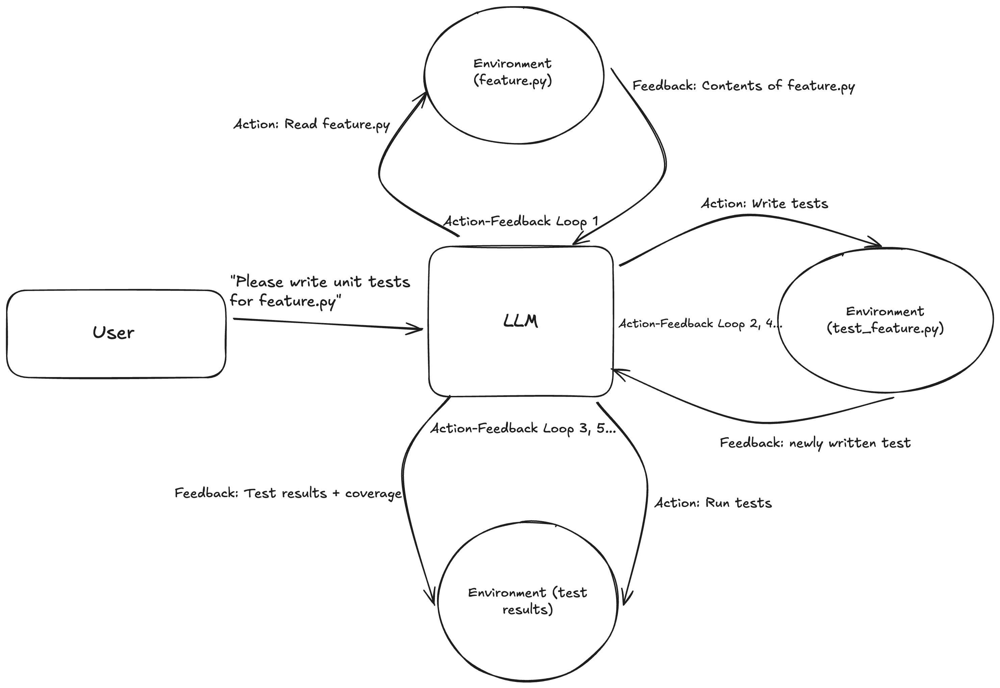
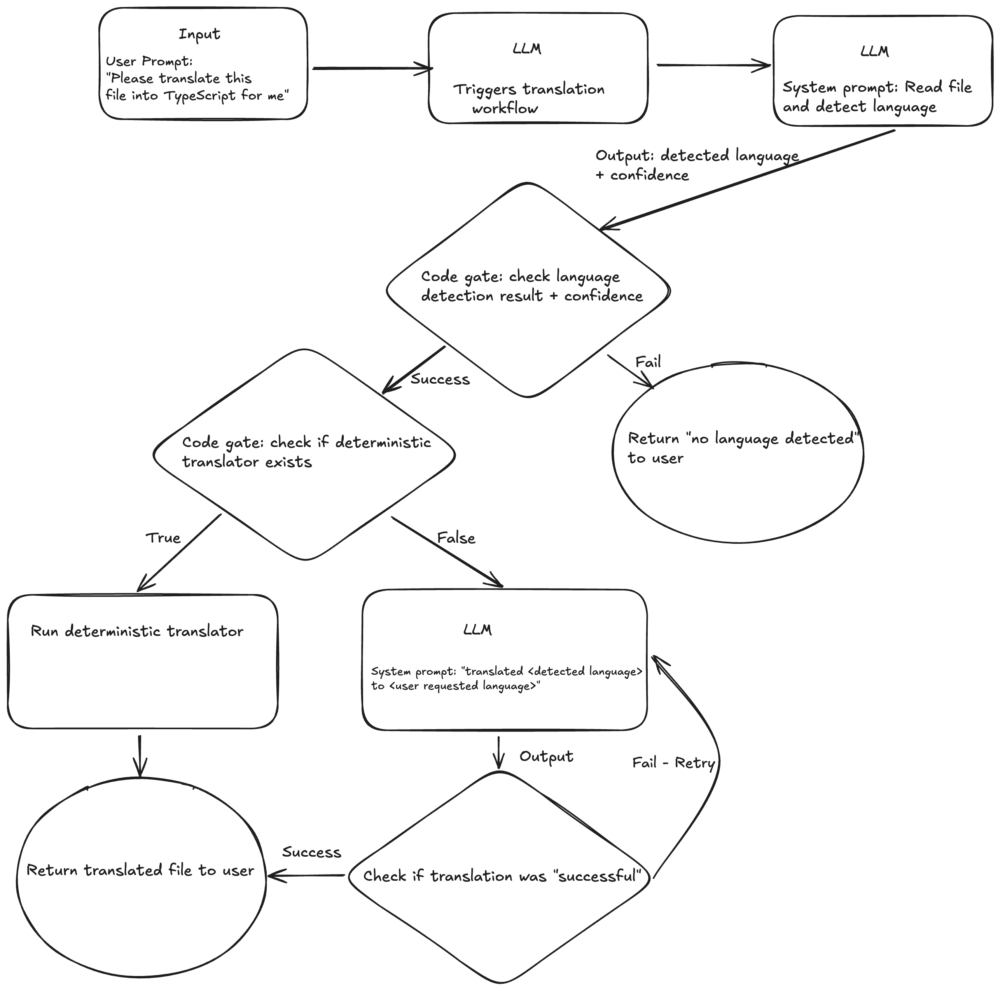
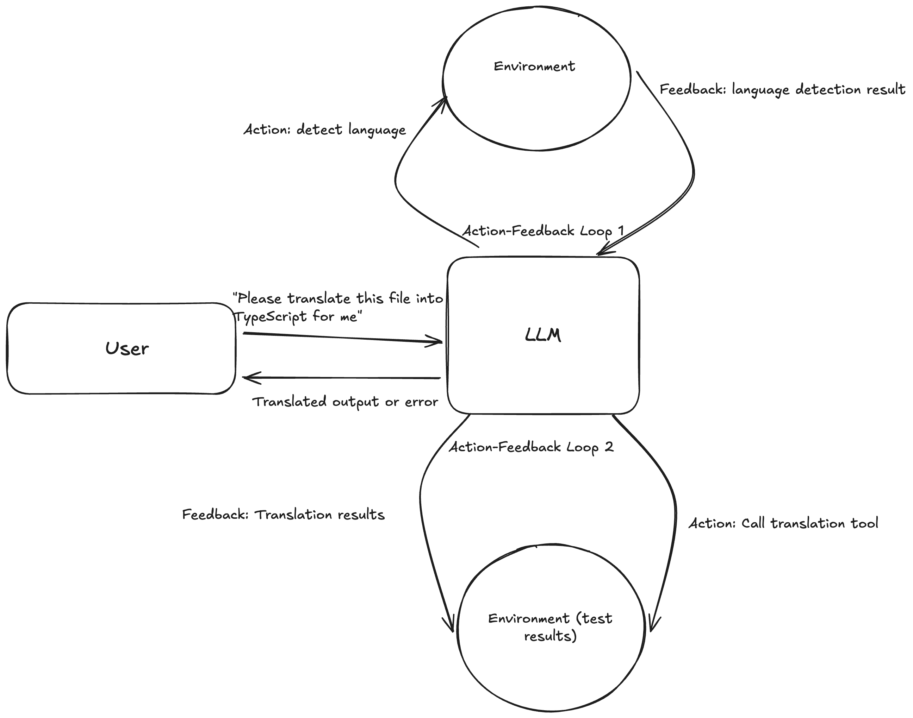
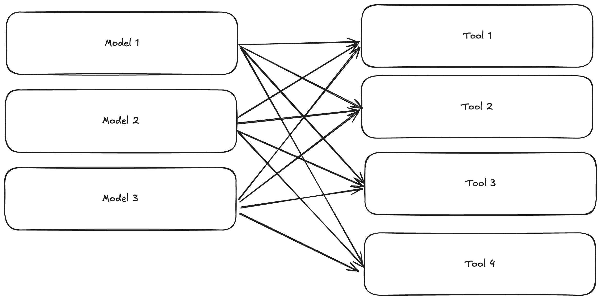
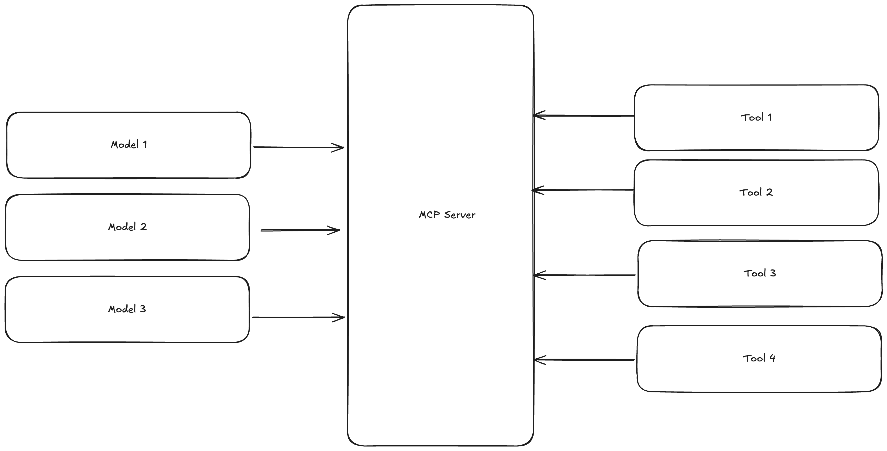

# Chapter 1. Agentic AI and MCP

Towards the end of 2024, Anthropic released the Model Context Protocol (MCP) to great fanfare. Not only did Anthropic standardize a way to transform chatbots from simple talkers into agents that could act, but they released MCP concurrently with support from popular AI-powered IDEs as well as Anthropic’s Claude Desktop, driving rapid adoption. One of the major pieces of the MCP architecture, the MCP servers, was made to be incredibly simple to spin up, but powerfully complex when advanced workflows were needed. This lead to a rapid flood of user-created MCP servers, augmenting generative AI workflows and cementing the adoption of MCP as *the* standard for building AI agents.

This book aims to go deep into MCP, taking you beyond the available documentation and giving you a deep understanding of the MCP architecture, the features the protocol and its SDKs provide, and most importantly, how to use that understanding to build your own MCP servers and clients and augment your own generative AI workflows with them. By doing this, you can transform standard generative AI chatbots into fully fledged agents, which can act, plan, and use tools on their own, and even work together to accomplish complex tasks. In this chapter, you will learn more about AI agents, what they are, how they are used, and how MCP fits into the agentic AI landscape. The next chapter will cover MCP itself: its history, the problems it solves, its architecture, and real-world examples of MCP in action. The next three chapters will cover the major components of MCP: clients and their host applications, servers, and transports. With this knowledge in hand, the final three chapters will use a project in order to give you practical experience building not just your own servers, cliens, and transports, but also how to leverage them in an actual agent.

# What is an Agent, Anyway?

But what exactly *is* an agent? If you Google search this, you will find more definitions than you will find links. If you ask Claude or ChatGPT a few times in a row, you might even get different answers as well. Everyone seems to have an opinion on what is or isn’t an agent, but it is difficult to talk about agents without settling on a common definition. For the purposes of this book, we will use the definition used by Anthropic in their article [Building Effective Agents](https://www.anthropic.com/engineering/building-effective-agents): an *agent* is a “system…​where large language models (LLMs) dynamically direct their own processes and tool usage, maintaining control over how they accomplish tasks.” They’re usually implemented as LLMs that receive a task and then use tools (here, a *tool* is any code “outside” of the agent that is called by the agent to accomplish some task) to execute an action and gather feedback before proceeding. The action and feedback gathering occurs in a loop, where the LLM does some action, feedback is gathered and sent back to the LLM, and then the LLM decides whether to present the result as a final result to the user, use the feedback it gathered to do another action, or gather more feedback from the user.

Let’s take a look at a common use for agents, and what this loop would look like for each outcome. For this example, let’s imagine a coding task: you are in an AI-powered code editor like Cursor or Windsurf and you ask the chatbot to write unit tests for your code. The action/feedback loops may look something like [Figure 1-1](#action-feedback-loop):

*Figure 1-1. A hypothetical action-feedback loop in action for a coding agent.*

Figure 1-1 shows an example action-feeadback loop (*AF loop*) for a coding agent. The user initiates a task by asking the agent (nicely) to write unit tests for their code housed in `feature.py`. The first AF loop is initiated: the LLM reads `feature.py`, the environment it gets feedback from is `feature.py`, and the feedback here could be the code itself, its structure only, or some other representation of the file. Armed with this information, the next AF loop that the agent performs could be to write all the tests that are implied by the contents of `feature.py`. Writing the tests, then, is the action, the feedback environment is the written test file, and the feedback is the written code or some other representation of it. The agent could then enter the third AF loop, where it runs the tests as its action. The environment for this loop is the test environment and results, and the feedback to the LLM could be the test results, test coverage, or anything else that would be helpful to the model to determine the next step. After here, if the results are satisfactory, the loops can end. If not, the agent would probably choose to re-run AF loop 2 or perhapse take a different, more precise action, like fixing the failing tests, then run AF loop 3 again and continue until the results are satisfactory.

This is distinct from an *agentic workflow*, a system in which code, rather than the LLM, determines the path the logic will take, but still calls an LLM to do some part of the work. This is a common pattern in agentic systems, and can be very useful for complex tasks that require some level of deterministic logic as enforced by the code. For example, imagine an application that takes code as an input and turns it into its equivalent in another language. A workflow approach to this could be to take the input code, call an LLM to detect the language the code is in, and if it doesn’t detect a language, return a failure message to the user. If it does detect a language and it is one that you have a deterministic parser for, then the deterministic parser is called on the code, and the translated output is returned to the user. If a language is detected that you don’t have a parser for, then you would call an LLM again and prompt it to do the translation for you, returning the output to the user. This is *prompt chaining*, a common agentic workflow pattern for tasks that require one or more calls to an LLM and a code path for deciding which next steps to take to complete that task. Some other common workflow patterns include *paralellization*, where several LLM calls are made at once and the results are combined, *routing*, where an LLM classifies an input then makes one of several possible LLM calls with the classified input, *orchestrator-worker*, where one LLM breaks down a task, calls worker LLMs to work on the smaller tasks, and finally an LLM is called to put the results together, and *evaluator-optimizer*, where an LLM generates a response to the user prompt and a second LLM call evaluates that response and either presents it to the user if it’s acceptable or returns it with feeback to the first LLM conversation for refinement.

[Figure 1-2](#prompt-chaining-example) shows this prompt-chaining workflow in detail: the input is sent to the LLM to detect the language of the input. The output is the guessed language, which is checked in code to see if there was a detection or not. It branches to the “fail” state if a language was not detected, and to the “success” state if one was. The next state is also deterministic, and checks if we have a deterministic parser for the detected language. If so, the next state is simply calling the parser and reporting the output to the user. If not, the next state is to call an LLM again and prompt it to do the translation for you, returning the output to the user.

*Figure 1-2. A hypothetical prompt-chaining workflow for a language detection and translation agent.*

The workflow is initiated by the first LLM call, which detects that the workflow should be initiated. In this workflow, a series of LLM calls with prompts that build on the results of the previous calls are made, with the workflow’s direction driven primarily by the code, rather than the LLM.

By contrast, an agentic approach, however, would provide language detection and translation tools to the LLM, and simply ask it to detect the language of the input and use that to pick the correct translation tool to do the translation. [Figure 1-3](#Agentic-workflow-example) shows this process: The user provides code input, and the LLM is called. It loops through the action-feedback loop, detecting the language of the input, then checking the environment for any tools to do the translation. If there is an appropriate tool for the agent to use, it calls it, if not, it will autonomously attempt the translation on its own. Whatever result it gets back, it will return to the user.

*Figure 1-3. A language detection and translation agent.*

[Figure 1-3](#Agentic-workflow-example) shows the same process as the prompt chaining workflow in [Figure 1-2](#prompt-chaining-example), but implemented as an autonomous agent. The agent is provided with language detection and translation tools, and is able to use them at its own discretion given the user’s prompt. This is opposed to the prompt chaining workflow, where the code determines the progression of the workflow.

The chief difference to remember is that agents are able to decide which tools to use and actions to take over 1 or more action-feedback loops, while workflows use code paths to determine which tools to use and actions to take, and how to take those actions.

# How are Agents Used in Generative AI?

As you saw above, agents are deployed for complex tasks where planning, decision-making, and tool use are necessary to complete the given task. Typically, to the user, there isn’t any obvious difference between how they interact with an agent than how they interact with non-agentic LLMs: there’s a chat box with a chatbot at the “other end” of it, they ask it questions, and it answers. One key difference with agents, though, is that users can ask them to *do* something, and they can take action and interact with their environment given tools. A user might experience this as nothing more than a more powerful chatbot, but agents can provide customized experiences to the user via their usage of tools, specialized prompts, data resources, memory, and the ability to coordinate and collaborate with other agents.

Because agents are autonomous modifications of existing LLMs, using agents looks just like using an LLM: you give it text (a prompt), and get a response back. But with agents, LLMs now can choose to use or even write small bits of code to execute, can retain memory of interactions with multiple users, and autonomously do research on the web, parallelizing research tasks that would be mostly sequential in a non-agentic or human system.

# What Agents Enable in Generative AI

Agents and the design patterns that are being invented and explored for them are enabling some of the most exciting new advances in generative AI. A single agent transforms an LLM with a static source of information (from its training data) into something that can access new information, take action on its environment via tools, act semi-autonomously, and communicate with other agents. All of this behavior comes from both the architecture of the agent (specifically, the action-feedback loop discussed earlier in this chapter), and the abilities that are added on to an LLM in an agentic system: data retrieval, tools, and memory.

Before agents were widespread, it was most common to interact directly with an LLM via a chat interface. The only information it had available came from its training data so the models were frozen in time, and a model couldn’t remember anything about the user’s chat history or use tools. *Retrieval-augmented generation (RAG)* was an early way to give LLMs more information to work with, and gave rise to chatbots that could answer questions with information in an organization’s knowledge base, support documents, or other data sources. Other techniques, like fine-tuning, were also used to do things like expanding the foundation model’s *knowledge* or giving the chatbot a different *personality.*

Agents, however, allowed for something potentially even more powerful: the ability to act autonomously, to call deterministic code using its own *judgment* and environmental feedback, to coordinate with other agents, and to store short-term *memory* of the user’s chat history and other information. While most of these things aren’t themselves requirements for a system to be considered an agent, the power of LLMs combined with an autonomous agent loop and these bolted-on model augmentations has led to some of the most exciting advances in generative AI yet.

# Examples and Use Cases for Agents

To really explore how agents are used, what they allow us to do, and what kinds of tasks they excel at, it will be helpful to look at some use cases of agents, real-life examples of those use cases, and, where possible, their architectures. Agentic systems are being deployed seemingly everywhere, but a few use cases have really shined recently:

- Coding agents
- Research agents
- Customer service agents
- Business-specific copilots/assistants

  - **Coding agents**: These might be the most common and popular agents, and it’s likely that you’ve worked with one or more. Unsupervised applications like [Anthropic’s](https://www.anthropic.com/claude-code) and OpenAI’s Codex [Claude Code](https://openai.com/codex/) provide a command line interface for instructing the agent(s), but code changes are done in the background, freeing you up to do other tasks while it works. Supervised applications include [Cursor](https://www.cursor.com/) [Windsurf](https://windsurf.dev/), and the [Github Copilot](https://github.com/features/copilot) extension for VS Code and provide a user interface within a familiar code editor, allowing you to view and approve the changes the agent makes.
  - **Research agents**: These agents are used to do deep research on a topic, making use of memory, tools like web search, and in some cases, additional autonomous agents to pursue various avenues of research. Anthropic’s [research agent](https://www.anthropic.com/news/research) is a good example of this, where it uses a combination of built-in and user-provided tools to conduct its research, a memory store to provide context and a scratchpad of current research directions, and subagents orchestrated by the main agent to pursue individual research directions. You can learn more about Claude Research’s architecture and how it works [here](https://www.anthropic.com/engineering/built-multi-agent-research-system).
  - **Customer service agents**: Customer service agents are becoming ubiquitous. While most in the wild are simple decision trees or LLM-powered chatbots with RAG, more and more customer service agents are becoming true agents, adding tool use and memory to better service customers’ questions, guide them through fixing their issue (or attempting to fix it directly), and, when needed, more accurately escalate issues.
  - **Software-specific copilots/assistants**: Many software applications and platforms, especially those that service enterprise customers, are adding copilots that help their customers use and manage the software. These agents will often have tools that are specific to the software: one may be able to build charts with user data, another may generate branded reports, and yet another may help users query their software’s data with natural language.

These are just a few of the most popular use cases for agents, but agents’ inherent flexibility and autonomy make the possibilities for their use nearly endless. Interactive [art projects](https://www.youtube.com/watch?v=7fNYj0EXxMs), AI “personalities” built up over many interactions with people and other agents (like [Void](https://cameron.pfiffer.org/blog/void/) on Bluesky), 3D modeling agents, agents “emboided” in physical objects, and agents that act as an all-in-one personal assistant are just a few less common but perhaps more interesting uses for agents.

# The Model Context Protocol’s Role in Agentic AI

Before MCP, even though agentic AI was still fairly new, organizations that were building internal generative AI platforms and public frameworks like LangChain had to come up with different ways for users to implement tools and then give them to an LLM, with different LLMs requiring their own connector. This led to what is known as the “MxN problem”: for each of M LLMs that needs to be supported, you need N connectors for each tool, data source, etc. that you want to connect. If you support 3 models and 4 tools, that means you have to write 12 connectors that largely repeat themselves, increasing the opportunities for hard-to-diagnose bugs to pop up on ([Figure 1-4](#mxn-problem)).

*Figure 1-4. An illustration of the MxN problem where 3 models all need access to 4 different tools. This results in 12 (4 x 3) connectors being needed.*

The Model Context Protocol, inspired by the Language Server Protocol (LSP), provides a common interface for building tools, prompts, and data resources and connecting them to LLMs. In this way, for any number M of LLMs, you just write N connectors, transforming the M x N problem into M + N. In our 3 model and 4 tool example, this would mean we only need 7 connectors instead of 12 ([Figure 1-5](#mandn_solution)).

*Figure 1-5. With MCP providing a common interface between tools and models, we now only need 7 connectors to provide the three models access to the four tools instead of 12. Each model or AI application simply needs its own connector to the MCP server, and MCP provides a common interface for all of them to use the available tools.*

By creating a simple, standard interface for models to use tools, MCP servers reduce the MxN problem to an M+N problem: any model that supports tool use can be connected to an MCP server via an MCP client, so only one connector (for MCP, this is the client) is needed for all of the tools provided by a single MCP server. Every server that supports tools exposes `ListTools` and `CallTool` endpoints, which the host application calls via its client to get the tools available from the server and call them, respectively.

# MCP Components

The main components of MCP are the MCP server, the MCP client, and the MCP transport. The server provides tools, prompts, data resources, and more via a common interface. The client is the *connector* that interfaces between a host application and an MCP server. The transport is the underlying communication protocol that allows communication between the client and server. The MCP architecture as a whole will be covered in greater detail in the next chapter.

# Other Protocols in Agentic AI

With the success of MCP, other groups have announced their own agentic protocols. While MCP focuses on standardizing how LLMs access and use tools, prompts, and data resources, other protocols focus on how agents communicate with each other. The most notable of these is Google’s [Agent2Agent protocol](https://developers.googleblog.com/en/a2a-a-new-era-of-agent-interoperability/) (A2A). When A2A was released, its creators made clear that it wasn’t a competitor to MCP, but rather a complement to it, and agents that use MCP to access tools and data can still use A2A to communicate with other agents.

[Agent Communication Protocol](https://agentcommunicationprotocol.dev/), like A2A, focuses on how agents communicate with each other, providing a RESTful API for agents to communicate with each other, allowing agents built with different tech stacks and models to work together. [Agent Network Protocol](https://agent-network-protocol.com/) is a Chinese-developed protocol, again fouses on a making inter-agent communiction easier and less brittle. This protocol has identity and authentication built in, and supports encrypted communication between agents.

While these protocols are interesting and likely to become a part of an overall agentic protocol tech stack (much like the Internet protocol tech stack) that includes MCP and, if we follow the path of the Internet, several other purpose-built protocols, these other protocols are not the focus of this book. You should explore them, however, and I challenge you to figure out how to incorporate them with MCP.

# What You’ll Learn

The aim of this book is twofold. The primary purpose is to get you comfortable with every feature and component of the Model Context Protocol, enabling you to build host applications (i.e. agents, given our definition from the beginning of the chapter), clients, servers, and even contribute to the protocol and its various SDKs. The first part of this book, chapters 2 through 5, accomplishes this via explanation and example. We’ll examine every component of MCP and the official Python SDK, discuss what they’re used for, what they can do, and how the implementation relates back to the protocol. As you progress through these components, you will encounter code examples designed to show a practical implementation with minimal cruft, allowing you to focus on the topic at hand. The second part, chapters 6-9, guides you through building a project that uses every part of the MCP architecture. This will give you real, hands-on experience in building applications that can interface with MCP servers via MCP clients, MCP servers, and even transport layers.

The secondary purpose of this book is to serve as a reference guide. The sections of the following chapters dealing with the architecture and Python implementation of the Model Context Protocol include links to code, the protocol specification, and articles and projects that address or otherwise use the protocol. These will serve as starting points whenever you need to learn more about a concept addressed in the book or where that concept fits into the current (and fast-moving) state of the protocol. In addition, I hope both the code examples and project can serve as reference points that can get you started quickly on your own projects.
