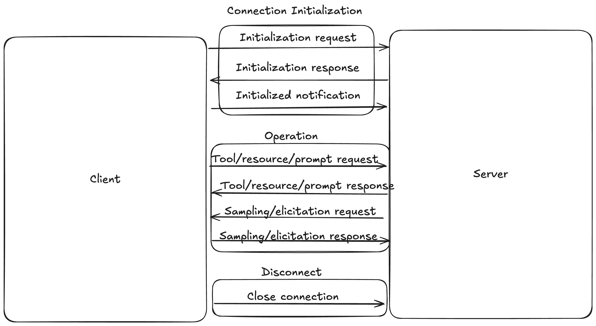
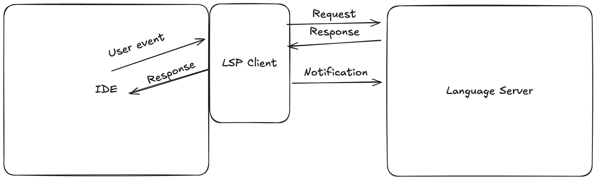
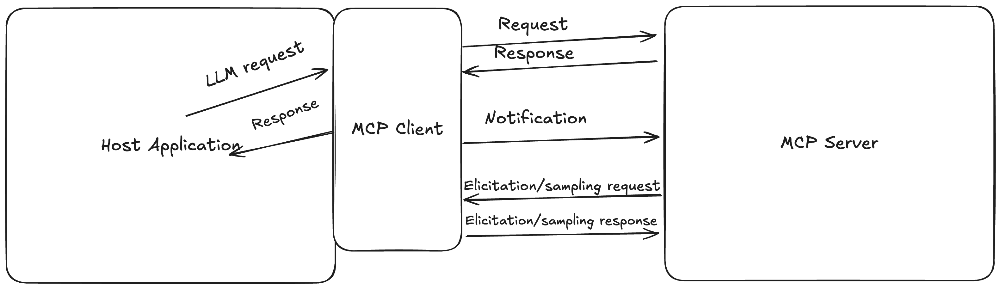
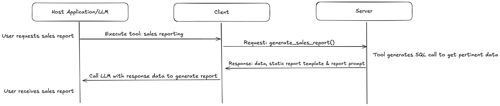
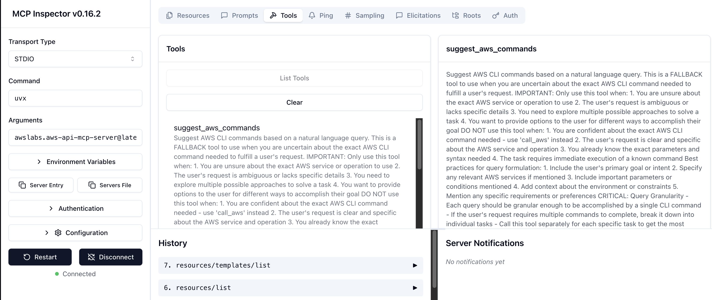

# Chapter 2. An Introduction to the Model Context Protocol

To best understand MCP, it’s important to understand its history, what inspired its creation, what problems it solves for developers, and how it is designed. The growth of the protocol’s usage has been nothing short of explosive, and with the rapid development of the protocol itself, the official and unofficial software development kits, and the wider ecosystem, it’s easy to lose sight of why MCP was created in the first place and what problems it was designed to solve. Having a deep understanding of these things will help you better understand the design choices made in the protocol and how to best leverage the components that MCP provides.

First, we will get into a time machine and travel all the way back to 2024, when an Anthropic engineer was getting annoyed at having to constantly switch between Claude Desktop and his code editor. You will learn about the surprising origin story of MCP, the diverse tools and frustrations that inspired its creation. Then, we will take a look at some of the problems MCP was built to solve through the lens of its creation. Then, we will look at some real-world usages of MCP, such as MCP servers (both local and remote) and applications that host MCP clients, enabling the use of MCP servers. You will see how they solve not only their specific problems, but the broader ones that the protocol was designed to handle. Finally, with all of this context, we will dig into the architecture of MCP itself: its components, how they work together, and how you can customize and build with them.

# The Genesis of MCP

MCP was born out of an internal project at Anthropic. David Soria Parra, a software engineer at Anthropic, was using Claude Desktop to assist him with his day-to-day work: writing developer tools. But he was frustrated by having to constantly copy and paste code between Claude Desktop and his code editor. If you were doing AI-assisted coding before the current wave of LLM-powered coding tools, you’ve probably experienced the same sort of frustration. He had also been working on a Language Server Protocol (LSP) project, which inspired him to take a similar approach to this problem.

The LSP is an open protocol that uses JSON-RPC to enable communication between a client and a server in order to provide advanced language knowledge to an IDE. If you’ve ever used a non-LLM autocomplete, hovered over a variable or a function call to get its definition, or renamed all instances of a variable from your IDE, you’ve likely used LSP and one or more language servers. The protocol was developed by Microsoft for VS Code and standardized in 2016, rapidly becoming the de facto standard for providing advanced language-specific capabilities to IDEs.

# Language Server Protocol (LSP)

The homepage for the LSP protocol specification, which includes a list of programming language servers and SDKs, can be found at [microsoft.github.io/language-server-protocol](https://microsoft.github.io/language-server-protocol/).

While stewing on his specific problem, David was thinking more broadly about how to make it easier for developers to create integrations with Claude Desktop specifically and LLMs in general. He noticed that writing integrations for LLMs, especially for more than one, created the MxN problem you learned about in the previous chapter: for each of M LLMs that you want to write N integrations for, you need to write MxN connectors. You can see this in Figure 1-4. With the LSP project still in the back of his mind, it dawned on David that an LSP-like protocol could be the perfect solution to the MxN problem. This reduces the MxN problem to an M+N problem (see Figure 1-5), now the integrations don’t need unique connectors for each LLM, the integrations and LLM(s) just need to be able to communicate over a shared protocol, allowing a common interface for integrations and LLMs to implement their own connectors. These connectors only need to interface with MCP servers, rather than every combination of LLM and integration, and so the MxN problem is reduced to an M+N problem.

David brought his idea to Justin Spahr-Summers, and the two began setting the foundations for what would become MCP. Later that year, before MCP’s initial release, Anthropic had an internal hackathon. Several teams adopted MCP right away and begin building all kinds of tools and other integrations to Claude Desktop using MCP. This rapid, organic adoption of MCP was, in hindsight, a sign of things to come only a month later, when MCP was first released to the public.

# The Beginnings of MCP

Much of this story comes from an interview with David and Justin on The Latent Space Podcast, which you can find at [the Latent Space](https://www.latent.space/p/mcp).

Before MCP was released, a number of vendors got early access and were able to build clients and servers for their applications with the help of Anthropic. This immediate integration of MCP into several major IDEs and other tools used by developers daily was a major contributor to MCP’s runaway success. The other, arguably bigger contributor, was how easy MCP made it to build and distribute new tools as MCP servers. This ease of creation led to a near-immediate proliferation of MCP servers and tutorials on how to build servers. The ecosystem was born. This ease of use did lead to some issues, though, as some servers were built with little to no authentication or authorizations, others leaked sensitive information, and some just didn’t work as expected. This hasn’t stopped the community though, as more developers gained more experience, they began forming communities like [r/mcp](https://www.reddit.com/r/mcp/) and [r/modelcontextprotocol](https://www.reddit.com/r/modelcontextprotocol/) on Reddit, as well as a [community-run MCP Discord server](https://discord.gg/v5FsE4Baqq) to share their experiences and help each other out, developing best practices and standards for development, and contributing to MCP documentation, protocol specifications, the SDKs, and more (like this book!).

# Why This Book?

Given all these resources that have become available, what’s the point of this book? When I began building with MCP, there were plenty of tutorials of varying quality on building MCP servers. Most people were just integrating servers into applications that already had clients built in, like Cursor or Claude Desktop, but I wanted to build client support for MCP into an agent platform and framework I was working on. There were, surprisingly, very few resources (if any) on building clients. This inspired me to write this book, to help others understand both the model context protocol itself, deeply understand each of its components, and be able to wield the protocol via the Python SDK and fully participate and improve the larger MCP ecosystem and community.

The story of MCP’s beginnings is a bit entertaining, but it is also an important bit of context for truly understanding MCP’s place in the larger generative AI tooling ecosystem. It’s [not REST API](https://leehanchung.github.io/blogs/2025/05/17/mcp-is-not-rest-api/), it’s more akin to LSP that happens to also allow remote servers to exist. It’s a protocol, and not tied to any specific SDK or implementation. It exists to be open, and to allow agents to discover tools, prompts, data, and decide when and how to use them. Specifically, MCP was designed to make it easier to write integrations for LLMs, allow for 2-way communication between agents and servers, and to allow teams to easily distribute their tools, prompts, and data sources to other teams and the public.

# The Problems MCP Addresses

MCP wasn’t just created to prevent users from having to copy and paste code between Claude Desktop and their favorite code editor. Sure, that was the immediate problem that led to the creation of MCP, but MCP was built in order to solve other, more general problems. The copy and paste problem that David faced and that inspired MCP’s creation was a part of a larger problem that MCP could solve: the need for integrations between Claude Desktop (and LLMs more generally) and other applications like IDEs. MCP addresses this problem by not only providing a common interface for discovering and using integrations, but also by making it extremely simple to build and distribute new integrations, largely due to being able to separate integrations from application code. MCP servers don’t just send integrations to the LLM, but they have to be able to receive information from LLMs to do things like executing the tool that the LLM chooses or providing lists of integrations to the host application and LLM.

## Integrations

One of the most exciting developments of agents and generative AI has been how they give other applications superpowers. You can ask your notes questions, you can ask your IDE to write a function for you, you can use an agent to organize your calendar, or prune your files. However, these uses all require integrations between the application and the LLM that powers the agent. Historically, these integrations were built by the application’s developers and tightly coupled to the application’s codebase. This causes several downstream issues that this section will explore in more detail, but the one of the most important of these is that if an application wants to support multiple models, developers will have to write a connector for each integration for each model.

This is is the MxN problem that we discussed in the previous chapter, and at some point makes building integrations untenable. MCP addresses this problem with the MCP server. The server provides a common interface for both discovering and using integrations such as tools, prompts, and data sources. This means that application developers using MCP no longer have to write custom connectors for each model and for each integration that they want to support. Instead, they can just connect to the server, get the lists of integrations the server provides, and then call the same function (e.g. for tools in Python: `use_tool()` with the tool name and arguments passed as parameters to the function) to use the integration. This “universal connector” architecture is often described as a “USB-C” architecture for integrations, because the connector is the same for all integrations.

# Integrations or Tools?

In this chapter, we’ve talked about integrations and tools somewhat interchangeably. *Tools* are a type of LLM integration, and are units of deterministic code (typically functions) that are called and executed by the LLM. *Integrations* are a more general term that includes tools but also anything else, such as data sources as prompt context, that can be integrated into an LLM request.

## Distribution

Previously, teams working with agents had to build their own tools and connectors, and because these were often bespoke and environment-specific, they were not reusable and thus difficult to distribute among teams, let alone the public. With MCP, tools, prompts, data resources,and more can be shared either indirectly via a code-sharing platform like GitHub or as a running server that models can connect to directly. Because MCP unifies the interface for discovering and using integrations, the integrations themselves can be decoupled from application code, and any agent consuming the integrations just needs to discover what is available and then use the appropriate integration.

This unlocks a force multiplier effect for teams and individuals. Anyone can make their datasets or tools AI-ready by writing an MCP server and sharing it with the world. Teams within a large organization can either dedicate themselves to writing MCP servers and distributing them for use to other teams within the organization, or teams can collaborate on MCP servers and share them throughout the organization, standardizing tools, prompts, and data for the entire business.

## 2-Way Communication

Like many communication protocols, MCP is designed for 2-way communication. This means that MCP servers can not only send information to the host application and LLM, but that they can receive information from them. This is necessary for autonomous communications protocols, because both parties often need to send each other data to do basic things like establishing a connection or requesting a list of available tools from a connected MCP server. MCP mandates two-way communication in the protocol specification itself, by defining the full connection lifecycle, including initialization requests from client to server, and the appropriate response from server to client, as one example of 2-way communication at the level of the protocol itself. [Figure 2-1](#The-MCP-Connection-Lifecycle) shows the full connection lifecycle between client and server in MCP, covering the initialization, operation and shutdown phases.

*Figure 2-1. MCP’s connection lifecycle consists of three phases: Initialization, operation, and disconnection. Within each phase, messages are passed between client and server in a series of requests and responses, demonstrating the bidirectional nature of client-server communication in MCP.*

Because MCP is a protocol, MCP itself just requires that communication between the client and server is bidirectional. The implementation is handled by transports, which are responsible for handling the underlying details of client-server communication, such as maintaining connections and passing messages over the established communication channel. MCP comes with two default transports: Streamable HTTP which allows for connections to remote MCP servers, and stdio, which is used for local MCP servers. Users, are able to implement their own transports as well, and can be plugged right into the existing MCP SDKs. You’ll learn more about transports and how to build them in Chapter 5.

# Real-World Examples of MCP

When deciding whether to use MCP, just like any other open technology, it’s important to evaluate the community and ecosystem around the technology. For open source technologies, this can help you decide if the technology is worth the time and effort to learn and use, if it has a strong community that can rapidly respond to bugs and build new features, and if it is stable enough to include in your production applications. Typically, you can get a feel for this by looking at the number of users, who is using it, how many people are contributing to development, and how the technology is being used in the wild.

MCP is a very new protocol, but already has a strong community and ecosystem. The community-run Discord server mentioned earlier in the chapter has around 1000 members as of this writing, the two subreddits have over a combined 70,000 subscribers, and the official [MCP specification GitHub repository](https://github.com/modelcontextprotocol/modelcontextprotocol) has over 4,800 stars. It also has over 150 active issues, where proposals to change the protocol are discussed. More importantly, MCP has more than 350 official MCP servers listed on its [official MCP server repository](https://github.com/modelcontextprotocol/servers), and just under 650 community-built servers. On [its official list](https://modelcontextprotocol.io/clients) of example clients, there are 76, many of which were available at MCP’s official launch. But what lead to this rapid adoption?

While the generative AI field is as hot as its ever been, the vibrant MCP ecosystem isn’t just a product of the hype. Upon launch, MCP became supported by a number of major applications both from Anthropic and from other vendors, like Claude Desktop, Cursor, and Zed. Having working implementations of MCP in applications favored by developers, already widely using Anthropic’s Claude family of models because of its coding abilities, was crucial in encouraging rapid early adoption of the protocol. In addition, the protocol made it incredibly easy to build and share tools, prompts, and data resources via the server, which was released with ample documentation for building and incorporating via several SDKs. From that, a wealth of resources for getting started with building MCP servers followed, and then frameworks like [FastMCP](https://github.com/jlowin/fastmcp) came along (with v1 incorporated into the official Python SDK) to further simplify MCP server development.

These are the seeds, planted by Anthropic and nourished by the community, that grew like weeds into the vibrant, thriving ecosystem we see today. Many servers and client integrations are focused on developers, like [AWS’](https://github.com/awslabs/mcp/tree/main) wealth of MCP servers supporting AWS developers, the [official GitHub MCP server](https://github.com/github/github-mcp-server) for intelligently managing GitHub repositories, and [Linear’s official MCP server](https://linear.app/docs/mcp) for interacting with Linear projects and tickets. But it’s not just developers that are benefiting from MCP, Canva released an [MCP server](https://www.canva.dev/docs/apps/mcp-server/) to allow agentic software to help designers with their process, [Uberall’s MCP server](https://github.com/uberall/uberall-mcp-server) augments agents that work with salespeople, the [FetchSERP’s MCP server](https://github.com/fetchSERP/fetchserp-mcp-server-node) brings agents tools for doing SEO analysis, web scraping, and more, a boon for growth marketers.

It’s not just servers that show real-world uses of MCP. Client integrations bring MCP tools to specific host applications that have already implemented agentic workflows. This allows those agents to become even more powerful, giving them the gift of tool use. Many of these, like Cline, Cursor, GitHub Copilot, and Windsurf are IDEs or IDE plugins that allow augmenting the code assistant workflows used in these applications. Beyond editors, chat applications like Slack and BoltAI, the popoular API testing client Postman, and desktop assistants like Witsy and 5ire all have MCP clients, allowing users to enhance their experiences with these applications by adding the capabilities provided by MCP servers.

## A Developer’s MCP Use Case

Because MCP is geared towards the developers building with it, it probably makes sense that the most well-established tools and use cases serve developers. When MCP was released publicly, the popular AI-powered IDEs all added support for adding MCP servers to their respective agents. This has been a boon for developers, who can now add even more knowledge and abilities to the code assistants as long as their model of choice supports features like tool calling. Let’s consider a Python developer who uses AWS heavily, especially the AWS CLI and their CDK infrastructure-as-code (IaC) library and is using the Cursor IDE. Cursor has had built-in support for MCP servers and has since around the time MCP was first released in November 2024, and so our developer can add any servers they want to their IDE. Since this developer uses AWS, they can pick from over a dozen official AWS MCP servers that provide access to documentation, tooling (like [CDK Nag](https://github.com/cdklabs/cdk-nag)), and more. From those, they might choose the [CDK MCP server](https://awslabs.github.io/mcp/servers/cdk-mcp-server/) which can, among other things, provide an interface to the expansive CDK documentation, give advice on CDK best practices given existing code, and assist with using Lambda Powertools within a CDK application. They could also include the [AWS documentation MCP server](https://awslabs.github.io/mcp/servers/aws-documentation-mcp-server/) to get more accurate answers to questions about AWS and the [AWS API MCP server](https://awslabs.github.io/mcp/servers/aws-api-mcp-server/) to allow their agent to run AWS commands given natural language prompts. Then, they could decide to add one of several LSP MCP servers to give their agent access to all the LSP features that their IDE also has access to, like code completions, and maybe even a memory MCP server to create a personality for their agent.

# Too Many Tools

Due to tool name collisions, overlapping definitions and use cases, and other factors, tool choice accuracy (how often an agent picks the correct tool given a prompt) can be negatively affected when there are a large amount of tools. Before you add a dozen servers to your agent of choice, make sure you note or otherwise evaluate (using a tool like [Promptfoo](https://www.promptfoo.dev/)) the tool choice accuracy of your agent before and after adding servers.

The possibilities are as close to endless as could be: if none of the hundreds of available MCP servers fit your specific need, this book will give you the tools to build your own and share it with the world. One of those tools is an understanding of the architecture of MCP, which at the highest level consists of three major components: the client, the server, and the transport. All three will be introduced in the next section.

# The Architecture of MCP

The Model Context Protocol follows a client-server architecture, in which a client application like an IDE or chat agent can connect to a local or remote server and exchange messages with it. While most are familiar with this architecture from the simplified form of how browsers interact with websites, a look at the design of the Language Server Protocol can provide a good introduction to the MCP architecture. So we will start with a short discussion of the overall LSP and MCP architecture, comparing and contrasting the two, then we will discuss the major components of the protocol itself, what they do individually, and how they work together. These components are the host application, the MCP client, the MCP server, MCP transports, and then we will talk about some development tools that have popped up to help with MCP development.

## From LSP to MCP

In the beginning of the chapter, during the discussion about the origins of MCP, we learned that MCP was inspired by the Language Server Protocol, something that is ubiquitous in modern IDEs and code editors today. Before LSP, it was common to have language-specific IDEs partially because language support had to be built separately for each language an IDE was to support — another classic example of the MxN problem (see Figure 1-4). LSP solved this by establishing a protocol in which host applications could communicate with language servers running in separate processes via a standard JSON-RPC communication interface. This is done with client code that is included with the host application and manages connections to language servers, and servers that are launched and run as separate processes. Language servers provide a any of a number of additional capabilities to the host application for the language that the server supports using a universal messaging language and format. [Figure 2-2](#The-LSP-architecture) shows the interactions between a host application and several language servers using LSP.

*Figure 2-2. The LSP architecture consists of a host application (the IDE) with a client and 1 or more language servers. The host application emits events to the client, which can turn them into a request or notification to the language server. The language server responds to a request with a response, which the client relays to the host application.*

If you are coming into this book with some existing knowledge of MCP, this architecture will look very familiar. Like LSP, MCP involves host applications, client software that manages connnections to servers, servers that provide additional capabilities to the host application, and a JSON-RPC communication layer. The architectural influence of LSP is clear, but MCP does have some significant differences. While LSP focuses on extending the capabilities of IDEs, MCP is more agnostic to the kind of host application that uses it. The only requirement to using MCP is a soft one: the host application *should* be agentic in some way, but there is nothing to stop you from using it in a non-agentic host system. With LSP, servers are typically run as processes local to the host application. When you start your IDE, your language servers are also started up on your machine. MCP, on the other hand, supports both local and remote servers. When a user adds a local server to a host application like Claude Desktop, they add a server definition that includes the command for starting the server as well as any start-time parameters the server may require and messages are sent over a local transport layer, typically stdio. Remote servers, on the other hand, are defined by a URL and often support some form of authentication, like API keys or OAuth tokens, using remote transport layers like Streamable HTTP to pass JSON-RPC messages.

# Streamable HTTP

The Streamable HTTP transport is the default transport layer for remote MCP servers and is supported out of the box by the official MCP software development kits. This allows MCP servers to run on their own process while accepting multiple outside connections. Communication is done with familiar HTTP methods (specifically GETs and PUTs), with an optional flag that enables *server-sent events*-style (*SSE*) streaming communication between the client and remote server. You can learn more about the transport [in the official documentation](https://modelcontextprotocol.io/specification/2025-03-26/basic/transports#streamable-http) and in Chapter 5.

These can be hosted by a third party on their own web servers or within an organization within their own private network. This really unlocks the power of agentic AI, because now tools can be easily distributed as easily as REST APIs are for traditional web applications. [Figure 2-3](#The-MCP-architecture) shows how host applications, clients, and servers interact in MCP. If it looks like a copy of [Figure 2-1](#The-MCP-Connection-Lifecycle), that’s because it essentially is, and underscores the deep inspiration LSP had on MCP’s design. In this image, the MCP client is attached to the host application, and it acts as a nexus point between the host application (along with its LLM) and the MCP server. The host application can call the client, which can then send a request to the server and then receive a response from it, however elicitations and sampling (which you will learn more about in [Chapter 3](chapter_3.html#ch03)) reverse this order. Clients and servers can also send notifications to each other, which don’t require a response from the other party.

*Figure 2-3. The MCP architecture consists of a host application with a client and 1 or more MCP servers (only one client instance may connect to a single server). The host application calls the client, which can turn them into a request or notification to the MCP server. The MCP server responds to a request with a response, which the client relays to the host application. With elicitations and sampling, the MCP server cal also send requests to the client which will handle them with the application or LLM and send a request back to the server.*

In Part 1 of this book, we will be focusing on the structure of MCP itself, how it works, and how to use MCP’s features through the official Python SDK. To do so, we will break the MCP architecture down into its major components: the host application and MCP client, the MCP server, and the MCP transport. In Part 2, we will work together to build a project that spans all of these components, giving you hands-on experience with every aspect of the protocol. The following sections will introduce each of these major components along with their uses and how they fit into the larger protocol.

## The Host Application and MCP Client

We will start with host applications and the MCP client. Of course, host applications aren’t technically part of the MCP architecture, but they are necessary to actually use MCP. Host applications are any applications that host an MCP client and use it to extend their capabilities by interacting with MCP servers. There are no restrictions to what host applications can be; some common application types are IDEs, chatbot applications like Claude Desktop, frameworks for building agents, and AI-powered terminals like Warp.

Clients are a part of the host application, and are responsible for managing connections to MCP servers as well as routing requests from the LLM to the appropriate server and back to the LLM. A client instance maintains a 1:1 connection with a single server, relaying messages between the host application and server. Clients can determine which server features make it to the host application and LLM. Some might only allow a server’s tools to be used regardless of which of the MCP building blocks (tools, resources, and prompts) are available, while others may allow all of a server’s building blocks to be used.

# Client or Client

Some sources may refer to any applications that consume the context provided by MCP clients as clients, and in certain contexts, this is a valid usage. However, because this book is focused heavily on the code, we separated the “client” into two distinct concepts: the **host application** and the MCP **client**. The host application is the application that hosts the MCP client code and interacts with an LLM to provide functionality to its users. Outside of the interaction point with the LLM, the rest of the application code may be completely agnostic to the presence of an MCP client. The MCP client, then, is the specific code within the host application that connects to MCP servers and communicates with them.

Clients also provide a few few features to servers, augmenting their functionality. These features are sampling, roots, and elicitation. **Sampling** allows a server to make calls to the host application’s language model. This allows servers to provide complex, AI-enabled workflows within their tools. As an example, consider report generation. Let’s assume you have an MCP server that has access to your organization’s database of sales data. You could prompt your application to build a report of the last 6 months of sales, then it would call the sales reporting tool, which would retrieve your raw data from the database, then send it along with templates stored in the server back to the client along with a prompt, having the host LLM generate the report given the prompt, raw data, and report template. This allows the server to control the prompt and assets like report templates that lend the server its main functionality while not saddling it with a separate dependency on a language model. See [Figure 2-4](#sampling_sequence_diagram) for a visual representation of this workflow.

*Figure 2-4. This sequence diagram shows an example sampling workflow. In it, the user asks the host application for a sales report. The host’s LLM chooses to call the sales reporting tool, which triggers the client to send a tool execution request to the server with the tool name and parameters. The server runs the code, and in its response returns the data, a report template, and a prompt. The client then can forward everything to the host LLM to generate the report and then return the result to the user.*

**Roots** allow clients to mark specific parts of the filesystem that a connected server has access to. These can be useful across many workflows, such as automatically restricting a server’s access to a specific project directory or allowing users to select specific files and directories to make available to the application and thus any connected servers. It’s a powerful way to provide filesystem context to servers that need it, however it is *not* a secure way to limit the blast radius of a malicious server. This is because the MCP specification only says that servers *should* respect any roots provided by the client, but does not require it. This probably serves as a compatibility feature for servers that don’t access the filesystem, but roots being ignorable make them a poor substitute for a proper access control system.

**Elicitations** are a relative newcomer to the MCP client feature set. Elicitations are similar in purpose to sampling: where sampling allows the server to make calls to the host application’s language model, elicitations allow the server to reach back into the host application via the client and request input from the user. This means that servers, when connected to clients that suport the feature, can construct not only complex LLM-powered workflows, but also workflows that include human feedback, providing even more flexibility and out-of-the-box functionality to host applications as long as the application’s client supports it.

The client exists to provide a connection between the host application and the MCP server. It manages the connection itself, relays messages between the host’s language model and the server, and provides features that enable more complex workflows to be run by the server itself. The server is the other major component that you will encounter as an MCP developer. In fact, you will typically spend the most time working with servers, whether you are installing them for personal use, connecting them to your own agentic applications, or building them for others to use.

## The MCP Server

Servers in MCP are the most visible part of the MCP architecture. Like their predecessors in LSP, MCP servers are responsible for providing a wide range of capabilities to the host application that is connected to it. In LSP, these capabilities are typically language-specific and include things like code completion, documentation tooltips, and other things along those lines. In MCP, however, servers don’t need to run local to the host application, and servers have a much broader range of capabilities they can augment the host application with. These capabilities typically fall into three categories: actions, data, and language model prompts. These represent things the host application can do, what it can do them with, and how to interact with the language model, respectively, and fit into the three major MCP server building blocks: tools, resources, and prompts.

**Tools** represent actions. These are typically self-contained functions that can be called by the host application’s language model. Their names and descriptions are provided to the LLM via the client, and based on the user prompt, the LLM can choose to call the tool or not. If the tool is called, it’ll run wherever the MCP server is running, with the results being sent back to the client and application. Tools are the most common building block in MCP servers, and are the most versatile and common way to augment an application’s capabilities by expanding the actions it can take.

**Resources** represent data. They can come in the form of text files, blob files (like PDFs), database schemas, code documentation, and more. If tools are the verbs of the MCP server’s grammar, then resources are the nouns. Resources can be used directly to provide more context to the LLM, or used by tools to operate on the data, or even [as a cache for reducing the size and cost of your LLM calls](https://timkellogg.me/blog/2025/06/05/mcp-resources).

And, finally, **prompts** are the language model prompts that can be used by the host application to interact with their own LLM. While this may seem really similar to sampling on the client side, they actually serve very different purposes. Sampling allows the server to directly call the LLM being used by the host application, while server-provided prompts are controlled by the application: it can decide when and how to use the prompts provided by the server. These are useful when you have a server built for a specific service or application and the builders know it well enough to have tested and built optimized prompts for interacting with said service.

###### Warning

As with other external tools like packages and traditional APIs, MCP servers can provide additional attack vectors for hackers to access your data and systems. An example attack is the rug pull, where an originally safe server is made malicious by the server’s owner. This is less problematic with servers running locally, but it is a risk that should be considered and mitigated when using MCP servers both locally and remotely. Chapter 4 covers server security in more detail.

While not quite a building block in the same way that tools, resources, and prompts are, MCP servers also provide utilities that help with server development and debugging. In a strong nod to MCP’s inspiration in LSP, MCP servers can provide a completions capability, which provides autocompletion suggestions to users for prompts and resources. MCP servers may also implement logging capabilities, which allow clients to receive and filter structured logs from the server they’re connected to. The final server utility is pagination. If you’ve worked with web APIs (especially REST) or directly with databases before, you’ve most likely encountered pagination already. Pagination allows servers to return a subset of a response to the requesting client along with a token that represents the current position in the overall response data, which can help improve performance when dealing with large datasets both locally and remotely.

Servers will be covered in greater detail beginning in [Chapter 5](chapter_5.html#ch05), and you can expect to see more about the major building blocks and utilities, and how to build support for them there. The next major component of the model context protocol is the transport layer.

## The MCP Transport

Transports in MCP implement the protocol’s communication layer. At the most basic level, they are responsible for sending and receiving messages between the client and server. MCP SDKs come with two default transports: stdio for local connections and Streamable HTTP for remote connections. While these are the most commonly used, the protocol allows for the implementation of custom transports as well, which can support use cases for which the default transports are less well-suited, as long as the underlying communication channel being used allows for bidirectional message passing. Transports may be stateless (as in the case of the stdio transport) or optionally stateful (as in the case of the Streamable HTTP transport). For stateful transports, the transport is responsible for maintaining a session between the client and server and may support things like resuming after a network interruption, or supporting multiple clients connecting to the same server. All transports must manage the entire connection lifecycle, which is covered in [Chapter 5](chapter_5.html#ch05).

# Supporting Multiple Transports

When you are building a client or a server, you are not limited to using a single transport. By supporting multiple transports, you are giving your users the flexibility to choose the best transport for their use case. Anthropic strongly recommends that the stdio transport should always be supported, and you can add support for the streamable HTTP transport if you plan to deploy a remote server or have your application support adding remote servers.

The main functionality of transports, however, is to manage connections and handle messages. No matter which transport is used, the messages sent between the client and server are always JSON-RPC messages. This means that the transport is responsible for loading the messages into the correct format for the client and server to understand, something the built-in transports handle on their own. There are three main types of messages in MCP: requests, responses, and notifications. Requests can be sent from either a client or a server, and are used to initiate some action from the connected entity. Responses are replies to requests, and these hold either the result of an operation or error information if that operation has failed. Notifications are one-way messages and can be sent by either the client or the server, typically notifying the receiver of some change in state.

As with any part of the protocol, you are able to build your own transports and can use them just like you would use the built-in ones. This is less common, but can be worth doing if you have unique needs, especially around performance and security. Transports should be thought of as a security boundary, and if you have security needs beyond what is provided by the built-in transports, building you own is a good option. You could also build your own if you are integrating MCP with an existing system that already is using a communication protocol or messaging system. You will learn more about the structure of transports and messages in [Chapter 5](chapter_5.html#ch05).

## The MCP Connection Lifecycle

Before moving on to the next chapters, let’s briefly cover the MCP connection lifecycle. This lifecycle governs how each of the MCP components handle creating, using, and closing a connection which is underscored by the names of the major phases of the connection lifecycle:

- **Initialization**: The client and server exchange messages to establish which protocol versions they’re compatible with, to share and negotiate supported capabilities, and to share any implementation details that may be relevant to the connection.
- **Operation**: This is the main “loop” where everything happens. Based on the negotiated capabilities from the initialization phase, the client sends a request to the server, and the server replies with a response, which could include the results of the requested operation or an error if there was a failure.
- **Shutdown**: During this phase, the client terminates the protocol connection, with the transport layer being responsible for communicating this termination to the server.

If you’re using the built-in transports for your client or server, the connection lifecycle is almost entirely managed for you, and this becomes less important. Instead, you can just focus on connecting and disconnecting from the appropriate built-in session manager provided by the SDK in your language of choice. The protocol also enables authorization at the transport layer, and transport developers who want to include authorization are required to implement [OAuth 2.1](https://oauth.net/2.1/) authorization support. These topics will all be covered in more detail in [Chapter 5](chapter_5.html#ch05).

## Protocol Utilities & Other Developer Tools

Part of the story of MCP’s rapid ascent is due to the tooling around it, both built by Anthropic and by outside developers in the MCP ecosystem. In the protocol itself is support for special utility messages that can be used by both clients and servers, while outside of it are SDKs, testing and debugging tools, frameworks, and more. These tools, especially the frameworks early on, made interacting with the protocol very simple, very early, contributing to the protocol’s rapid update. More recent tools focus on improving the developer experience, allowing for major overhauls on the official SDKs, directly testing MCP servers, visualizing logs, and similar developer-focused tasks. This will be crucial to MCP’s continued adoption beyond the already stunning explosion in popularity, since developers will be working on and/or near the protocol.

> Developers, developers, developers, developers!
>
> Steve Ballmer

While servers have their own specialized utilities, the base protocol also supports some common utilities that both clients and servers can use, typically to get feedback about or change the state of the connection. The first utility is cancellation. This takes the form of a notification message from either the client or the server that holds a request ID and reason for cancellation, and is used to cancel requests that are still being worked on. Ping is available as a parameterless JSON-RCP message which are sent either by the client or the server to check if the connection is still alive. And finally, progress reporting is also available at the protocol level and allows clients or servers to display an accurate progress bar back to the user that communicates the progress of any operation. You will learn more about all of these in chapters 3 and 4.

###### Note

If you want to use these tools, you’ll have to ensure that the client and server both support them.

For those of you building with MCP (hopefully everyone reading this book!), there are already a number of developer tools designed to make your life easier. In addition to SDKs in several languages (such as Python, Typescript, Go, Rust, C#, and several more) The primary way you will interact with MCP as a developer is through the official software development kits. These “implement the protocol,” using the language they’re in to manage, handle, and route the messages that are at the core of MCP, and are available in Python, Typescript, Go, Rust, C#, and more. All of these handle the core functionality of clients, servers, and transports. Another popular tool is [MCP Inspector](https://github.com/modelcontextprotocol/inspector). This gives you a web UI client and proxy that you can use to connect to your servers via any built-in transport and visually test them, which you can see in [Figure 2-5](#mcp_inspector).

*Figure 2-5. The MCP Inspector UI, showing the connection setup in the left menubar, the server function selectors in the top menu, and the tool inspector UI in the center.*

The MCP Inspector UI can give you deep visibility into the workings of an individual MCP server. Being able to inspect resources, prompts, tools, and roots, being able to run tools, send ping messages, and even run sampling and elicitation workflows allows you to manually test every possible aspect of an MCP server. You will learn more about MCP Inspector in [Chapter 7](chapter_7.html#ch07).

In the next chapters, you will get an inside look at how the major MCP components work, what their code can look like with the Python SDK, and how to implement your own client and servers. This background—​what inspired MCP, the problems it solves, how it’s being used today, and how it was designed—​should give you more context and a deeper understanding of the components you are going to learn about next.
