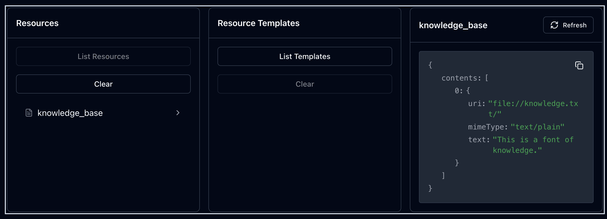
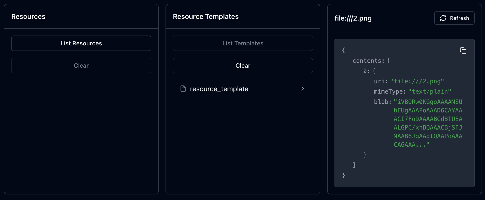

<a id="ch05"></a>

# Chapter 5. Building MCP Servers: Providing Tools, Prompts and Resources to Applications

On the other side of the MCP equation from the client is the server. In Chapter 3, the client examples all made use of a server that gave their host application the ability to do math. This server was pre-built and was run locally. In this chapter, our examples will show the construction of this same server from scratch, including all of the primitives and features that servers can provide to clients and their host applications.

###### Note

In the client chapters, we talked about *host applications* from the perspective of the client. Now that we are building servers, we will take the point of view of the server, for whom clients and their host applications are inseparable. For these chapters, we will refer to them collectivels as *client applications* or just *clients*.

We will begin with a high-level view of the server, including what servers do and how they’re useful, how they connect to clients, and the two main paths for building them with the Python SDK. Then, we will get right into the details:

- server primitives (tools, prompts, and resources) and how to serve them
- server utilities (completion, logging, notifications, and pagination) and how to use them
- server security
- using client-provided resources like sampling and elicitation

As a server developer, you will also need to become comfortable with testing your server. You’ll learn about MCP Inspsector, a tool to visualize and interact with your server and its tools, and evaluations, tests used on traditional AI systems that we can repurpose for our own use.

<a id="id73"></a>

# Servers, What Are They Good For?

Servers are the most popular entry point for developers getting started with MCP. Popular tools such as Claude Desktop, Claude Code, Cursor, and more all have built-in support for adding servers to their applications, and the maintainers of the various MCP SDKs have focused very heavily on making server development as easy as possible for developers. This has had a few consequences, like insecure and poorly performing servers being built and immediately released, and hiding some of the deeper benefits that MCP servers provide.

The most obvious thing that servers do is provide applicatons with access to MCP primitives, granting applications new abilities they didn’t have before. These primitives are the building blocks of MCP, and consist of tools, prompts, and resources. You encountered these in [Chapter 3](chapter_3.html#ch03), where your client integrated these primitives with a simple chat application that the client was a part of. By using these primitives, you learned what they offered: tools offer programmed actions, resources offer structured data that can be use as context by the language model, and prompts offer interactive instructions for the client application’s language model. In the [MCP specification](https://modelcontextprotocol.io/specification/2025-06-18/server), each primitive is designed to be controlled by a different entity: tools are controlled by the model that calls them, resources are controlled by the application that decides how to use them, and prompts are controlled by the application user that triggers their use and provides their inputs.

These lists of uses and controllers is summarized in the following table, which is reproduced with some modifications from the MCP specification:

<a id="server_primitive_table"></a>

*Table 5-1. MCP server primitives, controllers, and descriptions, from the [MCP server specification](https://modelcontextprotocol.io/specification/2025-06-18/server)*

| Primitive | Controller | Description |
| --- | --- | --- |
| Tool | The model | Functions exposed to the LLM to take some action |
| Resource | The application | Contextual data managed by the application using the server |
| Prompt | The application user | Interactive templates invoked by user choice |

But the real magic of servers lies somewhere else, but is still related to how they augment applications: they solve the problem of distribution. Before MCP, tools, data sources, and prompts were all tightly coupled to the intelligent application that used them, which made them difficult to share and reuse. If someone wanted their application’s LLM to have access to, e.g. AWS documentation, they would have to connect to it, write the appropriate code to retrieve it, and then make it available to their application’s LLM. With MCP, someone at AWS who knows the provided tool better can write an MCP server that provides this functionality to anyone who can connect to it. Now, application developers can focus on their application’s logic, letting MCP servers handle the rest. Server writers can distribute their servers either via code-sharing platforms like GitHub or as a running server that MCP clients can connect to remotely. When an MCP server can be written in a single file, it makes it much easier to share and reuse—​even more so when the server is deployed to a remote web server.

<a id="id74"></a>

# Connecting Servers to Applications Using Transports

The key to how servers talk to applications via MCP clients is the *transport*. You encountered these in the client examples in [Chapter 3](chapter_3.html#ch03) and will get into the gory details of them in Chapter 8, but for server development it’s important to understand the options available for distributing your server to client applications. The protocol itself uses [JSON-RPC](https://www.jsonrpc.org/) as the underlying communication protocol, and transports serve to communicate messages encoded with that protocol between the client and server. There are two major transports supported by MCP and its SDKs: stdio for local connections and Streamable HTTP for remote connections. When you are developing a server, the protocol encourages you to support stdio as long as its possible. Supporting stdio makes it easy for users to connect to your server by loading the server script locally in their application and allowing the MCP client to call it with a set command (usually communicated via the server’s `README`). When using this transport, the MCP client executes the server script as a long-running subprocess and messages are read by the server’s standard input and written to its standard output. Figure 5-1 shows the basic flow of a stdio connection.

Streamable HTTP, on the other hand, is designed to support remote connections, such that the server and client do not need to be running on the same system. When implementing a server with this transport, you have to provide a single HTTP endpoint (the MCP specification calls this the *MCP endpoint*) that supports GET and POST requests, as Streamable HTTP makes use of both methods: GET for the client to initiate a connection with the server and POST for the client to send requests, notifications, and events to the server. What makes Streamable HTTP streamable is that it also allows for optional SSE streaming between the client and server. This allows, among other things, for a single MCP client instance to connect to multiple servers at once using separate streams.

###### Note

While Streamable HTTP is primarily intended for remote servers, it can also be used locally, which can help with debugging and testing. When using this transport locally, the specification recommends using `localhost` (`127.0.0.1`) over `0.0.0.0`.

Figure 5-2 shows the basic flow of a Streamable HTTP connection.

Because of the unique challenges that come with running a remote server available on the public Internet, the MCP specification provides for both streaming session resumability and authorization via OAuth. To support session resumability, your server would include an `id` field on each SSE event with a globally unique ID for that event. If the streaming connection is broken, the client can send a GET request with the header `_Last-Event-ID_` to the server with the last event ID it received. Your server can then send again any messages that would have been sent after that event ID on the same stream (since the server can have multiple streams open at once, you should never send messages destined for different streams).

> Don’t cross the streams
>
> Dr. Egon Spengler, *Ghostbusters (1984)*

While resuming streaming sessions is optional to implement, when running a remote server, authorization is a must. The MCP specification provides for authorization via OAuth, and generally requires the server developer to use a language-native OAuth library to handle the authorization flow. The unique nature of MCP and generative AI more broadly opens MCP servers especially up to threats new and old, like man-in-the-middle attacks, session hijacking, token passthrough attacks, tool poisoning, and more. Defending against these will need to be top of mind for you, the server developer, so that you can safeguard your own and your users’ data. We will cover this in more depth in Server Security, later on in this chapter.

Outside of security and authorization, most of the details of connection management are abstracted away by the MCP protocol SDKs, similarly to how you saw in the client examples in [Chapter 3](chapter_3.html#ch03). In the next section, we will introduce the two ways to build MCP servers with the Python SDK, and then drill into the details of how to use one of those techniques in your own projects.

<a id="id75"></a>

# Building Servers with the Python SDK

When MCP was first released with its various SDKs, there was only one way to build MCP servers. This is normally unsurprising: SDKs are typically opinionated about how you build with them, and this was no exception. However, not long after the release of MCP, FastMCP was released, which provided a much-simplified way to build MCP servers in Python. It proved to be so popular that it was officially incorporated into the official MCP Python SDK. This led to a 2-tier structure of MCP server development techniques: FastMCP for nearly all use cases, and the pre-existing “low-level” API for those who need more control.

###### Warning

Do not confuse FastMCP 1.0 with FastMCP 2.0 (or FastAPI). FastMCP 1.0 focsed on redesigning the MCP server development experience, while FastMCP 2.0 broadens its focus to the entire Python SDK, implementing MCP with Python using their own design.

> <a id="antipattern_rest_apis"></a>
>
> # Antipattern Alert: Creating MCP Servers from REST APIs
>
> One thing I’ve seen come up a lot in MCP communities and launched servers is the automated generation of MCP servers from existing REST APIs. This is a common antipattern, exacerbated by many products and tools that offer to do just that for organizations wanting to expose their APIs to agents. REST APIs are typically very granular, stateless, and polymorphic, while agents do best when a tool does a single, well-defined action with an equally well-defined shape of its inputs and outputs. When you need to call several REST API endpoints to accomplish a single activity, you run the dual risk of increasing the probability of tool choice errors and exploding the costs of your users’ agent actions. Not only does an agent having access to too many tools tend to increase the error rate when it comes to tool choice, but needing to choose and call several tools for a single action can compound the tool choice error rate. For example, if your agent has a 95% success rate of choosing the correct tool for an action, having to choose 5 tools will drop your agent’s success rate to around 77%.
>
> This is also the basis for exploding costs: if your agent is calling 5 tools to do a single action, each turn’s input token count includes the input and output tokens of the previous turns, which quickly adds up. Using a back-of-the-envelope calculation derived from Chapter 3’s simple example server, your overall token usage could increase by a factor of around 8x and your cost by nearly 7x. Instead of deploying an autogenerated MCP server, you should [follow the advice of Prefect CEO Jeremiah Lowin](https://www.jlowin.dev/blog/stop-converting-rest-apis-to-mcp) and use an autogenerated MCP server to bootstrap your final server, then “aggressively curate” the generated tools to remove what your agent doesn’t need, unclear variables and more. Even better is his suggestion to start your server from scratch, using “agent stories” much like user stories are used in traditional product-focused software development, to build the server that an agent can best use.

<a id="id76"></a>

## FastMCP

FastMCP is now the default way to build MCP servers with the Python SDK, and provides much of the power of the SDK’s original design with a much simpler interface. It largely interacts with your server code via decorators, much like FastAPI, and natively supports features like server authentication. Most importantly, FastMCP supports all MCP primitives along with client-side abilities, like elicitations and sampling. It also allows you to manage the server’s lifecycle, so you can e.g. make a database connection when the FastMCP server is instantiated and close it when the server is stopped. Using the FastMCP functionality is much simpler than the original design, at the most basic level, you just need to instantiate the FastMCP object and pass it your server’s name:

<a id="instantiate_fastmcp"></a>

```python
from mcp.server.fastmcp import Context, FastMCP

mcp = FastMCP(name="server_name")
```

This just instantiates the FastMCP object, which you will use to add MCP primitives to your server. You can add many more options to the `FastMCP` constructor too, such as instructions (shown to the client), such as a flag for debug mode, the default log level, a json response flag, and more. These are all exposed in your server as a `Context` object, which can be passed into any of the server’s functions as a parameter for use within those functions.

After that, you can start the server with `mcp.run()`, which will block until the server is stopped. You can also pass in a transport method to the `run()` method, which will start the server and return a coroutine that you can await to start the server.

<a id="run_fastmcp"></a>

```python
if __name__ == "__main__":
    mcp.run()
```

In addition to direct execution, you can use [Figure 2-5](chapter_2.html#mcp_inspector) to run the server in development mode with `uv run mcp dev server.py` or install it to be run via Claude Desktop with `uv run mcp install server.py`. These techniques only work with FastMCP servers, not servers built with the low-level API, and require your project to have the MCP development tools installed, which you can install by running `uv add "mcp[cli]"` in your project.

<a id="id77"></a>

## Low-level Server API

The low-level API provides the full MCP protocol, including all of the features of the FastMCP API, but also gives you full control over how you handle client requests, the server lifespan, and how you handle tool calls. In FastMCP, you simply decorate Python functions with something like `@mcp.tool()` (you will see exactly how in [“Server Primitives: Tools, Prompts, and Resources”](#server_primitives)) and when a client requests the list of tools from your server, FastMCP will do the work behind the scenes to build and return the list of tools. With the low-level API, however, you are able to implement your own responses for the `tool/list` request, giving you more control over what your server returns to the client when it makes a `tool/list` request. To instantiate a server with the low-level API, you will need to import `Server` from `mcp.server.lowlevel`, create an `async` function, set the initialization options of the server (things like the server name, version, and capabilities), and then instantiate the server within an async `stdio_server()` context manager. When you instantiate the server, you will also need to pass in a read stream and a write stream, which you can get from the context manager. You will also pass in your initialization options here. Then, you can simply call that function with `asyncio.run()` to start the server asynchronously.

<a id="start_low_level_server"></a>

```python
import asyncio

import mcp.server.stdio
from mcp.server.lowlevel import NotificationOptions, Server
from mcp.server.models import InitializationOptions

# Create a server instance
server = Server("low-level-server")

async def run():
    print("Running low-level server")
    initialization_options = InitializationOptions(
        server_name="low-level-server",
        server_version="0.1.0",
        capabilities=server.get_capabilities(
            notification_options=NotificationOptions(),
            experimental_capabilities={},
        ),
    )

    async with mcp.server.stdio.stdio_server() as (read_stream, write_stream):
        await server.run(
            read_stream=read_stream,
            write_stream=write_stream,
            initialization_options=initialization_options,
        )


if __name__ == "__main__":
    asyncio.run(run())
```

As you can tell, instantiating a server with the low-level API is more verbose than with FastMCP, but it gives you some extra capabilities and flexibility, even if it is rare to need it. One thing that wasn’t explained in in the introduction to this example is the `get_capabilities()` method. This is interesting because what it does is check if the server has any handlers registered with it for a capability, like supporting prompts, resources, or tools. If those handlers are found, an instance of a class representing that capability (e.g. `PromptsCapability`) is created and passed to a `ServerCapabilities` object, which is included in the `InitializationOptions` object. This is how capability declaration, something mandated by the MCP specification, is handled in the low-level API. The `NotificationOptions` object passed in to `get_capabilities()` is used to determine what which capabilities support notifications.

To support tool use, you will need to implement a handler for the `tools/list` and `tool/call` requests. This will also be the case for prompts and resources. As you will see in [“Server Primitives: Tools, Prompts, and Resources”](#server_primitives), this process is more involved than it is with FastMCP, which infers your tool list from the declared tool functions. To handle the list tools request, you will write a function that returns a list of `Tool` objects. Each `Tool` instance has a `name`, `description`, and `inputSchema`, along with an optional `outputSchema`. The `inputSchema` must be in the form of a JSON object, which means it needs `type`, `properties`, and `required` keys. The `properties` key points to a dictionary where the keys are the Tool function’s arguments, and the values are a dictionary that holds the argument’s type and description. The `required` key just points to a list of the required arguments. In the following example, this is implemented as `list_tools()`. The tool is implemented in `add()`, and is declared a tool with the `@server.call_tool()` decorator. Any tool functions in the low-level API take a `name` parameter, which is the tool’s name, and an `args` parameter, which is a dictionary of the tool’s arguments and their values.

To ensure the correct tool is being called, you can check the content of the `name` parameter to ensure it is what you expect it to be, and to use the arguments you defined in the `inputSchema`, you can address them as keys in the `args` parameter. This gives you all the ingredients you need to to implement a tool’s logic, and if it returns something, it can be returned either as a `Content` object (such as `TextContent`) or as a dictionary that declaires the type of the result along with the result itself. The example below takes the latter approach, returning a `type` of `text` and an f-string showing the calculation and result of the tool.

<a id="low_level_list_call_tools"></a>

```python
from typing import Any

import mcp.server.stdio
...
from mcp.types import Tool
...
@server.list_tools()
async def list_tools() -> list[Tool]:
    """List all tools available on the server."""
    return [
        Tool(
            name="add",
            description="Add two numbers together.",
            inputSchema={
                "type": "object",
                "properties": {
                    "a": {
                        "type": "number",
                        "description": "The first number to add"
                    },
                    "b": {
                        "type": "number",
                        "description": "The second number to add"
                    },
                },
                "required": ["a", "b"],
            },
        )
    ]


@server.call_tool()
async def add(name: str, args: dict[str, Any]) -> dict[str, Any]:
    """Add two numbers together.

    Args:
        a: First number
        b: Second number
    """
    if name != "add":
        raise ValueError(f"Unknown tool: {name}")
    result = args["a"] + args["b"]
    return {"type": "text", "text": f"{args['a']} + {args['b']} = {result}"}
```

This is a simple example, but it illustrates the basic process of implementing a function that lists some primitive (such as tools) and an tool’s logic as well. In addition, you can provide a structured output schema for the tool, which will ensure that the tool’s output is provided in a particular structured format to the MCP client and thus its host application. The output schema allows your tools to validate their output before sending them to the client and for them to either return structured data only or a tuple of structured data and human-readable content blocks, as opposed sending only content blocks like in the previous example. In the FastMCP implementation, this happens automatically and is generated from the tool’s return type annotation. The next example shows what changes would be necessary to return structured data from an existing tool using the low-level API.

<a id="low_level_strucutred_output"></a>

```python
@server.list_tools()
async def list_tools() -> list[Tool]:
    """List all tools available on the server."""
    return [
        Tool(
            name="add",
            description="Add two numbers together.",
            inputSchema={
                "type": "object",
                "properties": {
                    "a": {"type": "number", "description": "The first number to add"},
                    "b": {"type": "number", "description": "The second number to add"},
                },
                "required": ["a", "b"],
            },
            outputSchema={
                "type": "object",
                "properties": {
                    "augend": {
                        "type": "number",
                        "description": "The first number to add",
                    },
                    "addend": {
                        "type": "number",
                        "description": "The second number to add",
                    },
                    "sum": {
                        "type": "number",
                        "description": "The result of the addition",
                    },
                },
                "required": ["augend", "addend", "sum"],
            },
        )
    ]

@server.call_tool()
async def add(name: str, args: dict[str, Any]) -> dict[str, Any]:
    """Add two numbers together.

    Args:
        a: First number
        b: Second number
    """
    if name != "add":
        raise ValueError(f"Unknown tool: {name}")
    result = {"augend": args["a"], "addend": args["b"], "sum": args["a"] + args["b"]}
    return result
```

Using the output schema in the low-level API takes two steps: first you have to declare the schema in the proper tool definition in the `list_tools()` handler; second, you have to return the structured data from the tool itself. The output schema definition takes the same structure as the input schema: a Python dictionary that is structured like a JSON object with a `type` key that has the value `"object"` and another object under the key `properties` that holds the expected components of the tool’s output. There is also an optional `required` field that holds a list of required properties. If you don’t set any to be required, then any output will be valid. Then, in the tool itself, you just have to ensure that you return a dictionary with the same keys as `properties` in the output schema. MCP will automatically validate any output against the schema and raise an error if any required fields are missing, misspelled, of the wrong type, and more.

Try changing the name of one of the fields in `add()`’s result and running your server and tool in MCP Inspector. What happens?

The low-level server takes a lot of extra work just to support a simple example like this, but there are some benefits, like being able to work with the server’s lifespan API. The lifespan API allows you to do few things, but primarily it allows you to set up and tear down any resources that the server needs to use (like a database connection) on server start and shutdown. This is useful for any resources that are expensive to create or take time establish a connection to, and for those that need to be explicitly closed when the server is stopped. To do this, you set up an `async` function that is decorated with the `@asyncontextmanager` decorator, itself provided by the Python standard lirbary’s `contextlib` module. This should take an argument of type `Server` and yield an `AsyncIterator` object. In the function body, you do any setup in the main body, in a `try` block, yield whatever objects you want to provide via the context object as a dictionary, and in the `finally` block you can do any necessary teardown. Then, you have to pass this function to the `Server` constructor using the `lifespan` argument.

You can also provide these resources to your server’s tools, prompts, and resources with the via a lifespan context object that you can request from the server. To access the context object in one of your agent-facing functions, request it from the server using the `request_context` property of the server object, and it will give you the dictionary you yielded from your lifespan function. The next example shows this in action, building on the previous one.

<a id="lifespan_management"></a>

```python
import asyncio
import sys
from collections.abc import AsyncGenerator
from contextlib import asynccontextmanager
from datetime import datetime

...

@asynccontextmanager
async def lifespan(server: Server) -> AsyncGenerator[dict[str, list[str]]]:
    logs = []
    logs.append(f"{datetime.now()}: Server started")
    print(logs[-1], file=sys.stderr)
    try:
        logs.append(f"{datetime.now()}: logs yielded")
        yield {"logs": logs}
    finally:
        logs.append(f"{datetime.now()}: Server stopped, printing all logs")
        print(logs, file=sys.stderr)

# Create a server instance
server = Server("low-level-server", lifespan=lifespan)

@server.list_tools()
async def list_tools() -> list[Tool]:
    """List all tools available on the server."""
    ctx = server.request_context
    logs = ctx.lifespan_context["logs"]
    print(logs[-1], file=sys.stderr)
    logs.append(f"{datetime.now()}: list_tools called")
    print(logs[-1], file=sys.stderr)

    return [
        Tool(
            name="add",
            description="Add two numbers together.",
            inputSchema={
                "type": "object",
                "properties": {
                    "a": {
                        "type": "number",
                        "description": "The first number to add",
                    },
                    "b": {
                        "type": "number",
                        "description": "The second number to add",
                    },
                },
                "required": ["a", "b"],
            },
            outputSchema={
                "type": "object",
                "properties": {
                    "augend": {
                        "type": "number",
                        "description": "The first number to add",
                    },
                    "addend": {
                        "type": "number",
                        "description": "The second number to add",
                    },
                    "sum": {
                        "type": "number",
                        "description": "The result of the addition",
                    },
                },
                "required": ["augend", "addend", "sum"],
            },
        )
    ]

@server.call_tool()
async def add(name: str, args: dict[str, Any]) -> dict[str, Any]:
    """Add two numbers together.

    Args:
        a: First number
        b: Second number
    """
    if name != "add":
        raise ValueError(f"Unknown tool: {name}")
    result = {"augend": args["a"], "addend": args["b"], "sum": args["a"] + args["b"]}
    ctx = server.request_context
    logs = ctx.lifespan_context["logs"]
    logs.append(f"{datetime.now()}: add called")
    print(logs[-1], file=sys.stderr)
    return result

async def run():
    print("Running low-level server", file=sys.stderr)
    ...
```

In this example, we’ve added a rudimentary logging capability to the server. We define the function `lifespan()`, decorating it with `@asynccontextmanager` to allow it to be used as a context manager, then create a list within the `lifespan()` function to hold the logs. Because the main body of the function is called during server startup, we added a log message indicating that the server was started. In the `try` block after that, we added another log message indicating that the logs were yielded, and yield the logs within a dictionary. Note that the `lifespan()` function is only called during server startup, and the `logs` list is only yielded once. Any retrievals are of the yielded dictionary, so any updates to the list need to happen directly to the it.

The `finally` block is used during server shutdown. Then, to the server initialization function, we add a parameter `lifespan` that takes the `lifespan()` function we defined. Then, when we call `server.request_context` anywhere in the code (but in our example, just in `list_tools()` and `add()`), we can access the logs list from the context object and update it directly, then we print the most recent entry to `stderr`. We are printing to `stderr` since, if you are using MCP Inspector to debug your servers, you can see these printed messages in the notifications pane.

<a id="id78"></a>

## Why FastMCP?

While the lifespan API is undoutedly cool, it has limited applicability, making it hard to justify trading away FastMCP’s simplicity. That is why, in this book, we will focus on building servers with FastMCP rather than the low-level API. But beyond (and because of) FastMCP’s marriage of power and simplicity, it has quickly become the default way to build MCP servers with the Python SDK. Because of its ubiquity, all of the rest of the text and examples in this chapter will focus on the FastMCP API.

<a id="server_primitives"></a>

# Server Primitives: Tools, Prompts, and Resources

When you develop an MCP server, the majority of your focus will likely be on implementing the primitives that your server will support. The MCP primitives are the main building blocks that an MCP server provides to connected client applications. These primitives are *tools*, which are functions that the application can choose to call, *prompts*, which you can provide to the application to better guide how it interacts with what the server provides, and *resources*, which are data that is provided by the server to the application. In this section, you will see learn to serve each of these primitives from an example MCP server. In [Chapter 3](chapter_3.html#ch03) you used a server to run with the client examples, and now in Chapter 54, you will see how that server was put together.

First thing’s first, though: how do you actually create and start an MCP server? In the following example, you will see a server that does nothing but does run and allow connections to be made to it.

<a id="minimal_stdio_server"></a>

```python
from mcp.server.fastmcp import FastMCP

# Initialize FastMCP server
mcp = FastMCP("minimal-stdio-server")

if __name__ == "__main__":
    # Initialize and run the server
    mcp.run()
```

This example is just what you saw in the FastMCP section, and creates an instance of a FastMCP server with the name `minimal-stdio-server`, and runs it with `mcp.run()` when the script is run directly. You can run this with `uv run server.py` or `uv run mcp dev server.py`, which will run the [Figure 2-5](chapter_2.html#mcp_inspector), and it’ll start and do nothing. Going forward, all of the examples will be able to be run this way, and it is highly recommended to use MCP Inspector so that you can easily interact with the server in the examples.

###### Tip

When using MCP Inspector, you can use command line flags to install additional dependencies or mount local code so that you can see your changes in real time in the Inspector UI. For example, to give your server access to the Pydantic library without installing it to your local dev environment, you can run the following command:

```bash
uv run mcp dev server.py --with pydantic
```

And to mount local code so that you can make edits without restarting the server, you can run the following from the server’s directory:

```bash
uv run mcp dev server.py --with-editable .
```

If you want your server to support Streamable HTTP, you can do so by passing the the appropriate transport string (`'streamable-http'`) to the `run()` method, which you can make configurable in any number of ways, if needed.

```python
if __name__ == "__main__":
    # Initialize and run the server
    mcp.run("streamable-http")
```

And this is all it takes to build a running MCP server. Of course, these examples don’t do anything besides just run, and in the next section we will change that by implementing a tool that can be called by an MCP client.

<a id="serving_tools"></a>

## Serving Tools

Tools are the backbone of the MCP ecosystem. They are what truly augments the behavior and abilities of an LLM, by providing them with access to just about anything that you can code, instantly giving them the ability to do anything that you can imagine. But what exactly is a tool? In the Python SDK, a tool is merely a Python function that is decorated with the `@mcp.tool()` decorator. This allows FastMCP to automatically send the tool’s name and description to the client when it requests the list of tools from the server, which it would typically pass to the host application’s language model. With FastMCP, the tool’s input and output schemas are automatically inferred from the tool’s function signature and any type annotations that you provide, while the tool description is inferred from the docstring of the tool function.

> MCP is like The Matrix, you just jack in a server and all of a sudden you know kung fu!
>
> Christopher Bailey, *Host of the Real Python Podcast*

<a id="id81"></a>

### Designing Tools

Before getting to examples, it’s important to understand how to design a tool for effective use by the LLM. We already talked about the importance of using the FastMCP API so that the tool name, parameters, and description can all be detected by FastMCP to be put in the appropriate parts of the data model. But not only do they need to be detected by FastMCP, they need to be understood by the LLM. This means that tools should have distinct names that relate to the actions they perform, descriptive but not overly verbose descriptions, and well-defined inputs and outputs. You should also strongly consider keeping your tools [within appropriate namespaces](https://www.anthropic.com/engineering/writing-tools-for-agents). With MCP, a namespace is typically displayed as an underscore-separated prefix to the tool’s name, and can be especially handy if you are developing multiple similar tools with one key difference (such as a third-party API provider) between them. But even if you’re not, namespacing can help your users because it is likely that a purpose-defined agent (as opposted to a general-purpose one) will be using several somewhat similar tools, and giving the application’s model additional differentiators will only help its tool choice accuracy. Anthropic also recommends highly detailed tool descriptions, and analogizes crafting a tool descriptions to explaining how some code works to a new hire. You need to think deeply about the context that you hold implicitly about that code, and make it explicit to the new hire. It is the same for an LLM, and so you need to balance token efficiency with clarity and context that enables optimal tool choice performance.

With your tool code well-documented, you should shift your focus to what the tool is doing. LLMs work best with tools when they are end-to-end actions, rather than granular, composable, individual actions common to REST APIs. This is because, as mentioned in [“Antipattern Alert: Creating MCP Servers from REST APIs”](#antipattern_rest_apis), the client application will need to call several tools to accomplish a single action, which can compound error rates and token costs, and blow up your context window. You can certainly break up your tool code into private functions and compose them within your server code for better testability and reusability, just be careful not to expose those building blocks as tools.

In traditional software development, many product management strategies include creating “user stories.” These are short descriptions of a feature or action that a user might want to use or perform, written from the perspective of the user. For example, a common format is “As a \[user type\], I want to do \[action\] so that I can \[goal\].” This allows developers and product managers to take the user’s perspective and design features that address a real need. MCP server development is different, as you are building tools for an agent to use, so it could be useful (as suggested in the article linked in [“Antipattern Alert: Creating MCP Servers from REST APIs”](#antipattern_rest_apis)) to write “agent stories” that describe the actions an agent might want to take, written from the agent’s perspective.

Beyond how you write individual tools, you should keep in mind that LLMs generally have soft limits on how many tools they can handle choosing from before their tool choice accuracy drops off. So while MCP client developers have some options for handling an overload of tools, as a server developer you should aim to keep the number of tools you expose to a reasonable number. Your users will likely use other servers as well, and they will appreciate having a few well-defined tools that they can reliably call in their applications.

###### Note

Client developers have more options to deal with too many available tools, such as filtering the tool list they receive (at a cost of reduced flexibility) or developing [multi-agent systems](https://www.anthropic.com/engineering/multi-agent-research-system) with specialized subagents, than end users who are using your server directly with an application like their IDE or Claude Desktop. Be sure to keep all of your potential users in mind:

- application and client developers using a known set of servers
- client developers building generic MCP server support into their applications
- end users who will add your server to applications they use, but are unable to modify

As mentioned earlier, the FastMCP API automatically infers input and output schemas from the tool’s function signature. A consequence of this is that for many output types, MCP tools return validated structured output by default, which ensures that the tool output has a consistent shape and is easier to work with. These output types are:

- Pydantic models
- Python TypedDicts
- Dataclasses
- Classes with type hints
- Dictionaries with string keys and JSON-serializable values
- Python primitive types, which get wrapped in a dictionary with a `result` key
- Python generic types, which get wrapped in a dictionary with a `result` key

While this covers nearly every kind of output you can actually return in Python, you can find the most up-to-date list in the [Python SDK’s README](https://github.com/modelcontextprotocol/python-sdk/tree/main?tab=readme-ov-file#structured-output). In addition to the structured output types, the FastMCP package provides `Image` and `Audio` types that you can use as tool outputs, which automatically construct and return native `ImageContent` and `AudioContent` response blocks to the client, without you or the client developer having to do any additional work. The next example shows tools that return a Pydantic model and an image.

<a id="structured_output"></a>

```python
from mcp.server.fastmcp import FastMCP, Image
from PIL import Image as PILImage
from PIL import ImageDraw
from pydantic import BaseModel

# Initialize FastMCP server
mcp = FastMCP("structured-output-server")


class ReportCard(BaseModel):
    name: str
    grades: list[tuple[str, int]]  # class name and grade


@mcp.tool()
async def generate_report_card(name: str, grades: list[tuple[str, int]]) -> ReportCard:
    """
    Generate a report card for a student.

    Args:
        name: The name of the student
        grades: A list of tuples containing the class name and grade
    """
    return ReportCard(name=name, grades=grades)


@mcp.tool()
async def generate_report_card_image(report_card: ReportCard) -> Image:
    """
    Generate a report card image for a student.

    Args:
        report_card: The report card to generate an image for
    """
    image = PILImage.new("RGB", (400, 200), color=(255, 255, 255))
    draw = ImageDraw.Draw(image)
    draw.text((100, 100), report_card.name, fill=(0, 0, 0))
    return Image(data=image.tobytes())


if __name__ == "__main__":
    # Initialize and run the server
    mcp.run()
```

In this example, we have a Pydantic model called `ReportCard` which represents a student’s report card and includes their name and a list of class-grade tuples. This will define the structured output format for the tool and function `generate_report_card()`. Next is the implementation of the `generate_report_card()` tool which just takes the input data and returns it in the structured ReportCard model format. The other tool, `generate_report_card_image()` demonstrates how the FastMCP `Image` class works: you import the `Image` class from FastMCP and return an image object constructed from that class. In this example, we used Pillow to open an image, draw to it, then add the student’s name to it. We have to return a `fastMCP.Image` object, so we convert the image to a bytes object using the `tobytes()` method and pass it to the `Image` constructor, returning the intantiated Image object. You don’t have to use Pillow to manipulate your image, but you do have to be able to convert it to a bytes object.

Server developers do have some important security responsibilities when it comes to tools, however. Because your tools can be executed on a user’s machine, on an application’s server or internal network, or on a server you control, you need to control the inputs they take, what they output, and who exactly can access them. This means validating all inputs to your tools (both for type and content), sanitizing any outputs that could be sensitive, implementing access controls where necessary (such as providing authenticated access to a third-party service), and rate limiting tool calls. These actions all guard against abuse of your tools and safeguard sensitive data that your tools could access, and are highly dependent on what your tools actually do. Building effective safeguards also requires understanding how tools are used within the protocol, and the order of operations for model-client-server interactions when tools are provided and potentially used.

<a id="id82"></a>

### How Tools Are Used

Generally, tools are used by the model when and how it decides to call them. This is a necessary component of agency as defined by Anthropic and discussed in [Chapter 1](chapter_1.html#chapter_1_agentic_ai_and_mcp). Tools aren’t actually limited to this interaction model, however: application developers are free to implement any interaction model that works for their application, such as an agentic workflow that calls tools in a more tightly controlled manner or a hybrid model where the LLM chooses some tools to use and the application handles other parts of the workflow. This choice, along with following the MCP specification’s guidelines on interacting with tools, is largely up to the application developer, while the server developer’s responsibilities lie in providing tool lists, the tools themselves, and depending on the deployment strategy, the execution environment for the tools.

When an application connects to a server via a client, the client will first send a list tools request to the server. In the Python SDK, this calls the server’s `list_tools()` function, which is automatically implemented by the FastMCP API or manually implemented when using the low-level API. This will return a list of tools to the client, which is sent with every following request to the model when the model is acting as an agent. The model will then select which tool to use, if any, and if a tool is selected, the client will send a tool call request to the server. In the Python SDK, this will call either the server’s `call_tool()` function or the FastMCP API’s `tool()` function, which decorates tool calls and allows the request to invoke the appropriate tool function with the appropriate arguments. This will validate input arguments and outputs against the tool’s input schema and output schema (whether crafted manually in the low-level API or automatically in the FastMCP API), and then return the results to the client.

> <a id="decorators"></a>
>
> # A Refresher on Decorators
>
> Decorators are a bit of syntactic sugar in Python that allow you to modify the behavior of a function without changing the code of the function itself. They work because functions are first-class objects in Python, which means, among other things, that you can pass functions as arguments to other functions. So when you decorate a function, the decorated function is passed as an argument to the decorator function, which then will call the decorated function at some point during the execution of the rest of its logic. This is done by defining a `wrapper()` or `handler()` function within the body of the decorator function definition (the name of the inner function doesn’t matter, these are just common conventions) that does its logic and calls the function that it was passed, and that inner function is returned by the outer (decorator) function. In the MCP Python SDK’s low-level API, this is the `call_tool()` function. It actually has two nested inner functions. The deepest inner function (called `handler()`) handles the request, parsing the tool name and arguments from the request and getting the tool definition from the server’s internal cache. It optionally will validate arguments against the tool’s input schema, and then calls the tool function with the tool’s name and any arguments. It takes the results and handles parsing them into structured and/or unstructured outputs depending on what the tool returns, then validates the output against the tool’s output schema. It then creates the SDK’s `ServerResult` object, which it returns. The function that wraps this one is called `decorator()`, which takes the function argument, defines the inner handler function, then registers that handler by adding it to the server’s `request_handlers` dictionary. The original function is then returned, and the outer function returns the decorator function, as is typical for decorators. This flow is often confusing, and it isn’t helped by the inherent complexity of the `call_tools()` function.
>
> The FastMCP API’s `tool()` decorator is a bit simpler. It has only a single inner function called `decorator()`, and all it does is take a function as an argument and then calls `add_tool()` on the server instance, which adds the tool definition (as a `Tool` object) to the server’s internal cache, implemented in a separate class called `ToolManager`. If a tool needs to be called, the tool manager’s internal `call_tool()` method is called, which gets the tool from the registry and then calls the `Tool` object’s `run()` method, which, like the low-level API’s `handler()`, does optional argument validation along with output validation and conversion to the appropriate output type. This is simpler to follow, but more spread out across multiple classes in the codebase. You are also able to pass optional parameters to the `tool()` decorator itself, such as `name` which will override the tool function’s name, `title` which gives a human-readable name to the tool, `description` which will override the tool function’s docstring, `annotations` which takes a `ToolAnnotations` object with various hint properties to better describe the tool, and `structured_output` which always creates a tool with structured output if set to `True`, never does if set to `False`, and if not set at all it will try to infer the output type from the function’s return type annotation.
>
> Decorators are often difficult to wrap your head around, and when writing my own I frequently find myself referring back to several tutorials to help refresh myself on the concept and write them appropriately. One of my favorite resources for this is [Primer on Python Decorators](https://realpython.com/primer-on-python-decorators/) by Geir Arne Hjelle on [Real Python](https://realpython.com/).

The result is passed to the client, which will then send it to the model to continue its own agent loop. In addition, the server is able to send list\_changed notifications to the client any time the list of available tools changes. In the Python SDK, you can manually send this notification with `ctx.session.send_tool_list_changed()`, where `ctx` is the MCP context object that can be passed in to a tool function as a parameter. Depending on how the client is implemented, this may prompt the client to make a list tools request back to the server, which will then refresh the client’s tool list. The following figure illustrates the communication flow between the model, client, and server for tool use.

To tie all of this together, the following example implements a namespaced tool that returns structured output via a Pydantic model and sets a more human-readable name for the tool. It also creates a simpler tool that returns unstructured output, forcing the server to always return unstructured output and adding a read-only hint to the tool’s annotations.

<a id="full_tool"></a>

```python
from random import randint

from mcp.server.fastmcp import FastMCP
from mcp.types import ToolAnnotations
from pydantic import BaseModel

# Initialize FastMCP server
mcp = FastMCP("full-tool-server")


class Class(BaseModel):
    title: str
    grade: int
    instructor: str
    credits: int


class ReportCard(BaseModel):
    name: str
    grades: list[Class]
    weighted_gpa: float | None = None
    unweighted_gpa: float | None = None


def _generate_classes() -> list[Class]:
    return [
        Class(
            title="Math",
            grade=randint(0, 100),
            instructor="Mr. Smith",
            credits=randint(1, 4),
        ),
        Class(
            title="Science",
            grade=randint(0, 100),
            instructor="Mrs. Johnson",
            credits=randint(1, 4),
        ),
        Class(
            title="History",
            grade=randint(0, 100),
            instructor="Mr. Brown",
            credits=randint(1, 4),
        ),
    ]


@mcp.tool(title="Generate Report Card")
def grader_generate_report_card(
    name: str, classes: list[Class] | None = None
) -> ReportCard:
    """
    Generates a full report card for a student and a list of classes.
    Can leave out the list of classes to use a randomly generated list.

    Args:
        name: The name of the student
        classes: An optional list of Class objects to add to the report card
    """
    if not classes:
        classes = _generate_classes()

    weighted_gpa = grader_calculate_gpa(classes)
    unweighted_gpa = grader_calculate_gpa(classes, weighted=False)
    return ReportCard(
        name=name,
        grades=classes,
        weighted_gpa=weighted_gpa,
        unweighted_gpa=unweighted_gpa,
    )


@mcp.tool(
    title="Calculate GPA",
    annotations=ToolAnnotations(readOnlyHint=True),
    structured_output=False,
)
def grader_calculate_gpa(classes: list[Class], weighted: bool = True) -> float:
    """
    Calculate the GPA for a list of classes. Calculates the weighted
    GPA by default, but can optionally calculate the unweighted GPA.

    Args:
        classes: A list of classes
        weighted: Whether to use weighted GPA
    """
    if weighted:
        return sum(_class.grade * _class.credits for _class in classes) / sum(
            _class.credits for _class in classes
        )
    return sum(_class.grade for _class in classes) / len(classes)

if __name__ == "__main__":
    # Initialize and run the server
    mcp.run()
```

In this example, we set up two Pydantic models: `Class` and `ReportCard`. These will serve as the optional input and output types for the tools to be implemented. Then, to aid in testing, we have `_generate_classes()` to randomly generate a list of classes. The first tool, `grader_generate_report_card()`, is a namespaced tool with the human-readable name “Generate Report Card” and a detailed description. If classes aren’t provided, it will generate a list of classes to add to the report card. It will then calculate the weighted and unweighted GPAs for the student, using the `grader_calculate_gpa()` tool as a regular Python function, and then returns the structured `ReportCard` object. Notice how this tool is set up to do a complete action, rather than rely on multiple separate tool calls from the application to compose the final result piece by piece. The second tool, `grader_calculate_gpa()`, is a simpler tool that makes use of a human-readable title, a read-only tool annotation, and forces structured output to be `False`. It takes a list of Class objects and a boolean flag to determine whether to calculate the weighted or unweighted GPA, makes the calculation, and returns a simple float result.

The next primitive that we will cover is the prompt. Your server can serve prompts to the client application, and it can choose to use them, which allows you to distribute your own well-tested prompts to your users, which can improve tool choice performance for them.

<a id="id83"></a>

## Serving Prompts

If you’re worked with LLMs for any length of time, you’re at least somewhat familiar with prompts. Prompts are the instructions that the LLM uses to generate its response and typically take the form of strings that are sent to the LLM to guide its response. For most popular models, there is a *system prompt* and a *user prompt*. The system prompt is persistent and guides the responses of the LLMs throughout the conversation, and you can typically either add to the default system prompt or completely replace it with a custom one. If you want to change the personality of the model, tell it how to use tools, give the model rules to follow, or provide additional context, you can do so by adding to or replacing the system prompt. The user prompt is usually generated by the user and is a direct query to the model, such as a simple question or a request to do a specific set of actions. It is not persistent, and is only sent to the model when the user actually submits their query.

###### Tip

System prompts are persistent, which means that they are sent to the model with every single user prompt and incur an input token cost. In designing system prompts, just like with user prompts, you should be mindful of the prompt’s token efficiency and cost.

In Python MCP servers, prompts are represented by functions that return either a string, a `UserMessage`, an `AssistantMessage`, or a list of one or both message objects representing a partial conversation, and are decorated with the `@mcp.prompt()` decorator. This probably sounds familiar: from the server’s perspective, prompts are essentially tools that have a restricted set of object types they can return and whose results are handled in a special way by the application. The structure of prompt functions is such that their parameters are typically used to inject users from the application into the prompt, but they can be used for anything that makes sense to include in your prompt function, like numbers that need to be computed together in order to inject the correct value into the prompt. With MCP, applications users or applications themselves that are using your server can decide how to use the prompts that you provide, so if you aren’t using the Message classes provided by the MCP SDK to guide the users, you may find your prompts being used in unexpected ways.

<a id="id84"></a>

### Designing Prompts

Remember prompt engineering? While the many pronouncements that it would be an entirely new discipline and profession were a bit premature, prompt engineering is still a valuable skill to have when working with LLMs. It almost goes without saying, then, that if you’re designing prompts to be distributed by your MCP server, you should have a solid grasp of prompt engineering. [Prompt Engineering for Generative AI](https://learning.oreilly.com/library/view/prompt-engineering-for/9781098153427/) (O’Reilly, 2024) defines “Five Principles of Prompting,” which are:

1. Give direction
2. Specify format
3. Provide examples
4. Evaluate quality
5. Divide labor

The first principle, *give direction*, is the most basic and most fundamental principle of prompt enginering. Your prompts should always give clear direction to the LLM, both to guide the task (what you’re prompting it to do) and to guide the format (how you’re prompting it to respond). This means that the prompts that you provide for your MCP server should effectively do *something*, which you can accomplish by providing clear, simple, and concise instructions, and by listing specific guidelines or rules that the LLM should follow in its response. It also means that your prompt should do things like provide a persona or examples to augment both the content and the sound of the LLM’s response.

The next principle is to *specify format*. This typically refers to a structured output format, such as YAML or JSON, but can also refer to a more general layout of the response. Depending on the goal of your prompt, this may or may not be appropriate or necessary. For example, if you are providing prompts that only serve to accurately call your server’s tools, the output format doesn’t matter so much. But if you want your prompt to respond with a properly-formatted YAML document, you can directly specify your desired output format in the prompt, provide a partial or full example of the desired output in the prompt, or, more likely with MCP, create a YAML conversion tool, but that last option was already covered in depth in [“Serving Tools”](#serving_tools).

Given these techniques that we can use to specify formats in our prompts, it’s unsurprising that the third principle is to *provide examples*. Like people, LLMs work best when they have a few examples to work from. This is called *few-shot learning*, and is a powerful technique for improving the accuracy and performance of LLMs. There is a tradeoff to consider here however: the more examples you provide, the more constrained and less creative the LLM’s response will be. Sometimes, this is desirable, but other times, it’s not. You will have to consider what you really want out of your prompt and evaluate its performance with different example sets across many runs. Doing so will be covered in [Chapter 7](chapter_7.html#ch07), but some tools you can start looking at now are [PromptBench](https://github.com/microsoft/promptbench) and [PromptFoo](https://www.promptfoo.dev/).

This actually is the fourth principle: *evaluate quality*. You should always evaluate the quality of your prompt by running it against a variety of models, especially since you’ll be distributing your prompts to users who can use it with any model, thanks to the magic of MCP. You can use the tools mentioned above, or do simple A/B testing with two different prompts using a model’s API. The final principle is to *divide labor*. If you start noticing your prompt growing and attempting to do more, it may be time to split it up into separate prompts. With MCP, you can also use advanced techniques like *sampling*, covered in [Chapter 6](chapter_6.html#ch06), to request responses from the LLM via the MCP client, and then provide a final prompt with context to the user or even run all the prompts through the LLM, bypassing the typical user interaction model of MCP prompts. Some other general rules of thumb for prompt design are to avoid saying what not to do (this can confuse the models), use precise descriptions (“fairly long” vs. “2 paragraphs of 3-5 sentences”, for example), and to use separators to separate the context and instruction portions of your prompt.

###### Tip

Prompt engineering is a complex and nuanced topic, worthy of its own books, courses, and other educational materials. While this section covers the basics, you should also check out [Prompt Engineering for Generative AI](https://learning.oreilly.com/library/view/prompt-engineering-for/9781098153427/) by James Phoenix and Mike Taylor (O’Reilly, 2024) and [Prompt Engineering for LLMs](https://learning.oreilly.com/library/view/prompt-engineering-for/9781098156145/) by John Berryman and Albert Ziegler (O’Reilly, 2024) to become a prompt engineering expert.

As mentioned at the beginning of this section, prompts are typically split into system prompts and user prompts. In the major models (such as those from OpenAI and Anthropic), these are represented as messages with roles, `system` and `user`, respectively. System messages or system prompts specify the manner in which the model should respond to user messages or prompts, and can involve things like taking on a persona (“you are a helpful assistant”) or providing guidelines or rules for the model to follow (“always respond in a friendly and helpful manner”). User messages or prompts represent inputs or requests from a user (and not necessarily a human user!) to the model, and are often direct questions or requests, such as “What are the 50 most popular restaurants in New York City?” Additionally, these models also have a third role, `assistant`, which is used to represent the model’s response. When you’re crafting prompts for MCP servers, the SDK provides `UserMessage` and `AssistantMessage` classes to represent these messages, making it easy to ensure your prompt is used in the correct way and allowing you to craft multi-turn prompts. A notable omission in the SDK is the lack of a `SystemMessage` class, if you want to provide a system prompt, you will need to return a plain string and document that the prompt is intended to be used as a system prompt.

There are also some tricks you can use to improve your prompts that are model-specific, but they may not necessarily reduce performance when used on other models. Since MCP servers are model-agnostic, it is important not to rely too much on these tricks, but any concerns about performance can be alleviated with exhaustive testing. For OpenAI models, one of their major prompt engineering techniques (as detailed in the [OpenAI documentation](https://help.openai.com/en/articles/6654000-best-practices-for-prompt-engineering-with-the-openai-api)) is to fence off the context from the instruction portions of the prompt, using either `\#\##` or `"""`. For example, the following prompt instructs the model to generate a list of 3 main ideas from user input added below it. The user input is fenced off from the instruction with `\###`:

```
Create a list of 3 main ideas from the following text:

###
{user_input}
###
```

In this example, the instruction block is “Create a list of 3 main ideas from the following text:”, and the user input is marked as context with the `\###` fences. In Anthropic’s models like the Claude family, XML tags are preferred for marking specific portions of the prompt. Using XML tags allows for more flexibility, as you can mark off anything that you might want to, give it a descriptive tag, and then refer back to that tag later. For a simple example, here is the same prompt using XML tags:

```
<instruction>
Create a list of 3 main ideas from the following text:
</instruction>

<text>
{user_input}
</text>
```

In this example, instead of using fences with a single meaning, we use more expressive XML tags to mark the instruction and text portions of the prompt. While this example is simple, you can imagine using multiple hierarchical XML tags to help better contextualize sections of the prompt, such as a document resource with a title, preamble, and body. You can even chain prompts, requesting that the response include tags, then your next prompt can refer back to those tags for the next prompt in the chain. Since we are starting to look at actual prompts, it is time to start thinking about how to use them in your MCP server. In the beginning of this section, you learned that prompts in MCP are provided by functions, much like tools are. Prompt functions, however, must return either a string, a dictionary with the keys `role` and `message`, a `Message` object (or one of its children), or a sequence (such as a list) of any of the listed types. Prompts are registered by decorating the prompt function with `@mcp.prompt()`. This decorator allows you to optionally specify the prompt’s name, title, and description, just like with the `@mcp.tool` decorator. In the following example, you will see 3 prompt functions: one that returns a static string, one that returns an f-string with user input, and one that returns a `UserMessage` object with XML tags.

<a id="simple_prompt"></a>

##### Example 5-1. Three simple prompt functions depicting the different ways to return a prompt

```py
from mcp.server.fastmcp import FastMCP
from mcp.server.fastmcp.prompts.base import UserMessage

# Initialize FastMCP server
mcp = FastMCP("simple-prompt-server")

@mcp.prompt()
async def simple_string_prompt() -> str:
    """A simple, static prompt that greets the user."""
    return "Say hello to the user."

@mcp.prompt()
async def simple_prompt_input(username: str) -> str:
    """A simple prompt that greets the user with their name."""
    return f"Say hello to the user using their name: {username}"

@mcp.prompt()
async def simple_example_prompt(user_text: str) -> UserMessage:
    """A simple prompt that summarizes the input text, using XML tags."""
    return UserMessage(
        content=f"""
<instruction>
Create a list of 3 main ideas from the following text:
</instruction>

<text>
{user_text}
</text>
    """
    )

if __name__ == "__main__":
    mcp.run()
```

The first prompt function, `simple_string_prompt` isn’t terribly interesting. It simple returns a static string that instructs the model to greet the user by saying “Hello.” The second one is slightly more complex. It takes a single argument, `username`, and returns a string that instructs the model to gree the user by name, according to the user input. The third one shows another way to return a prompt, and that’s by creating a `UserMessage` object and returning it. The string still has user input interpolated into it, but now uses XML tags to assist the model in understanding the prompt and encloses it in a `UserMessage` object.

What if `simple_example_prompt()` returned a list of ``UserMessage`s? This would represent a _multi-turn prompt_, which is a prompt that includes multiple `Message`` objects, representing a conversation between the model and the user. Each `Message` represents a “turn” in the conversation that is taken up by one of the participants. Each `Message` object has a role, `user` or `assistant`, which is used to show whether the user or the model is *speaking* in that turn. This is powerful because you can “preload” a conversation, which allows you to even more strongly guide the model’s response. The real power in this relies in leaving the assistant’s response partially filled in (a technique called *prefilling*), which allows you to exert more control over the model’s response to your prompt. On its own, prefilling the model’s response can be used to provide a structured output format or have the model maintain a role, depending on the user interaction model. In the next example, the prompt function returns a multi-turn prompt that prefills the assistant’s response with a list format.

<a id="multiturn_prompt"></a>

##### Example 5-2. A multi-turn prompt that prefills the assistant’s response with a numbered list format.

```py
from mcp.server.fastmcp import FastMCP
from mcp.server.fastmcp.prompts.base import AssistantMessage, UserMessage

# Initialize FastMCP server
mcp = FastMCP("multiturn-prompt-server")

@mcp.prompt()
async def multiturn_prompt(
    main_idea_count: int, user_text: str
) -> list[UserMessage | AssistantMessage]:
    user_input = UserMessage(
        content=f"""
<instruction>
Create a list of {main_idea_count} main ideas from the following text:
</instruction>

<text>
{user_text}
</text>
    """
    )

    assistant_prefill_test = f"""
Here are {main_idea_count} main ideas from the text:
1.
"""
    assistant_prefill = AssistantMessage(content=assistant_prefill_test)
    return [user_input, assistant_prefill]

if __name__ == "__main__":
    mcp.run()
```

In this example, we have a prompt function `multiturn_prompt()`, which uses the same `UserMessage` as `simple_example_prompt()` in [Example 5-1](#simple_prompt), but returns a list of `UserMessage` and `AssistantMessage` objects to represent a multi-turn conversation. The `UserMessage` is slightly modified from `simple_example_prompt()` to take a `main_idea_count` argument, and the `AssistantMessage` is prefilled with an introductory response and then the beginning of a numbered list. This will encourage the model to continue the list, filling it in with the requested information.

You can also use prompts to control the model’s behavior in other ways. For example, it is possible to encourage the model to prioritize a tool when responding to a user’s request. To do something like this, you can just take the user’s input and add a request to check for the applicability of a certain tool before any others. You can also be less subtle, and simply tell the model to use the tool no matter what the user request is. In the following example, the prompt function `request_tool_use` takes the user’s request and appends an additional instruction to it, telling the model to use a specific tool and to add the result of that call to the end of their response to the user. The `force_tool_use()` prompt function forces tool use by directly calling the tool and prefilling the assistant’s response with the result.

<a id="tool_use_prompt"></a>

##### Example 5-3. A prompt function that requests tool use by appending an additional instruction to the user’s request.

```py
import random

from mcp.server.fastmcp import FastMCP
from mcp.server.fastmcp.prompts.base import AssistantMessage, UserMessage

# Initialize FastMCP server
mcp = FastMCP("tool-use-prompt-server")

@mcp.tool()
async def analyze_sentiment() -> str:
    """A tool that tells the truth."""
    return random.choice(["positive", "negative", "neutral"])

@mcp.prompt()
async def request_tool_use(user_request: str) -> UserMessage:
    """A prompt that forces the model to call a tool."""
    return UserMessage(
        content=f"""
<user_request>
{user_request}
</user_request>
<tool_instruction>
Use the analyze_sentiment tool if available to you to get the sentiment of the
user's request. Respond in such a way to move the user's sentiment to neutral.
</tool_instruction>
    """
    )

@mcp.prompt()
async def force_tool_use(
    user_request: str,
) -> list[UserMessage | AssistantMessage]:
    """Directly calls the tool and adds the result to the response."""
    user_request_message = UserMessage(content=user_request)
    tool_result = await analyze_sentiment()
    assistant_prefill = AssistantMessage(
        content=f"Your request was {tool_result}, let's "
    )
    return [user_request_message, assistant_prefill]

if __name__ == "__main__":
    mcp.run()
```

In this example, we have a tool called `analyze_sentiment()`, which returns a random sentiment rating to the user. The `request_tool_use()` prompt function takes the user’s request and adds an additional instruction for the model, telling it to use the function and to use those results to guide how it responds to the user. `force_tool_use()`, on the other hand, directly calls the tool function, and prefills the assistant’s response with the result and the beginning of a response to the user. This code is simple, but you can probably start to see how you can influence an application’s behavior with your prompts and combining them with tools. Resources, which we will cover in the next section, can also be used within MCP prompts. Resources are data sources provided by your MCP server that have a URI that is specified by the server developer (you). You can use this URI in your prompts to ensure that the model uses the resource in some way, such as using it as a springboard for analysis or facts for a response. The next example shows how you can refer to resources in your prompts by using a resource URI.

<a id="resource_prompt"></a>

##### Example 5-4. A prompt function that uses a resource URI to refer to a resource in the prompt.

```py
from pathlib import Path

from mcp.server.fastmcp import FastMCP
from mcp.server.fastmcp.prompts.base import UserMessage
from mcp.types import ResourceLink
from mcp.server.fastmcp import FastMCP

# Initialize FastMCP server
mcp = FastMCP("basic-resource-server")

@mcp.resource("file://knowledge.txt")
async def knowledge_base() -> str:
    """A resource that loads a test-based knowledge base."""

    # Get the absolute path to knowledge.txt relative to this script
    knowledge_path = Path(__file__).parent / "knowledge.txt"

    with open(knowledge_path, "r") as f:
        return f.read()

@mcp.prompt()
async def knowledge_base_prompt(user_request: str) -> UserMessage:
    """A prompt that uses the knowledge base resource."""
    user_request_message = UserMessage(content=user_request)
    instruction_message = UserMessage(
        content="""
This prompt includes knowledge base from the resource URI: file://knowledge.txt,
please use this resource to answer the user's request. The resource follows
this message:
"""
    )
    resource_message = UserMessage(
        content=ResourceLink(
            name="knowledge_base", uri="file://knowledge.txt", type="resource_link"
        )
    )
    return [user_request_message, instruction_message, resource_message]

if __name__ == "__main__":
    mcp.run()
```

In this server, the function `knowledge_base()` is designated as a resource with the `@mcp.resource()` decorator, and the argument to it sets its URI to `file://knowledge.txt`. The function opens the file and returns its contents as a string. You’ll learn more about resources in [“Serving Resources”](#serving_resources). The `knowledge_base_prompt()` function is the prompt function, which is marked with the `@mcp.prompt()` decorator. It takes a `user_request` argument and builds a multi-turn prompt that includes the user’s original request, an instruction to use the resource with its URI, and a `ResourceLink` `UserMessage` that points to the resource’s URI. This prompt function adds the text resource to the user’s request and instructs the model to use the resource to help answer the user.

<a id="id85"></a>

### How Prompts Are Used

These examples show how to serve prompts to client applications, and the magic of MCP means that as a server developer, you don’t necessarily have to worry about how users (applications) use your prompts. But just as with tools and as you will see with resources, it is still important to understand the intended user interaction model for prompts, how applications will typically use them, and how the implemented protocol transfers prompts between the server and application. The MCP specification doesn’t necessarily force one particular way for users or applications to interact with prompts, but prompts were designed in the protocol to be *user-controlled*. This means that the user should be able to select which prompts to use and when to use them, which has been typically implemented as a menu selection or as slash commands in chat applications. Understanding how your prompts are likely to be used will help you design them in such a way that gives the user a seamless experience.

Understanding unpredictable ways applications may use your prompts can also help you provide a more flexible experience for your users. For instance, if you know that applications can technically use your prompts as user messages, assistant messages, or even system prompts, then you might be pushed to return a list of `UserMessage` objects instead of a simple string in order to give the application more information about how your prompt was designed to be used. Your server may be used with applications that do not allow the user to see or select prompts, as in [Chapter 3](chapter_3.html#ch03) where prompts were chosen dynamically by the model instead of by the user. Your server may also be used by applications that put prompts into the system prompt, instead of presenting them as a user or assistant message. This is more complex to implement, but it does exist, so it’s worth documenting whether your prompts are meant to be used in this way or not, either via a README, docstrings, or by explicitly returning `UserMessage` and/or `AssistantMessage` objects.

The flow of messages between the server and client follow a similar overall pattern to that of tools and resources: there is an initial discovery phase that is followed by a use phase, and during the lifetime of the client-server connection, a set of messages sent back and forth when the server’s prompt list changes. The discovery phase happens automatically when the client connects to the server, with the client sending a `prompts/list` request to the server and the server responding with a list of prompts. This normally happens after the client and server announce that they support prompts and any other primitives. The usage phase is typically triggered by the user selecting a prompt from a list of prompts within the client application. This should cause the client to send a `prompts/get` request to the server, and the server will respond with the prompt itself. During the lifetime of the client-server connection, the server may send a `prompts/list_changed` notification to the client, notifying the client that the list of available prompts has changed. The client should then respond with a `prompts/list` request to the server and the server will respond with the updated list of prompts.

The following figure illustrates how these request and response messages flow back and forth between the client and the server:

The next and final MCP primitive is the *resource*. This section gave you a sneak peek at them, and in the next section you will go deep into resources, how they work, how to build them, and how you will see users using them in action.

<a id="serving_resources"></a>

## Serving Resources

*Resources* are the final of the three MCP primitives. They provide read-only access to data sources that can then act as additional context for the client application’s language model, and these data sources can be just about anything:

- log files
- database schemas
- images
- PDFs
- structured configurations (JSON, YAML, etc.)

Of course, you are not limited to these types of data sources. You can use resources to serve any type of data that would be useful to the client application’s language model. Resources are defined with an `mcp.resource()` decorator, which allows you to specify the resource’s URI, name, and more. The URI is required, as it is the unique identifier or key to access the resource itself. Descriptions are strongly recommended as well, because they can be passed to the client application’s language model by the client to assist it in choosing which resources, if any, to use, either via the method shown in [Chapter 3](chapter_3.html#ch03) where the model is always prompted to choose a resource, or by including resource URIs and descriptions in a prompt provided by your server. *Resource annotations* are optional hints that you can provide to any clients using your server to help them understand how to use the resource. *Resource templates* allow you to parametrize resources by using URI templates, which is crucial for easily providing a broad range of different but related resources. You will do a deep dive into each of these topics in [“Exposing Resources”](#exposing_resources).

Resources can be used in a variety of ways, with more yet to be discovered by the community, but these uses are all in service of the same goal: providing additional context to a language model to help it make better decisions and enrich its responses. In [“How Resources Are Used”](#how_resources_are_used), you will learn about some of the ways production MCP servers are putting resources to use, such as for log analysis, providing documentation to enrich answers to coding queries, caching resources in prompt chains, and to discover which sub-resources are available. You will see how to suggest resources to be used with a tool, much like the [Example 5-4](#resource_prompt) example in the previous section.

First, let’s examine how to actually expose resources to the MCP clients that will connect to your server.

<a id="exposing_resources"></a>

### Exposing Resources

So you now know that a resource is a data source that provides context to a language model. But what does that look like in practice? In the MCP Python SDK, resources are exposed with Python functions decorated by `@mcp.resource()`. In this decorator, you can specify the following properties:

- **uri**: Required. A unique identifier for the resource that conforms to [RFC 3986](https://datatracker.ietf.org/doc/html/rfc3986).
- **name**: Optional. A name for the resource, defaults to the function name.
- **title**: Optional. A human-readable name for the resource.
- **description**: Optional. A description of the resource, defaults to the function’s docstring.
- **mime\_type**: Optional. The MIME type of the resource to be returned, defaults to `text/plain`.
- **icons**: Optional. A list of Icon objects that can be used by the client to display the resource.

###### Note

The `icons` parameter is undocumented in the Python SDK, but it is available for use with resources but not resource templates. An Icon object has a `src` URI or URL, an optional `mimeType`, and optional `sizes` string.

While URIs just have to conform to RFC 3986, there are some standard URI schemes that the MCP specification defines: `https://`, `file://`, and `resource://`. `https://` should be used for web-based resources that the client can access on its own with no assistance from the server. `file://` should be used for local files and anything else that is file-like, including filesystems. `git://` is also defined in the protocol, and should be used to denote git resources, such as a repository or commit. MCP also allows you to create your own custom URI schemes, as long as they conform to RFC 3986.

The body of the prompt function should access, read, and return the contents of the resource. It is called whenever the client requests the resource, so it should be kept light and efficient. It should return either a string for text resource content or `bytes` for binary blobs, and anything else (like a dictionary) will be converted by the SDK to JSON. In the following example, you will see a simple resource function that reads a file and returns its contents as a string.

<a id="basic_resource"></a>

##### Example 5-5. A simple resource function that reads a file and returns its contents as a string.

```py
from pathlib import Path

from mcp.server.fastmcp import FastMCP

# Initialize FastMCP server
mcp = FastMCP("basic-resource-server")

@mcp.resource("file://knowledge.txt")
async def knowledge_base() -> Resource:
    """A resource that loads a test-based knowledge base."""

    # Get the absolute path to knowledge.txt relative to this script
    knowledge_path = Path(__file__).parent / "knowledge.txt"

    with open(knowledge_path, "r") as f:
        return f.read()

if __name__ == "__main__":
    mcp.run()
```

This example is the same resource function that you encountered in [Example 5-4](#resource_prompt), the URI is set to `file://knowledge.txt`, and the function returns the full path to the file as a string. The code building the MCP response that is called by the `@mcp.resource()` decorator will handle your path by opening and reading the file, returning the contents as a string. For the simplest resources, this can be all you need. Figure 5-4 shows the resource loaded into MCP Inspector, which you’ll learn more about in [Chapter 7](chapter_7.html#ch07). In this figure, you can see the list of resources the server provides in the left panel, which is just the `knowledge_base` resource, and in the right panel are the loaded contents of the resource. Notice how the `uri` and `mimeType` are displayed, and because this resource function returns a string, the contents are displayed under the `text` key.



*Figure 5-1. MCP Inspector with the knowledge\_base resource listed in the left panel and loaded in the right.*

You are not limited to hardcoded URIs for resources. You can create *resource templates*, which are parametrized URIs that allow you to create a dynamic resource URI based on other information you might have. This is pretty similar to a parametrized GET endpoing in the REST API world. You can create a resource template the same way you create a resource function, but the URI must have variables enclosed in curly braces. In the next example, we have a server that provides a resource template, giving the client the power to choose whether it wants one file or the other.

<a id="resource_template"></a>

##### Example 5-6. A resource template that allows the client to choose between two files.

```py
from pathlib import Path

from mcp.server.fastmcp import FastMCP

# Initialize FastMCP server
mcp = FastMCP("resource-template-server")

@mcp.resource("file:///{filename}")
async def resource_template(filename: str) -> str | bytes:
    """A resource that loads one of two files based on the filename parameter."""
    # Get the absolute path to the file relative to this script
    file_to_load = Path(__file__).parent / filename

    # Determine if file is binary based on extension
    if file_to_load.suffix.lower() == ".txt":
        with open(file_to_load, "r") as f:
            return f.read()
    else:
        with open(file_to_load, "rb") as f:
            return f.read()

if __name__ == "__main__":
    mcp.run()
```

In this example, we create a resource template with `@mcp.resource()` by enclosing the variable part of the resource URI with curly braces. Notice that there is an extra `/` after the `file://` URI scheme. This is needed when the variable portion of the URI is at the beginning of the URI, otherwise you can use `file://` on its own. Any variable parts of the URI are also made into parameters for the resource function, which can then be used in the function itself. In this example, we get the Path object representation of the full path to the file in question, then check the file ending: if `.txt`, we read the file as a string, otherwise we read it into memory as a binary blob. Either way, the result is returned to the client. While not necessary for a simple example, in production-ready code, your filetype checks should be more expansive and robust than what is shown here. Figure 5-6 shows the resource template loaded into MCP Inspector with a valid `filename` parameter.



*Figure 5-2. MCP Inspector with the resource\_template resource template in the middle panel and loaded with a parameter value of `2.png` in the right panel.*

The way this decorator works is that the server will take your resource function and turn it into a `FunctionResource` object, which is then added to the server’s internal cache, the resource manager. Creating the `FunctionResource` object allows you to store the resource description and function itself in an object that looks like a resource, so that when the server receives a list resources request, it doesn’t have to actually load the data in every resource. Instead, loading the resource via the resource function is deferred until the client requests the resource, improving your server’s performance, especially if it’s serving large resources. You may also directly expose resources with the FastMCP API. To do this, you forgo the `mcp.resource()` decorator and instead create a `Resource` object with the desired properties directly, and then you call `add_resource()` on the FastMCP server instance to add it to the resource manager. FastMCP provides a number of `Resource`-derived clases that can be used to directly create resources without using a decorated function which can provide additional flexibility in how you enrich resources that you expose to the client. In the following example, you will see two ways to do this: the first is with a resource template function (you can do the same with a resource function), where we return a `FileResource` with the file’s path for later reading. The second is by creating a `FileResource` object directly in the main body of the server code and then manually adding it to the resource manager with `mcp.add_resource()`.

<a id="resource_object"></a>

##### Example 5-7. Creating Resource objects in resource template classes and as standalone objects.

```py
from pathlib import Path

from mcp.server.fastmcp import FastMCP
from mcp.server.fastmcp.resources import FileResource

# Initialize FastMCP server
mcp = FastMCP("resource-object-server")

@mcp.resource("file:///{filename}")
async def resource_template(filename: str) -> FileResource:
    """A resource that loads one of two files based on the filename parameter."""
    # Get the absolute path to the file relative to this script
    file_to_load = Path(__file__).parent / filename
    if file_to_load.suffix.lower() == ".txt":
        binary_flag = False
    else:
        binary_flag = True
    return FileResource(
        uri=f"file:///{filename}", path=file_to_load, is_binary=binary_flag
    )

filename = "1.txt"
file_resource = FileResource(
    uri=f"file:///{filename}", path=Path(__file__).parent / filename
)
mcp.add_resource(file_resource)

if __name__ == "__main__":
    mcp.run()
```

In this example, we modify the previous example’s `resource_template()` function to return a `FileResource` object, rather than a string or `bytes` object. We keep the simple file extension check, but only to set a boolean flag, which will be used for the `is_binary` parameter of the `FileResource` constructor. We return an instance of the `FileResource` class, passing in the URI, path, and binary flag. This example also demonstrates how to create a `FileResource` object directly in the main body of the server code and then using `add_resource()` to add it to the FastMCP resource manager cache. Generally, you should just use the `@mcp.resource()` decorator to create resources, but if you need something more specialized, a `Resource`-derived class could be a good fit.

###### Tip

FastMCP provides several convenience classes for resources, including `FileResource`, `HttpResource`, `FunctionResource`, and more. You can find these `Resource`-derived classes in the `mcp.server.fastmcp.resources` module, or [in the Python SDK’s Github repository](https://github.com/modelcontextprotocol/python-sdk/blob/71889d7387f070cd872cab7c9aa3d1ff1fa5a5d2/src/mcp/server/fastmcp/resources/types.py).

You can also annotate your resources and resource templates, which provides additional information about the resource to the client. The protocol defines the accepted annotation keys as `audience` which is a JSON array of string with values `user`, `assistant`, or both, `priority` which is a range from 0.0 to 1.0 which indicate sthe importance of the resource, and `lastModified` which stores the last modified timestamp of the resource. Unfortunately, the version of FastMCP bundled with the MCP Python SDK does not support these annotations, so if you want to build them, you’ll either have to use [FastMCP 2](https://gofastmcp.com/getting-started/welcome) (2.11 or later) and add `annotations` to as a parameter to the decorator or use the low-level server in the standard Python SDK, where you can return a `Resource` object with an `annotations` field.

In the two previous examples, you saw two different content types being returned: text and binary blobs. Text is what you’ll want to use for any kind of text-based resource, including, for example, configuration files, log files, and even JSON data. Binary blobs are typically used for images, audio files, PDFs, anything that isn’t directly represented as text and are returned as `bytes` objects. Anything that gets returned in a resource or resource template function that isn’t a string or `bytes` object will be converted to a JSON string and returned to the client.

###### Warning

Be wary of antipatterns when developing resources. Resources should be lightweight and avoid doing any heavy calculations in their functions. Similarly, resource functions should not have any side effects, and they shouldn’t be used to trigger other actions or operations. These are all possible because resource access is mediated by Python functions, so they can technically be abused to do more than they’re designed to do. Resist that temptation, and keep your resource functions lightweight and focused on bringing the resource to the client.

Under the hood, and directly in the low-level server, there are a few actions that the protocol defines for resources. The first is listing resources, which is triggered with a `resources/list` request to the server, to which the server responds with a list of resources that includes the URI, name, title, description, and mimeType of each resource that the server makes available. This is automatically handled by FastMCP much like the analogous responses for tools and prompts, but if using the low-level API you will need to write your own implementation. Similarly, there is a `resources/templates/list` request for listing resource templates and it works just like the `resources/list` request. Reading a resource is done with a `resources/read` request to the server, which includes a URI so that the server can return the proper resource. In the Python SDK, the resource function is called to retrieve the resource. Clients can also subscribe to individual resources, and get notifications when the resource changes.

<a id="how_resources_are_used"></a>

### How Resources Are Used

Resources can be used in a variety of ways, but the the overarching theme is that they provide additional context to the client application’s language model in order to help it make better decisions and more sense of its operating environment. This could be in the form of log analysis, where resource templates are used to select a subset of logs to provide to an analysis or helpdesk agent, or in coding documentation, where MCP servers like the AWS MCP servers and [Context7](https://github.com/upstash/context7), which both provide up-to-date code documentation to the model, improving the quality of responses by coding assistants.

There are other, more exotic uses of resources as well, one of which is [using resources for entity discovery](https://aws.amazon.com/blogs/machine-learning/unlocking-the-power-of-model-context-protocol-mcp-on-aws/). This pattern is useful if you have a large number of resources that you need to discover and use, or if the available resources are dynamic and depend on the user or application accessing the server. In this pattern there is a resource that returns a dictionary of whatever entity you’re building the resource for (in the linked article, these are documentation knowledge bases), where the key is the entity’s internal ID, and the value is a dictionary of the entity’s properties that will help the model decide which entity to use. With a list of entities and descriptions, those could be added to the user’s prompt in a list of `UserMessage` objects, allowing the model to choose the proper entity, then that entity could be passed as a parameter to a query tool for querying the actual data.

Another interesting use of resources is to build a cache of resource references, preventing users from blowing up the prompt context with resources that are no longer necessary. While this is generally the domain of the client developer to implement, it’s worth noting how your server could be used to implement this pattern. In this pattern, the user is envisioned as doing a RAG-like operation, requiring the model to get resources from the server (or for the user to select them). The RAG tool would return a list of URIs, which the client developer would add to the prompt, e.g. with rich XML tags that include the URI and description, and for new items, include their text in the following user prompt. The full text is included for new items because those are likely what the user immediately wants to use as context for their query. The much compressed XML is also passed to the model, and if the model decides to use the resource, the application can parse the response for URIs and retrieve them from the cache. The [tupac project](https://github.com/tkellogg/tupac/tree/main), which was linkedd in [Chapter 3](chapter_3.html#ch03), implements this pattern for caching resources in the prompt context.

Resources are *application controlled*, meaning that it is up to the application to decide how to integrate resources into their model context. The message flow for resources is fairly simple and not too different from what you saw for prompts. Initially, the client will send a `resources/list` request to the server, and the server will respond with a list of resources that it has available. Then, if it’s time to use a resource, the client will send a `resources/read` request to the server with the appropriate URI, and the server will respond with the contents of the resource. Subscriptions have a similar 2-step flow: the client sends a `requests/subscribe` request to the server, which returns a confirmation response. The only action that is server-initiated is update notifications. When a resource is updated, the server will send a `notifications/resources/updates` notification to the client, which should respond with a `resources/read` request for the updated resource. The following figure illustrates the message flow for each of these actions.

This chapter only covered the most basic uses of the three MCP primitives: tools, prompts, and resources. You learned about what servers are used for in the MCP ecosystem, the different ways your server can connect to clients, and the two APIs available within the MCP Python SDK to build your own servers: FastMCP and the low-level API. The remainder of the chapter covered the primitives, and you learned how to best design and then use tools and prompts, and how to expose resources. We also covered the client and server interaction patterns for each primitive as well as both common and less common, but more creative uses of them. These can be used as inspiration for new use cases as you build your own MCP servers, or they may become dispensible tools in your toolbox as you build your own agents.

In the next chapter, we will go deeper into the details of server development. We will talk about using server utilities like completions, logging, notifications, and pagination, and then we will also learn how to user client-provided resources if they’re available, such as elicitations for getting user input, sampling to allow the server to query the client application’s language model, and roots to mark the where in the host filesystem the server can access.
